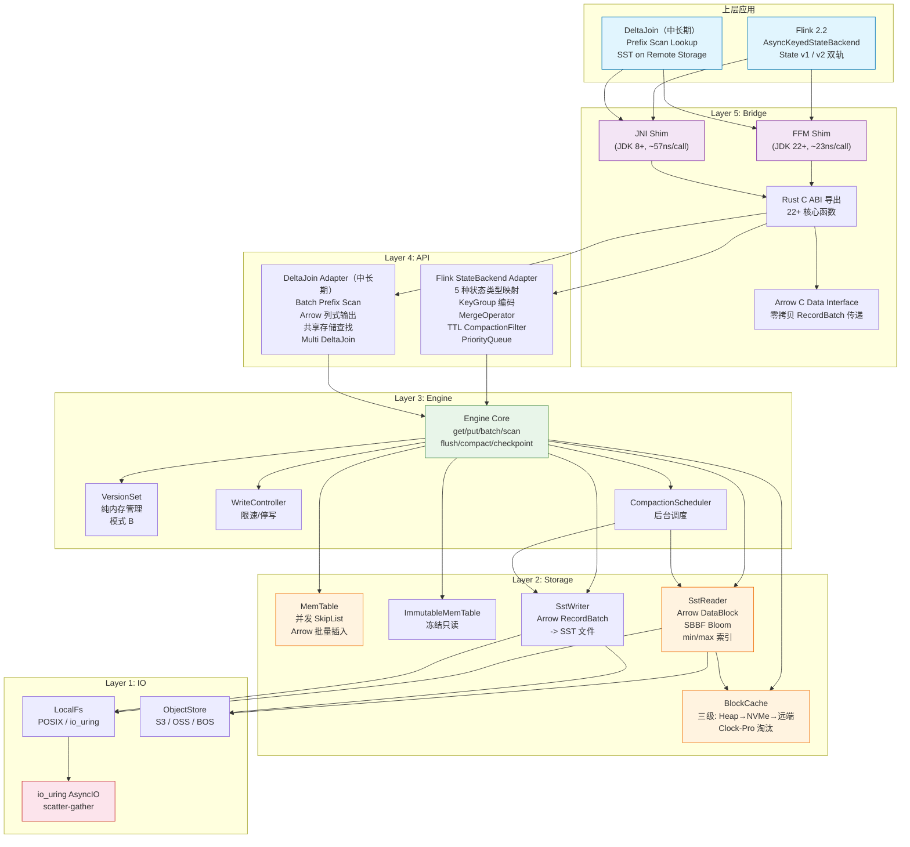
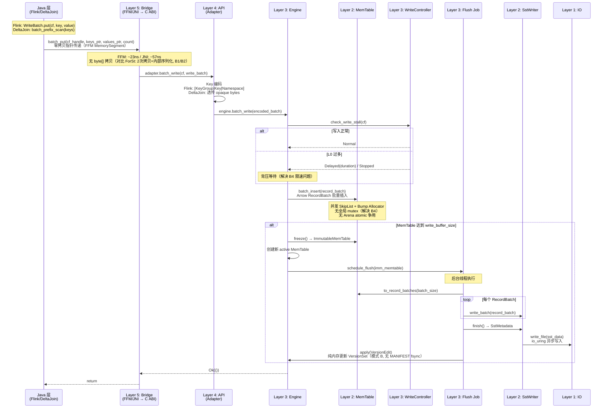
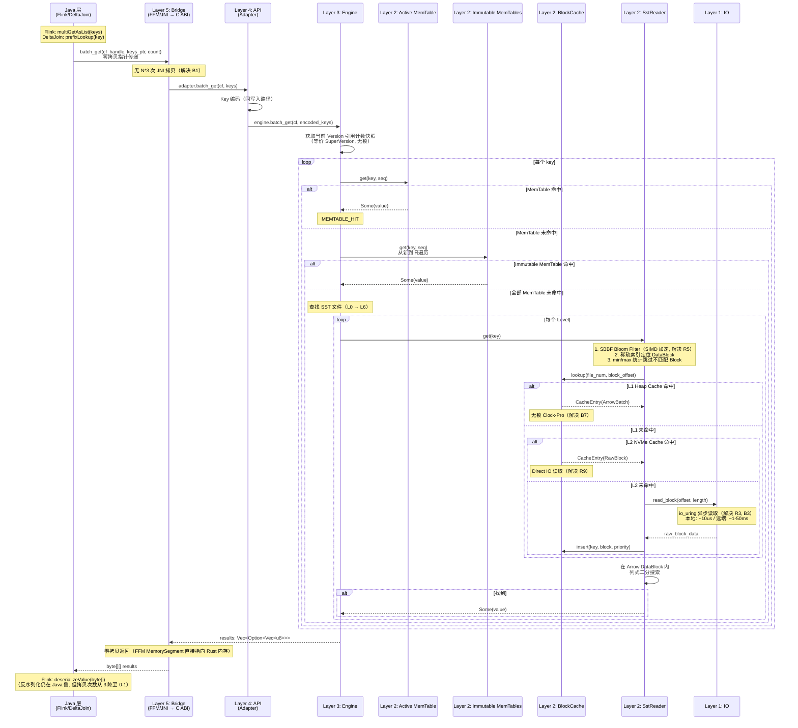

# ForSt-RS 总体架构设计

## 0. 文档元数据
- **文档 ID**: 2.1
- **状态**: completed
- **依赖**: 1.1, 1.2, 1.7, 1.8, 1.16, 1.17, Phase 2 设计规范
- **验证方式**: 分层架构图清晰且 5 层边界明确；核心 trait 定义 >=10 个；覆盖 R1-R13 全部 Gap；性能分析回应 1.7 的 8 个瓶颈；>=3 个 Mermaid 图
- **最后更新**: 2026-04-19

---

## 1. 设计目标与约束

### 1.1 设计目标

ForSt-RS 是一个用 Rust 从零构建的嵌入式 LSM-Tree 存储引擎，面向流式计算场景的状态存储需求。核心设计目标：

1. **消除 JNI 瓶颈**：用 Rust 原生引擎替代 C++ ForSt/RocksDB，消除 Java -> C++ -> Java 的双重 JNI 开销（文档 1.7 瓶颈 B1，每次 get() 3 次拷贝，multiGet N*3 次拷贝）
2. **Arrow-native 数据传输**：以 Arrow RecordBatch 为引擎内部数据单元，从 MemTable 到 SST 到 Cache 存储全链路列式，消除逐条 byte[] 序列化/反序列化（文档 1.7 瓶颈 B2，序列化可占 CPU 20-40%）
3. **流式场景优化**：面向高频 key 更新、低延迟点查的 LSM-Tree 变体，解决通用 RocksDB 引擎未针对流式场景优化的问题（文档 1.8 R1）
4. **三阶段演进**：短期作为 ForSt/RocksDB 的直接替换（兼容现有接口）；中期重构 Flink Java 侧接口实现 Arrow 零拷贝 + 单表 DeltaJoin 本地查找引擎；长期支持 Multi DeltaJoin + Remote Merge Service + Server-side Compaction（文档 1.8 R12, R13, 文档 1.17）
5. **Checkpoint-centric 元数据**：无 MANIFEST 文件，VersionSet 随 Flink Checkpoint 原子持久化，简化恢复路径（文档 1.16 模式 B 决策）

### 1.2 已确定的设计约束

| 约束 ID | 来源 | 内容 |
|---------|------|------|
| C1 | 文档 1.16 | 元数据管理采用模式 B（纯 Checkpoint），VersionSet 仅内存管理，不写本地 MANIFEST 文件 |
| C2 | 文档 1.16 §5.1 | Flush/Compaction 版本更新为纯内存操作，无 fsync |
| C3 | 文档 1.9 | Arrow RecordBatch 作为引擎内部数据传输单元，Java/Rust 间通过 C Data Interface 零拷贝 |
| C4 | 文档 1.14 | ForSt-RS 不管 Schema Evolution，透传 opaque bytes |
| C5 | 文档 1.4 | 最小桥接接口集：12 个核心 DB 操作 + 5 个 Checkpoint 操作 + 5 个配置操作 |
| C6 | 文档 1.8 §4.1 | P0 优先级：R10.5(已决) -> R11(SST) -> R1(流式) -> R2(向量化) -> R6(双轨) -> R10(Checkpoint) -> R12(场景) |
| C7 | 设计规范 C9 | 允许修改 Flink 源码（Planner/Runtime 均可改） |
| C8 | 设计规范 C10 | 短期以 Flink 状态存储为主；中期重构 Flink 接口实现 DeltaJoin 本地查找引擎；长期支持 Multi DeltaJoin + Remote Merge Service |
| C9 | 设计规范 §0.3 | FFM-first, JNI-fallback 桥接策略 |
| C10 | 文档 1.7 | 8 个瓶颈按影响排序：B1(JNI) > B2(序列化) > B3(Cache Miss) > B4(写锁) > B5(Checkpoint flush) > B6(Compaction) > B7(Cache 锁) > B8(Arrow WAL 拷贝) |

### 1.3 R1-R13 Gap 与架构层的映射

| 要求 | Gap 描述 | 解决层 | 优先级 |
|------|---------|--------|--------|
| R1: 流式场景适配 | RocksDB 通用 LSM 未针对流式优化 | Layer 3 Engine + Layer 2 Storage | P0 |
| R2: 数据向量化 | byte[] 逐条处理 | Layer 3 Engine（Arrow RecordBatch 贯穿存储全链路） | P0 |
| R3: IO 向量化 | 同步 POSIX IO + JNI 桥接 | Layer 1 IO（io_uring + scatter-gather） | P1 |
| R4: 计算向量化 | 无手动 SIMD | Layer 2 Storage + Layer 3 Engine（SIMD hash/CRC/比较） | P2 |
| R5: 加速策略 | 传统 Bloom + LRU Cache | Layer 2 Storage（SBBF + 多级索引 + 分层缓存） | P1 |
| R6: 双轨兼容 | Sync + Async 两套 Java 实现 | Layer 4 API（Flink StateBackend Adapter） | P0 |
| R7: FFM 替代 JNI | ~1461 JNI native 方法 | Layer 5 Bridge（FFM-first, JNI-fallback） | P1 |
| R8: 远端对象存储 | 无 Rust 原生对象存储客户端 | Layer 1 IO（Rust native S3/OSS SDK） | P1 |
| R9: 冷热分层 | Block Cache 仅内存 | Layer 2 Storage（Heap -> NVMe -> Object Store 三级） | P1 |
| R10: Checkpoint 集成 | 依赖 RocksDB API | Layer 3 Engine（Checkpointable/Restorable trait） | P0 |
| R10.5: 内部元数据 | C++ MANIFEST | Layer 3 Engine（模式 B 纯内存 VersionSet） | P0 |
| R11: SST 格式 | BlockBasedTable ~126 源文件 | Layer 2 Storage（Arrow-based SST） | P0 |
| R12: Flink 场景完整性 | 5 种状态 + Checkpoint + TTL + Merge | Layer 4 API（Flink StateBackend Adapter） | P0 |
| R13: DeltaJoin 场景完整性 | prefix_scan + 共享存储 + Multi DeltaJoin | Layer 4 API（DeltaJoin Adapter） | P1 |

---

## 2. 方案设计

### 2.1 五层架构

ForSt-RS 采用自底向上的 5 层架构，每层职责明确、边界清晰、可独立测试和替换。

| 层级 | 名称 | 职责 | 关键组件 |
|------|------|------|---------|
| **Layer 5** | Bridge（FFM/JNI -> Rust C ABI） | Java 与 Rust 的跨语言桥接；数据零拷贝传输；生命周期管理 | FFM Shim, JNI Shim, C ABI 导出函数, Arrow C Data Interface |
| **Layer 4** | API（适配层） | 上层场景适配；Flink StateBackend 语义映射；DeltaJoin 查找语义映射 | FlinkStateBackendAdapter, DeltaJoinAdapter, KeyEncoder, MergeOperator |
| **Layer 3** | Engine（DB Core） | 引擎核心逻辑：get/put/batch/scan/flush/compact/checkpoint | Engine, ColumnFamily, VersionSet, WriteController, CompactionScheduler |
| **Layer 2** | Storage（存储组件） | 内存与磁盘存储数据结构 | MemTable, ImmutableMemTable, SstReader, SstWriter, BlockCache, VersionSet, BloomFilter |
| **Layer 1** | IO（底层 IO） | 文件系统抽象；本地与远端 IO；异步 IO | FileSystem, ObjectStore, LocalFs, io_uring AsyncIO |

### 2.2 与 ForSt/RocksDB 的架构对照表

| 维度 | ForSt/RocksDB (C++) | ForSt-RS (Rust) | 改进点 |
|------|---------------------|-----------------|--------|
| **语言** | C++17 | Rust (2024 edition) | 内存安全、无 UB、零成本抽象 |
| **Java 桥接** | JNI (~1461 native 方法, 文档 1.3) | FFM-first / JNI-fallback C ABI | 调用开销从 ~57ns 降至 ~23ns（文档 1.9） |
| **数据单元** | byte[] / Slice 逐条处理 | Arrow RecordBatch 批量列式 | 消除逐条序列化，批量 IO |
| **MemTable** | InlineSkipList + Arena (文档 1.2 §3.4) | 并发 SkipList + Bump Allocator + Arrow 批量插入 | 消除 CAS 重试热点（B4），thread-local 分区可选 |
| **SST 格式** | BlockBasedTable (~126 源文件, 文档 1.1) | Arrow-based SST（DataBlock = Arrow RecordBatch） | 列式存储 + SBBF Bloom + min/max 统计 |
| **Block Cache** | LRU (分片 Mutex) / HyperClockCache (文档 1.2 §3.5) | 三级缓存：Heap(Clock-Pro) -> NVMe -> 远端 | 消除分片锁争用（B7），冷热分层（R9） |
| **元数据** | MANIFEST 文件 + CURRENT (文档 1.15) | 纯内存 VersionSet + Checkpoint blob（模式 B） | 消除 MANIFEST fsync，恢复 <10ms（文档 1.16） |
| **WAL** | log::Writer 32KB Block (文档 1.2 §3.2) | 可选 WAL（Flink 场景禁用） | 简化写路径 |
| **Compaction** | Level/Universal/FIFO (文档 1.2 §3.6) | 面向流式的 Tiered + TTL Filter（Rust trait 插件化） | 减少写放大、降低前台干扰（B6） |
| **IO 模型** | 同步 POSIX read/write (文档 1.7 B3) | io_uring 异步 IO + scatter-gather | 消除线程阻塞，提升 IO 并发 |
| **Flink Env** | JNI -> C++ -> JNI 双重跨语言 (文档 1.2 §3.7) | Rust native 文件系统 / FFM 直接回调 Java FS | 消除双重 JNI（B1） |
| **并发模型** | DB mutex_ + WriteThread 状态机 (文档 1.7 B4) | 无锁写入队列 + 细粒度读写锁 | 消除全局 mutex 竞争 |
| **Checkpoint** | disableFileDeletions + getLiveFiles(flush=true) (文档 1.5) | 原子 VersionSet 快照 + 可选非强制 flush | 消除同步阶段 flush 阻塞（B5） |

### 2.3 三阶段演进架构

ForSt-RS 采用渐进式演进策略，分三个阶段逐步释放架构红利：

**短期（Phase 1）：Rust 引擎 + C ABI 桥接，直接替换 ForSt/RocksDB**
- 完整的 LSM-Tree 状态存储引擎（Layer 1-3）
- 兼容现有 ForSt C++ ABI 接口，作为 drop-in replacement
- 兼容 Flink StateBackend Java 接口（Layer 4-A）
- 保持所有上层接口不变，专注引擎核心能力
- 目标：消除 JNI 瓶颈（B1）、双重序列化（B2）、写锁竞争（B4）

**中期（Phase 2）：重构 Flink Java 侧接口 + 单表 DeltaJoin**
- 重构 Flink Java 侧接口，实现 Arrow 零拷贝最大化性能
- ForSt-RS 作为本地 DeltaJoin 查找引擎，SST 文件存储在远端（S3/HDFS）
- DeltaJoin 适配层（Layer 4-B）：Prefix Scan 优化、Arrow 列式输出、共享存储查找
- 本地存储仅作为缓存层，实现存算分离

**长期（Phase 3）：Multi DeltaJoin + Remote Merge Service**
- Multi DeltaJoin：A ⋈ B ⋈ C 多维表在单个 ForSt-RS 实例中联合查找
- Remote Merge Service：服务端合并多个维表的 SST 文件，减少客户端 IO 压力
- Server-side Compaction：后台 Compaction 卸载到独立服务，消除前台干扰

**共享部分**（Layer 1-3，全阶段一致）：
- 相同的 LSM-Tree 引擎核心（get/put/scan/flush/compact/checkpoint）
- 相同的 Arrow-based SST 文件格式
- 相同的 Block Cache 和 MemTable 实现
- 相同的 Checkpoint 快照机制

**Flink 适配层（Layer 4-A）**：
- 实现 `AsyncKeyedStateBackend` 接口（文档 1.4）
- 5 种状态类型映射（ValueState, ListState, MapState, ReducingState, AggregatingState）
- 双轨兼容（Sync v1 + Async v2，文档 1.8 R6）
- KeyGroup 前缀编码（SerializedCompositeKeyBuilder 语义）
- MergeOperator 支持（ListState append，文档 1.4 §3.2.3）
- TTL CompactionFilter（FlinkCompactionFilter 等价，文档 1.1 §3.2.2）
- Checkpoint 集成（增量/全量快照，文档 1.5）
- PriorityQueue（Timer Service，文档 1.4 §3.6.1）

**DeltaJoin 适配层（Layer 4-B，中期引入）**：
- Prefix Scan 优化（批量前缀查找 + Arrow 列式输出，文档 1.17 §3.2.4）
- 共享存储查找（SST 直写远端，本地仅缓存）
- 单 ColumnFamily 简化模式
- WAL 禁用（Flink Checkpoint 提供一致性保证）
- 四种 RowMerger 策略适配（Default/FirstRow/Versioned/Aggregate）
- 增量快照（远端 SST diff 追踪）

### 2.4 DeltaJoin 架构预留

基于文档 1.17 的可行性分析，ForSt-RS 在架构上预留以下 DeltaJoin 优化接口，覆盖中期（单表 DeltaJoin）和长期（Multi DeltaJoin + Remote Merge）演进：

**中期：单表 DeltaJoin 查找引擎**

1. **Batch Prefix Scan API**：`batch_prefix_scan(keys: &[&[u8]]) -> Vec<ArrowRecordBatch>`，支持多个前缀键合并为单次引擎调用，减少 Iterator 创建开销（文档 1.17 §3.2.3 当前逐条处理瓶颈）
2. **Arrow 列式输出接口**：扫描结果直接输出为 Arrow RecordBatch，避免逐行 byte[] 拷贝（文档 1.17 §3.3.3）
3. **PrefixScanner trait**：独立的前缀扫描接口，支持 SIMD 前缀比较加速（文档 1.17 §3.4.2）
4. **共享存储查找**：SST 文件直写远端存储（S3/HDFS），本地仅作为 Block Cache 缓存层

**长期：Multi DeltaJoin + Remote Merge**

5. **Multi ColumnFamily DeltaJoin**：单个 ForSt-RS 实例通过多 ColumnFamily 承载多个维表（A ⋈ B ⋈ C），共享 Block Cache 和后台线程池，解决资源碎片化
6. **Remote Merge Service 接口预留**：定义 `RemoteMerger` trait，支持将多个维表的 SST 文件合并操作卸载到服务端，减少客户端 IO 和 CPU 压力
7. **Server-side Compaction 接口预留**：定义 `RemoteCompactor` trait，支持 Compaction 任务提交到远端执行，彻底消除前台干扰

---

## 3. 接口定义

以下定义 ForSt-RS 的核心 Rust trait（伪代码级别），共 14 个。

### 3.1 Engine — 引擎顶层接口

```rust
/// 引擎顶层接口，对外暴露完整的 DB 操作能力。
/// 解决 R1（流式场景适配）、R2（数据向量化）。
pub trait Engine: Send + Sync {
    /// 单点读取
    fn get(&self, cf: &ColumnFamilyHandle, key: &[u8]) -> Result<Option<Vec<u8>>>;

    /// 单点写入
    fn put(&self, cf: &ColumnFamilyHandle, key: &[u8], value: &[u8]) -> Result<()>;

    /// 删除
    fn delete(&self, cf: &ColumnFamilyHandle, key: &[u8]) -> Result<()>;

    /// 批量读取（向量化，解决 B1 multiGet N*3 拷贝问题）
    fn batch_get(
        &self,
        cf: &ColumnFamilyHandle,
        keys: &[&[u8]],
    ) -> Result<Vec<Option<Vec<u8>>>>;

    /// 批量写入（Arrow RecordBatch 输入，解决 B2 双重序列化）
    fn batch_write(&self, write_batch: WriteBatch) -> Result<()>;

    /// 创建前向迭代器
    fn new_iterator(
        &self,
        cf: &ColumnFamilyHandle,
        opts: &ReadOptions,
    ) -> Result<Box<dyn Iterator>>;

    /// 触发 MemTable flush
    fn flush(&self, cf: &ColumnFamilyHandle) -> Result<()>;

    /// 创建/删除 ColumnFamily
    fn create_column_family(&self, name: &str, opts: &CfOptions) -> Result<ColumnFamilyHandle>;
    fn drop_column_family(&self, cf: ColumnFamilyHandle) -> Result<()>;

    /// 引擎统计信息（解决 R12 Native Metrics）
    fn get_property(&self, cf: &ColumnFamilyHandle, property: &str) -> Result<Option<String>>;

    /// 关闭引擎
    fn close(&self) -> Result<()>;
}
```

### 3.2 ColumnFamily — 列族

```rust
/// 列族句柄，标识引擎内的一个逻辑命名空间。
/// Flink 场景使用多 CF（default + 每个 State 一个 CF）；DeltaJoin 场景使用单默认 CF。
pub struct ColumnFamilyHandle {
    id: u32,
    name: String,
}

/// 列族配置
pub struct CfOptions {
    pub write_buffer_size: usize,          // MemTable 大小阈值
    pub max_write_buffer_number: usize,    // Immutable MemTable 最大数量
    pub level0_file_num_compaction_trigger: usize,
    pub compaction_style: CompactionStyle,
    pub merge_operator: Option<Box<dyn MergeOperator>>,    // ListState append
    pub compaction_filter: Option<Box<dyn CompactionFilter>>, // TTL 清理
    pub prefix_extractor: Option<Box<dyn PrefixExtractor>>,  // 前缀提取（Delta Join）
}
```

### 3.3 MemTable / ImmutableMemTable

```rust
/// 可写 MemTable，支持并发插入和点查。
/// 解决 B4（写路径锁竞争）：使用无锁并发数据结构。
pub trait MemTable: Send + Sync {
    /// 单条插入
    fn insert(&self, key: &[u8], value: &[u8], seq: u64, op_type: OpType) -> Result<()>;

    /// 批量插入（Arrow RecordBatch，解决 R2 数据向量化）
    fn batch_insert(&self, batch: &RecordBatch) -> Result<()>;

    /// 点查
    fn get(&self, key: &[u8], seq: u64) -> Result<Option<ValueEntry>>;

    /// 前缀扫描
    fn prefix_scan(&self, prefix: &[u8], seq: u64) -> Result<Box<dyn Iterator>>;

    /// 当前已使用内存
    fn approximate_memory_usage(&self) -> usize;

    /// 冻结为不可变 MemTable
    fn freeze(self) -> Box<dyn ImmutableMemTable>;
}

/// 不可变 MemTable，支持并发读取和 flush 到 SST。
pub trait ImmutableMemTable: Send + Sync {
    /// 点查
    fn get(&self, key: &[u8], seq: u64) -> Result<Option<ValueEntry>>;

    /// 有序迭代器
    fn iter(&self) -> Box<dyn Iterator>;

    /// 转换为 Arrow RecordBatch 迭代器（用于 flush 到 SST）
    fn to_record_batches(&self, batch_size: usize) -> Box<dyn std::iter::Iterator<Item = RecordBatch>>;

    /// 已使用内存
    fn approximate_memory_usage(&self) -> usize;
}
```

### 3.4 SstReader / SstWriter

```rust
/// SST 文件读取器，支持点查和范围扫描。
/// 解决 R11（SST 格式）：基于 Arrow RecordBatch 的自定义 SST 格式。
pub trait SstReader: Send + Sync {
    /// 点查（通过 Bloom Filter + Index 定位 DataBlock）
    fn get(&self, key: &[u8]) -> Result<Option<ValueEntry>>;

    /// 范围扫描（返回 Arrow RecordBatch 迭代器）
    fn scan(
        &self,
        lower: Option<&[u8]>,
        upper: Option<&[u8]>,
    ) -> Result<Box<dyn std::iter::Iterator<Item = Result<RecordBatch>>>>;

    /// 前缀扫描（为 Delta Join 预留，文档 1.17）
    fn prefix_scan(&self, prefix: &[u8]) -> Result<Box<dyn std::iter::Iterator<Item = Result<RecordBatch>>>>;

    /// 获取 SST 文件元数据
    fn metadata(&self) -> &SstMetadata;
}

/// SST 文件写入器
pub trait SstWriter: Send {
    /// 写入一个 Arrow RecordBatch（已按 key 排序）
    fn write_batch(&mut self, batch: &RecordBatch) -> Result<()>;

    /// 完成写入，生成 SST 文件
    fn finish(self) -> Result<SstMetadata>;
}
```

### 3.5 BlockCache / CacheEntry

```rust
/// 三级分层缓存接口。
/// 解决 B3（Block Cache 未命中）、B7（Cache 分片锁争用）、R9（冷热分层）。
pub trait BlockCache: Send + Sync {
    /// 查找缓存条目
    fn lookup(&self, key: &CacheKey) -> Option<CacheEntry>;

    /// 插入缓存条目
    fn insert(&self, key: CacheKey, value: CacheEntry, priority: CachePriority) -> Result<()>;

    /// 淘汰指定条目
    fn erase(&self, key: &CacheKey);

    /// 当前缓存使用量
    fn usage(&self) -> usize;

    /// 设置容量
    fn set_capacity(&self, capacity: usize);
}

/// 缓存条目：承载 Arrow RecordBatch（DataBlock）或原始 Block 数据
pub struct CacheEntry {
    pub data: CacheData,
    pub size: usize,
}

pub enum CacheData {
    ArrowBatch(RecordBatch),  // 已解码的列式数据
    RawBlock(Vec<u8>),         // 压缩/未解码的原始块
}

pub enum CachePriority {
    High,    // Index / Filter Block
    Low,     // Data Block
    Bottom,  // Compaction 读入的临时 Block
}
```

### 3.6 VersionSet / Version

```rust
/// 版本集合，管理 LSM-Tree 的文件布局。
/// 解决 R10.5（内部元数据）：纯内存管理，无 MANIFEST 文件（模式 B，文档 1.16）。
pub trait VersionSet: Send + Sync {
    /// 获取当前版本的引用计数快照（用于无锁读取，类似 SuperVersion）
    fn current(&self) -> Arc<Version>;

    /// 应用版本变更（Flush/Compaction 后更新，纯内存操作）
    fn apply(&self, edit: VersionEdit) -> Result<Arc<Version>>;

    /// 原子获取快照（Checkpoint 同步阶段使用）
    fn snapshot(&self) -> VersionSetSnapshot;

    /// 从序列化 blob 恢复（Checkpoint 恢复路径）
    fn restore_from_blob(blob: &[u8], sst_dir: &Path) -> Result<Self> where Self: Sized;

    /// 序列化为 blob（Checkpoint 异步阶段使用）
    fn serialize_to_blob(&self) -> Result<Vec<u8>>;

    /// 获取活跃 SST 文件列表（增量 Checkpoint diff 追踪）
    fn live_sst_files(&self) -> Vec<SstFileMeta>;
}

/// 单个版本：某一时刻 ColumnFamily 的完整 SST 文件布局
pub struct Version {
    pub cf_id: u32,
    pub levels: Vec<LevelMeta>,
    pub next_file_number: u64,
    pub last_sequence: u64,
}

/// 版本变更描述
pub struct VersionEdit {
    pub new_files: Vec<(u32, SstFileMeta)>,  // (level, file_meta)
    pub deleted_files: Vec<(u32, u64)>,       // (level, file_number)
    pub next_file_number: Option<u64>,
    pub last_sequence: Option<u64>,
}
```

### 3.7 Compactor

```rust
/// Compaction 执行器。
/// 解决 B6（Compaction 资源争用）：异步 IO + IO 优先级 + SIMD 加速。
pub trait Compactor: Send + Sync {
    /// 选择需要 Compaction 的文件（基于策略）
    fn pick_compaction(&self, version: &Version) -> Option<CompactionTask>;

    /// 执行 Compaction 任务
    fn execute(&self, task: CompactionTask) -> Result<CompactionResult>;

    /// 设置 IO 速率限制（保护前台读写）
    fn set_rate_limit(&self, bytes_per_sec: u64);
}

/// Compaction 过滤器（TTL 清理，等价于 FlinkCompactionFilter，文档 1.1 §3.2.2）
pub trait CompactionFilter: Send + Sync {
    /// 判断 key-value 是否应在 Compaction 中过滤掉
    fn filter(&self, key: &[u8], value: &[u8], seq: u64) -> FilterDecision;
}

pub enum FilterDecision {
    Keep,
    Remove,
    ChangeValue(Vec<u8>),
}
```

### 3.8 Checkpointable / Restorable

```rust
/// Checkpoint 能力接口。
/// 解决 R10（Checkpoint 集成）+ B5（Checkpoint flush 阻塞）。
pub trait Checkpointable: Send + Sync {
    /// 同步阶段：原子获取 VersionSet 快照 + 冻结 MemTable
    /// 返回序列化的元数据 blob 和活跃 SST 文件列表
    fn prepare_checkpoint(&self) -> Result<CheckpointSnapshot>;

    /// 禁止文件删除（Compaction 期间保护 SST 文件）
    fn disable_file_deletions(&self) -> Result<()>;

    /// 恢复文件删除
    fn enable_file_deletions(&self) -> Result<()>;
}

/// Restore 能力接口
pub trait Restorable: Sized {
    /// 从 Checkpoint blob + SST 文件目录恢复引擎
    fn restore(blob: &[u8], sst_dir: &Path, opts: &EngineOptions) -> Result<Self>;

    /// KeyGroup 范围裁剪（Rescaling 场景，文档 1.13）
    fn clip_key_group_range(&self, target_range: KeyGroupRange) -> Result<()>;

    /// 外部 SST 导入（Scale-in/out IngestDB 场景，文档 1.5 §3.4）
    fn ingest_external_files(&self, files: &[&Path]) -> Result<()>;
}

pub struct CheckpointSnapshot {
    pub metadata_blob: Vec<u8>,        // 序列化的 VersionSet
    pub live_sst_files: Vec<SstFileMeta>, // 活跃文件列表（供 Java 侧 diff 追踪）
}
```

### 3.9 FileSystem / ObjectStore

```rust
/// 文件系统抽象（Layer 1 IO 层）。
/// 解决 R8（远端对象存储）：统一本地和远端文件系统接口。
pub trait FileSystem: Send + Sync {
    /// 创建顺序写入文件
    fn create(&self, path: &Path) -> Result<Box<dyn WritableFile>>;

    /// 打开随机读取文件
    fn open(&self, path: &Path) -> Result<Box<dyn RandomAccessFile>>;

    /// 删除文件
    fn delete(&self, path: &Path) -> Result<()>;

    /// 文件是否存在
    fn exists(&self, path: &Path) -> Result<bool>;

    /// 列出目录
    fn list(&self, dir: &Path) -> Result<Vec<FileStatus>>;

    /// 重命名（原子操作）
    fn rename(&self, src: &Path, dst: &Path) -> Result<()>;
}

/// 对象存储抽象（远端 S3/OSS/BOS）
pub trait ObjectStore: Send + Sync {
    /// 上传对象
    fn put(&self, key: &str, data: &[u8]) -> Result<()>;

    /// 下载对象
    fn get(&self, key: &str) -> Result<Vec<u8>>;

    /// 范围读取（用于 SST Block 级读取）
    fn get_range(&self, key: &str, offset: u64, length: u64) -> Result<Vec<u8>>;

    /// 删除对象
    fn delete(&self, key: &str) -> Result<()>;
}
```

### 3.10 PrefixScanner（为 Delta Join 预留）

```rust
/// 前缀扫描接口，为 Delta Join 场景优化（文档 1.17）。
/// 支持批量前缀查找 + Arrow 列式输出。
pub trait PrefixScanner: Send + Sync {
    /// 单前缀扫描
    fn prefix_scan(&self, prefix: &[u8]) -> Result<Vec<Vec<u8>>>;

    /// 批量前缀扫描（多 prefix key 合并扫描，减少 Iterator 创建开销）
    fn batch_prefix_scan(&self, prefixes: &[&[u8]]) -> Result<Vec<Vec<Vec<u8>>>>;

    /// 批量前缀扫描 - Arrow 输出（零拷贝列式结果）
    fn batch_prefix_scan_arrow(
        &self,
        prefixes: &[&[u8]],
    ) -> Result<Vec<RecordBatch>>;
}
```

### 3.11 MergeOperator

```rust
/// Merge 操作符（ListState append 语义，等价于 RocksDB StringAppendOperator）
/// 解决 R12（Flink 场景完整性）中的 Merge Operator 兼容性。
pub trait MergeOperator: Send + Sync {
    /// 全量 merge：将所有历史 operand 合并
    fn full_merge(
        &self,
        key: &[u8],
        existing_value: Option<&[u8]>,
        operands: &[&[u8]],
    ) -> Result<Vec<u8>>;

    /// 部分 merge：合并相邻的两个 operand
    fn partial_merge(&self, key: &[u8], left: &[u8], right: &[u8]) -> Result<Vec<u8>>;

    /// 操作符名称（用于持久化标识）
    fn name(&self) -> &str;
}
```

### 3.12 PrefixExtractor

```rust
/// 前缀提取器（用于 Bloom Filter 和前缀扫描优化）
pub trait PrefixExtractor: Send + Sync {
    /// 从完整 key 中提取前缀
    fn extract(&self, key: &[u8]) -> &[u8];

    /// 判断 key 是否在前缀域内
    fn in_domain(&self, key: &[u8]) -> bool;
}
```

### 3.13 Iterator

```rust
/// 有序 KV 迭代器接口
pub trait Iterator: Send {
    /// 定位到第一个 >= target 的位置
    fn seek(&mut self, target: &[u8]);

    /// 定位到第一个条目
    fn seek_to_first(&mut self);

    /// 移动到下一个条目
    fn next(&mut self);

    /// 当前位置是否有效
    fn valid(&self) -> bool;

    /// 当前 key
    fn key(&self) -> &[u8];

    /// 当前 value
    fn value(&self) -> &[u8];

    /// 当前状态
    fn status(&self) -> Result<()>;
}
```

### 3.14 WriteController

```rust
/// 写入控制器：管理写入限速和停写（解决 B4 写路径锁竞争）
pub trait WriteController: Send + Sync {
    /// 检查是否应限速或停写
    fn check_write_stall(&self, cf: &ColumnFamilyHandle) -> WriteStallCondition;

    /// 更新 L0 文件计数（Compaction 完成后调用）
    fn update_l0_file_count(&self, cf: &ColumnFamilyHandle, count: usize);
}

pub enum WriteStallCondition {
    Normal,
    Delayed(Duration),  // 限速
    Stopped,            // 停写
}
```

---

## 4. 架构图 / 数据流图

### 4.1 分层架构总图



### 4.2 数据流图 — 写入链路



### 4.3 数据流图 — 读取链路



---

## 5. 性能分析

### 5.1 瓶颈逐一回应

以下逐一回应文档 1.7 识别的 8 个瓶颈：

| 瓶颈 | 影响 | ForSt-RS 解决方案 | 预期改善 |
|------|------|-------------------|---------|
| **B1: JNI 累积开销** | 高 | Layer 5 Bridge: FFM 替代 JNI，调用开销从 ~57ns 降至 ~23ns；零拷贝指针传递消除 get() 3 次拷贝和 multiGet N*3 次拷贝；消除 C++ 中间层（Java -> Rust 直接桥接，无 Java->C++->Java 双重 JNI） | 读路径拷贝 3->0-1 次；写路径拷贝 2->0 次；CPU 时间减少 15-30% |
| **B2: 双重序列化** | 高 | Layer 3 Engine: Arrow RecordBatch 作为内部数据单元；Layer 4 API: Key 编码层仍保留（兼容 Flink KeyGroup 语义），但 value 可直接以 Arrow 列式传递，消除 TypeSerializer 的逐条序列化/反序列化。长期目标：推动 Flink Arrow-native State API | 序列化 CPU 开销减少 50-70%；GC 压力大幅降低 |
| **B3: Block Cache 未命中 IO 放大** | 高 | Layer 2 Storage: 三级缓存（Heap -> NVMe -> 远端），有效缓存容量扩大 10-100 倍；SBBF Bloom Filter 减少无效 IO；Block min/max 统计跳过不匹配块；Layer 1 IO: io_uring 异步读取隐藏 IO 延迟 | Cache 未命中率降低 50%+；远端场景 IO 延迟 P99 降低 2-5 倍 |
| **B4: 写路径锁竞争** | 中-高 | Layer 3 Engine: 无锁写入队列替代 mutex-based WriteThread 状态机；Layer 2 MemTable: 并发 SkipList 无全局 mutex，thread-local bump allocator 消除 Arena atomic 争用；Flink 场景 WAL 禁用简化写路径 | 写入吞吐提升 2-3 倍；P99 写入延迟降低 |
| **B5: Checkpoint flush 阻塞** | 中 | Layer 3 Engine: 模式 B 下 Checkpoint 同步阶段仅需原子获取 VersionSet 快照 + 冻结 MemTable（标记快照点），不强制 flush；MemTable 内容可在异步阶段序列化。消除 `getLiveFiles(flush=true)` 的同步 flush 阻塞 | Checkpoint 同步阶段时间降低 50-80% |
| **B6: Compaction 资源争用** | 中 | Layer 3 Engine: Compaction IO 优先级低于前台读写；Layer 1 IO: io_uring 异步 Compaction IO 不阻塞前台线程；Layer 2 Cache: Compaction 读入的 Block 使用 Bottom 优先级，不污染前台热数据；SIMD 加速合并排序和 CRC32 校验 | Compaction 期间读延迟 P99 上升幅度从 2-5 倍降低到 <50% |
| **B7: Block Cache LRU 分片锁争用** | 中 | Layer 2 Cache: 使用 Clock-Pro 或 W-TinyLFU 无锁/低争用淘汰算法替代 LRU 分片 Mutex；自适应分片数量；基于 Rust 并发 HashMap（dashmap/flurry）实现 | 在 16+ 并发读线程下消除可测量的锁争用 |
| **B8: nioBuffer() 深拷贝** | 中 | Layer 1 IO: Rust scatter-gather IO（writev）直接写入分页内存，无需合并为连续缓冲区；Arrow 数据通过指针传递给 Rust 进行持久化，消除 Java 侧中间转换 | 消除每批次 4MB 级深拷贝 |

### 5.2 与 ForSt/RocksDB 的性能对比总结

| 维度 | ForSt/RocksDB 现状 | ForSt-RS 预期 | 改善倍数 |
|------|-------------------|---------------|---------|
| 单点读延迟（Cache Hit） | ~1-5us（含 JNI 开销） | ~0.3-1us | 3-5x |
| 单点读延迟（Cache Miss, 本地 SSD） | ~10-30us | ~5-15us | 2x |
| 批量读吞吐（multiGet 100 keys） | 受 N*3 拷贝限制 | 零拷贝批量返回 | 3-5x |
| 单点写延迟 | ~2-5us（含 JNI + 2 次拷贝） | ~0.5-2us | 2-4x |
| 批量写吞吐（WriteBatch 100 puts） | 受 200 次拷贝 + WriteBatch 内部序列化限制 | Arrow 批量插入，零拷贝 | 3-5x |
| Checkpoint 同步阶段 | 100ms-1s（flush 阻塞） | <10ms（仅快照 VersionSet） | 10-100x |
| 恢复时间（元数据加载） | 100ms-数秒（MANIFEST 重放） | <10ms（blob 反序列化） | 10-100x |
| 内存效率（多 bucket 场景） | 每 bucket 独立实例，资源碎片化 | 共享引擎 + 多 CF | 内存节省 50%+ |

### 5.3 新引入的开销

| 开销 | 原因 | 影响评估 | 缓解措施 |
|------|------|---------|---------|
| FFM/JNI C ABI 调用 | Rust C ABI 导出函数仍有跨语言调用开销 | 低（~23ns/call for FFM） | 批量接口减少调用次数 |
| Arrow RecordBatch 构造 | 从行式 KV 构造列式 RecordBatch 有 CPU 开销 | 中（批量越大摊薄越低） | 批量 >= 64 条时列式优势显现 |
| Rust 运行时初始化 | 首次加载 Rust 动态库的初始化 | 极低（一次性，<100ms） | 预加载 |
| SST 格式不兼容 | 现有 RocksDB SST 文件无法直接读取 | 迁移成本（一次性） | 提供 SST 格式转换工具 |

---

## 6. 与其他模块的交互

### 6.1 与 Phase 2 其他设计文档的接口对齐

| 文档 | 交互接口 | 说明 |
|------|---------|------|
| 2.2 Arrow SST 格式 | `SstReader` / `SstWriter` trait | 本文档定义 trait 签名，2.2 定义物理布局和实现细节 |
| 2.3 MemTable 设计 | `MemTable` / `ImmutableMemTable` trait | 本文档定义 trait 签名，2.3 定义数据结构选型和并发模型 |
| 2.4 Block Cache 设计 | `BlockCache` trait | 本文档定义 trait 签名，2.4 定义三级架构和淘汰算法 |
| 2.5 FFM 桥接层设计 | Layer 5 C ABI 导出函数 | 本文档定义架构分层，2.5 定义具体 C ABI 函数签名和零拷贝协议 |
| 2.6 Compaction 设计 | `Compactor` / `CompactionFilter` trait | 本文档定义 trait 签名，2.6 定义策略选型和调度机制 |
| 2.7 Checkpoint 集成 | `Checkpointable` / `Restorable` trait | 本文档定义 trait 签名，2.7 定义模式 B 完整流程 |
| 2.8 读写路径设计 | `Engine` trait 的全部方法 | 本文档定义总体路径，2.8 定义每条路径的详细时序 |
| 2.9 Flink 适配层 | Layer 4-A Flink StateBackend Adapter | 本文档定义适配层职责，2.9 定义 Java 类设计和状态映射 |
| 2.11 Crate 结构 | 5 层 -> crate 映射 | 本文档定义逻辑分层，2.11 定义物理 crate 划分 |

### 6.2 层间接口约束

- **Layer 5 -> Layer 4**: 通过 C ABI 函数调用，数据通过指针传递（MemorySegment / DirectByteBuffer）
- **Layer 4 -> Layer 3**: Rust 内部函数调用，数据通过 Rust 引用传递
- **Layer 3 -> Layer 2**: Rust trait 多态调用（零成本抽象），数据通过 `Arc<T>` 共享
- **Layer 2 -> Layer 1**: 异步 IO 接口（`async fn` 或 callback），数据通过 `Vec<u8>` 或 `ArrowRecordBatch`
- **跨层不可变约定**: Arrow RecordBatch 一旦创建不可修改，通过引用计数共享

---

## 7. 风险与替代方案

### 7.1 已识别风险

| 风险 | 影响 | 概率 | 缓解措施 |
|------|------|------|---------|
| Arrow RecordBatch 与 LSM-Tree key 排序的兼容性问题 | 高 | 中 | 2.2 SST 格式设计中明确解决：每个 DataBlock 内 key 列全局有序，Arrow 列式布局在此约束下设计 |
| SST 格式不兼容导致无法滚动升级 | 高 | 高 | 提供 SST 格式转换工具；过渡期支持读旧格式（RocksDB BlockBasedTable） |
| FFM 双模桥接层维护成本超预期 | 中 | 中 | 决策门 D-02-02 允许选择单模（纯 JNI + DirectBB）降低复杂度 |
| Merge Operator 语义不完全等价 | 中 | 低 | 基于 ForSt 测试用例构建 Rust 侧回归测试；ListState 的 StringAppendOperator 语义相对简单 |
| 模式 B 下没有本地 MANIFEST 导致调试困难 | 低 | 高 | 提供 dump-metadata 调试工具；可选配置输出元数据日志到本地（非恢复依赖） |
| Rust 生态的 io_uring 库成熟度 | 中 | 低 | tokio-uring 已生产可用；可回退到传统 epoll + 线程池 |

### 7.2 替代方案

**替代方案 A: 包装 RocksDB C API 而非从零构建**
- 优点：复用成熟引擎，开发周期短
- 缺点：无法实现 Arrow-native SST 格式和列式数据传输；仍受 RocksDB 架构限制
- 结论：不采用。ForSt-RS 的核心价值在于 Arrow-native 存储层全链路优化，包装无法实现

**替代方案 B: 基于现有 Rust LSM 引擎（如 AgateDB, MiniLSM）**
- 优点：有基础框架可复用
- 缺点：现有 Rust LSM 引擎均为通用 KV，无 Arrow 支持，无 Flink 集成能力
- 结论：可参考设计但不直接采用，核心组件需自行实现

**替代方案 C: 3 层架构（Bridge + Engine + IO）**
- 优点：层次更少，接口更简单
- 缺点：Engine 层过于庞大，API 适配和 Storage 组件耦合
- 结论：不采用。见决策记录 D1

**替代方案 D: 7 层架构（拆分更细粒度）**
- 优点：每层更小更专注
- 缺点：层间接口过多，调用链过长，性能损耗
- 结论：不采用。见决策记录 D1

---

## 8. 决策记录

### D1: 为什么选择 5 层而非 3 层或 7 层

**决策**: 采用 5 层架构（Bridge -> API -> Engine -> Storage -> IO）。

**理由**:

1. **3 层（Bridge + Engine + IO）的问题**: Engine 层需要同时处理 Flink/DeltaJoin 适配逻辑、LSM-Tree 核心逻辑、MemTable/SST/Cache 数据结构——职责过重，违反单一职责原则。Flink 的 5 种状态类型映射、KeyGroup 编码、MergeOperator 等逻辑与 LSM-Tree 核心无关，混合在一起会导致引擎核心代码膨胀且难以独立测试。

2. **7 层（例如拆分 Encoding / Indexing / Scheduling 独立层）的问题**: 过多的层次边界引入不必要的接口抽象和函数调用开销。在 Rust 中，trait 动态分派有 vtable 间接调用成本（约 1-2ns），对存储引擎的热路径影响累积显著。此外，7 层的接口对齐维护成本过高。

3. **5 层的优势**:
   - Layer 5 (Bridge) 隔离跨语言复杂性，可独立测试 C ABI 正确性
   - Layer 4 (API) 隔离场景差异（Flink 状态存储 vs DeltaJoin 查找），引擎核心不感知上层语义
   - Layer 3 (Engine) 聚焦 LSM-Tree 协调逻辑，是纯 Rust 业务层
   - Layer 2 (Storage) 聚焦数据结构（MemTable/SST/Cache），可独立 benchmark
   - Layer 1 (IO) 隔离平台差异（io_uring vs epoll / 本地 vs 远端），可插拔替换

### D2: 为什么 Engine 层采用统一引擎 + 三阶段演进

**决策**: Layer 3 Engine 是统一的 LSM-Tree 引擎核心，通过三阶段演进逐步扩展适配层能力。

**理由**:

1. **功能重叠度高**: Flink 状态存储和 DeltaJoin 查找对底层存储引擎的需求高度一致——都需要 get/put/scan/flush/compact/checkpoint 基本操作。差异仅在上层语义：Flink 需要 KeyGroup 编码 + 5 种状态类型映射；DeltaJoin 需要 Prefix Scan + 共享存储查找。

2. **避免代码重复**: 如果 Engine 层区分两个场景，核心的 VersionSet 管理、MemTable flush、Compaction 调度、Block Cache 管理等逻辑需要维护两份，违反 DRY 原则。

3. **共享资源池**: 共享引擎允许多个适配层共享 Block Cache、后台 Compaction 线程池等资源，避免资源碎片化。Multi DeltaJoin 场景（长期）更需要单实例多 CF 共享资源。

4. **差异通过 Layer 4 适配**: Flink 的 MergeOperator（ListState append）、TTL CompactionFilter、PriorityQueue 等特有功能通过 Layer 4 的 Adapter 注入 Engine（作为 `CfOptions` 中的 trait object），Engine 通过统一的 `CompactionFilter` / `MergeOperator` trait 调用，无需感知具体场景。

5. **渐进式演进**: 短期仅需 Flink 适配层（Layer 4-A）；中期新增 DeltaJoin 适配层（Layer 4-B）；长期扩展 Remote Merge / Server-side Compaction。Engine 核心始终稳定。

### D3: 为什么 IO 层独立（Layer 1）

**决策**: 将 IO 层从 Storage 层分离为独立的 Layer 1。

**理由**:

1. **io_uring 的特殊性**: io_uring 需要专门的 submission queue / completion queue 管理，与传统的同步 IO API 差异巨大。将其封装在独立层内，Storage 层通过统一的 `FileSystem` trait 调用，不感知 IO 模型差异。

2. **远端存储预留**: Layer 1 的 `ObjectStore` trait 为 S3/OSS/BOS 等对象存储提供统一抽象（文档 1.8 R8）。远端存储的延迟特性（100ms+ 级别）需要专门的预取和缓存策略，这些逻辑在 IO 层处理，不污染 Storage 层的数据结构设计。

3. **可测试性**: 独立 IO 层允许使用 `MockFileSystem` 进行确定性测试，不依赖真实文件系统或网络。文档 1.1 模块 24 (`test_util/`) 的 TestFS（故障注入文件系统）模式可在 Rust 侧复用。

4. **平台适配**: 不同操作系统的 IO 能力差异（Linux io_uring vs macOS kqueue vs Windows IOCP）在 Layer 1 内部通过 feature flag 和条件编译处理，上层完全透明。

### D4: 元数据管理采用模式 B（纯 Checkpoint）

**决策**: ForSt-RS 不维护本地 MANIFEST 文件，VersionSet 仅在内存中管理，通过 Flink Checkpoint 协议持久化。

**理由**: 详见文档 1.16 §3.8 的 7 个论据。核心要点：
- 与 Flink 恢复语义天然匹配（Checkpoint 原子一致性）
- 代码量减少 59%（2,750 行 vs 6,750 行）
- 消除 MANIFEST fsync 瓶颈
- 恢复速度 <10ms（blob 反序列化 vs MANIFEST 重放数秒）
- 关键技术风险最少（1 个 vs 4 个）

### D5: Arrow RecordBatch 作为引擎内部数据传输单元

**决策**: 从 MemTable 到 SST DataBlock 到 Block Cache，存储全链路使用 Arrow RecordBatch 作为数据传输单元。

**理由**:
- 消除逐条 byte[] 序列化/反序列化（文档 1.7 B2，可占 CPU 20-40%）
- 批量 IO 天然适配 io_uring scatter-gather
- Arrow C Data Interface 支持 Java/Rust 零拷贝传递（文档 1.9）
- SIMD 加速计算（arrow-rs 已有向量化计算内核，文档 1.8 R4）
