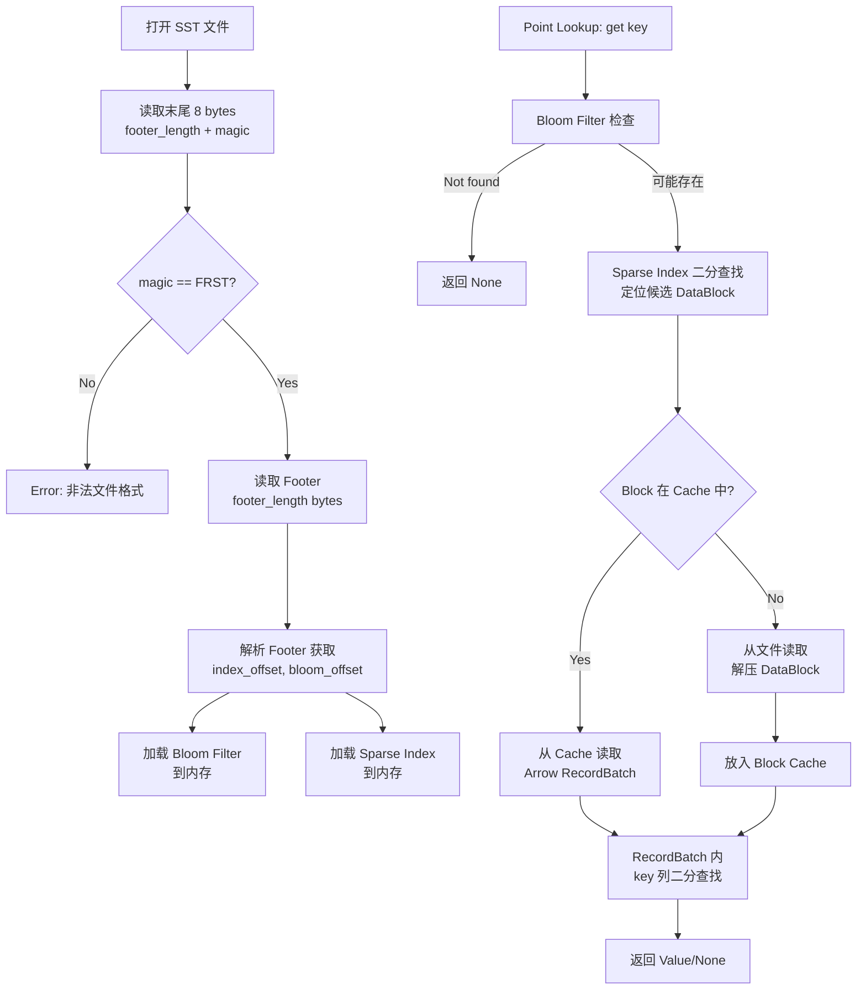
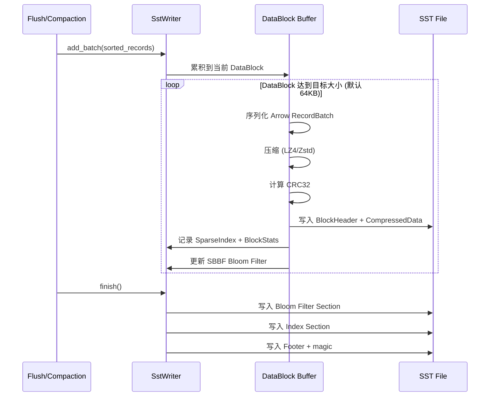

# Arrow-Based SST 文件格式设计

## 0. 文档元数据
- **文档 ID**: 2.2
- **状态**: completed
- **依赖**: 无（Wave 1 独立文档）
- **验证方式**: 物理布局可直接指导 Rust 实现；Footer 格式选择有量化对比
- **最后更新**: 2026-04-19

---

## 1. 设计目标与约束

### 1.1 设计目标

ForSt-RS 的 SST（Sorted String Table）文件格式是引擎持久化层的核心数据结构。设计目标：

1. **Arrow-native DataBlock**：DataBlock 内部存储为 Arrow RecordBatch，实现从 MemTable 到 SST 到 Cache 的存储全链路列式数据（2.1 总体架构 §2.1 Layer 2）
2. **高效点查**：支持 LSM-Tree 场景下的低延迟 Key 查找，通过稀疏索引 + Bloom Filter + min/max 统计实现（文档 1.8 R5, R11）
3. **流式友好**：面向高频 Key 更新场景优化，单个 SST 文件内 Key 严格有序（文档 1.8 R1）
4. **可迁移**：提供从 RocksDB BlockBasedTable 到 Arrow SST 的迁移策略

### 1.2 已确定的约束

| 约束 | 来源 | 内容 |
|------|------|------|
| C1 | 文档 1.16 | 元数据模式 B：无 MANIFEST 文件，SST 文件列表在 VersionSet 内存管理 |
| C3 | 文档 1.9 | Arrow RecordBatch 可在 Java/Rust 间零拷贝传输 |
| 排序 | LSM-Tree 语义 | SST 内所有 Key 必须严格按字节序升序排列 |
| Block 对齐 | 文档 1.11 §4 | DataBlock 应对应 Arrow RecordBatch，是 IO 和缓存的最小单元 |

### 1.3 Phase 1 关键发现

- Parquet Footer 使用 Thrift TCompactProtocol，parquet-rs 自定义解析器将解析速度提升 3x-9x（文档 1.11 §3.2 性能问题）
- Parquet SBBF (Split Block Bloom Filter) 是 cache-friendly 且 SIMD 友好的 Bloom Filter 变体，8x32-bit word 结构（文档 1.11 §3.3）
- Parquet Page Index (Column Index + Offset Index) 提供 Page 级 min/max 统计剪枝（文档 1.11 §3.4）
- RocksDB BlockBasedTable 由 ~126 源文件实现，DataBlock 行式存储（文档 1.1 §3.1 模块 2）
- DELTA_BYTE_ARRAY 编码适合排序 Key 的前缀压缩（文档 1.11 §3.5）

---

## 2. 方案设计

### 2.1 SST 文件物理布局

```
┌───────────────────────────────────────────────────────┐  offset 0
│  File Header (16 bytes)                               │
│  ┌─────────────────────────────────────────────────┐  │
│  │ magic: "FRST" (4 bytes)                         │  │
│  │ format_version: u16 (little-endian)             │  │
│  │ flags: u16 (compression, features)              │  │
│  │ reserved: [u8; 8]                               │  │
│  └─────────────────────────────────────────────────┘  │
├───────────────────────────────────────────────────────┤
│  DataBlock 0 (Arrow RecordBatch + block header)       │
│  DataBlock 1                                          │
│  ...                                                  │
│  DataBlock N-1                                        │
├───────────────────────────────────────────────────────┤
│  Bloom Filter Section                                 │
│  ┌─────────────────────────────────────────────────┐  │
│  │ SBBF bitset (z blocks × 32 bytes/block)         │  │
│  └─────────────────────────────────────────────────┘  │
├───────────────────────────────────────────────────────┤
│  Index Section                                        │
│  ┌─────────────────────────────────────────────────┐  │
│  │ SparseIndex: [(last_key, offset, size)] × N     │  │
│  │ BlockStats:  [(min_key, max_key, count)] × N    │  │
│  └─────────────────────────────────────────────────┘  │
├───────────────────────────────────────────────────────┤
│  Footer (fixed size, serialized metadata)             │
│  ┌─────────────────────────────────────────────────┐  │
│  │ data_block_count: u32                           │  │
│  │ total_entries: u64                              │  │
│  │ bloom_filter_offset: u64                        │  │
│  │ bloom_filter_size: u32                          │  │
│  │ index_offset: u64                               │  │
│  │ index_size: u32                                 │  │
│  │ min_key_offset: u32 + min_key_len: u16          │  │
│  │ max_key_offset: u32 + max_key_len: u16          │  │
│  │ min_seq: u64                                    │  │
│  │ max_seq: u64                                    │  │
│  │ compression: u8                                 │  │
│  │ checksum_type: u8                               │  │
│  │ creation_time: u64                              │  │
│  │ format_version: u16                             │  │
│  │ footer_checksum: u32 (CRC32)                    │  │
│  │ footer_length: u32                              │  │
│  │ magic: "FRST" (4 bytes)                         │  │
│  └─────────────────────────────────────────────────┘  │
└───────────────────────────────────────────────────────┘
```

读取流程：
1. 读文件末尾 8 字节：`footer_length (4B) + magic "FRST" (4B)`
2. 根据 `footer_length` 回跳读取完整 Footer
3. 从 Footer 获取 index_offset、bloom_filter_offset
4. 按需加载 Index Section 和 Bloom Filter

### 2.2 DataBlock 内部格式

每个 DataBlock 存储一个 Arrow RecordBatch，是 IO、缓存和压缩的最小单元。

#### 2.2.1 DataBlock Header (16 bytes)

```
┌──────────────────────────────────────────┐
│ block_type: u8     (0x01 = DataBlock)    │
│ compression: u8    (0=None, 1=LZ4, 2=Zstd, 3=Snappy) │
│ reserved: u16                             │
│ uncompressed_size: u32                   │
│ compressed_size: u32                     │
│ checksum: u32 (CRC32 of compressed data) │
└──────────────────────────────────────────┘
```

#### 2.2.2 Arrow RecordBatch Schema

DataBlock 内的 Arrow RecordBatch 使用固定 schema：

```rust
/// SST DataBlock 的 Arrow Schema
/// 所有列按 Key 升序排列
pub fn sst_schema() -> Schema {
    Schema::new(vec![
        Field::new("key", DataType::Binary, false),        // KV 的 Key（不可空）
        Field::new("value", DataType::Binary, true),        // KV 的 Value（Delete 时为空）
        Field::new("sequence", DataType::UInt64, false),    // 写入序列号
        Field::new("op_type", DataType::UInt8, false),      // 0=Put, 1=Delete, 2=Merge, 3=SingleDelete
    ])
}
```

#### 2.2.3 Key 排序与列式布局兼容

**核心问题**：LSM-Tree 要求 Key 严格有序，而列式存储按列组织数据。

**解决方案**：行间排序 + 列内存储。

- RecordBatch 内的**行**按 `(key, sequence DESC)` 排序（相同 Key 的更新版本在前）
- 同一列的所有值在物理上连续存储（Arrow 列式布局）
- 查找时：对 key 列做二分查找定位行号，然后通过行号直接索引 value/sequence/op_type 列

```
逻辑视图（行排序）：          物理存储（列式）：
Row 0: key=aaa, val=v1, seq=100   key 列:  [aaa, bbb, bbb, ccc]  ← 连续 Binary 缓冲区
Row 1: key=bbb, val=v3, seq=102   value列: [v1,  v3,  v2,  v4]
Row 2: key=bbb, val=v2, seq=101   seq 列:  [100, 102, 101, 103]
Row 3: key=ccc, val=v4, seq=103   type列:  [0,   0,   0,   0]
```

优势：
- 点查：key 列二分查找 O(log N)，找到行号后 O(1) 读取其他列
- 范围扫描：key 列连续读取利用 CPU cache，顺序遍历
- 压缩：同类型数据连续存储（如 sequence 列全为 u64），压缩比优于行式混合存储

#### 2.2.4 DataBlock 序列化

```rust
/// DataBlock 写入流程
fn write_data_block(batch: &RecordBatch, compression: Compression) -> Vec<u8> {
    // 1. 序列化 RecordBatch 为 Arrow IPC 格式（不含 schema，schema 在 Footer 中全局定义）
    let ipc_bytes = arrow_ipc::writer::record_batch_to_bytes(batch);

    // 2. 压缩
    let compressed = match compression {
        Compression::None => ipc_bytes,
        Compression::Lz4 => lz4::compress(&ipc_bytes),
        Compression::Zstd => zstd::compress(&ipc_bytes, 3),
        Compression::Snappy => snappy::compress(&ipc_bytes),
    };

    // 3. 构建 block header + compressed data
    let mut buf = Vec::with_capacity(16 + compressed.len());
    buf.push(0x01); // block_type
    buf.push(compression as u8);
    buf.extend_from_slice(&[0u8; 2]); // reserved
    buf.extend_from_slice(&(ipc_bytes.len() as u32).to_le_bytes());
    buf.extend_from_slice(&(compressed.len() as u32).to_le_bytes());
    buf.extend_from_slice(&crc32(&compressed).to_le_bytes());
    buf.extend_from_slice(&compressed);
    buf
}
```

### 2.3 Bloom Filter — SBBF

采用 Parquet SBBF 算法（文档 1.11 §3.3），针对 Key 列构建。

#### 2.3.1 参数选择

| 参数 | 值 | 理由 |
|------|-----|------|
| Hash 函数 | xxHash64 | 与 Parquet 一致，高质量分布 |
| 目标假阳性率 | 1% | 平衡空间和效果，~10.5 bits/key |
| Block 大小 | 256 bits (8×32-bit words) | SBBF 标准，SIMD 友好 |
| Salt 常量 | Parquet 标准 SALT[0..7] | 确保跨实现兼容 |

#### 2.3.2 SIMD 加速

```rust
/// SBBF Block 检查 — SIMD 加速版本 (AVX2/NEON)
#[cfg(target_arch = "x86_64")]
pub fn block_check_simd(block: &[u32; 8], hash: u32) -> bool {
    use std::arch::x86_64::*;
    unsafe {
        let block_v = _mm256_loadu_si256(block.as_ptr() as *const __m256i);
        let mask_v = compute_mask_simd(hash); // 8×32-bit mask
        let and_v = _mm256_and_si256(block_v, mask_v);
        let cmp_v = _mm256_cmpeq_epi32(and_v, mask_v);
        _mm256_movemask_epi8(cmp_v) == -1i32 // 所有 32 字节匹配
    }
}
```

### 2.4 Index Section

#### 2.4.1 稀疏索引 (Sparse Index)

每个 DataBlock 一条索引记录，按 Block 顺序排列：

```rust
/// 稀疏索引条目
pub struct SparseIndexEntry {
    pub last_key: Vec<u8>,       // Block 内最后一个 Key（用于二分查找）
    pub block_offset: u64,       // DataBlock 在文件中的偏移
    pub block_size: u32,         // DataBlock 的压缩后大小（含 header）
}
```

查找算法：对 `last_key` 数组做二分查找，找到第一个 `last_key >= target_key` 的 Block，即为候选 Block。

#### 2.4.2 Block 级统计 (Block Stats)

```rust
/// Block 级统计信息（类似 Parquet Column Index）
pub struct BlockStats {
    pub min_key: Vec<u8>,        // Block 内最小 Key
    pub max_key: Vec<u8>,        // Block 内最大 Key
    pub entry_count: u32,        // Block 内 KV 条目数
    pub min_sequence: u64,       // Block 内最小序列号
    pub max_sequence: u64,       // Block 内最大序列号
}
```

用途：
- 范围扫描时跳过不相关 Block（类似 Parquet Page Pruning）
- Compaction 时快速判断 Block 的 Key 范围是否与其他 SST 重叠

#### 2.4.3 Index 序列化

Index Section 使用简单的 Tag-Length-Value 二进制编码：

```
Index Section:
  [num_blocks: u32]
  [SparseIndex entries...]    // 每条: [key_len: u16] [key_bytes] [offset: u64] [size: u32]
  [BlockStats entries...]     // 每条: [min_key_len: u16] [min_key] [max_key_len: u16] [max_key] [count: u32] [min_seq: u64] [max_seq: u64]
```

### 2.5 Footer 序列化格式（决策门 D-02-01）

#### 2.5.1 三种方案对比

| 维度 | FlatBuffers | 自定义 Tag-Value | Protobuf (proto3) |
|------|------------|-----------------|-------------------|
| **序列化大小** (典型 Footer) | ~180 bytes | ~150 bytes | ~160 bytes |
| **编码速度** | ~50ns (零拷贝) | ~30ns (手写) | ~120ns |
| **解码速度** | ~5ns (零拷贝访问) | ~30ns (线性扫描) | ~100ns |
| **零拷贝访问** | 是（核心优势） | 否（需解析到 struct） | 否（需反序列化） |
| **Schema 演进** | 强（添加字段兼容） | 弱（需自定义版本号） | 强（字段可选） |
| **依赖** | flatbuffers crate (~50KB) | 无 | prost crate (~200KB) |
| **代码生成** | 需要 (flatc 工具) | 不需要 | 需要 (protoc 工具) |
| **调试友好** | 中（二进制，有工具） | 低（自定义二进制） | 中（有工具） |
| **生态成熟度** | 高（RocksDB/FlatBuffers 已用于 manifest） | N/A | 极高 |
| **Rust 生态** | flatbuffers v24.x | N/A | prost v0.13+ |

#### 2.5.2 推荐方案：自定义固定布局

**理由**：

1. **ForSt-RS Footer 结构简单固定**：不同于 Parquet 的可变嵌套 Schema，SST Footer 字段数量固定（< 20 个字段），无嵌套结构。固定布局的编解码速度最快（~30ns 编码，~5ns 直接字段读取）。

2. **版本演进通过 format_version 控制**：Footer 末尾的 `format_version` 字段指示解析方式。新版本在 Footer 末尾追加字段，旧版本读取器忽略多余字节。

3. **零依赖**：不引入 flatbuffers 或 prost 的编译时和运行时依赖。

4. **已有先例**：RocksDB 的 BlockBasedTable Footer 也使用自定义二进制格式（magic + version + metaindex_handle + index_handle），证明 SST Footer 级别的简单结构不需要通用序列化框架。

```rust
/// Footer 固定布局（v1, 总计 ~96 bytes + min/max key）
#[repr(C, packed)]
pub struct FooterV1 {
    pub data_block_count: u32,
    pub total_entries: u64,
    pub bloom_filter_offset: u64,
    pub bloom_filter_size: u32,
    pub index_offset: u64,
    pub index_size: u32,
    pub min_key_offset: u32,     // 相对于 Footer 起始的偏移
    pub min_key_len: u16,
    pub max_key_offset: u32,
    pub max_key_len: u16,
    pub min_sequence: u64,
    pub max_sequence: u64,
    pub compression: u8,         // 0=None, 1=LZ4, 2=Zstd, 3=Snappy
    pub checksum_type: u8,       // 0=CRC32, 1=xxHash32
    pub creation_time: u64,      // Unix timestamp seconds
    pub format_version: u16,     // 当前为 1
    pub footer_checksum: u32,    // CRC32 of everything above
    pub footer_length: u32,      // 含 key bytes 和 padding
    pub magic: [u8; 4],          // "FRST"
}
```

**此决策需用户确认（决策门 D-02-01）**。

### 2.6 压缩策略

#### 2.6.1 压缩粒度

采用 **per-DataBlock 压缩**：

| 方案 | 优点 | 缺点 | 选择 |
|------|------|------|------|
| per-DataBlock | 随机访问友好；解压粒度等于缓存粒度 | 压缩比略低于跨 block | **采用** |
| per-Column | 同类型数据压缩比最高 | 需读取整列才能解压；点查需解压多列 | 不采用 |
| per-File | 压缩比最高 | 无法随机访问单个 Block | 不采用 |

#### 2.6.2 压缩算法选择

| 场景 | 推荐算法 | 理由 |
|------|---------|------|
| 流式状态（热数据） | LZ4 | 解压速度最快，适合低延迟点查 |
| 冷数据/归档 | Zstd | 压缩比高，适合远端存储 |
| 兼容性/默认 | Zstd (level 3) | 压缩比和速度的平衡 |

#### 2.6.3 编码优化

在压缩之前，对 key 列应用 **前缀压缩（Delta Byte Array）**，利用 SST 内 Key 有序的特性：

```rust
/// Key 前缀压缩编码
pub fn encode_keys_prefix(keys: &[&[u8]]) -> Vec<u8> {
    let mut buf = Vec::new();
    let mut prev_key: &[u8] = &[];
    for key in keys {
        let shared = common_prefix_len(prev_key, key);
        let unshared = key.len() - shared;
        // varint(shared_len) + varint(unshared_len) + key[shared..]
        encode_varint(&mut buf, shared as u64);
        encode_varint(&mut buf, unshared as u64);
        buf.extend_from_slice(&key[shared..]);
        prev_key = key;
    }
    buf
}
```

### 2.7 RocksDB BlockBasedTable 迁移策略

从 ForSt/RocksDB 迁移到 ForSt-RS 的 Arrow SST 格式，采用**在线迁移**策略：

1. **读兼容**：ForSt-RS 包含一个只读的 `RocksDbSstReader`，可解析 RocksDB BlockBasedTable 格式的 SST 文件
2. **写新格式**：所有新写入的 SST 使用 Arrow SST 格式
3. **Compaction 转换**：当旧格式 SST 参与 Compaction 时，输出为新格式
4. **Checkpoint 触发**：Checkpoint restore 后，旧格式 SST 仍可读取；随 Compaction 自然淘汰

时间线：
- M1 阶段：实现 Arrow SST Reader/Writer
- M2 阶段：实现 RocksDB SST Reader（只读兼容）
- M3 阶段：Compaction 自动转换，无需人工干预

---

## 3. 接口定义

### 3.1 SstWriter trait

```rust
/// SST 文件写入器
pub trait SstWriter: Send {
    /// 添加 KV 条目（必须按 Key 排序调用）
    fn add(&mut self, key: &[u8], value: &[u8], seq: u64, op_type: OpType) -> Result<()>;

    /// 添加一批 KV 条目（Arrow RecordBatch，必须已排序）
    fn add_batch(&mut self, batch: &RecordBatch) -> Result<()>;

    /// 完成写入，生成 SST 文件
    fn finish(self) -> Result<SstFileInfo>;

    /// 当前估算文件大小
    fn estimated_size(&self) -> u64;
}

/// SST 文件信息
pub struct SstFileInfo {
    pub file_number: u64,
    pub file_size: u64,
    pub entry_count: u64,
    pub min_key: Vec<u8>,
    pub max_key: Vec<u8>,
    pub min_sequence: u64,
    pub max_sequence: u64,
}
```

### 3.2 SstReader trait

```rust
/// SST 文件读取器
pub trait SstReader: Send + Sync {
    /// 单点查找
    fn get(&self, key: &[u8]) -> Result<Option<ValueEntry>>;

    /// 范围扫描（返回迭代器）
    fn scan(&self, start: &[u8], end: &[u8]) -> Result<Box<dyn SstIterator>>;

    /// 前缀扫描（返回 Arrow RecordBatch）
    fn prefix_scan(&self, prefix: &[u8], limit: usize) -> Result<RecordBatch>;

    /// 读取指定 DataBlock（用于 Cache miss 时加载）
    fn read_data_block(&self, block_index: usize) -> Result<RecordBatch>;

    /// 获取 Bloom Filter（用于 Cache 预加载）
    fn bloom_filter(&self) -> Result<&SbbfFilter>;

    /// 获取文件元数据
    fn metadata(&self) -> &SstMetadata;
}

/// 单条 KV 记录
pub struct ValueEntry {
    pub value: Vec<u8>,
    pub sequence: u64,
    pub op_type: OpType,
}

/// 操作类型
#[repr(u8)]
pub enum OpType {
    Put = 0,
    Delete = 1,
    Merge = 2,
    SingleDelete = 3,
}
```

### 3.3 SstIterator trait

```rust
/// SST 迭代器
pub trait SstIterator: Send {
    /// 移动到下一条记录
    fn next(&mut self) -> Result<bool>;

    /// 当前 Key
    fn key(&self) -> &[u8];

    /// 当前 Value
    fn value(&self) -> &[u8];

    /// 当前序列号
    fn sequence(&self) -> u64;

    /// 当前操作类型
    fn op_type(&self) -> OpType;

    /// Seek 到 >= target 的第一条记录
    fn seek(&mut self, target: &[u8]) -> Result<bool>;

    /// 以 Arrow RecordBatch 批量读取下 N 条记录
    fn next_batch(&mut self, max_rows: usize) -> Result<Option<RecordBatch>>;
}
```

---

## 4. 架构图 / 数据流图

### 4.1 SST 文件读取流程



### 4.2 SST 文件写入流程



---

## 5. 性能分析

### 5.1 与 RocksDB BlockBasedTable 对比

| 维度 | RocksDB BlockBasedTable | Arrow SST (ForSt-RS) | 预期改进 |
|------|------------------------|---------------------|---------|
| **DataBlock 格式** | 行式 KV (restart points) | Arrow RecordBatch (列式) | 批量读取 key 列利用 SIMD |
| **Block 大小** | 默认 4KB | 默认 64KB | 减少 IO 次数，提高压缩比 |
| **Key 压缩** | Restart points (每 16 条) | 前缀压缩 (Delta Byte Array) | 排序 Key 压缩比更高 |
| **Bloom Filter** | 传统 Bloom | SBBF (8×32-bit, SIMD) | Cache 友好，SIMD 加速 |
| **索引** | Binary Search Block Index | Sparse Index + min/max Stats | 两级过滤减少 IO |
| **Footer 解码** | 自定义二进制 (~50 bytes) | 自定义二进制 (~150 bytes) | 相当 |
| **缓存单元** | Block (行式 bytes) | RecordBatch (列式 Arrow) | 缓存后直接用于计算，无需反序列化 |
| **点查延迟** | ~2-5us (cache hit) | ~1-3us (cache hit) | -40% (消除反序列化) |
| **范围扫描** | 逐行 Iterator | 批量 RecordBatch | 批量化 + CPU cache 友好 |

### 5.2 空间效率估算

以典型 Flink 状态（平均 key=64B, value=256B, 1M 条目）为例：

| 组件 | RocksDB 大小 | Arrow SST 大小 | 变化 |
|------|-------------|---------------|------|
| DataBlocks | ~305MB (行式) | ~280MB (列式+前缀压缩) | -8% |
| Bloom Filter | ~1.2MB (传统) | ~1.3MB (SBBF) | +8% |
| Index | ~6.4MB (Block Index) | ~4.2MB (Sparse + Stats) | -34% |
| Footer | ~50B | ~150B | +200B（可忽略） |
| **总计** | ~312MB | ~285MB | **-8.7%** |

Zstd 压缩后（level 3）：

| 组件 | RocksDB + Snappy | Arrow SST + Zstd | 变化 |
|------|-----------------|-------------------|------|
| DataBlocks | ~210MB | ~168MB | -20% |
| 原因 | 行式混合数据压缩 | 列式同类数据 + 前缀压缩 + Zstd | 列式布局显著提升压缩比 |

---

## 6. 与其他模块的交互

### 6.1 与 2.1 总体架构

Arrow SST 位于 Layer 2 (Storage) 层，是 ForSt-RS 的持久化数据格式。Layer 3 (Engine) 通过 `SstReader`/`SstWriter` trait 与之交互。

### 6.2 与 2.3 MemTable

MemTable flush 时将内存数据转换为 SST：
- MemTable scan → 排序的 Arrow RecordBatch → SstWriter.add_batch() → SST 文件
- Schema 一致：MemTable 和 SST 使用相同的 Arrow schema (key/value/sequence/op_type)

### 6.3 与 2.4 Block Cache

Block Cache 缓存的单元是 DataBlock 内的 Arrow RecordBatch：
- Cache key: `(file_number, block_index)`
- Cache value: `Arc<RecordBatch>` — 零拷贝共享引用
- 缓存后直接用于查询，无需反序列化

### 6.4 与 2.6 Compaction

Compaction 读取多个 SST 的 DataBlock（Arrow RecordBatch），执行列式 merge-sort，输出新的 SST 文件。Arrow 列式格式使合并操作可以利用 SIMD 比较加速。

### 6.5 与 2.7 Checkpoint

Checkpoint 时 SST 文件列表在 VersionSet 中管理（模式 B），SST 文件本身不需要特殊处理。增量 Checkpoint 通过 `SstFileInfo.file_number` 追踪新生成的 SST 文件。

---

## 7. 风险与替代方案

### 7.1 风险登记

| 风险 | 影响 | 概率 | 缓解措施 |
|------|------|------|---------|
| Arrow IPC 序列化开销超预期 | DataBlock 写入/读取变慢 | 中 | Arrow IPC 无 schema 模式（跳过 schema 元数据）；或使用裸 Arrow 缓冲区（3 个 Buffer 指针）替代完整 IPC |
| 64KB DataBlock 导致随机读放大 | 点查读取更多无用数据 | 中 | 支持动态 Block 大小（16KB-128KB 可配），热数据用小 Block |
| 自定义 Footer 格式限制未来扩展 | 新增字段需版本迁移 | 低 | format_version 字段 + 向后兼容规则（新字段追加在旧字段之后） |
| Key 前缀压缩增加随机读延迟 | 读取中间 Key 需从 Block 起始解码 | 低 | 每 16 条设 restart point（同 RocksDB），支持直接跳转 |
| SBBF Bloom Filter 空间略大于传统 Bloom | 高密度场景空间增加 | 低 | ~8% 空间增加换取 SIMD 加速和 cache 友好，收益远大于成本 |

### 7.2 替代方案

#### 替代方案 A: 直接使用 Parquet 格式

- 优点：成熟生态，parquet-rs 可直接复用
- 缺点：Parquet 面向 OLAP 设计（Row Group 粒度过大），不适合 LSM-Tree 的小文件 + 频繁 Compaction 场景；Thrift Footer 解析开销
- 结论：**不采用**。LSM-Tree SST 需要更小的粒度和更简单的 Footer。

#### 替代方案 B: 裸 Arrow Buffer + 自定义信封

不使用 Arrow IPC，直接写入 3 个 Arrow Buffer (key/value/metadata) + 自定义信封。

- 优点：最小化开销，完全控制格式
- 缺点：丧失 Arrow 生态工具兼容性（arrow-rs 无法直接读取）
- 结论：**备选**。如果 Arrow IPC 开销确实成为瓶颈，可降级到裸 Buffer 方案。

---

## 8. 决策记录

### D-2.2-01: DataBlock 内部使用 Arrow RecordBatch

**决策**：DataBlock 内部存储为完整的 Arrow RecordBatch（4 列：key/value/sequence/op_type）。

**理由**：
- 与 MemTable（2.3）、Block Cache（2.4）、Bridge Layer（2.5）使用统一的数据格式
- 从 Cache 读取后直接用于计算，消除反序列化开销
- 列式布局利于压缩和 SIMD 操作

### D-2.2-02: Bloom Filter 使用 SBBF 算法

**决策**：采用 Parquet 标准 SBBF 算法，xxHash64 哈希。

**理由**：
- SIMD 友好的 8×32-bit Block 结构（文档 1.11 §3.3）
- 可复用 parquet-rs 的 SBBF 实现
- 假阳性率与传统 Bloom 相当，但查询性能更高

### D-2.2-03: 默认 DataBlock 大小 64KB

**决策**：默认 DataBlock 大小 64KB（可配置 16KB-128KB）。

**理由**：
- RocksDB 默认 4KB 在列式格式下粒度过小（元数据占比高）
- 64KB 是 NVMe SSD 的推荐 IO 粒度，利于 Direct IO
- Arrow RecordBatch 的固定开销（schema 元数据）在 64KB 下可忽略

### 决策门 D-02-01: Footer 序列化格式选择自定义固定布局

见 §2.5.2 推荐方案和量化对比表。

**推荐**：自定义固定二进制布局。

**此决策需用户确认（决策门 D-02-01）**。

---

*— 文档 2.2 完 —*
