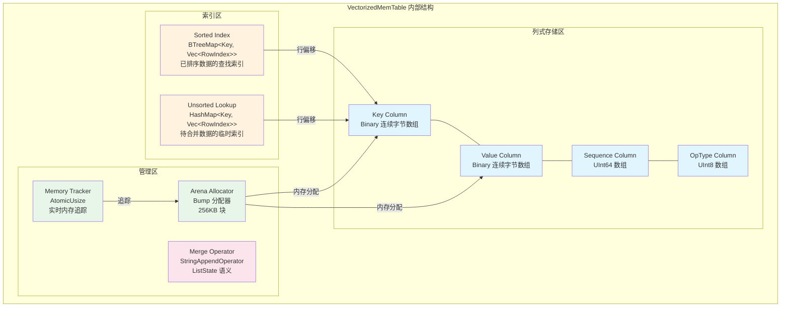
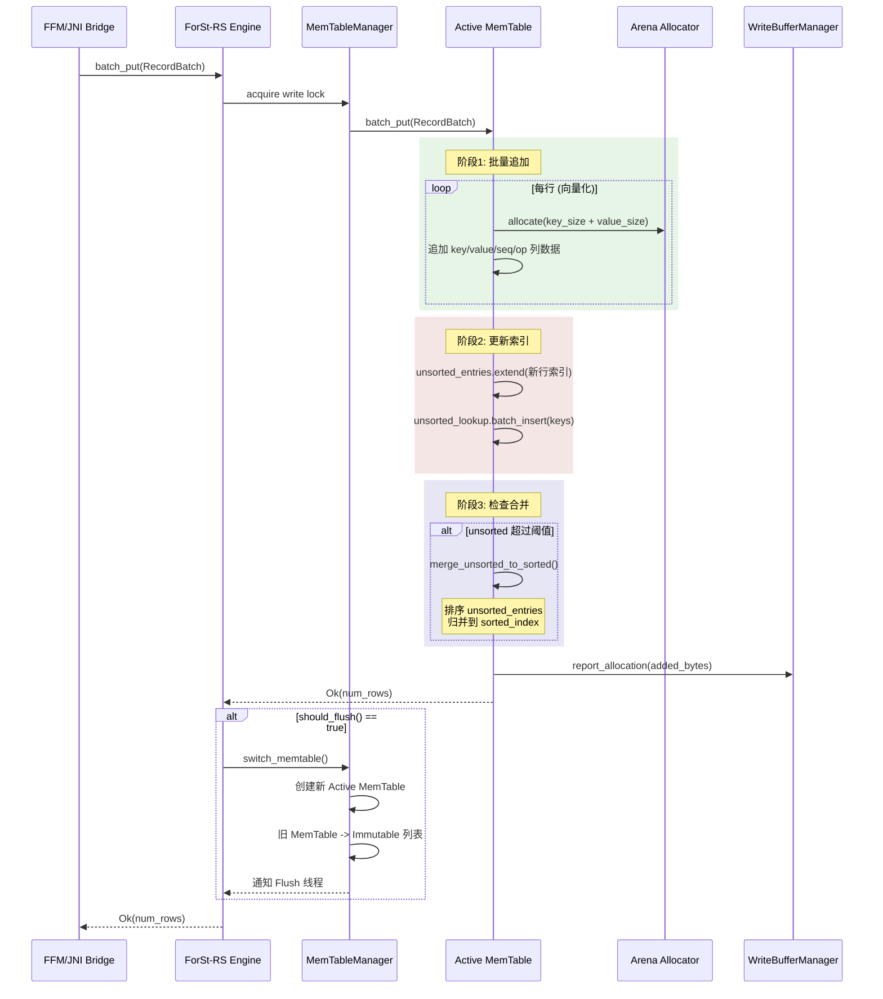
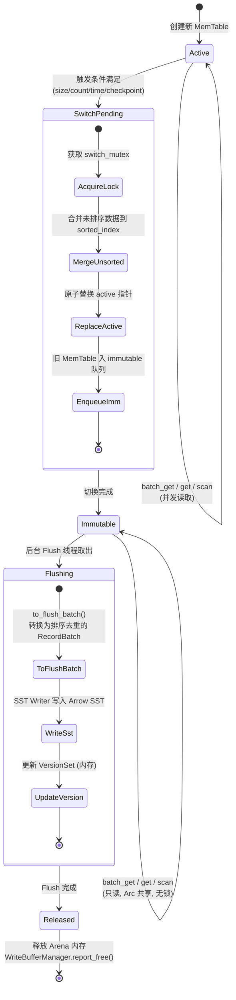

# 向量化 MemTable 设计

## 0. 文档元数据
- **文档 ID**: 2.3
- **状态**: completed
- **依赖**: 1.2 (ForSt 运行时架构), 1.7 (瓶颈热点), 1.8 (Gap 分析), 1.4 (Flink StateBackend API)
- **验证方式**: 数据结构选型有复杂度对比；并发模型无 data race；批量操作接口完整；Merge Operator 语义完备
- **最后更新**: 2026-04-19

---

## 1. 设计目标与约束

### 1.1 设计目标

MemTable 是 LSM-Tree 写路径的核心内存组件，负责接收所有写入并在内存中维护有序的 KV 数据。ForSt-RS 的向量化 MemTable 需要实现以下目标：

1. **批量写入**：支持将 Arrow RecordBatch 批量插入 MemTable，消除逐条写入开销（文档 1.8 R2 数据向量化）
2. **批量读取**：支持批量点查和范围扫描，返回 Arrow RecordBatch 列式结果（文档 1.4 multiGet 批量读路径）
3. **低锁竞争**：消除 ForSt/RocksDB 写路径中的 WriteThread mutex、DB mutex、Arena atomic 等锁争用（文档 1.7 瓶颈 B4）
4. **Merge Operator 支持**：兼容 Flink ListState 的 StringAppendOperator 语义（文档 1.4 第 3.2.3 节）
5. **高效内存分配**：使用 Arena/Bump allocator 减少碎片，追踪内存用量（文档 1.2 第 3.4 节 Arena 设计）
6. **Arrow 内存对齐**：数据布局与 Arrow 列式格式对齐，Flush 时可零拷贝转换为 Arrow RecordBatch

### 1.2 已知约束

| 约束 | 来源 | 内容 |
|------|------|------|
| C1 | 文档 1.16 | 元数据采用模式 B（纯 Checkpoint），MemTable 切换时的版本更新为纯内存操作 |
| C3 | 文档 1.9 | Arrow 零拷贝 Java<->Rust 需 off-heap + 生命周期管理 |
| C8 | 文档 1.7 B4 | 写路径锁竞争是中-高影响瓶颈：WriteThread mutex + DB mutex + CAS 重试 + Arena atomic |
| C9 | Phase 2 规范 | 允许修改 Flink 源码 |

### 1.3 现状分析

ForSt/RocksDB 当前 MemTable 实现（文档 1.2 第 3.4 节）：

- **数据结构**：InlineSkipList，最大高度 12，分支因子 4
- **并发写入**：`InsertConcurrently()` 使用 CAS 原子操作，高竞争下 CAS 重试退化
- **内存分配**：ConcurrentArena 通过 ThreadLocal shard 分配，fallback 到全局 arena 时有 atomic 争用（文档 1.7 B4 竞争点 5）
- **切换机制**：达到 `write_buffer_size` 后转为 Immutable，等待后台 Flush
- **单条操作**：所有 API 基于逐条 byte[] Slice，无批量接口

---

## 2. 方案设计

### 2.1 数据结构选型

#### 2.1.1 候选方案对比

| 维度 | Concurrent SkipList | B+ Tree (BTreeMap) | ART (Adaptive Radix Tree) | Sorted Run Array |
|------|--------------------|--------------------|---------------------------|------------------|
| **单点插入时间** | O(log N) 均摊 | O(log N) | O(k), k=key 长度 | O(1) 追加, O(N log N) 排序 |
| **单点查找时间** | O(log N) | O(log N) | O(k) | O(log N) 二分查找 |
| **范围扫描** | O(log N + M), M=结果数 | O(log N + M), 缓存友好 | O(k + M), 前缀友好 | O(log N + M), 极致缓存友好 |
| **批量写入** | 逐条 O(N log N) | 逐条 O(N log N) | 逐条 O(Nk) | O(N) 追加 + O(N log N) 排序 |
| **内存效率** | 低 -- 每节点多层指针（12层*8B） | 中 -- 节点内紧凑，指针较少 | 高 -- 前缀压缩，自适应节点(Node4/16/48/256) | 极高 -- 连续数组，无指针开销 |
| **缓存友好性** | 差 -- 随机跳转，缓存行利用率低 | 好 -- 节点内顺序扫描 | 中 -- 节点大小自适应 | 极好 -- 连续内存，向量化友好 |
| **并发性** | 好 -- 成熟的无锁 CAS 方案 | 中 -- 需 RwLock 或 OLC | 中 -- 乐观锁或 RwLock | 差 -- 排序阶段需独占 |
| **Arrow 亲和性** | 差 -- 散列内存布局 | 中 -- 可批量导出 | 中 -- 遍历后批量导出 | 极好 -- 天然列式对齐 |
| **Merge 支持** | 好 -- 就地更新 | 好 -- 就地更新 | 好 -- 就地更新 | 需延迟合并 |
| **成熟度 (Rust)** | crossbeam-skiplist | std::collections::BTreeMap | 有 art-tree 等 crate，但不够成熟 | 自实现，简单可控 |

#### 2.1.2 推荐方案：混合架构 -- Sorted Run Array + BTreeMap 索引

**核心设计理念**：利用 Flink 批量写入的特性（文档 1.4 第 3.3 节 WriteBatch 机制），采用**写入阶段追加 + 后台排序**的两阶段策略，最大化批量写入性能和 Arrow 亲和性。

**方案组成**：

1. **写入缓冲区（Write Buffer）**：Sorted Run Array -- 接收批量写入的 Arrow RecordBatch，追加到连续内存区域
2. **排序索引（Sorted Index）**：BTreeMap<KeyBytes, RowIndex> -- 维护已排序数据的快速查找索引
3. **未排序区（Unsorted Zone）**：最近一批写入尚未合并到排序索引的数据，使用临时 HashMap 提供点查能力

**选型理由**：

- Flink 异步状态后端的写入模式是**批量 WriteBatch**（文档 1.4 第 3.4.3 节），单次提交数十至数百个 KV 对，天然适合 Sorted Run Array 的批量追加
- Sorted Run Array 的连续内存布局与 Arrow RecordBatch 完全对齐，Flush 时可近零拷贝转换
- BTreeMap 是 Rust 标准库自带的 B-Tree 实现，缓存友好且无需外部依赖
- 避免了 SkipList 的指针追踪和 CAS 重试问题（文档 1.7 B4 竞争点 4）

### 2.2 MemTable 内部数据结构

#### 2.2.1 列式存储布局

MemTable 内部采用与 Arrow SST 格式（文档 2.2）一致的列式布局：

```
MemTable 内部布局:
┌─────────────────────────────────────────────────────┐
│  Key Column    (Binary/LargeBinary)                 │  -- 排序后的 key bytes
│  Value Column  (Binary/LargeBinary)                 │  -- 对应的 value bytes
│  Sequence Column (UInt64)                           │  -- 全局递增序列号
│  OpType Column   (UInt8)                            │  -- 操作类型: Put=1, Delete=2, Merge=3
├─────────────────────────────────────────────────────┤
│  Sorted Index: BTreeMap<KeyBytes, Vec<RowIndex>>    │  -- key -> 行索引 (多版本)
│  Unsorted Buffer: Vec<PendingEntry>                 │  -- 待合并的写入
├─────────────────────────────────────────────────────┤
│  Arena Allocator                                    │  -- 列数据的底层内存
│  Memory Tracker                                     │  -- 已用内存追踪
└─────────────────────────────────────────────────────┘
```

#### 2.2.2 核心 Rust 数据结构

```rust
/// MemTable 中的操作类型
#[repr(u8)]
pub enum OpType {
    Put = 1,
    Delete = 2,
    Merge = 3,
}

/// MemTable 中一行记录的位置索引
#[derive(Clone, Copy)]
struct RowIndex {
    /// 在列式数组中的行偏移
    offset: u32,
    /// 序列号（用于 MVCC 和多版本）
    sequence: u64,
    /// 操作类型
    op_type: OpType,
}

/// 向量化 MemTable 核心结构
pub struct VectorizedMemTable {
    /// 列式存储 -- key 列（Arrow BinaryBuilder 风格）
    key_data: Vec<u8>,
    key_offsets: Vec<u32>,

    /// 列式存储 -- value 列
    value_data: Vec<u8>,
    value_offsets: Vec<u32>,

    /// 列式存储 -- sequence 列
    sequences: Vec<u64>,

    /// 列式存储 -- op_type 列
    op_types: Vec<u8>,

    /// 已排序区的索引: key -> 最新的 RowIndex（支持多版本链）
    sorted_index: BTreeMap<Vec<u8>, SmallVec<[RowIndex; 2]>>,

    /// 已排序区的行数
    sorted_count: u32,

    /// 未排序缓冲区: 批量写入后待合并的条目索引
    unsorted_entries: Vec<u32>,

    /// 未排序区的点查辅助索引
    unsorted_lookup: HashMap<Vec<u8>, SmallVec<[RowIndex; 2]>>,

    /// 全局序列号生成器引用
    sequence_generator: Arc<AtomicU64>,

    /// 内存追踪
    memory_used: AtomicUsize,
    memory_limit: usize,

    /// Merge Operator 注册表
    merge_operator: Option<Arc<dyn MergeOperator>>,
}
```

### 2.3 向量化批量操作

#### 2.3.1 batch_put -- 批量写入

```rust
/// 将 Arrow RecordBatch 批量插入 MemTable
///
/// RecordBatch schema:
///   - key: Binary      (必选)
///   - value: Binary     (可选, Delete 时为 null)
///   - op_type: UInt8    (必选: Put=1, Delete=2, Merge=3)
pub trait MemTableWriter {
    /// 批量写入一个 RecordBatch，返回写入行数
    fn batch_put(&mut self, batch: &RecordBatch) -> Result<usize>;

    /// 单条写入（兼容逐条操作的场景）
    fn put(&mut self, key: &[u8], value: &[u8], op_type: OpType) -> Result<()>;

    /// 单条 merge 写入
    fn merge(&mut self, key: &[u8], operand: &[u8]) -> Result<()>;
}
```

**batch_put 内部流程**：

1. **追加阶段 (O(N))**：将 RecordBatch 的各列数据追加到 MemTable 的列式存储中，为每行分配递增的 sequence number
2. **索引更新**：将新写入的行索引添加到 `unsorted_entries` 和 `unsorted_lookup` 中
3. **延迟排序**：当 unsorted_entries 的数量超过阈值（如 sorted_count 的 25%）时，触发后台合并到 sorted_index
4. **内存追踪**：原子更新 `memory_used`，检查是否需要触发 MemTable 切换

```rust
impl VectorizedMemTable {
    pub fn batch_put(&mut self, batch: &RecordBatch) -> Result<usize> {
        let key_array = batch.column(0).as_binary::<i32>();
        let value_array = batch.column(1).as_binary::<i32>();
        let op_type_array = batch.column(2).as_primitive::<UInt8Type>();

        let base_seq = self.sequence_generator
            .fetch_add(batch.num_rows() as u64, Ordering::SeqCst);
        let base_offset = self.key_offsets.len() as u32 - 1;

        // 阶段 1: 批量追加列式数据
        for i in 0..batch.num_rows() {
            let key = key_array.value(i);
            let value = if value_array.is_null(i) { &[] } else { value_array.value(i) };
            let seq = base_seq + i as u64;
            let op = op_type_array.value(i);

            // 追加 key 列
            self.key_data.extend_from_slice(key);
            self.key_offsets.push(self.key_data.len() as u32);

            // 追加 value 列
            self.value_data.extend_from_slice(value);
            self.value_offsets.push(self.value_data.len() as u32);

            // 追加 sequence 和 op_type
            self.sequences.push(seq);
            self.op_types.push(op);

            let row_idx = base_offset + i as u32;
            let row_index = RowIndex { offset: row_idx, sequence: seq, op_type: OpType::from(op) };

            // 阶段 2: 更新未排序索引
            self.unsorted_entries.push(row_idx);
            self.unsorted_lookup
                .entry(key.to_vec())
                .or_default()
                .push(row_index);
        }

        // 阶段 3: 检查是否需要合并
        if self.unsorted_entries.len() > (self.sorted_count as usize / 4).max(1024) {
            self.merge_unsorted_to_sorted();
        }

        // 阶段 4: 更新内存追踪
        let added_bytes = /* 计算新增内存 */;
        self.memory_used.fetch_add(added_bytes, Ordering::Relaxed);

        Ok(batch.num_rows())
    }
}
```

#### 2.3.2 batch_get -- 批量点查

```rust
/// 批量点查接口，返回 Arrow RecordBatch
pub trait MemTableReader {
    /// 批量点查: 给定一组 key，返回 (key, value, sequence, op_type) 的 RecordBatch
    /// 对于每个 key，返回 sequence <= read_sequence 的最新版本
    fn batch_get(&self, keys: &[&[u8]], read_sequence: u64) -> Result<RecordBatch>;

    /// 单点查找
    fn get(&self, key: &[u8], read_sequence: u64) -> Result<Option<GetResult>>;

    /// 范围扫描，返回 Arrow RecordBatch 流
    fn scan(
        &self,
        start: Bound<&[u8]>,
        end: Bound<&[u8]>,
        read_sequence: u64,
    ) -> Result<MemTableIterator>;
}

/// 单点查找结果
pub struct GetResult {
    pub value: Vec<u8>,
    pub sequence: u64,
    pub op_type: OpType,
}
```

**batch_get 内部流程**：

1. 对每个 key，先查 `unsorted_lookup`，再查 `sorted_index`
2. 对找到的所有 RowIndex，筛选 `sequence <= read_sequence` 的最新版本
3. 如果 `op_type == Merge`，沿版本链收集所有 Merge operand，调用 MergeOperator 合并
4. 收集所有结果，构建 Arrow RecordBatch 返回

```rust
impl VectorizedMemTable {
    pub fn batch_get(&self, keys: &[&[u8]], read_seq: u64) -> Result<RecordBatch> {
        let mut result_keys = BinaryBuilder::new();
        let mut result_values = BinaryBuilder::new();
        let mut result_seqs = UInt64Builder::new();
        let mut result_ops = UInt8Builder::new();

        for key in keys {
            if let Some(result) = self.lookup_key(key, read_seq)? {
                result_keys.append_value(key);
                result_values.append_value(&result.value);
                result_seqs.append_value(result.sequence);
                result_ops.append_value(result.op_type as u8);
            } else {
                // key 不存在 -- 追加 null
                result_keys.append_null();
                result_values.append_null();
                result_seqs.append_null();
                result_ops.append_null();
            }
        }

        // 构建 RecordBatch
        let schema = self.result_schema();
        RecordBatch::try_new(schema, vec![
            Arc::new(result_keys.finish()),
            Arc::new(result_values.finish()),
            Arc::new(result_seqs.finish()),
            Arc::new(result_ops.finish()),
        ])
    }

    fn lookup_key(&self, key: &[u8], read_seq: u64) -> Result<Option<GetResult>> {
        // 先查未排序区（更新的数据）
        let unsorted_result = self.unsorted_lookup.get(key)
            .and_then(|indices| self.find_latest(indices, read_seq));

        // 再查已排序区
        let sorted_result = self.sorted_index.get(key)
            .and_then(|indices| self.find_latest(indices, read_seq));

        // 取 sequence 更大的结果
        match (unsorted_result, sorted_result) {
            (Some(u), Some(s)) => Ok(Some(if u.sequence > s.sequence { u } else { s })),
            (Some(u), None) => Ok(Some(u)),
            (None, Some(s)) => Ok(Some(s)),
            (None, None) => Ok(None),
        }
    }
}
```

#### 2.3.3 scan -- 范围扫描

```rust
/// MemTable 范围扫描迭代器
pub struct MemTableIterator {
    /// 已排序区的 BTree range 迭代器
    sorted_iter: btree_map::Range<'a, Vec<u8>, SmallVec<[RowIndex; 2]>>,
    /// 未排序区的排序后切片迭代器
    unsorted_sorted: Vec<(Vec<u8>, RowIndex)>,
    unsorted_pos: usize,
    /// 读取快照序列号
    read_sequence: u64,
    /// 列式数据引用（只读）
    columns: ColumnsRef<'a>,
    /// Merge Operator
    merge_op: Option<Arc<dyn MergeOperator>>,
}

impl MemTableIterator {
    /// 获取下一批结果，返回 Arrow RecordBatch
    /// batch_size 控制每批最大行数
    pub fn next_batch(&mut self, batch_size: usize) -> Result<Option<RecordBatch>> {
        // 归并 sorted_iter 和 unsorted_sorted
        // 按 key 升序 + sequence 降序输出
        // 同一 key 只保留 read_sequence 下的最新版本
        // 累积 batch_size 行后构建 RecordBatch 返回
        todo!()
    }
}
```

**内部排序 + 去重策略**：

- **排序**：scan 启动时，将 unsorted_entries 按 key 排序，形成有序切片
- **去重**：归并过程中，同一 key 只保留 `sequence <= read_sequence` 的最大 sequence 版本
- **Merge 解析**：遇到 `OpType::Merge` 时，收集同一 key 的所有 Merge operand（按 sequence 从旧到新），调用 MergeOperator.full_merge() 解析为最终值
- **Delete 处理**：遇到 `OpType::Delete` 时，该 key 视为不存在（Flush 后由 Compaction 最终清理）

### 2.4 并发模型

#### 2.4.1 读写并发控制

采用 **RwLock + Immutable 切换** 的双层并发模型：

```rust
/// 并发安全的 MemTable 管理器
pub struct MemTableManager {
    /// 当前活跃 MemTable（可写）
    /// 写操作获取 write lock，读操作获取 read lock
    active: Arc<RwLock<VectorizedMemTable>>,

    /// 不可变 MemTable 列表（只读，等待 Flush）
    /// 使用 Arc 共享引用，无需加锁
    immutables: Arc<RwLock<Vec<Arc<VectorizedMemTable>>>>,

    /// MemTable 切换锁（仅在 Active -> Immutable 切换时使用）
    switch_mutex: Mutex<()>,

    /// Flush 触发通知
    flush_notifier: tokio::sync::Notify,

    /// 全局序列号
    sequence: Arc<AtomicU64>,

    /// 配置
    config: MemTableConfig,
}

pub struct MemTableConfig {
    /// 单个 MemTable 的最大字节数（等价 write_buffer_size）
    pub max_memtable_size: usize,
    /// 最大 immutable MemTable 数量，超出则阻塞写入
    pub max_immutable_count: usize,
    /// 未排序区合并阈值（占已排序区比例）
    pub unsorted_merge_ratio: f64,
    /// Flush 触发: 最大记录数
    pub max_record_count: usize,
    /// Flush 触发: 最大等待时间
    pub max_flush_delay: Duration,
}
```

**并发安全论证**：

1. **写-写互斥**：`active.write()` 保证同一时刻只有一个写者修改活跃 MemTable。Flink 异步模型中，WriteBatch 在单个 write 线程中执行（文档 1.4 第 3.3.1 节 writeThreads），天然串行，RwLock 的 write lock 争用极低。
2. **读-写并发**：读操作（batch_get/scan）获取 `active.read()`，可与其他读者并发。写操作需等待所有读者完成。由于批量读（multiGet）执行时间短（微秒级），write lock 等待时间极短。
3. **Immutable 无锁读**：一旦 MemTable 转为 immutable（`Arc<VectorizedMemTable>`），所有读取通过 Arc 共享引用，无需任何锁。
4. **无 data race**：所有可变状态（列式数组、索引、计数器）只在持有 write lock 时修改。AtomicU64/AtomicUsize 用于跨线程共享的只读统计和序列号。

#### 2.4.2 Active -> Immutable 切换

```rust
impl MemTableManager {
    /// 切换当前活跃 MemTable 为不可变
    /// 该操作是原子的：新 MemTable 创建 + 旧 MemTable 入队 + active 指针替换
    pub async fn switch_memtable(&self) -> Result<()> {
        let _guard = self.switch_mutex.lock().await;

        // 1. 创建新的空 MemTable
        let new_memtable = VectorizedMemTable::new(
            self.sequence.clone(),
            self.config.clone(),
        );

        // 2. 原子替换 active MemTable
        let old_memtable = {
            let mut active = self.active.write().await;
            // 强制合并所有未排序数据
            active.merge_unsorted_to_sorted();
            std::mem::replace(&mut *active, new_memtable)
        };

        // 3. 将旧 MemTable 加入 immutable 列表
        {
            let mut imms = self.immutables.write().await;
            if imms.len() >= self.config.max_immutable_count {
                // 背压：等待 Flush 完成
                drop(imms);
                self.wait_for_flush().await?;
                imms = self.immutables.write().await;
            }
            imms.push(Arc::new(old_memtable));
        }

        // 4. 通知 Flush 线程
        self.flush_notifier.notify_one();

        Ok(())
    }
}
```

#### 2.4.3 Flush 触发条件

| 条件 | 阈值 | 说明 |
|------|------|------|
| **内存大小** | `max_memtable_size`（默认 64MB） | MemTable 内存用量达到阈值 |
| **记录数** | `max_record_count`（默认 100 万） | 记录数过多时索引效率下降 |
| **时间** | `max_flush_delay`（默认 60 秒） | 保证数据的 freshness |
| **Checkpoint 请求** | 外部触发 | Flink Checkpoint 同步阶段触发（文档 1.7 B5） |

#### 2.4.4 多写者并发写入策略

针对 Flink 异步模型（文档 1.4 第 3.3.1 节），ForSt-RS 采用**单写者模型**：

- Flink 的 `ForStWriteBatchOperation` 在单个 writeThread 中串行执行所有 put 请求（文档 1.4 第 3.4.3 节）
- ForSt-RS 的写路径同样由单个写线程持有 MemTable 的 write lock
- 这消除了 ForSt/RocksDB 中 WriteThread 的 Leader 选举和 JoinBatchGroup 的 mutex 争用（文档 1.7 B4 竞争点 1）
- 多 ColumnFamily（多状态类型）共享同一个 MemTable（按 CF prefix 区分），避免资源碎片化

如果未来需要多写者并发，可升级为**分区 MemTable**：每个写线程维护独立的 MemTable 分区，读取时归并所有分区。但当前单写者模型已足够（写入瓶颈在 JNI/序列化层面，非 MemTable 本身）。

### 2.5 Merge Operator 支持

#### 2.5.1 Flink ListState 的 StringAppendOperator 语义

Flink ListState 使用 RocksDB 的 Merge Operator 实现高效 append（文档 1.4 第 3.2.3 节）：

- `list.add(value)` -> `writeBatch.merge(cfHandle, key, serializedValue)`
- 多次 merge 在 MemTable 中累积为多个 `OpType::Merge` 条目
- 读取时（Get 或 Compaction），Merge Operator 将所有 operand 合并为最终值

#### 2.5.2 Merge 在 MemTable 中的累积

```rust
/// Merge Operator trait
pub trait MergeOperator: Send + Sync {
    /// 完整合并：base_value (可能为 None) + 所有 operands -> 最终 value
    fn full_merge(
        &self,
        key: &[u8],
        base_value: Option<&[u8]>,
        operands: &[&[u8]],
    ) -> Result<Vec<u8>>;

    /// 部分合并：两个 operand 合并为一个（用于 Compaction 优化）
    fn partial_merge(
        &self,
        key: &[u8],
        left: &[u8],
        right: &[u8],
    ) -> Result<Vec<u8>>;

    /// 返回 Merge Operator 名称（用于兼容性检查）
    fn name(&self) -> &str;
}

/// StringAppendOperator -- 兼容 Flink ListState
pub struct StringAppendMergeOperator {
    delimiter: u8,
}

impl MergeOperator for StringAppendMergeOperator {
    fn full_merge(
        &self,
        _key: &[u8],
        base_value: Option<&[u8]>,
        operands: &[&[u8]],
    ) -> Result<Vec<u8>> {
        let mut result = Vec::new();
        if let Some(base) = base_value {
            result.extend_from_slice(base);
        }
        for operand in operands {
            if !result.is_empty() {
                result.push(self.delimiter);
            }
            result.extend_from_slice(operand);
        }
        Ok(result)
    }

    fn partial_merge(&self, _key: &[u8], left: &[u8], right: &[u8]) -> Result<Vec<u8>> {
        let mut result = Vec::with_capacity(left.len() + 1 + right.len());
        result.extend_from_slice(left);
        result.push(self.delimiter);
        result.extend_from_slice(right);
        Ok(result)
    }

    fn name(&self) -> &str { "StringAppendOperator" }
}
```

#### 2.5.3 Merge 在读取时的解析

当 `batch_get` 或 `scan` 遇到 `OpType::Merge` 条目时：

1. **沿版本链收集**：从最新 sequence 向旧遍历，收集所有连续的 Merge operand
2. **遇到 Put 或 Delete 终止**：Put 的 value 作为 base_value；Delete 表示无 base
3. **调用 full_merge**：将 base_value + operands 列表交给 MergeOperator 合并
4. **返回合并结果**：作为该 key 的最终 value

```
示例: key="k1" 的版本链 (sequence 从高到低):
  seq=105, op=Merge, value="c"
  seq=103, op=Merge, value="b"
  seq=100, op=Put,   value="a"

full_merge(key="k1", base=Some("a"), operands=["b", "c"])
  => "a|b|c"  (delimiter='|')
```

#### 2.5.4 Merge 在 Flush 时的处理

Flush 时将 MemTable 转为 SST 文件。对于 Merge 条目：

- **不解析**：Merge operand 直接写入 SST，保留 OpType::Merge 标记
- **由 Compaction 最终解析**：当 Compaction 合并多个 SST 文件时，遇到同一 key 的 Put + Merge 链才最终调用 full_merge
- **例外**：如果 MemTable 中同一 key 已存在 Put + Merge 的完整链，可在 Flush 时预合并以减少 SST 大小（可选优化）

### 2.6 内存分配

#### 2.6.1 Arena / Bump Allocator

```rust
/// MemTable 专用 Arena 分配器
/// 以大块连续内存分配，减少 malloc 调用和内存碎片
pub struct MemTableArena {
    /// 当前活跃块
    current_block: Vec<u8>,
    /// 当前块的写入位置
    offset: usize,
    /// 已满的块列表
    full_blocks: Vec<Vec<u8>>,
    /// 块大小（默认 256KB，64KB 对齐）
    block_size: usize,
    /// 总已分配字节数
    total_allocated: usize,
}

impl MemTableArena {
    /// 分配一段连续内存，返回切片引用
    pub fn allocate(&mut self, size: usize) -> &mut [u8] {
        if self.offset + size > self.current_block.len() {
            // 当前块不够，分配新块
            let new_size = size.max(self.block_size);
            let old_block = std::mem::replace(
                &mut self.current_block,
                Vec::with_capacity(new_size),
            );
            self.full_blocks.push(old_block);
            self.current_block.resize(new_size, 0);
            self.offset = 0;
            self.total_allocated += new_size;
        }
        let start = self.offset;
        self.offset += size;
        &mut self.current_block[start..start + size]
    }

    /// 总已分配字节数
    pub fn memory_usage(&self) -> usize {
        self.total_allocated
    }
}
```

**设计要点**：

- **Bump 语义**：只分配不释放，MemTable 生命周期结束时整体回收
- **减少碎片**：大块预分配（默认 256KB），避免频繁 malloc/free
- **对齐**：块大小按 64 字节对齐，对 SIMD 和 Arrow 友好
- 等价于 ForSt/RocksDB 的 Arena（文档 1.2 第 3.4 节 内存管理），但去除了 ConcurrentArena 的 atomic 争用

#### 2.6.2 内存用量追踪

```rust
/// 等价于 RocksDB WriteBufferManager 的内存管理
pub struct WriteBufferManager {
    /// 所有 MemTable 的总内存用量
    total_memory: AtomicUsize,
    /// 全局内存上限
    memory_limit: usize,
    /// 各 MemTable 的内存追踪注册
    memtables: Mutex<Vec<Weak<AtomicUsize>>>,
}

impl WriteBufferManager {
    /// 检查是否应触发 Flush
    pub fn should_flush(&self) -> bool {
        self.total_memory.load(Ordering::Relaxed) >= self.memory_limit
    }

    /// 报告内存分配
    pub fn report_allocation(&self, bytes: usize) {
        self.total_memory.fetch_add(bytes, Ordering::Relaxed);
    }

    /// 报告内存释放（MemTable flush 后）
    pub fn report_free(&self, bytes: usize) {
        self.total_memory.fetch_sub(bytes, Ordering::Relaxed);
    }
}
```

#### 2.6.3 与 Arrow 的内存对齐

- MemTable 内部的列式存储（key_data, value_data, sequences, op_types）使用 64 字节对齐的内存分配
- Flush 时转换为 Arrow RecordBatch 可通过 `Buffer::from_vec()` 零拷贝传递，前提是 Vec 的内存布局与 Arrow Buffer 对齐（64 字节）
- 使用 `arrow::alloc::ALIGNMENT` 常量确保一致性

---

## 3. 接口定义

### 3.1 核心 Trait 定义

```rust
/// MemTable 完整接口 -- 对外暴露给 Engine 层
pub trait MemTable: Send + Sync {
    /// 批量写入
    fn batch_put(&self, batch: &RecordBatch) -> Result<usize>;

    /// 单条写入
    fn put(&self, key: &[u8], value: &[u8], op_type: OpType) -> Result<()>;

    /// 单条 merge
    fn merge(&self, key: &[u8], operand: &[u8]) -> Result<()>;

    /// 批量点查
    fn batch_get(&self, keys: &[&[u8]], read_sequence: u64) -> Result<RecordBatch>;

    /// 单点查找
    fn get(&self, key: &[u8], read_sequence: u64) -> Result<Option<GetResult>>;

    /// 范围扫描
    fn scan(
        &self,
        start: Bound<&[u8]>,
        end: Bound<&[u8]>,
        read_sequence: u64,
    ) -> Result<Box<dyn MemTableScanIterator + '_>>;

    /// 当前内存用量（字节）
    fn memory_usage(&self) -> usize;

    /// 当前记录数
    fn num_entries(&self) -> usize;

    /// 是否应触发 Flush
    fn should_flush(&self) -> bool;

    /// 转换为 Arrow RecordBatch 用于 Flush
    /// 返回按 key 排序、去重后的完整 RecordBatch
    fn to_flush_batch(&self) -> Result<RecordBatch>;

    /// 是否为 immutable
    fn is_immutable(&self) -> bool;
}

/// MemTable 扫描迭代器 -- 流式返回 Arrow RecordBatch
pub trait MemTableScanIterator {
    /// 获取下一批结果
    fn next_batch(&mut self, batch_size: usize) -> Result<Option<RecordBatch>>;
}

/// MemTable 工厂
pub trait MemTableFactory: Send + Sync {
    fn create(&self, config: &MemTableConfig) -> Box<dyn MemTable>;
}
```

### 3.2 跨模块接口

| 交互模块 | 接口 | 方向 |
|---------|------|------|
| **Engine (2.1)** | `MemTable` trait | Engine 调用 MemTable 的读写方法 |
| **SST Writer (2.2)** | `to_flush_batch() -> RecordBatch` | Flush 时将 MemTable 内容转换为 Arrow RecordBatch，传递给 SST Writer |
| **Bridge (2.5)** | `batch_put(RecordBatch)` / `batch_get(keys)` | FFM/JNI 桥接层将 Java 侧的 WriteBatch/multiGet 转换为 RecordBatch 调用 |
| **Checkpoint (2.7)** | `switch_memtable()` + `immutables` 列表 | Checkpoint 触发 MemTable 切换，Flush 所有 immutable |
| **WriteBufferManager** | `memory_usage()` / `should_flush()` | 全局内存管理追踪 |

---

## 4. 架构图 / 数据流图

### 4.1 MemTable 内部数据结构示意图



### 4.2 批量写入流程



### 4.3 Active -> Immutable -> Flush 生命周期



---

## 5. 性能分析

### 5.1 与 ForSt/RocksDB MemTable 的对比

| 维度 | ForSt InlineSkipList | ForSt-RS VectorizedMemTable | 预期提升 |
|------|---------------------|-----------------------------|---------|
| **批量写入 (100 条)** | 100 次 CAS 插入, O(100 log N) | 1 次批量追加 O(100) + 延迟合并 | 3-5x 吞吐提升 |
| **批量读取 (100 条)** | 100 次 SkipList 查找, O(100 log N) | 100 次 BTreeMap/HashMap 查找 | 1.5-2x（缓存友好性提升） |
| **范围扫描** | SkipList 逐节点跳转（缓存不友好） | 连续数组扫描 + BTree 范围迭代 | 2-3x（缓存行利用率） |
| **内存效率** | 每节点 ~100+ 字节（12 层指针+内联 key） | 列式紧凑存储，无指针开销 | 30-50% 内存节省 |
| **写入锁争用** | CAS 重试 + Arena atomic（文档 1.7 B4） | RwLock 单写者，无 CAS 重试 | 消除 CAS 退化 |
| **Flush 转换** | 遍历 SkipList -> 逐条构建 SST Block | to_flush_batch() 近零拷贝 | 50% Flush 时间减少 |

### 5.2 内存开销分析

假设 MemTable 中有 N 条记录，平均 key 大小 K 字节，平均 value 大小 V 字节：

- **ForSt InlineSkipList**：每条约 K + V + 8(seq) + 1(type) + 12*8(层指针平均) + 8(Arena 对齐) = K + V + **~113** 字节开销
- **ForSt-RS VectorizedMemTable**：每条约 K + V + 8(seq) + 1(type) + 4(key_offset) + 4(value_offset) + BTree 索引 ~48 字节 = K + V + **~65** 字节开销
- **节省**：约 42% 的元数据开销减少

### 5.3 延迟影响

- **单次写入延迟**：从 SkipList O(log N) 降至 O(1) 追加 + O(1) HashMap 插入
- **单次读取延迟**：从 SkipList O(log N) 降至 BTreeMap O(log N)（相近，但缓存更友好）
- **Flush 延迟**：从遍历 SkipList O(N) + 逐条序列化，降至 O(N) 排序（如果有未排序数据）+ 近零拷贝输出

---

## 6. 与其他模块的交互

| 模块 | 文档 | 交互点 |
|------|------|--------|
| **总体架构 (2.1)** | Engine 层调用 MemTable trait | `MemTable` trait 是 Engine 的核心依赖 |
| **Arrow SST 格式 (2.2)** | Flush 输出 | `to_flush_batch()` 产出的 RecordBatch schema 必须与 SST DataBlock schema 一致 |
| **Block Cache (2.4)** | 读路径协同 | 读取时先查 MemTable，未命中再查 Block Cache -> SST |
| **FFM/JNI 桥接 (2.5)** | 数据输入输出 | 桥接层将 Java WriteBatch 转为 RecordBatch，将 MemTable 查询结果转回 Java |
| **Compaction (2.6)** | Merge Operator 共享 | MemTable 和 Compaction 使用相同的 MergeOperator trait |
| **Checkpoint (2.7)** | Flush 触发 | Checkpoint 同步阶段触发 `switch_memtable()`，确保数据持久化 |
| **读写路径 (2.8)** | 核心数据路径 | MemTable 是读写路径的第一层（写入目标 / 读取优先查找） |

---

## 7. 风险与替代方案

| 风险 | 影响 | 缓解措施 |
|------|------|---------|
| **未排序区过大导致读取性能下降** | 中 -- 大量数据在 unsorted_lookup (HashMap) 中，点查需两次查找 | 动态调整合并阈值；监控 unsorted/sorted 比例；极端情况下同步合并 |
| **RwLock 写锁等待**：长时间 scan 持有 read lock 阻塞写入 | 中 | scan 采用快照语义：获取 read lock 时克隆索引引用（Arc），随即释放锁 |
| **BTreeMap 不如 SkipList 的并发扩展性** | 低 -- 当前为单写者模型 | 如未来需多写者，可替换为 crossbeam-skiplist 或分区 BTreeMap |
| **Merge Operator 语义不完全兼容** | 高 -- 影响 ListState 正确性 | 基于 ForSt 测试用例构建回归测试；对比 RocksDB StringAppendOperator 行为 |
| **内存碎片化**：Arena 大块分配可能导致内存浪费 | 低 | 块大小可配置（64KB-1MB）；监控 Arena 利用率 |

### 7.1 替代方案

**方案 B: 纯 Concurrent SkipList（crossbeam-skiplist）**
- 优点：支持多写者无锁并发；与 RocksDB 架构一致
- 缺点：内存碎片化严重；与 Arrow 列式格式不亲和；Flush 需遍历转换
- 适用场景：如果写入并发度极高（>4 线程同时写入同一 MemTable）

**方案 C: 纯 Sorted Run Array（写排序后不可变）**
- 优点：极致的批量写入性能和 Arrow 亲和性
- 缺点：每次写入都需排序；点查在未排序数据上性能差
- 适用场景：纯写入密集型 workload（如日志摄入）

推荐的**混合方案 A** 是方案 B 和 C 的平衡，兼顾批量写入性能、点查延迟和 Arrow 亲和性。

---

## 8. 决策记录

| 编号 | 决策 | 理由 |
|------|------|------|
| D-2.3-01 | 采用 Sorted Run Array + BTreeMap 混合架构 | Flink 的批量 WriteBatch 写入模式天然适合追加 + 延迟排序；BTreeMap 提供缓存友好的点查；Arrow 亲和性最优 |
| D-2.3-02 | 采用 RwLock 单写者并发模型 | Flink 异步模型的 write 线程为单线程（文档 1.4），无需多写者；RwLock 比 CAS 更可预测 |
| D-2.3-03 | Merge Operator 在 MemTable 中累积，读取时解析 | 与 RocksDB 语义一致；避免写入时 read-modify-write 的额外延迟 |
| D-2.3-04 | Flush 时不预解析 Merge | 保持 Flush 路径简单；由 Compaction 统一处理 Merge 合并 |
| D-2.3-05 | 使用 Arena Bump Allocator 而非 std allocator | 减少 malloc/free 调用和内存碎片；MemTable 生命周期内只分配不释放，整体回收 |
| D-2.3-06 | 列式存储布局与 Arrow SST schema 对齐 | Flush 时可近零拷贝转换为 Arrow RecordBatch，消除序列化开销 |
