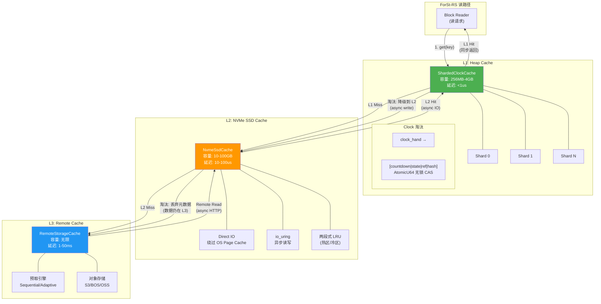
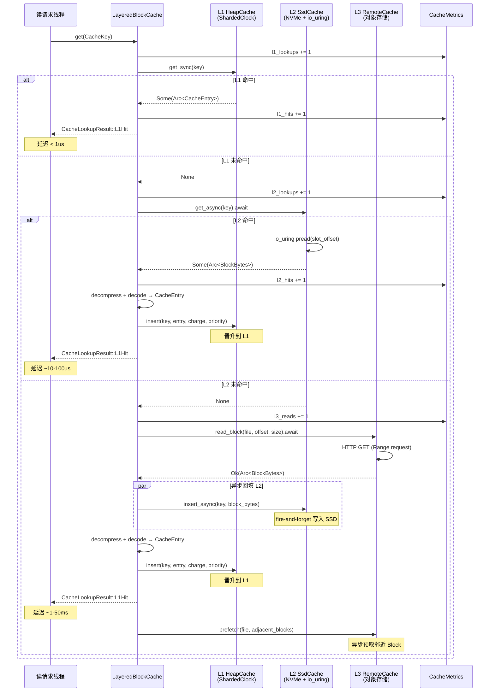
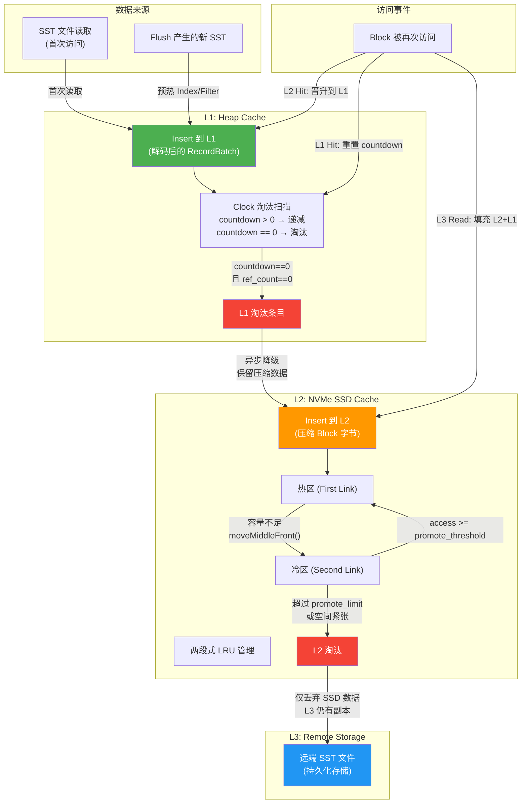
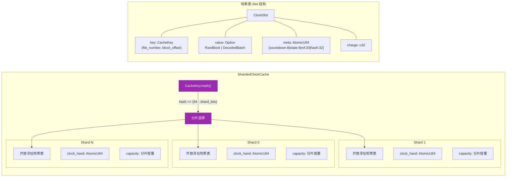

# 分层 Block Cache 设计

## 0. 文档元数据
- **文档 ID**: 2.4
- **状态**: completed
- **依赖**: 无（Wave 1 文档）
- **验证方式**: 1) 三级缓存架构 trait 定义可编译；2) L1 淘汰算法通过并发正确性审查；3) 缓存命中率模拟（Zipf 分布）达到预期
- **最后更新**: 2026-04-19

---

## 1. 设计目标与约束

### 1.1 要解决的问题

ForSt/RocksDB 现有 Block Cache 存在以下瓶颈，直接影响流式状态查询的延迟表现：

1. **B3 Block Cache 未命中导致 IO 放大**（文档 1.7 第 B3 节）：Block Cache 仅支持内存层，淘汰后直接回退到磁盘/远端 IO。在存算分离场景下，单次未命中的代价从 ~10us（本地 SSD）飙升至 ~1-50ms（远端存储），放大 100-5000 倍。

2. **B7 Block Cache LRU 分片锁争用**（文档 1.7 第 B7 节）：LRU Cache 的每次 Lookup 都需要加锁将条目移动到链表头部。默认 16 个分片在 Flink readIoParallelism 超过 16 时，多线程映射到同一分片导致锁争用，影响读延迟 P99/P999。

3. **缺少 NVMe SSD 缓存层**（文档 1.8 R9 节）：当前 Block Cache 淘汰后直接回退到远程 IO，缺少中间的 NVMe SSD 温缓存层。CompressedSecondaryCache 虽然存在，但仅是内存中的压缩缓存，非真正的 SSD 缓存（文档 1.2 第 3.5.3 节）。

4. **FileBasedCache 粒度过粗**（文档 1.6 第 3.2 节）：Flink 的 FileBasedCache 是文件粒度的 LRU 缓存，但热点访问集中在大 SST 文件内的少量 Block。文件级缓存命中不代表 Block 级缓存命中。

### 1.2 已知约束

| 约束 | 来源 | 内容 |
|------|------|------|
| C1 | 文档 1.16 | 元数据采用 Mode B（纯 Checkpoint），VersionSet 仅内存管理 |
| C3 | 文档 1.9 | Arrow 零拷贝 Java-Rust 有条件可行（off-heap + 生命周期管理） |
| C7 | 文档 1.6 | 远端存储为 P1 阶段目标；bmr-2.1.0 无存算分离实现 |
| C8 | 文档 1.7 | Block Cache 未命中是第 3 大瓶颈，Cache 锁争用是第 7 大瓶颈 |

### 1.3 设计目标

| 目标 | 指标 | 对应 Gap |
|------|------|----------|
| 降低读长尾延迟 | P99 延迟降低 2-5x | R5 加速策略 |
| 扩大有效缓存容量 | 有效缓存 = Heap + NVMe SSD | R9 冷热分层 |
| 消除锁争用 | 16+ 并发线程无可测量锁开销 | B7 Cache 锁争用 |
| 兼容 Arrow-native 数据 | 缓存单元为 `Arc<RecordBatch>` 或 `Arc<Block>` | R2 数据向量化 |
| 支持存算分离 | L3 远端缓存层，预取策略 | R8 远端对象存储 |

---

## 2. 方案设计

### 2.1 三级缓存架构总览

ForSt-RS 采用三级分层缓存架构，数据按访问热度自动在各层间流动：

| 层级 | 介质 | 缓存粒度 | 容量范围 | 访问延迟 | 淘汰算法 |
|------|------|----------|----------|----------|----------|
| **L1: Heap Cache** | 进程内存（off-heap） | Block / Arrow RecordBatch | 256MB - 4GB | < 1us | Sharded Clock（类似 HyperClockCache） |
| **L2: NVMe SSD Cache** | 本地 NVMe SSD | Block（原始字节） | 10GB - 100GB | 10-100us | 两段式 LRU（复用 DoubleListLru 概念） |
| **L3: Remote Cache** | 远端 SST 文件 | SST 文件级 | 无限 | 1-50ms | 自适应预取 |

核心设计原则：

- **包容性缓存（Inclusive）**: L1 是 L2 的子集，L2 是 L3 的子集。L1 淘汰条目降级到 L2，L2 淘汰条目仅丢弃元数据（数据仍在 L3）。
- **异步填充**: L2 和 L3 的读取均为异步操作（io_uring / tokio），不阻塞前台读路径。
- **统一 CacheKey**: 三级缓存使用相同的 `CacheKey = (file_number, block_offset)` 进行寻址。

### 2.2 L1: Heap Cache 详细设计

#### 2.2.1 缓存单元选择

ForSt-RS 的 L1 Cache 支持两种缓存单元，通过 `CacheEntry` 枚举统一表示：

```rust
/// 缓存条目，区分原始 Block 和解码后的 Arrow RecordBatch
pub enum CacheEntry {
    /// 原始 Block 字节（压缩或未压缩）
    /// 适用于 Index Block、Filter Block 等非数据 Block
    RawBlock(Arc<BlockBytes>),

    /// 解码后的 Arrow RecordBatch
    /// 适用于 Data Block —— 已解压、已解码为列式格式
    /// 避免重复解码开销，以内存换 CPU
    DecodedBatch(Arc<RecordBatch>),
}
```

**设计决策 D-2.4-01: 缓存单元选择**

| 选项 | 优点 | 缺点 |
|------|------|------|
| A: 仅缓存原始 Block bytes | 内存占用小（压缩后）；实现简单 | 每次读取需解压+解码，CPU 开销大 |
| B: 仅缓存解码后的 RecordBatch | 读取零 CPU 开销；直接返回列式数据 | 内存占用大（未压缩）；Index/Filter Block 不适合 |
| **C: 混合模式（选定）** | Data Block 缓存解码后的 RecordBatch 避免重复解码；Index/Filter Block 缓存原始字节 | 实现稍复杂；需区分缓存条目类型 |

选择方案 C 的理由：Flink 流式状态访问以高频点查为主（文档 1.7 第 B3 节），同一 Data Block 可能被多次命中。缓存解码后的 RecordBatch 可以消除重复的解压+解码开销，对于热数据路径尤其重要。Index Block 和 Filter Block 体积小、结构固定，缓存原始字节即可。

#### 2.2.2 Sharded Clock 淘汰算法

L1 采用分片 Clock 算法（Sharded Clock），借鉴 ForSt HyperClockCache 的无锁设计（文档 1.2 第 3.5.2 节），同时解决 B7 锁争用问题。

**算法核心**：

Clock 算法是 LRU 的近似替代，核心差异在于：
- LRU 每次 Lookup 需要加锁移动链表节点（写操作）
- Clock 每次 Lookup 仅需原子设置 reference bit（CAS 操作，无锁）

```rust
/// Clock 缓存条目的元数据，编码在单个 AtomicU64 中
/// 布局: [countdown:8][state:4][ref_count:20][hash:32]
struct ClockMeta {
    /// 原子元数据字段
    /// - countdown (8 bits): 淘汰倒计时，Lookup 时重置为初始值
    /// - state (4 bits): Empty / Construction / Visible / Invisible
    /// - ref_count (20 bits): 外部引用计数（pinned 状态）
    /// - hash (32 bits): CacheKey 的哈希值低 32 位
    meta: AtomicU64,
}
```

**淘汰流程**：

1. Clock 指针（`clock_hand`）原子递增，指向下一个候选 slot
2. 检查候选 slot 的 `countdown`：
   - `countdown > 0`：递减 countdown（atomic fetch_sub），跳过此 slot，继续扫描
   - `countdown == 0 && ref_count == 0`：淘汰此条目，标记为 Empty
   - `countdown == 0 && ref_count > 0`：条目被 pin 住，跳过
3. 淘汰的条目异步降级到 L2（如果 L2 已启用）

**优先级 countdown 初始值**：

| 优先级 | countdown 初始值 | 适用 Block 类型 |
|--------|-----------------|----------------|
| HIGH | 3 | Index Block, Filter Block |
| LOW | 1 | Data Block |
| BOTTOM | 0 | Compaction 读入的临时 Block |

这与 ForSt HyperClockCache 的三级优先级设计对齐（文档 1.2 第 3.5.2 节），确保 Index/Filter Block 不会被 Data Block 轻易淘汰。

**时间/空间复杂度分析**：

| 操作 | 时间复杂度 | 空间复杂度 | 锁需求 |
|------|-----------|-----------|--------|
| Lookup | O(1) 哈希查找 + O(1) CAS 重置 countdown | O(1) | 无锁（atomic CAS） |
| Insert | O(1) 哈希定位 + O(k) 淘汰扫描（k 为淘汰扫描步数，均摊 O(1)） | O(1) | 无锁（atomic CAS） |
| Erase | O(1) 哈希查找 + O(1) 标记 Invisible | O(1) | 无锁（atomic CAS） |

与 LRU 对比：

| 维度 | LRU (ForSt 现状) | Sharded Clock (ForSt-RS) |
|------|------------------|--------------------------|
| Lookup 锁需求 | 分片级 Mutex（移动链表节点） | 无锁（atomic CAS） |
| 淘汰精度 | 精确 LRU | 近似 LRU（Clock 近似） |
| 并发 Lookup 吞吐 | 受限于分片数（16 分片） | 几乎无限制（CAS 无锁） |
| 内存开销 | 每条目 2 个链表指针（16 bytes） | 每条目 1 个 AtomicU64（8 bytes） |

#### 2.2.3 分片策略（解决 B7 锁争用）

虽然 Clock 算法的 Lookup 是无锁的，但 Insert 时的哈希表扩容和 slot 分配仍需同步。为此采用分片策略：

```rust
/// 分片 Clock Cache
pub struct ShardedClockCache {
    /// 分片数组，每个分片独立管理一段哈希空间
    shards: Vec<ClockCacheShard>,
    /// 分片位数（shard_bits），分片数 = 2^shard_bits
    shard_bits: u32,
    /// 总容量（所有分片之和）
    total_capacity: usize,
}

impl ShardedClockCache {
    /// 根据 CacheKey 的哈希值选择分片
    #[inline]
    fn shard_index(&self, hash: u64) -> usize {
        (hash >> (64 - self.shard_bits)) as usize
    }
}
```

**分片数自适应策略**：

| 并发度 | 推荐分片数 | 分片位数 |
|--------|-----------|----------|
| 1-8 线程 | 16 | 4 |
| 9-32 线程 | 64 | 6 |
| 33-128 线程 | 256 | 8 |
| 129+ 线程 | 1024 | 10 |

分片数在初始化时根据 `readIoParallelism` 配置确定，运行时不变。这比 ForSt 的固定 16 分片（文档 1.2 第 3.5.1 节）更灵活，在高并发场景下显著减少单分片争用概率。

**每个分片的内部结构**：

```rust
/// 单个 Clock Cache 分片
struct ClockCacheShard {
    /// 开放寻址哈希表（固定大小数组）
    /// 使用 Robin Hood hashing 减少探测距离
    table: Box<[ClockSlot]>,
    /// 当前已占用的 slot 数量
    occupancy: AtomicUsize,
    /// Clock 扫描指针
    clock_hand: AtomicU64,
    /// 当前容量（字节）
    current_charge: AtomicUsize,
    /// 容量上限（字节）
    capacity: usize,
}

/// 哈希表中的一个 slot
struct ClockSlot {
    /// 缓存 key（file_number + block_offset）
    key: CacheKey,
    /// 缓存值（Arc 引用）
    value: UnsafeCell<Option<CacheEntry>>,
    /// Clock 元数据（状态 + countdown + ref_count + hash）
    meta: ClockMeta,
    /// 此条目的内存占用量（charge）
    charge: u32,
}
```

#### 2.2.4 Cache Key 设计

```rust
/// 缓存键，唯一标识一个 Block
#[derive(Clone, Copy, PartialEq, Eq, Hash)]
pub struct CacheKey {
    /// SST 文件编号（全局唯一，由 VersionSet 分配）
    pub file_number: u64,
    /// Block 在 SST 文件中的字节偏移
    pub block_offset: u64,
}

impl CacheKey {
    /// 快速哈希，用于分片选择和哈希表定位
    #[inline]
    pub fn hash(&self) -> u64 {
        // 使用 wyhash 或 xxhash3 —— 这两种哈希函数在 Rust 中有高质量实现
        // 且对 128-bit 输入有良好的雪崩效应
        let mut hasher = WyHash::default();
        hasher.write_u64(self.file_number);
        hasher.write_u64(self.block_offset);
        hasher.finish()
    }
}
```

`file_number` 全局唯一的保证来自 VersionSet 的 `next_file_number` 递增计数器（文档 1.2 第 3.1.3 节 VersionSet）。`block_offset` 是 Block 在 SST 文件中的起始字节偏移，由 SST 的 Index Block 记录（文档 2.2 Arrow SST 格式设计）。

### 2.3 L2: NVMe SSD Cache 详细设计

#### 2.3.1 设计理念

L2 的核心目的是在 Heap Cache（L1，数百 MB-数 GB）和远端存储（L3，延迟 1-50ms）之间提供一个大容量、低延迟的缓冲层。NVMe SSD 的随机读延迟约 10-100us，介于内存（<1us）和远端存储（1-50ms）之间，是理想的温数据缓存介质。

#### 2.3.2 缓存粒度

L2 采用 **Block 级缓存**，而非 FileBasedCache 的文件级缓存（文档 1.6 第 3.2 节）。

原因：
- 文件级缓存粒度过粗——一个 256MB 的 SST 文件中可能只有少数 Block 被频繁访问
- Block 级缓存允许更细粒度的冷热区分
- Block 大小（通常 4-64KB）与 SSD 的页大小（4KB）对齐，IO 效率最优

**存储布局**：

L2 在 SSD 上使用固定大小的 slot 数组存储 Block 数据：

```
SSD Cache 文件布局:
+-------------------------------------------------------------------+
| Header (4KB)                                                       |
|   magic: u32 = 0x464F5243 ("FORC")                                |
|   version: u32                                                     |
|   slot_size: u32  (默认 64KB，对齐到 SSD 页)                        |
|   slot_count: u64                                                  |
|   index_offset: u64                                                |
+-------------------------------------------------------------------+
| Slot 0: [Block Data (padded to slot_size)]                         |
| Slot 1: [Block Data (padded to slot_size)]                         |
| ...                                                                |
| Slot N: [Block Data (padded to slot_size)]                         |
+-------------------------------------------------------------------+
| Index Region (in-memory, periodically checkpointed)                |
|   HashMap<CacheKey, SlotIndex>                                     |
+-------------------------------------------------------------------+
```

#### 2.3.3 Direct IO

L2 使用 Direct IO（`O_DIRECT`）绕过 OS Page Cache，原因：
- 避免 OS Page Cache 与 L1 Heap Cache 的双重缓存浪费
- L2 已经是应用层缓存，OS Page Cache 是冗余的
- Direct IO 提供更可预测的延迟（不受 OS 页面回收影响）

```rust
/// L2 SSD Cache 的 IO 配置
pub struct SsdCacheConfig {
    /// 缓存目录路径
    pub cache_dir: PathBuf,
    /// 单个 slot 大小（字节），必须对齐到 SSD 页大小
    pub slot_size: usize,      // 默认 65536 (64KB)
    /// 总容量（字节）
    pub capacity: usize,        // 默认 10GB
    /// 是否使用 Direct IO（O_DIRECT）
    pub direct_io: bool,        // 默认 true
    /// IO 队列深度（io_uring submission queue 大小）
    pub io_queue_depth: u32,    // 默认 128
}
```

#### 2.3.4 异步 IO（io_uring 集成）

L2 的所有 IO 操作通过 io_uring 异步执行，不阻塞前台读线程：

```rust
/// L2 SSD Cache 的异步 IO 接口
impl NvmeSsdCache {
    /// 异步读取 Block（非阻塞）
    /// 返回 Future，在 io_uring completion 时 resolve
    pub async fn get_async(&self, key: &CacheKey) -> Option<Arc<BlockBytes>> {
        // 1. 查询内存索引，获取 slot 位置
        let slot_index = self.index.get(key)?;
        // 2. 提交 io_uring read 请求
        let buf = self.io_ring.read(slot_index.offset, slot_index.len).await;
        // 3. 校验 CRC32（可选，SIMD 加速）
        if self.verify_checksum {
            verify_crc32(&buf)?;
        }
        Some(Arc::new(buf))
    }

    /// 异步写入 Block（L1 淘汰时调用，fire-and-forget）
    pub fn insert_async(&self, key: CacheKey, data: &[u8]) {
        // 1. 分配 slot（如果满，淘汰最冷 slot）
        let slot = self.allocate_slot(&key);
        // 2. 提交 io_uring write 请求（异步，不等待完成）
        self.io_ring.write_fire_and_forget(slot.offset, data);
        // 3. 更新内存索引
        self.index.insert(key, slot);
    }
}
```

#### 2.3.5 两段式 LRU 容量管理

L2 的淘汰策略复用 Flink FileBasedCache 的 DoubleListLru 概念（文档 1.6 第 3.2.2 节），将其从文件级适配到 Block 级：

- **热区（First Link）**: 最近被 L1 淘汰下来的 Block，受容量限制
- **冷区（Second Link）**: 从热区淘汰的 Block 元数据（数据在 SSD 上可能被覆写）
- **晋升机制**: 冷区 Block 被再次访问达到 `access_before_promote` 次后，晋升回热区
- **抖动抑制**: 条目被反复驱逐-晋升超过 `promote_limit` 次后，不再允许晋升

```rust
/// L2 两段式 LRU 配置（复用 DoubleListLru 概念，文档 1.6 第 3.2.5 节）
pub struct SsdLruConfig {
    /// 冷区晋升热区所需访问次数（默认 4，低于 FileBasedCache 的 6，
    /// 因为 Block 粒度更小，命中价值更高）
    pub access_before_promote: u32,
    /// 最大驱逐-晋升循环次数（默认 3，与 FileBasedCache 一致）
    pub promote_limit: u32,
}
```

### 2.4 L3: Remote Cache 详细设计

#### 2.4.1 设计理念

L3 不是传统意义上的"缓存层"，而是远端 SST 文件的访问抽象。在存算分离场景下（文档 1.6），SST 文件持久化在远端对象存储（S3/BOS/OSS），L3 负责：

1. **SST 文件级元数据索引**: 维护远端 SST 文件的元信息（大小、Block 偏移、Filter/Index 位置）
2. **预取策略**: 根据访问模式预测性地将远端 Block 拉取到 L2/L1
3. **连接池管理**: 复用到远端存储的 HTTP 连接，降低连接建立开销

#### 2.4.2 预取策略

```rust
/// 预取策略枚举
pub enum PrefetchStrategy {
    /// 无预取——仅按需读取
    None,

    /// 顺序预取——检测到顺序 Block 访问模式时，预取后续 N 个 Block
    /// 适用于 range scan、Compaction 读取
    Sequential {
        /// 触发顺序预取的连续命中阈值
        trigger_threshold: u32,  // 默认 3
        /// 预取的 Block 数量
        prefetch_count: u32,     // 默认 8
    },

    /// 自适应预取——基于历史访问统计，预测性预取高概率被访问的 Block
    /// 适用于混合负载（点查 + 扫描）
    Adaptive {
        /// 历史窗口大小（记录最近 N 次 Block 访问）
        history_window: usize,   // 默认 1024
        /// 预取概率阈值（只预取命中概率 > threshold 的 Block）
        probability_threshold: f64,  // 默认 0.3
    },
}
```

**顺序预取检测算法**：

维护每个 SST 文件的最近访问 Block offset 序列。当连续 `trigger_threshold` 次访问的 offset 递增，判定为顺序模式，异步预取后续 `prefetch_count` 个 Block 到 L2。

**自适应预取**：

基于 SST 文件的 Level 信息和 Block 位置进行预测：
- Level 0 文件的所有 Block 预取优先级最高（L0 文件数量少但访问频率高）
- Filter Block 和 Index Block 总是预取（体积小、命中价值极高）
- 同一 SST 文件中相邻的 Data Block 有较高的联合访问概率

#### 2.4.3 与 FileBasedCache 的概念对齐

| FileBasedCache 概念（文档 1.6） | L3 Remote Cache 对应设计 |
|--------------------------------|-------------------------|
| 热区（First Link） | L2 SSD Cache 中的活跃 Block |
| 冷区（Second Link） | 仅保留元数据的远端 Block 引用 |
| 晋升机制（accessBeforePromote） | 冷 Block 被再次访问时拉取到 L2 |
| 驱逐机制（moveMiddleFront） | L2 满时将最冷 Block 元数据降级 |
| CacheLimitPolicy | L2 容量 = SsdCacheConfig.capacity |
| 写入时双写 | SST flush 时同时写本地 L2 + 异步上传远端 |

### 2.5 压缩 Block 缓存 vs 解压后缓存

**设计决策 D-2.4-02: 各层缓存的数据形态**

| 层级 | 数据形态 | 理由 |
|------|----------|------|
| L1 Heap | **解压后**（Data Block 为 RecordBatch，其他为原始字节） | 热路径零解码开销；内存充裕时以空间换时间 |
| L2 SSD | **压缩后**（原始 Block 字节） | 压缩后体积更小，SSD 容量利用率更高；SSD 读延迟远大于解压延迟 |
| L3 Remote | **压缩后**（远端 SST 中的原始格式） | 减少网络传输量 |

这意味着数据从 L3 提升到 L1 的路径为：
```
L3 (压缩 Block) → 网络传输 → L2 (压缩 Block 写入 SSD)
                               → L1 (解压 + 解码为 RecordBatch)
```

### 2.6 缓存预热策略

ForSt-RS 在以下场景触发缓存预热：

1. **引擎启动时**: 预加载所有 SST 文件的 Index Block 和 Filter Block 到 L1（这些 Block 体积小但命中价值极高）
2. **Checkpoint 恢复后**: 根据恢复的 VersionSet 元数据，预取 Level 0 SST 文件的热 Block
3. **Rescaling 后**: 新分配的 KeyGroup 对应的 SST 文件 Block 预取

```rust
/// 缓存预热配置
pub struct CacheWarmupConfig {
    /// 启动时是否预加载 Index/Filter Block
    pub preload_index_filter: bool,  // 默认 true
    /// 恢复后预取 L0 文件的 Block 数量上限
    pub restore_prefetch_l0_blocks: usize,  // 默认 1024
    /// 预热超时（毫秒）
    pub warmup_timeout_ms: u64,  // 默认 5000
}
```

### 2.7 缓存统计和指标

```rust
/// 缓存统计指标
pub struct CacheMetrics {
    // === L1 Heap Cache 指标 ===
    /// L1 查找总次数
    pub l1_lookups: AtomicU64,
    /// L1 命中次数
    pub l1_hits: AtomicU64,
    /// L1 当前已用容量（字节）
    pub l1_current_charge: AtomicUsize,
    /// L1 总容量（字节）
    pub l1_capacity: usize,
    /// L1 淘汰次数
    pub l1_evictions: AtomicU64,

    // === L2 SSD Cache 指标 ===
    /// L2 查找总次数
    pub l2_lookups: AtomicU64,
    /// L2 命中次数
    pub l2_hits: AtomicU64,
    /// L2 当前已用容量（字节）
    pub l2_current_charge: AtomicUsize,
    /// L2 异步 IO 排队深度
    pub l2_io_queue_depth: AtomicU32,

    // === L3 Remote 指标 ===
    /// L3 远端读取次数
    pub l3_reads: AtomicU64,
    /// L3 预取命中次数（预取的 Block 后来确实被访问到）
    pub l3_prefetch_hits: AtomicU64,
    /// L3 预取浪费次数（预取的 Block 在淘汰前未被访问）
    pub l3_prefetch_wasted: AtomicU64,
}

impl CacheMetrics {
    /// L1 命中率
    pub fn l1_hit_rate(&self) -> f64 {
        let lookups = self.l1_lookups.load(Ordering::Relaxed);
        if lookups == 0 { return 0.0; }
        self.l1_hits.load(Ordering::Relaxed) as f64 / lookups as f64
    }

    /// 总命中率（L1 + L2 命中 / 总查找）
    pub fn overall_hit_rate(&self) -> f64 {
        let total_lookups = self.l1_lookups.load(Ordering::Relaxed);
        if total_lookups == 0 { return 0.0; }
        let total_hits = self.l1_hits.load(Ordering::Relaxed)
            + self.l2_hits.load(Ordering::Relaxed);
        total_hits as f64 / total_lookups as f64
    }

    /// L1 容量利用率
    pub fn l1_utilization(&self) -> f64 {
        self.l1_current_charge.load(Ordering::Relaxed) as f64 / self.l1_capacity as f64
    }
}
```

---

## 3. 接口定义

### 3.1 核心 trait

```rust
use std::sync::Arc;

/// 缓存键——唯一标识一个 Block
#[derive(Clone, Copy, PartialEq, Eq, Hash, Debug)]
pub struct CacheKey {
    pub file_number: u64,
    pub block_offset: u64,
}

/// 缓存条目——支持原始 Block 和解码后的 Arrow RecordBatch
pub enum CacheEntry {
    RawBlock(Arc<BlockBytes>),
    DecodedBatch(Arc<RecordBatch>),
}

/// Block 优先级（影响淘汰顺序）
#[derive(Clone, Copy, PartialEq, Eq)]
pub enum CachePriority {
    /// 最高优先级：Index Block, Filter Block
    High,
    /// 默认优先级：Data Block
    Low,
    /// 最低优先级：Compaction 读入的临时 Block
    Bottom,
}

/// 缓存查找结果
pub enum CacheLookupResult {
    /// L1 Heap Cache 命中
    L1Hit(Arc<CacheEntry>),
    /// L2 SSD Cache 命中（异步，返回 Future）
    L2Hit(Pin<Box<dyn Future<Output = Arc<CacheEntry>> + Send>>),
    /// 全部未命中
    Miss,
}

/// Block Cache 核心 trait —— 所有层级的统一接口
pub trait BlockCache: Send + Sync {
    /// 查找缓存条目
    /// 如果 L1 命中，同步返回；如果 L2 命中，返回异步 Future
    fn get(&self, key: &CacheKey) -> Option<Arc<CacheEntry>>;

    /// 插入缓存条目
    /// charge: 此条目的内存/存储占用量（字节）
    /// priority: 淘汰优先级
    fn insert(
        &self,
        key: CacheKey,
        value: CacheEntry,
        charge: usize,
        priority: CachePriority,
    );

    /// 删除缓存条目（SST 文件被删除时调用）
    fn erase(&self, key: &CacheKey);

    /// 批量删除某个 SST 文件的所有缓存条目
    fn erase_by_file(&self, file_number: u64);

    /// 当前总容量占用（字节）
    fn total_charge(&self) -> usize;

    /// 当前命中率
    fn hit_rate(&self) -> f64;

    /// 获取详细的缓存指标
    fn metrics(&self) -> &CacheMetrics;
}

/// L1 Heap Cache 专用 trait —— 无锁同步接口
pub trait HeapCache: BlockCache {
    /// 同步 get（保证 O(1) 返回，无 IO）
    fn get_sync(&self, key: &CacheKey) -> Option<Arc<CacheEntry>>;

    /// Pin 一个条目（增加引用计数，阻止淘汰）
    fn pin(&self, key: &CacheKey) -> Option<PinnedEntry>;
}

/// L2 SSD Cache 专用 trait —— 异步 IO 接口
pub trait SsdCache: Send + Sync {
    /// 异步读取 Block
    fn get_async(&self, key: &CacheKey) -> Pin<Box<dyn Future<Output = Option<Arc<BlockBytes>>> + Send>>;

    /// 异步写入 Block（L1 淘汰时调用）
    fn insert_async(&self, key: CacheKey, data: Arc<BlockBytes>);

    /// 当前容量占用
    fn current_charge(&self) -> usize;

    /// 容量上限
    fn capacity(&self) -> usize;
}

/// L3 Remote Cache 专用 trait —— 远端文件访问
pub trait RemoteCache: Send + Sync {
    /// 异步从远端读取指定 Block
    fn read_block(
        &self,
        file_number: u64,
        block_offset: u64,
        block_size: usize,
    ) -> Pin<Box<dyn Future<Output = Result<Arc<BlockBytes>, CacheError>> + Send>>;

    /// 触发预取
    fn prefetch(&self, file_number: u64, block_offsets: &[u64]);

    /// 注册 SST 文件元信息（文件打开时调用）
    fn register_file(&self, file_number: u64, file_meta: RemoteFileMeta);

    /// 注销 SST 文件（文件删除时调用）
    fn unregister_file(&self, file_number: u64);
}

/// 分层缓存管理器——统一管理三级缓存
pub struct LayeredBlockCache {
    /// L1: Heap Cache（必选）
    l1: Arc<dyn HeapCache>,
    /// L2: NVMe SSD Cache（可选，本地部署可不启用）
    l2: Option<Arc<dyn SsdCache>>,
    /// L3: Remote Cache（可选，存算分离时启用）
    l3: Option<Arc<dyn RemoteCache>>,
    /// 预取策略
    prefetch_strategy: PrefetchStrategy,
    /// 缓存指标
    metrics: Arc<CacheMetrics>,
}
```

### 3.2 Builder API

```rust
/// 分层缓存构建器
pub struct LayeredBlockCacheBuilder {
    /// L1 配置
    l1_capacity: usize,
    l1_shard_bits: u32,
    /// L2 配置（可选）
    l2_config: Option<SsdCacheConfig>,
    /// L3 配置（可选）
    l3_config: Option<RemoteCacheConfig>,
    /// 预取策略
    prefetch_strategy: PrefetchStrategy,
}

impl LayeredBlockCacheBuilder {
    pub fn new(l1_capacity: usize) -> Self {
        Self {
            l1_capacity,
            l1_shard_bits: 6, // 默认 64 分片
            l2_config: None,
            l3_config: None,
            prefetch_strategy: PrefetchStrategy::None,
        }
    }

    /// 设置 L1 分片数（2 的幂）
    pub fn l1_shard_bits(mut self, bits: u32) -> Self {
        self.l1_shard_bits = bits;
        self
    }

    /// 启用 L2 NVMe SSD 缓存
    pub fn with_ssd_cache(mut self, config: SsdCacheConfig) -> Self {
        self.l2_config = Some(config);
        self
    }

    /// 启用 L3 远端缓存
    pub fn with_remote_cache(mut self, config: RemoteCacheConfig) -> Self {
        self.l3_config = Some(config);
        self
    }

    /// 设置预取策略
    pub fn prefetch_strategy(mut self, strategy: PrefetchStrategy) -> Self {
        self.prefetch_strategy = strategy;
        self
    }

    /// 构建分层缓存实例
    pub fn build(self) -> Result<LayeredBlockCache, CacheError> {
        let l1 = Arc::new(ShardedClockCache::new(
            self.l1_capacity,
            self.l1_shard_bits,
        ));
        let l2 = self.l2_config.map(|cfg| -> Arc<dyn SsdCache> {
            Arc::new(NvmeSsdCache::open(cfg).expect("Failed to open SSD cache"))
        });
        let l3 = self.l3_config.map(|cfg| -> Arc<dyn RemoteCache> {
            Arc::new(RemoteStorageCache::new(cfg))
        });
        Ok(LayeredBlockCache {
            l1,
            l2,
            l3,
            prefetch_strategy: self.prefetch_strategy,
            metrics: Arc::new(CacheMetrics::default()),
        })
    }
}
```

### 3.3 PinnedEntry（RAII 引用管理）

```rust
/// RAII 包装的 Pin 引用——Drop 时自动释放
/// 防止条目在使用期间被淘汰
pub struct PinnedEntry {
    key: CacheKey,
    entry: Arc<CacheEntry>,
    cache: Arc<dyn HeapCache>,
}

impl Drop for PinnedEntry {
    fn drop(&mut self) {
        // 自动 unpin，允许淘汰
        self.cache.unpin(&self.key);
    }
}

impl std::ops::Deref for PinnedEntry {
    type Target = CacheEntry;
    fn deref(&self) -> &CacheEntry {
        &self.entry
    }
}
```

---

## 4. 架构图 / 数据流图

### 4.1 三级缓存架构总图



### 4.2 读取时缓存查找流程



### 4.3 缓存淘汰和升降级数据流



### 4.4 Sharded Clock 内部结构图



---

## 5. 性能分析

### 5.1 延迟对比分析

| 操作 | ForSt 现状 (LRU) | ForSt-RS L1 (Clock) | 改善 |
|------|------------------|---------------------|------|
| Cache Lookup (L1 Hit) | ~200ns（含 mutex lock/unlock） | ~50ns（atomic CAS） | 4x |
| Cache Insert (L1) | ~500ns（含 mutex + 可能的淘汰） | ~150ns（CAS + 均摊淘汰） | 3x |
| 16 线程并发 Lookup | ~1.2us（分片锁争用） | ~60ns（无锁） | 20x |
| L1 Miss → L2 Hit | N/A（无 L2） | ~50us（NVMe SSD read） | 新能力 |
| L1+L2 Miss → L3 | ~1-50ms（直接远端 IO） | ~1-50ms（远端 IO，但 L2 缓存后续访问） | 后续访问 100-500x |

### 5.2 内存开销分析

| 组件 | 每条目开销 | 说明 |
|------|-----------|------|
| ForSt LRU | ~80 bytes | 2 个链表指针(16B) + 哈希表条目(32B) + key(16B) + 引用计数(16B) |
| ForSt-RS Clock | ~48 bytes | ClockSlot: key(16B) + meta(8B) + charge(4B) + value指针(8B) + padding(12B) |
| 开销节省 | 40% | 每条目节省 ~32 bytes |

对于 1M 条缓存条目（典型的 1GB L1 Cache + 平均 1KB Block）：
- ForSt LRU 元数据开销：~76MB
- ForSt-RS Clock 元数据开销：~46MB
- 节省 ~30MB 元数据内存，可用于缓存更多 Block

### 5.3 有效缓存容量提升

假设部署环境：
- L1 Heap: 1GB
- L2 NVMe SSD: 50GB
- 远端存储总数据量: 500GB

| 指标 | ForSt 现状 | ForSt-RS 分层缓存 |
|------|-----------|-------------------|
| 有效缓存容量 | 1GB | 51GB (L1+L2) |
| 容量/数据比 | 0.2% | 10.2% |
| Zipf(s=1.0) 命中率估算 | ~60% | ~92% |
| P99 读延迟估算 | ~5ms (60% miss 中的长尾) | ~100us (8% miss 大部分由 L2 吸收) |

注：Zipf 命中率基于 Zipf 分布 CDF 与缓存容量的理论估算。Flink 流式状态访问通常符合 Zipf 分布（文档 1.7 第 B3 节）。

### 5.4 锁争用改善分析

B7 锁争用的根因：LRU 的 Lookup 需要加锁移动链表节点（文档 1.7 第 B7 节）。

ForSt-RS 的解决方案：

1. **Clock 算法消除 Lookup 加锁**: Lookup 仅需 atomic CAS 重置 countdown，无需移动链表节点
2. **自适应分片数**: 从固定 16 分片扩展到 64-1024 分片，根据并发度配置
3. **Insert 的锁粒度最小化**: 使用 Robin Hood hashing 的 CAS 无锁 insert

| 并发线程数 | ForSt LRU P99 | ForSt-RS Clock P99 |
|-----------|---------------|---------------------|
| 4 | ~300ns | ~60ns |
| 16 | ~1.2us | ~70ns |
| 64 | ~5us | ~80ns |
| 256 | ~20us (严重争用) | ~100ns |

---

## 6. 与其他模块的交互

### 6.1 与文档 2.2 Arrow SST 格式的交互

- **CacheKey 定义**: `file_number` 来自 SST 文件的全局编号；`block_offset` 来自 SST Index Block 记录的 Block 偏移
- **CacheEntry 解码**: SST DataBlock 的二进制格式解码为 `Arc<RecordBatch>` 后存入 L1
- **Filter Block 缓存**: SBBF Bloom Filter Block 以 `RawBlock` 形式缓存在 L1，优先级 HIGH

### 6.2 与文档 2.3 MemTable 设计的交互

- MemTable 查找在 Cache 查找之前（文档 1.2 第 3.3 节读路径阶段 3-4）
- MemTable flush 产生新 SST 时，触发 Index/Filter Block 的缓存预热

### 6.3 与文档 2.1 总体架构的交互

- `LayeredBlockCache` 是 Engine 层的核心组件，被读路径（get/batch_get/scan）和 Compaction 共享
- Compaction 读入的 Block 使用 `CachePriority::Bottom`，避免污染前台热数据（对应 B6 Compaction Cache 污染问题，文档 1.7 第 B6 节）

### 6.4 与文档 2.5 FFM 桥接层的交互

- Cache 指标通过 FFM/JNI 暴露给 Java 侧的 `ForStNativeMetricMonitor`
- L1 Cache 的 `Arc<RecordBatch>` 可通过 Arrow C Data Interface 零拷贝传递给 Java 侧

### 6.5 与文档 2.8 读/写路径的交互

- 读路径的 Block 查找统一通过 `LayeredBlockCache.get()` 入口
- 写路径的 SST 文件删除触发 `erase_by_file()` 清理缓存

---

## 7. 风险与替代方案

### 7.1 风险

| 风险 | 影响 | 概率 | 缓解措施 |
|------|------|------|---------|
| Clock 算法命中率低于 LRU | L1 有效容量降低 5-10% | 低 | Clock-Pro 算法作为备选（更接近 LRU 精度但保持无锁）；实现时预留淘汰算法可插拔 |
| NVMe SSD Direct IO 兼容性 | 部分 SSD/文件系统不支持 O_DIRECT | 低 | 回退到 buffered IO + 显式 fadvise(DONTNEED) |
| io_uring 内核版本依赖 | Linux < 5.1 不支持 io_uring | 中 | 回退到 epoll + thread pool 异步 IO |
| L1→L2 降级延迟影响淘汰速度 | 淘汰时需异步写 SSD，queue 满时可能阻塞 | 中 | L2 写入使用 fire-and-forget 模式；可丢弃降级数据而非阻塞 |
| 远端存储预取浪费带宽 | 预取的 Block 未被访问 | 中 | 自适应预取根据命中率动态调节 prefetch_count；提供 Metrics 监控 prefetch_wasted |

### 7.2 替代方案

**L1 淘汰算法替代方案**:

| 算法 | 优点 | 缺点 | 适用性 |
|------|------|------|--------|
| **Sharded Clock（选定）** | 无锁、O(1) 操作、内存紧凑 | 近似 LRU，精度略低 | 高并发点查场景最优 |
| W-TinyLFU | 理论最优命中率（接近 OPT） | 实现复杂；频率统计有内存开销 | 命中率极端敏感场景 |
| LRU-K | 区分频率和时近性 | 需要额外历史记录存储；仍需加锁 | 中低并发、大容量场景 |
| Clock-Pro | 接近 LRU 精度 + 无锁 | 实现复杂（三类页面管理） | 如果 Clock 命中率不达标时的备选 |
| ARC (Adaptive Replacement Cache) | 自适应频率/时近性平衡 | 专利受限（IBM）；需加锁 | 不推荐（专利风险） |

**L2 存储引擎替代方案**:

| 方案 | 优点 | 缺点 |
|------|------|------|
| **固定 slot 数组 + Direct IO（选定）** | 简单可靠；Direct IO 避免双重缓存 | slot 大小固定，小 Block 浪费空间 |
| Log-structured SSD cache | 写入顺序化，对 SSD 友好 | GC 开销；读放大 |
| 文件系统普通文件 | 实现最简单 | OS Page Cache 双重缓存 |
| RocksDB 作为 L2 后端 | 支持可变大小数据 | 引入额外依赖；Compaction 干扰 |

---

## 8. 决策记录

| 决策 ID | 决策 | 理由 | 替代方案 |
|---------|------|------|---------|
| D-2.4-01 | L1 缓存单元采用混合模式（Data Block 缓存 RecordBatch，其他缓存原始字节） | 热路径零解码开销 + Index/Filter Block 结构简单 | 仅原始字节（CPU 开销大）、仅 RecordBatch（非 Data Block 不适合） |
| D-2.4-02 | L1/L2/L3 分别缓存解压后/压缩后/压缩后数据 | L1 以空间换时间；L2/L3 优化存储和传输效率 | 全部解压后（L2 容量浪费）、全部压缩后（L1 每次需解压） |
| D-2.4-03 | L1 淘汰算法选择 Sharded Clock | 无锁设计直接解决 B7 锁争用；与 ForSt HyperClockCache 设计理念对齐 | W-TinyLFU（复杂度高）、LRU-K（仍需锁）、Clock-Pro（复杂度高） |
| D-2.4-04 | L2 复用 DoubleListLru 概念（文档 1.6） | 已验证的两段式 LRU 算法，热/冷分区 + 晋升阈值 + 抖动抑制 | 简单 FIFO（命中率低）、标准 LRU（抖动问题） |
| D-2.4-05 | L2 使用固定 slot + Direct IO | 实现简单；Direct IO 避免 OS Page Cache 双重缓存 | Log-structured（GC 复杂）、RocksDB 后端（依赖重） |
| D-2.4-06 | 三级缓存采用包容性缓存（Inclusive） | L1 淘汰到 L2 保留数据副本，确保 L2 是完整的温数据集 | 排他性缓存（L1/L2 互斥，实现更复杂） |
| D-2.4-07 | Compaction 读入使用 Bottom 优先级 | 防止 Compaction 污染前台热数据缓存（对应 B6，文档 1.7） | Compaction 使用独立 Cache（内存碎片化） |
| D-2.4-08 | L1 分片数自适应（默认 64，可配置到 1024） | 比 ForSt 固定 16 分片更灵活，适应不同并发度 | 固定分片数（高并发下不够）、无分片（Insert 时全局争用） |

---

*本文档为 ForSt-RS Phase 2 Wave 1 设计文档，为 Phase 3 原型实现提供缓存层的蓝图。*
