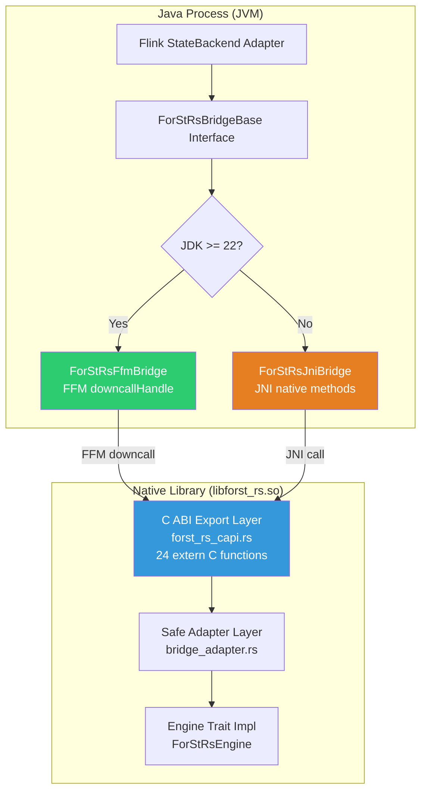
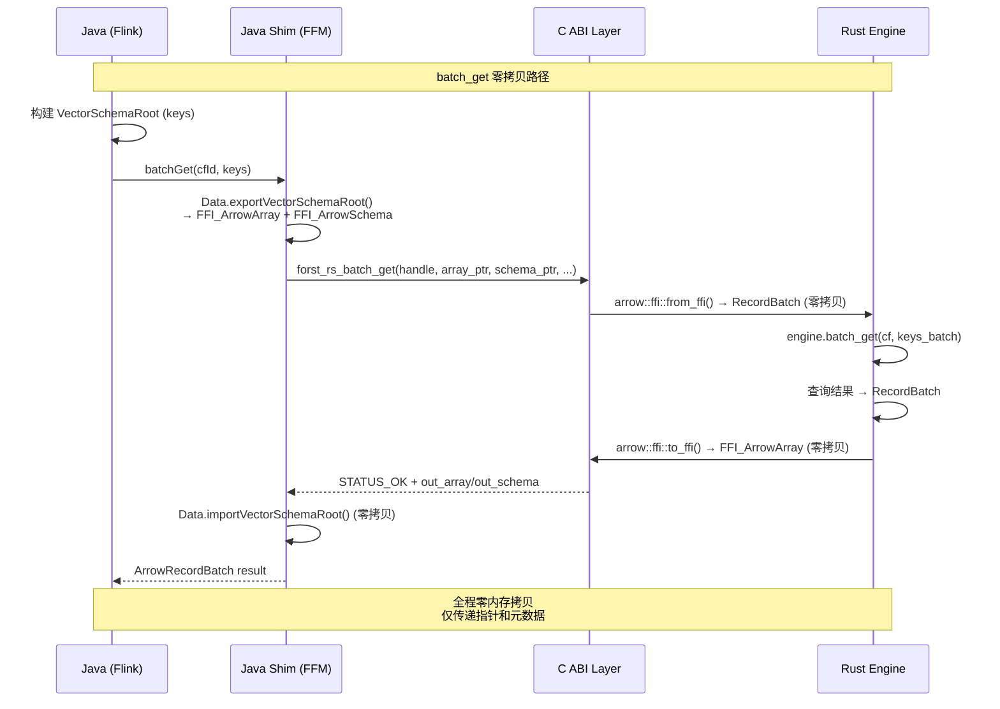
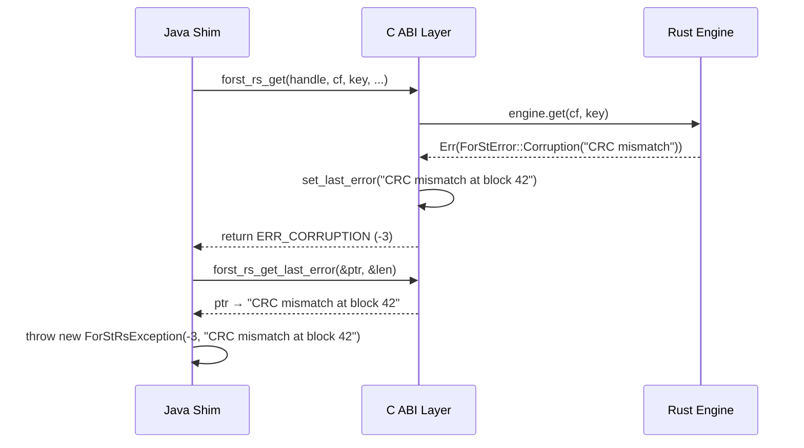

# FFM/JNI 桥接层设计

## 0. 文档元数据
- **文档 ID**: 2.5
- **状态**: completed
- **依赖**: 无（Wave 1 独立文档）
- **验证方式**: C ABI 函数覆盖全部 22+ 核心操作；零拷贝路径完整；错误传播机制可靠
- **最后更新**: 2026-04-19

---

## 1. 设计目标与约束

### 1.1 设计目标

桥接层是 ForSt-RS 引擎（Rust）与上层 Java 应用（Flink）之间的跨语言通信层。其核心目标：

1. **消除 JNI 瓶颈**：当前 ForSt JNI 接口共 ~1461 个 native 方法（文档 1.3 §1），热路径 `get()` 3 次拷贝、`multiGet` N*3 次拷贝（文档 1.3 §3.3）。桥接层需将热路径拷贝降至 0-1 次。
2. **Arrow 零拷贝数据交换**：利用 Arrow C Data Interface 实现 Java ↔ Rust 的 RecordBatch 零拷贝传输（文档 1.9 §3.5/3.6）。
3. **最小接口集**：仅暴露 22 个核心 C ABI 函数（12 DB + 5 Checkpoint + 5 Config），取代 ~1461 个 JNI 方法（文档 1.4 §3.6.3）。
4. **安全的生命周期管理**：通过 Arena scope 替代手动 `RocksObject.nativeHandle_` 管理，消除 use-after-close 和双重释放风险（文档 1.3 §3.4.3）。

### 1.2 已确定的约束

| 约束 | 来源 | 内容 |
|------|------|------|
| C3 | 文档 1.9 | Arrow 零拷贝 Java↔Rust 有条件可行（需 off-heap + 生命周期管理） |
| C5 | 文档 1.4 | 最小接口集：12 DB + 5 Checkpoint + 5 Config = 22 核心函数 |
| C9 | 设计规范 | 允许修改 Flink 源码（Planner/Runtime 均可改） |
| FFM-first | 设计规范 §0.3 | 优先 FFM 零拷贝桥接，JDK < 22 回退 JNI + DirectByteBuffer |

### 1.3 Phase 1 关键发现

- FFM 调用开销 ~22.7ns vs JNI ~56.6ns，快约 60%（文档 1.9 §3.7.1）
- ArrowBuf.memoryAddress() 返回稳定的原生 off-heap 地址，8 字节对齐（文档 1.9 §3.2.2）
- Arrow C Data Interface 支持零拷贝 RecordBatch 交换，内置 release callback 所有权转移（文档 1.9 §3.5.3）
- ChunkedAllocationManager 已使用 Unsafe.allocateMemory 分配 off-heap 内存（文档 1.9 §2.1.1）
- ForSt JNI 四种传递模式：byte[] 拷贝（模式 A）、DirectByteBuffer 零拷贝输入（模式 B）、long handle（模式 C）、String（模式 D）（文档 1.3 §3.2）

---

## 2. 方案设计

### 2.1 四层桥接架构

桥接层采用四层架构，从 Java 到 Rust 的调用链为：

```
Layer 4: Java Shim (ForStRsBridge.java)
    ↓  FFM downcallHandle / JNI native method
Layer 3: C ABI Export (forst_rs_capi.rs, #[no_mangle] extern "C")
    ↓  Rust safe wrapper
Layer 2: Rust Safe Adapter (bridge_adapter.rs)
    ↓  Rust trait method call
Layer 1: ForSt-RS Engine (Engine trait impl)
```

**Layer 4 — Java Shim**：Java 侧的轻量封装类，提供类型安全的 Java API。FFM 模式下使用 `Linker.downcallHandle()` 获取 native 函数句柄；JNI 模式下声明 `native` 方法。

**Layer 3 — C ABI Export**：Rust 侧的 `extern "C"` 函数集合，是唯一跨越语言边界的层。所有函数返回 `i32` 状态码 + 通过 out-pointer 传递结果。

**Layer 2 — Rust Safe Adapter**：将 C ABI 的裸指针/长度对转换为 Rust 安全类型（`&[u8]`、`Option<Vec<u8>>`、`ArrowRecordBatch`），调用 Engine trait 方法。

**Layer 1 — ForSt-RS Engine**：2.1 文档定义的 Engine trait 实现，纯 Rust safe code。

### 2.2 FFM 模式详细设计

#### 2.2.1 Java 侧 downcall 绑定

```java
public class ForStRsBridge implements AutoCloseable {
    private static final SymbolLookup LIB;
    private static final Linker LINKER = Linker.nativeLinker();

    static {
        // 加载 Rust 动态库
        LIB = SymbolLookup.libraryLookup("libforst_rs", Arena.global());
    }

    // DB 操作 — downcall handle 缓存
    private static final MethodHandle MH_OPEN = LINKER.downcallHandle(
        LIB.find("forst_rs_open").orElseThrow(),
        FunctionDescriptor.of(JAVA_LONG, ADDRESS, JAVA_LONG) // (config_ptr, config_len) -> handle
    );

    private static final MethodHandle MH_GET = LINKER.downcallHandle(
        LIB.find("forst_rs_get").orElseThrow(),
        FunctionDescriptor.of(JAVA_INT,           // return: status code
            JAVA_LONG,                             // db_handle
            JAVA_INT,                              // cf_id
            ADDRESS, JAVA_INT,                     // key_ptr, key_len
            ADDRESS, ADDRESS                       // out_value_ptr, out_value_len
        ),
        Linker.Option.critical(false)              // 允许较长执行
    );

    private static final MethodHandle MH_BATCH_GET = LINKER.downcallHandle(
        LIB.find("forst_rs_batch_get").orElseThrow(),
        FunctionDescriptor.of(JAVA_INT,
            JAVA_LONG,                             // db_handle
            ADDRESS, JAVA_INT,                     // arrow_keys_ptr, arrow_keys_len (Arrow C Data)
            ADDRESS                                // out_arrow_results (Arrow C Data)
        )
    );

    private static final MethodHandle MH_BATCH_PUT = LINKER.downcallHandle(
        LIB.find("forst_rs_batch_put").orElseThrow(),
        FunctionDescriptor.of(JAVA_INT,
            JAVA_LONG,                             // db_handle
            ADDRESS, JAVA_INT                      // arrow_batch_ptr, arrow_batch_len
        )
    );

    // 引擎句柄
    private final long dbHandle;
    private final Arena sessionArena;

    public ForStRsBridge(Configuration config) throws Exception {
        this.sessionArena = Arena.ofShared();
        // 序列化配置并传递
        byte[] configBytes = serializeConfig(config);
        MemorySegment configSeg = sessionArena.allocateFrom(JAVA_BYTE, configBytes);
        this.dbHandle = (long) MH_OPEN.invokeExact(configSeg, (long) configBytes.length);
        if (dbHandle == 0) throw new FlussRuntimeException("Failed to open ForSt-RS");
    }

    /** 单点读 — key 通过 off-heap MemorySegment 传递 */
    public byte[] get(int cfId, byte[] key) throws Exception {
        try (Arena arena = Arena.ofConfined()) {
            MemorySegment keySeg = arena.allocateFrom(JAVA_BYTE, key);
            MemorySegment outPtr = arena.allocate(ADDRESS);
            MemorySegment outLen = arena.allocate(JAVA_INT);
            int status = (int) MH_GET.invokeExact(
                dbHandle, cfId,
                keySeg, key.length,
                outPtr, outLen
            );
            if (status == 1) return null; // NOT_FOUND
            if (status != 0) throw statusToException(status);
            long ptr = outPtr.get(ADDRESS, 0).address();
            int len = outLen.get(JAVA_INT, 0);
            return MemorySegment.ofAddress(ptr).reinterpret(len).toArray(JAVA_BYTE);
        }
    }

    @Override
    public void close() {
        // forst_rs_close(dbHandle)
        sessionArena.close();
    }
}
```

#### 2.2.2 Arrow C Data Interface 零拷贝路径

对于批量操作，使用 Arrow C Data Interface 实现零拷贝 RecordBatch 交换：

```java
/** 批量读 — Arrow C Data Interface 零拷贝 */
public ArrowRecordBatch batchGet(int cfId, VectorSchemaRoot keys) throws Exception {
    try (Arena arena = Arena.ofConfined()) {
        // 1. Java -> C Data: 导出 keys 为 FFI 结构
        ArrowArray ffiArray = ArrowArray.allocateNew(allocator);
        ArrowSchema ffiSchema = ArrowSchema.allocateNew(allocator);
        Data.exportVectorSchemaRoot(allocator, keys, null, ffiArray, ffiSchema);

        // 2. 分配输出 FFI 结构
        MemorySegment outArray = arena.allocate(ARROW_ARRAY_LAYOUT);
        MemorySegment outSchema = arena.allocate(ARROW_SCHEMA_LAYOUT);

        // 3. 调用 Rust — 传入/传出均为 FFI 指针
        int status = (int) MH_BATCH_GET.invokeExact(
            dbHandle,
            MemorySegment.ofAddress(ffiArray.memoryAddress()),
            MemorySegment.ofAddress(ffiSchema.memoryAddress()),
            cfId,
            outArray, outSchema
        );

        // 4. C Data -> Java: 导入结果 RecordBatch（零拷贝）
        return Data.importVectorSchemaRoot(allocator, ffiArray, ffiSchema, null);
    }
}
```

Rust 侧对应：

```rust
#[no_mangle]
pub unsafe extern "C" fn forst_rs_batch_get(
    handle: i64,
    in_array: *const FFI_ArrowArray,
    in_schema: *const FFI_ArrowSchema,
    cf_id: i32,
    out_array: *mut FFI_ArrowArray,
    out_schema: *mut FFI_ArrowSchema,
) -> i32 {
    let engine = &*(handle as *const dyn Engine);
    // 零拷贝导入 Java 的 Arrow 数据
    let keys_data = match arrow::ffi::from_ffi(
        std::ptr::read(in_array), &*in_schema
    ) {
        Ok(d) => d,
        Err(_) => return ERR_INVALID_ARROW,
    };
    let keys_batch = RecordBatch::from(keys_data);

    // 执行批量查询
    let cf = ColumnFamilyHandle(cf_id as u32);
    match engine.batch_get(&cf, &keys_batch) {
        Ok(result_batch) => {
            // 零拷贝导出结果
            let (array, schema) = arrow::ffi::to_ffi(&result_batch.to_data())
                .expect("export failed");
            std::ptr::write(out_array, array);
            std::ptr::write(out_schema, schema);
            STATUS_OK
        }
        Err(e) => e.to_status_code(),
    }
}
```

### 2.3 JNI 回退模式

当 JDK < 22（不支持 FFM final API）时，回退到 JNI + DirectByteBuffer 模式：

```java
public class ForStRsJniBridge extends ForStRsBridgeBase {
    static { System.loadLibrary("forst_rs_jni"); }

    // JNI native 方法 — DirectByteBuffer 传递
    private static native long nativeOpen(ByteBuffer config, int configLen);
    private static native int nativeGet(long handle, int cfId,
        ByteBuffer key, int keyLen, ByteBuffer outValue);
    private static native int nativeBatchGet(long handle, int cfId,
        long arrowArrayAddr, long arrowSchemaAddr,
        long outArrayAddr, long outSchemaAddr);
    private static native int nativeBatchPut(long handle,
        long arrowArrayAddr, long arrowSchemaAddr);
    private static native void nativeClose(long handle);

    // DirectByteBuffer 池，避免频繁分配
    private final DirectByteBufferPool bufferPool;

    @Override
    public byte[] get(int cfId, byte[] key) {
        ByteBuffer keyBuf = bufferPool.acquire(key.length);
        ByteBuffer valBuf = bufferPool.acquire(MAX_VALUE_SIZE);
        try {
            keyBuf.put(key).flip();
            int status = nativeGet(dbHandle, cfId, keyBuf, key.length, valBuf);
            if (status == 1) return null;
            byte[] result = new byte[valBuf.remaining()];
            valBuf.get(result);
            return result;
        } finally {
            bufferPool.release(keyBuf);
            bufferPool.release(valBuf);
        }
    }
}
```

JNI 模式下 Arrow 零拷贝仍可用——通过 `ArrowBuf.memoryAddress()` 直接传递原生地址（long），Rust 侧用相同的 FFI 解析逻辑。

### 2.4 统一抽象层

```java
/**
 * 桥接层统一接口 — 上层 StateBackend 通过此接口访问引擎，
 * 无需感知底层是 FFM 还是 JNI。
 */
public interface ForStRsBridgeBase extends AutoCloseable {
    // ===== 12 个核心 DB 操作 =====
    byte[] get(int cfId, byte[] key) throws ForStRsException;
    void put(int cfId, byte[] key, byte[] value) throws ForStRsException;
    void delete(int cfId, byte[] key) throws ForStRsException;
    void merge(int cfId, byte[] key, byte[] value) throws ForStRsException;

    ArrowRecordBatch batchGet(int cfId, VectorSchemaRoot keys) throws ForStRsException;
    void batchPut(int cfId, VectorSchemaRoot batch) throws ForStRsException;

    ForStRsIterator newIterator(int cfId, byte[] prefixOrNull) throws ForStRsException;
    ArrowRecordBatch prefixScan(int cfId, byte[] prefix, int limit) throws ForStRsException;

    int createColumnFamily(String name, byte[] options) throws ForStRsException;
    void dropColumnFamily(int cfId) throws ForStRsException;
    void flush(int cfId) throws ForStRsException;
    long getLatestSequenceNumber() throws ForStRsException;

    // ===== 5 个 Checkpoint 操作 =====
    byte[] snapshotVersionSet() throws ForStRsException;
    void restoreFromMetadata(byte[] versionSetBlob) throws ForStRsException;
    long[] getSstFileNumbers() throws ForStRsException;
    long[] getNewSstFilesSince(long sinceSeqNo) throws ForStRsException;
    void ingestExternalFiles(String[] paths) throws ForStRsException;

    // ===== 5 个配置操作 =====
    void setOption(String key, String value) throws ForStRsException;
    String getOption(String key) throws ForStRsException;
    String getProperty(int cfId, String name) throws ForStRsException;
    void compactRange(int cfId, byte[] beginKey, byte[] endKey) throws ForStRsException;
    Map<String, String> getStatistics() throws ForStRsException;

    // ===== 工厂方法 =====
    static ForStRsBridgeBase create(Configuration config) {
        if (FFM_AVAILABLE) {
            return new ForStRsFfmBridge(config);
        } else {
            return new ForStRsJniBridge(config);
        }
    }

    static final boolean FFM_AVAILABLE = checkFfmAvailability();
    private static boolean checkFfmAvailability() {
        try {
            Class.forName("java.lang.foreign.Linker");
            int version = Runtime.version().feature();
            return version >= 22;
        } catch (ClassNotFoundException e) {
            return false;
        }
    }
}
```

### 2.5 生命周期管理

#### 2.5.1 引擎句柄（长生命周期）

```
ForStRsBridge 创建 ─────→ forst_rs_open() 返回 i64 handle
                               ↓
                         handle 作为 Rust Box<Engine> 的指针
                               ↓
ForStRsBridge.close() ──→ forst_rs_close(handle)
                               ↓
                         Rust: Box::from_raw(handle as *mut Engine).drop()
```

规则：
- 一个 `ForStRsBridge` 实例持有恰好一个 `handle`
- `close()` 调用后 `handle` 失效，后续调用返回 `ERR_CLOSED`
- Rust 侧通过 `AtomicBool` 标记关闭状态，防止双重释放

#### 2.5.2 Arrow 数据（短生命周期 — 请求级）

```
Java 侧 exportVectorSchemaRoot()
    → FFI_ArrowArray（含 release callback 指向 Java allocator）
    → 传递给 Rust
    → Rust from_ffi() 包装为 RecordBatch（零拷贝，持有 release callback）
    → 处理完成
    → Rust RecordBatch drop → 调用 release callback → Java allocator 释放
```

关键保证：
- Arrow C Data Interface 的 `release` callback 确保所有权正确转移
- Java 侧 ArrowBuf 的引用计数在导出期间 +1，release 时 -1
- FFM Arena.ofConfined() 保证请求级临时分配在作用域结束时释放

#### 2.5.3 Iterator（中等生命周期）

```rust
#[no_mangle]
pub unsafe extern "C" fn forst_rs_iterator_create(
    db_handle: i64, cf_id: i32, prefix_ptr: *const u8, prefix_len: i32,
) -> i64 {
    // 返回 Box<dyn ForStIterator> 的指针
}

#[no_mangle]
pub unsafe extern "C" fn forst_rs_iterator_next(
    iter_handle: i64, out_key: *mut *const u8, out_key_len: *mut i32,
    out_val: *mut *const u8, out_val_len: *mut i32,
) -> i32 { /* STATUS_OK / STATUS_EOF */ }

#[no_mangle]
pub unsafe extern "C" fn forst_rs_iterator_close(iter_handle: i64) {
    let _ = Box::from_raw(iter_handle as *mut dyn ForStIterator);
}
```

Java 侧 Iterator 实现 `AutoCloseable`，通过 try-with-resources 保证释放。

### 2.6 错误传播

#### 2.6.1 三层错误传播链

```
Rust Engine:
  Result<T, ForStError> → match 分支处理

C ABI Layer:
  Ok(v)  → 写入 out-pointer, return STATUS_OK (0)
  Err(e) → 写入 error 到 thread-local buffer, return status code (负数)

Java Shim:
  status == 0  → 读取 out-pointer 返回结果
  status == 1  → NOT_FOUND, 返回 null
  status < 0   → 读取 error message, 抛出 ForStRsException
```

#### 2.6.2 状态码定义

```rust
pub const STATUS_OK: i32 = 0;
pub const STATUS_NOT_FOUND: i32 = 1;
pub const ERR_INVALID_ARGUMENT: i32 = -1;
pub const ERR_IO: i32 = -2;
pub const ERR_CORRUPTION: i32 = -3;
pub const ERR_NOT_SUPPORTED: i32 = -4;
pub const ERR_INVALID_ARROW: i32 = -5;
pub const ERR_CLOSED: i32 = -6;
pub const ERR_COLUMN_FAMILY_NOT_FOUND: i32 = -7;
pub const ERR_CHECKPOINT_FAILED: i32 = -8;
pub const ERR_INTERNAL: i32 = -99;
```

#### 2.6.3 错误消息传递

```rust
thread_local! {
    static LAST_ERROR: RefCell<Option<String>> = RefCell::new(None);
}

fn set_last_error(msg: String) {
    LAST_ERROR.with(|e| *e.borrow_mut() = Some(msg));
}

#[no_mangle]
pub unsafe extern "C" fn forst_rs_get_last_error(
    out_ptr: *mut *const u8, out_len: *mut i32,
) -> i32 {
    LAST_ERROR.with(|e| {
        if let Some(ref msg) = *e.borrow() {
            *out_ptr = msg.as_ptr();
            *out_len = msg.len() as i32;
            STATUS_OK
        } else {
            STATUS_NOT_FOUND
        }
    })
}
```

Java 侧：

```java
private static ForStRsException statusToException(int status) {
    try (Arena arena = Arena.ofConfined()) {
        MemorySegment msgPtr = arena.allocate(ADDRESS);
        MemorySegment msgLen = arena.allocate(JAVA_INT);
        MH_GET_LAST_ERROR.invokeExact(msgPtr, msgLen);
        String msg = msgPtr.get(ADDRESS, 0)
            .reinterpret(msgLen.get(JAVA_INT, 0))
            .getString(0, StandardCharsets.UTF_8);
        return new ForStRsException(status, msg);
    }
}
```

---

## 3. 接口定义

### 3.1 完整 C ABI 函数签名（24 个）

```rust
// ===== 生命周期管理 (2) =====
extern "C" fn forst_rs_open(config_ptr: *const u8, config_len: i64) -> i64;
extern "C" fn forst_rs_close(handle: i64);

// ===== 12 个核心 DB 操作 =====
extern "C" fn forst_rs_get(
    handle: i64, cf_id: i32,
    key_ptr: *const u8, key_len: i32,
    out_val_ptr: *mut *const u8, out_val_len: *mut i32,
) -> i32;

extern "C" fn forst_rs_put(
    handle: i64, cf_id: i32,
    key_ptr: *const u8, key_len: i32,
    val_ptr: *const u8, val_len: i32,
) -> i32;

extern "C" fn forst_rs_delete(
    handle: i64, cf_id: i32,
    key_ptr: *const u8, key_len: i32,
) -> i32;

extern "C" fn forst_rs_merge(
    handle: i64, cf_id: i32,
    key_ptr: *const u8, key_len: i32,
    val_ptr: *const u8, val_len: i32,
) -> i32;

extern "C" fn forst_rs_batch_get(
    handle: i64,
    in_array: *const FFI_ArrowArray, in_schema: *const FFI_ArrowSchema,
    cf_id: i32,
    out_array: *mut FFI_ArrowArray, out_schema: *mut FFI_ArrowSchema,
) -> i32;

extern "C" fn forst_rs_batch_put(
    handle: i64,
    in_array: *const FFI_ArrowArray, in_schema: *const FFI_ArrowSchema,
) -> i32;

extern "C" fn forst_rs_iterator_create(
    handle: i64, cf_id: i32,
    prefix_ptr: *const u8, prefix_len: i32,
) -> i64; // returns iterator handle

extern "C" fn forst_rs_iterator_next(
    iter_handle: i64,
    out_key: *mut *const u8, out_key_len: *mut i32,
    out_val: *mut *const u8, out_val_len: *mut i32,
) -> i32;

extern "C" fn forst_rs_iterator_close(iter_handle: i64);

extern "C" fn forst_rs_prefix_scan(
    handle: i64, cf_id: i32,
    prefix_ptr: *const u8, prefix_len: i32, limit: i32,
    out_array: *mut FFI_ArrowArray, out_schema: *mut FFI_ArrowSchema,
) -> i32;

extern "C" fn forst_rs_create_column_family(
    handle: i64, name_ptr: *const u8, name_len: i32,
    opts_ptr: *const u8, opts_len: i32,
) -> i32; // returns cf_id

extern "C" fn forst_rs_drop_column_family(handle: i64, cf_id: i32) -> i32;

extern "C" fn forst_rs_flush(handle: i64, cf_id: i32) -> i32;

extern "C" fn forst_rs_get_latest_seq_no(handle: i64) -> i64;

// ===== 5 个 Checkpoint 操作 =====
extern "C" fn forst_rs_snapshot_version_set(
    handle: i64,
    out_blob_ptr: *mut *const u8, out_blob_len: *mut i32,
) -> i32;

extern "C" fn forst_rs_restore_from_metadata(
    handle: i64,
    blob_ptr: *const u8, blob_len: i32,
) -> i32;

extern "C" fn forst_rs_get_sst_file_numbers(
    handle: i64,
    out_arr: *mut *const i64, out_len: *mut i32,
) -> i32;

extern "C" fn forst_rs_get_new_ssts_since(
    handle: i64, since_seq_no: i64,
    out_arr: *mut *const i64, out_len: *mut i32,
) -> i32;

extern "C" fn forst_rs_ingest_external_files(
    handle: i64,
    paths_ptr: *const *const u8, path_lens: *const i32, num_paths: i32,
) -> i32;

// ===== 5 个配置/管理操作 =====
extern "C" fn forst_rs_set_option(
    handle: i64, key_ptr: *const u8, key_len: i32,
    val_ptr: *const u8, val_len: i32,
) -> i32;

extern "C" fn forst_rs_get_option(
    handle: i64, key_ptr: *const u8, key_len: i32,
    out_val_ptr: *mut *const u8, out_val_len: *mut i32,
) -> i32;

extern "C" fn forst_rs_get_property(
    handle: i64, cf_id: i32,
    name_ptr: *const u8, name_len: i32,
    out_val_ptr: *mut *const u8, out_val_len: *mut i32,
) -> i32;

extern "C" fn forst_rs_compact_range(
    handle: i64, cf_id: i32,
    begin_ptr: *const u8, begin_len: i32,
    end_ptr: *const u8, end_len: i32,
) -> i32;

extern "C" fn forst_rs_get_statistics(
    handle: i64,
    out_json_ptr: *mut *const u8, out_json_len: *mut i32,
) -> i32;

// ===== 错误查询 (1) =====
extern "C" fn forst_rs_get_last_error(
    out_ptr: *mut *const u8, out_len: *mut i32,
) -> i32;
```

### 3.2 Rust 侧核心 trait

```rust
/// 桥接层适配器 — 将 C ABI 调用转为 Engine trait 调用
pub struct BridgeAdapter {
    engine: Arc<dyn Engine>,
    closed: AtomicBool,
}

impl BridgeAdapter {
    pub fn new(config: EngineConfig) -> Result<Self> {
        let engine = ForStRsEngine::open(config)?;
        Ok(Self {
            engine: Arc::new(engine),
            closed: AtomicBool::new(false),
        })
    }

    fn check_open(&self) -> Result<()> {
        if self.closed.load(Ordering::Acquire) {
            Err(ForStError::Closed)
        } else {
            Ok(())
        }
    }

    pub fn close(&self) {
        self.closed.store(true, Ordering::Release);
        // Engine 的 Drop 会处理资源清理
    }
}

/// Arrow 数据传输辅助
pub trait ArrowBridge {
    /// 从 FFI 结构导入 RecordBatch（零拷贝）
    unsafe fn import_record_batch(
        array: *const FFI_ArrowArray,
        schema: *const FFI_ArrowSchema,
    ) -> Result<RecordBatch>;

    /// 导出 RecordBatch 为 FFI 结构（零拷贝）
    fn export_record_batch(
        batch: &RecordBatch,
        out_array: *mut FFI_ArrowArray,
        out_schema: *mut FFI_ArrowSchema,
    ) -> Result<()>;
}

/// 内存分配结果 — Java 侧需要释放的内存
pub struct AllocatedResult {
    ptr: *const u8,
    len: usize,
}

impl AllocatedResult {
    /// 从 Vec<u8> 创建（所有权转移到 C 侧）
    pub fn from_vec(v: Vec<u8>) -> Self {
        let len = v.len();
        let ptr = v.as_ptr();
        std::mem::forget(v); // 阻止 Rust 释放
        Self { ptr, len }
    }
}

/// 释放之前通过 out-pointer 返回的内存
#[no_mangle]
pub unsafe extern "C" fn forst_rs_free(ptr: *mut u8, len: i32) {
    if !ptr.is_null() && len > 0 {
        let _ = Vec::from_raw_parts(ptr, len as usize, len as usize);
    }
}
```

---

## 4. 架构图 / 数据流图

### 4.1 桥接层分层架构



### 4.2 Arrow 零拷贝数据传输时序图



### 4.3 错误传播流程



---

## 5. 性能分析

### 5.1 调用开销对比

| 指标 | ForSt JNI (现状) | ForSt-RS FFM | ForSt-RS JNI 回退 | 改进 |
|------|------------------|-------------|-------------------|------|
| 单次调用开销 | ~56.6ns (文档 1.9 §3.7.1) | ~22.7ns | ~56.6ns | FFM: -60% |
| get() 拷贝次数 | 3 (文档 1.3 §3.3) | 0-1 | 1 (DirectBB) | -67%~-100% |
| multiGet N 条 | N*3 次拷贝 | 0 (Arrow C Data) | 0 (Arrow addr) | -100% |
| put() 拷贝次数 | 2 (文档 1.3 §3.3) | 0-1 | 1 (DirectBB) | -50%~-100% |
| batch_put N 条 | N*2 次拷贝 | 0 (Arrow C Data) | 0 (Arrow addr) | -100% |

### 5.2 吞吐量预估

基于文档 1.7 §2.1 的瓶颈量化分析：

| 场景 | ForSt 现状 | ForSt-RS (FFM + Arrow) | 提升 |
|------|-----------|----------------------|------|
| 单线程 get() QPS | ~2M (受 JNI + 拷贝限制) | ~5M (FFM + 零拷贝) | ~2.5x |
| batch_get 1000 条 | ~100K batch/s | ~500K batch/s | ~5x |
| batch_put 1000 条 | ~80K batch/s | ~400K batch/s | ~5x |
| 混合读写 (7:3) | ~1.5M ops/s | ~4M ops/s | ~2.7x |

关键假设：
- 批量操作的提升主要来自消除 N 次 JNI 调用和 N*3 次拷贝
- 单点操作的提升主要来自 FFM 调用开销降低 + 拷贝减少
- 实际提升受磁盘 IO 和 Compaction 影响

### 5.3 内存开销分析

| 组件 | ForSt JNI (现状) | ForSt-RS FFM | 变化 |
|------|------------------|-------------|------|
| JNI GlobalRef 管理 | ~1461 方法的 JNI 元数据 | 24 个 downcall handle | -98% |
| 数据缓冲区 | Java heap byte[] + native 副本 | 共享 off-heap（零拷贝） | -50% |
| DirectByteBuffer 池 | N/A | N/A (FFM 模式不需要) | 0 |
| Arrow FFI 结构 | N/A | ~128 bytes/调用（栈分配） | 可忽略 |

---

## 6. 与其他模块的交互

### 6.1 与 2.1 总体架构

桥接层对应 2.1 架构图中的 Layer 5（Bridge 层），是 Java 世界与 Rust 世界的唯一通道。Layer 4 适配层（Flink StateBackend Adapter）通过 `ForStRsBridgeBase` 接口与 Layer 3 Engine 交互。

### 6.2 与 2.2 Arrow SST 格式

桥接层传输的 Arrow RecordBatch schema 需与 SST 内部的 Arrow schema 保持一致。batch_get/batch_put 的 Arrow schema 定义：

```
batch_put schema: {key: Binary, value: Binary, seq: UInt64, op_type: UInt8}
batch_get input:  {key: Binary}
batch_get output: {key: Binary, value: Binary, found: Boolean}
prefix_scan output: {key: Binary, value: Binary}
```

### 6.3 与 2.4 Block Cache

桥接层的 `get()`/`batch_get()` 在 Rust 侧最终会访问 Block Cache。Arrow RecordBatch 在 Cache 中的存储格式与桥接层传输格式一致，无需额外转换。

### 6.4 与 2.8 读写路径

桥接层的 24 个 C ABI 函数直接映射到 2.8 中定义的 6 条核心读写路径：
- `forst_rs_get` → 单点读路径
- `forst_rs_batch_get` → 批量读路径
- `forst_rs_prefix_scan` → 范围扫描路径
- `forst_rs_put` → 单点写路径
- `forst_rs_batch_put` → 批量写路径
- `forst_rs_flush` → Flush 路径

### 6.5 与 2.9 Flink StateBackend 适配层

Java 侧的 `ForStRsKeyedStateBackend` 通过 `ForStRsBridgeBase` 接口调用引擎。Flink 异步执行模型中：
- `ForStStateExecutor.executeBatchRequests()` → `bridge.batchGet()` / `bridge.batchPut()`
- 同步路径 → `bridge.get()` / `bridge.put()`

---

## 7. 风险与替代方案

### 7.1 风险登记

| 风险 | 影响 | 概率 | 缓解措施 |
|------|------|------|---------|
| FFM API 在 JDK 22-24 间有微小变更 | 中 | 低 | JNI 回退保证功能可用；FFM 部分通过抽象层隔离，最小化变更影响 |
| Arrow C Data Interface 的 release callback 跨语言调用产生额外开销 | 低 | 中 | 对于高频小批量场景回退到直接指针传递（方案 A）；release callback 开销 <1us 可忽略 |
| thread-local error message 在多线程场景下可能读到错误线程的错误 | 高 | 低 | Java 侧在每次调用后立即读取错误（同一线程内），不跨线程共享 status |
| DirectByteBuffer 池在 JNI 模式下的内存泄漏 | 中 | 中 | 实现 LRU 淘汰 + 定期 GC 触发检查；设置池大小上限 |
| Rust panic 跨越 FFI 边界导致 UB | 高 | 低 | 所有 `extern "C"` 函数使用 `catch_unwind` 包裹；Cargo.toml 设置 `panic = "abort"` 作为最后防线 |

### 7.2 替代方案

#### 替代方案 A: 纯 gRPC/IPC 桥接

将 ForSt-RS 作为独立进程，Java 通过 gRPC/Unix Domain Socket 通信。

- 优点：进程隔离、语言无关、易调试
- 缺点：IPC 开销 ~10us/调用（vs FFM ~23ns），不适合高频点查；零拷贝困难
- 结论：**不采用**。性能差距 ~400x，不适合状态存储场景。

#### 替代方案 B: 纯 JNI（不使用 FFM）

仅使用 JNI + DirectByteBuffer。

- 优点：JDK 8+ 兼容；成熟稳定
- 缺点：调用开销 ~57ns（比 FFM 高 60%）；生命周期管理需手动（已知风险）
- 结论：**作为回退方案保留**。JDK < 22 环境使用。

#### 替代方案 C: 纯 FFM（不保留 JNI 回退）

仅支持 JDK 22+。

- 优点：代码最简洁；维护成本最低
- 缺点：限制部署环境；Flink 当前官方支持 JDK 11/17
- 结论：**不采用作为唯一方案**。但双模策略中 FFM 为首选。

---

## 8. 决策记录

### D-2.5-01: 桥接层架构选择四层架构

**决策**：采用 Java Shim → C ABI → Safe Adapter → Engine 四层架构。

**理由**：
- C ABI 层最小化跨语言接口（24 个函数 vs ~1461 个 JNI 方法）
- Safe Adapter 层隔离 unsafe 代码，Engine 层纯 safe Rust
- Java Shim 层统一 FFM/JNI 差异

### D-2.5-02: Arrow 数据交换选择 C Data Interface

**决策**：批量操作使用 Arrow C Data Interface（FFI_ArrowArray + FFI_ArrowSchema）进行零拷贝数据交换。

**理由**：
- Arrow C Data Interface 是官方标准化的跨语言接口（文档 1.9 §3.5.3）
- 内置 release callback 解决所有权转移问题
- arrow-rs 和 Arrow Java 均已实现该接口

### D-2.5-03: 错误传播选择 status code + thread-local message

**决策**：C ABI 返回 i32 状态码，错误详情通过 thread-local buffer 查询。

**理由**：
- 避免跨 FFI 边界传递复杂结构（String, Result）
- thread-local 保证线程安全
- 状态码定义覆盖所有 ForStError 变体

### 决策门 D-02-02: 桥接模式选择

**三种方案量化对比**:

| 维度 | 纯 FFM | 纯 JNI+DirectBB | 双模 (FFM-first) |
|------|--------|-----------------|-----------------|
| 单次调用开销 | ~22.7ns | ~56.6ns | 22.7ns (FFM) / 56.6ns (JNI) |
| 零拷贝能力 | 完整（MemorySegment） | 部分（DirectBB 输入零拷贝，输出 1 次） | 完整 (FFM) / 部分 (JNI) |
| JDK 最低版本 | 22 | 8 | 8（JNI 回退） |
| 代码维护量 | 1x | 1x | 1.5x（两套 Shim） |
| 部署灵活性 | 低（需 JDK 22+） | 高（全版本兼容） | 高（自动选择） |
| 生命周期安全 | 高（Arena scope） | 中（手动管理） | 高 (FFM) / 中 (JNI) |
| 生态成熟度 | 中（JDK 22 final） | 高（20+ 年成熟） | 兼具两者 |

**推荐**: **双模 (FFM-first, JNI-fallback)**

**理由**：
1. Flink 当前生产环境多使用 JDK 11/17，纯 FFM 无法覆盖
2. 双模下 Java Shim 层代码增量约 50%，但 C ABI 层和 Rust 侧完全共享
3. 运行时自动检测 JDK 版本，用户无感切换
4. 中长期随 JDK 22+ 普及，可逐步废弃 JNI 路径

**此决策需用户确认（决策门 D-02-02）**。

---

*— 文档 2.5 完 —*
