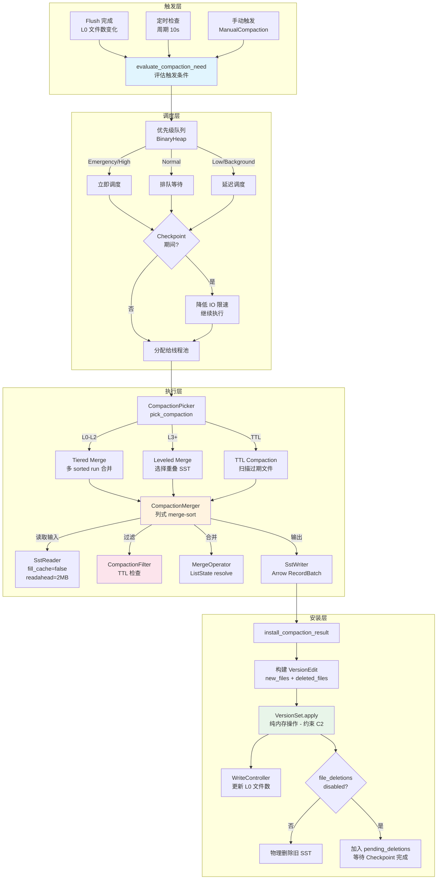
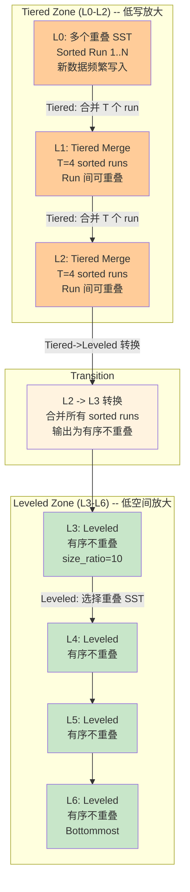
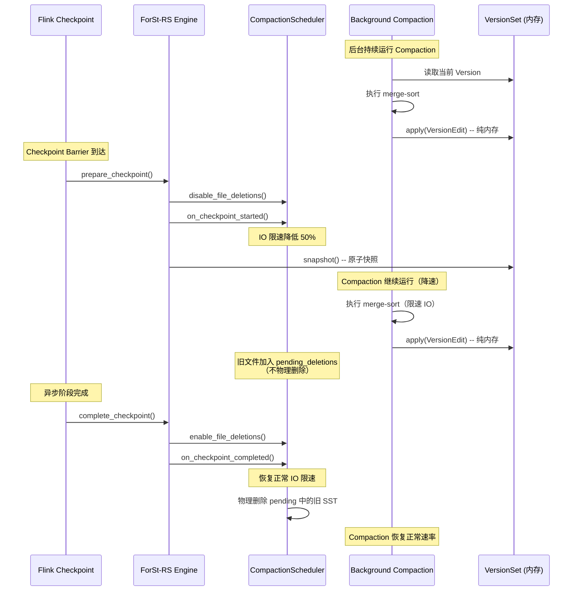

# Compaction 引擎设计

## 0. 文档元数据
- **文档 ID**: 2.6
- **状态**: completed
- **依赖**: 1.2 (ForSt 运行时架构), 1.7 (瓶颈热点 B6), 1.8 (Gap 分析 R1), 2.1 (总体架构), 2.2 (Arrow SST 格式), 2.3 (MemTable 设计), 1.16 (元数据可行性 - 模式 B)
- **验证方式**: 策略选型有写放大/空间放大量化分析；列式 merge-sort 算法有伪代码；TTL Filter 支持 Value/List 两种 StateType；调度模型有 Mermaid 图
- **最后更新**: 2026-04-19

---

## 1. 设计目标与约束

### 1.1 设计目标

Compaction 是 LSM-Tree 引擎的后台核心机制，负责合并多层 SST 文件以回收空间、减少读放大、清除过期数据。ForSt-RS 的 Compaction 引擎需要在 Arrow-native 数据格式和流式场景下实现以下目标：

1. **面向流式优化**：流式计算场景以高频 key 更新和低延迟点查为主（文档 1.8 R1），Compaction 策略需最小化写放大，降低对前台读写的干扰（文档 1.7 瓶颈 B6）
2. **Arrow-native 合并**：Compaction 的输入和输出均为 Arrow RecordBatch 格式的 DataBlock（文档 2.2），合并算法需在列式数据上高效执行 merge-sort
3. **TTL 过期清理**：支持 Flink 状态 TTL 过期淘汰，兼容 Value 和 List 两种 StateType 的过期语义（文档 1.1 第 3.2.2 节 FlinkCompactionFilter）
4. **Checkpoint 协同**：Compaction 版本更新为纯内存操作（约束 C2），与 Checkpoint 期间的 `disableFileDeletions` 协调（文档 1.7 B5/B6 交互）
5. **可插拔调度**：后台 Compaction 线程池支持优先级调度和 IO 限流，保护前台读写延迟

### 1.2 已知约束

| 约束 ID | 来源 | 内容 |
|---------|------|------|
| C1 | 文档 1.16 | 元数据采用模式 B（纯 Checkpoint），VersionSet 仅内存管理，不写本地 MANIFEST 文件 |
| C2 | 文档 1.16 第 5.1 节 | Flush/Compaction 版本更新为纯内存操作，无 fsync |
| C3 | 文档 1.9 | Arrow RecordBatch 作为引擎内部数据传输单元 |
| C10 | 文档 1.7 | Compaction 资源争用是第 6 大瓶颈（IO + CPU + Cache 三维度争用） |
| C11 | 文档 2.2 | SST DataBlock 格式为 Arrow RecordBatch（key/value/sequence/op_type 4 列） |
| C12 | 文档 2.3 | MergeOperator trait 在 MemTable 和 Compaction 间共享 |

### 1.3 现状分析

ForSt/RocksDB 当前 Compaction 机制（文档 1.2 第 3.6 节）：

- **策略**：Level（默认）、Universal、FIFO 三种
- **触发**：L0 文件数、各 Level 大小超阈值、空间放大率
- **执行**：`CompactionJob::Run()` 读取输入 SST -> `CompactionIterator` 合并排序 -> `TableBuilder` 写入新 SST
- **安装**：`CompactionJob::Install()` 通过 `LogAndApply()` 原子更新 Version（含 MANIFEST fsync）
- **瓶颈**（文档 1.7 B6）：
  - IO 带宽争用：Compaction 顺序 IO 数百 MB/s 与前台随机 IO 争夺带宽
  - Block Cache 污染：Compaction 读入的 Block 淘汰前台热数据
  - CPU 争用：合并排序 + CRC32 校验 + 压缩/解压与前台操作竞争
  - Checkpoint 互锁：`disableFileDeletions()` 阻止 Compaction 清理旧 SST

---

## 2. 方案设计

### 2.1 Compaction 策略选型

#### 2.1.1 候选策略对比

| 维度 | Leveled Compaction | Universal Compaction | Tiered Compaction | FIFO Compaction |
|------|-------------------|---------------------|-------------------|-----------------|
| **写放大 (WA)** | 高：O(size_ratio * num_levels)，典型 10-30x | 低-中：O(1) 至 O(num_runs)，典型 2-10x | 低：O(1) 至 O(T)，典型 2-5x | 无：O(1)，不做合并 |
| **空间放大 (SA)** | 低：~1.1x（Level 间有序不重叠） | 中-高：最坏 O(num_runs)，典型 2-4x | 中：O(T)，典型 2-3x | 低：~1.0x（旧数据直接删除） |
| **读放大 (RA)** | 低：每层最多 1 个 SST，O(num_levels) | 高：所有 sorted run 都可能被查询 | 中：与 Tier 数量相关 | 低：仅最新数据 |
| **前台写干扰** | 高：大范围 Compaction 持续时间长 | 低：Compaction 可推迟积累 | 极低：仅相邻 Tier 合并 | 无 |
| **适合场景** | 读密集、空间敏感 | 写密集、写放大敏感 | 流式高频更新（写放大低 + 读放大可控） | TTL 时序数据 |
| **流式适配性** | 差：高写放大浪费 IO，大 Compaction 阻塞写入 | 中：写放大低但空间放大不稳定 | 好：写放大低 + 分层合并控制前台干扰 | 仅限 TTL 场景 |

#### 2.1.2 流式场景的写放大分析

以典型 Flink 状态后端配置为例（MemTable 64MB，L0 触发 4 个文件，size_ratio=10，7 层）：

**Leveled Compaction**:
```
写放大 = size_ratio * (num_levels - 1) = 10 * 6 = 60x（最坏情况）
实际写放大 ≈ 10-30x（考虑 key 重叠率）
```

流式场景中，相同 key 被频繁更新，旧版本被新版本覆盖。Leveled Compaction 的每层合并都会重写未变更的 key，浪费大量 IO。

**Tiered Compaction**:
```
写放大 = T * (num_tiers - 1)，T 为每 Tier 的 sorted run 数上限
典型 T=4, num_tiers=3 → 写放大 ≈ 4 * 2 = 8x
```

Tiered 策略将同一 Tier 的多个 sorted run 合并后推入下一 Tier，写放大与 Tier 数量线性相关，远低于 Leveled 策略。

**Universal Compaction（size_ratio 触发）**:
```
写放大取决于相邻 sorted run 的大小比和触发阈值
最好情况 ≈ 2x（大量重叠 key），最差 ≈ num_runs * x
```

Universal 策略在 sorted run 数量可控时写放大低，但空间放大波动较大（Compaction 前后空间使用差异明显）。

#### 2.1.3 推荐策略：Tiered + Level 混合（Tiered-Leveled Hybrid）

**核心设计**：上层（L0-L2）采用 Tiered 策略，下层（L3+）采用 Leveled 策略。

**理由**：

1. **上层 Tiered 减少写放大**：流式场景中新数据频繁写入 L0-L2，相同 key 高频更新。Tiered 策略避免每次合并都重写无关 key，写放大从 Leveled 的 10-30x 降至 4-8x
2. **下层 Leveled 控制空间放大**：冷数据沉降到 L3+ 后，key 更新频率降低。Leveled 策略保证有序不重叠，空间放大 ~1.1x，读放大 O(1)
3. **自然对齐前台读写优先级**：上层 Tiered Compaction 的合并粒度小（单个 Tier 内的 sorted run），执行时间短，对前台干扰小。下层 Leveled Compaction 范围大但频率低
4. **RocksDB 验证**：RocksDB 的 Universal Compaction 实际上类似 Tiered 策略的变体，已在生产环境广泛验证

**参数配置**：

```rust
/// Tiered-Leveled Hybrid Compaction 配置
pub struct CompactionConfig {
    /// L0 -> L1 触发阈值（L0 文件数）
    pub l0_compaction_trigger: usize,        // 默认 4
    /// L0 停写阈值
    pub l0_stop_writes_trigger: usize,       // 默认 20
    /// L0 限速阈值
    pub l0_slowdown_writes_trigger: usize,   // 默认 12
    /// Tiered 层（L0-L2）每 Tier 最大 sorted run 数
    pub tiered_max_sorted_runs: usize,       // 默认 4
    /// Leveled 层（L3+）size ratio
    pub leveled_size_ratio: usize,           // 默认 10
    /// Tiered 到 Leveled 的转换层
    pub tiered_to_leveled_boundary: usize,   // 默认 3 (L3 开始 Leveled)
    /// 目标 SST 文件大小
    pub target_file_size_base: usize,        // 默认 64MB
    /// 最大层数
    pub max_levels: usize,                   // 默认 7
    /// 最大 Compaction 并发数
    pub max_background_compactions: usize,   // 默认 4
    /// Compaction IO 限速（bytes/sec，0 表示不限速）
    pub compaction_rate_limit: u64,          // 默认 0
}
```

**写放大/空间放大估算**（Tiered-Leveled Hybrid，典型配置）：

| 层级 | 策略 | 写放大贡献 | 空间放大贡献 |
|------|------|-----------|-------------|
| L0 -> L1 | Tiered (T=4) | ~4x | ~4x（4 个 sorted run 重叠） |
| L1 -> L2 | Tiered (T=4) | ~4x | ~4x |
| L2 -> L3 | Tiered -> Leveled 转换 | ~4x | ~1.1x（合并为有序） |
| L3 -> L4+ | Leveled (ratio=10) | ~10x 每层 | ~1.1x |
| **总计** | Hybrid | **~12-15x** | **~2-3x** |

对比纯 Leveled 的 30-60x 写放大，Hybrid 策略将写放大降低约 50-75%。

### 2.2 Arrow-Based Compaction 合并算法

#### 2.2.1 列式 Merge-Sort 概述

传统 RocksDB Compaction 使用 `MergingIterator` 逐条合并多个 SST 的 KV 对（行式）。ForSt-RS 的 Compaction 直接操作 Arrow RecordBatch（列式数据），合并算法需要适配列式布局。

**核心思路**：Block-level merge-sort + 行号索引映射。

1. 从多个输入 SST 读取 DataBlock（Arrow RecordBatch）
2. 对各 RecordBatch 的 key 列做多路归并（比较 key 列的字节值）
3. 通过行号索引从各 RecordBatch 的 value/sequence/op_type 列收集对应值
4. 输出合并后的 Arrow RecordBatch 到新 SST

#### 2.2.2 CompactionMerger 详细算法

```rust
/// 列式 Compaction 合并器
///
/// 从多个输入 SST 的 DataBlock（Arrow RecordBatch）中执行多路归并，
/// 输出按 key 排序、去重、过期清理后的 RecordBatch 流。
pub struct CompactionMerger {
    /// 输入源：每个 SST 的 Block 迭代器
    inputs: Vec<BlockIterator>,
    /// 当前各输入源的活跃 RecordBatch
    active_batches: Vec<Option<ActiveBatch>>,
    /// 多路归并的最小堆（按 key + sequence DESC 排序）
    merge_heap: BinaryHeap<Reverse<MergeEntry>>,
    /// 序列号边界（低于此值的旧版本可在 bottommost level 清除）
    oldest_snapshot_seq: u64,
    /// Compaction 过滤器（TTL 等）
    compaction_filter: Option<Box<dyn CompactionFilter>>,
    /// Merge Operator（ListState append 语义）
    merge_operator: Option<Arc<dyn MergeOperator>>,
    /// 目标 DataBlock 大小
    target_block_size: usize,
    /// 是否为 bottommost level Compaction
    is_bottommost: bool,
}

/// 活跃的 RecordBatch 及其当前读取位置
struct ActiveBatch {
    batch: RecordBatch,
    key_array: BinaryArray,
    value_array: BinaryArray,
    seq_array: UInt64Array,
    op_array: UInt8Array,
    current_row: usize,
    source_id: usize,      // 输入源标识（用于排序稳定性）
    level: u32,             // 来源层级（高层 = 更旧）
}

/// 归并堆条目
#[derive(Eq, PartialEq)]
struct MergeEntry {
    key: Vec<u8>,
    sequence: u64,
    source_id: usize,
    row_index: usize,
}

impl Ord for MergeEntry {
    fn cmp(&self, other: &Self) -> Ordering {
        // 主排序：key 字节序升序
        // 次排序：sequence 降序（同 key 新版本优先）
        // 三排序：source_id 升序（稳定性）
        self.key.cmp(&other.key)
            .then(other.sequence.cmp(&self.sequence))
            .then(self.source_id.cmp(&other.source_id))
    }
}
```

#### 2.2.3 合并输出流程

```rust
impl CompactionMerger {
    /// 产生下一个合并后的 DataBlock (Arrow RecordBatch)
    pub fn next_output_batch(&mut self) -> Result<Option<RecordBatch>> {
        let mut out_keys = BinaryBuilder::new();
        let mut out_values = BinaryBuilder::new();
        let mut out_seqs = UInt64Builder::new();
        let mut out_ops = UInt8Builder::new();

        let mut current_output_size: usize = 0;
        let mut last_emitted_key: Option<Vec<u8>> = None;
        let mut pending_merges: Vec<(Vec<u8>, Vec<Vec<u8>>)> = Vec::new();

        while let Some(Reverse(entry)) = self.merge_heap.peek() {
            let batch = &self.active_batches[entry.source_id]
                .as_ref().expect("active batch");
            let row = entry.row_index;

            let key = batch.key_array.value(row);
            let value = if batch.value_array.is_null(row) {
                &[]
            } else {
                batch.value_array.value(row)
            };
            let seq = batch.seq_array.value(row);
            let op = batch.op_array.value(row);

            // 1. 去重：同一 key 只保留最新版本（sequence 最大）
            let is_duplicate = last_emitted_key.as_ref()
                .map(|k| k.as_slice() == key)
                .unwrap_or(false);

            if is_duplicate && op != OpType::Merge as u8 {
                // 非 Merge 操作的旧版本：在 bottommost level 可直接丢弃
                if self.is_bottommost || seq < self.oldest_snapshot_seq {
                    self.advance_entry();
                    continue;
                }
            }

            // 2. Compaction Filter（TTL 过期检查）
            if let Some(ref filter) = self.compaction_filter {
                match filter.filter(key, value, seq) {
                    FilterDecision::Remove => {
                        self.advance_entry();
                        continue;
                    }
                    FilterDecision::ChangeValue(new_val) => {
                        out_keys.append_value(key);
                        out_values.append_value(&new_val);
                        out_seqs.append_value(seq);
                        out_ops.append_value(OpType::Put as u8);
                        current_output_size += key.len() + new_val.len() + 9;
                        last_emitted_key = Some(key.to_vec());
                        self.advance_entry();
                        // 检查是否达到目标 block 大小
                        if current_output_size >= self.target_block_size {
                            break;
                        }
                        continue;
                    }
                    FilterDecision::Keep => {}
                }
            }

            // 3. Merge Operator 处理
            if op == OpType::Merge as u8 {
                // 收集同一 key 的所有 Merge operand
                // 详见 2.2.4 节
                let merged = self.resolve_merge(key, value, seq)?;
                if let Some((final_val, final_op)) = merged {
                    out_keys.append_value(key);
                    out_values.append_value(&final_val);
                    out_seqs.append_value(seq);
                    out_ops.append_value(final_op as u8);
                    current_output_size += key.len() + final_val.len() + 9;
                    last_emitted_key = Some(key.to_vec());
                }
                if current_output_size >= self.target_block_size {
                    break;
                }
                continue;
            }

            // 4. Delete 处理
            if op == OpType::Delete as u8 || op == OpType::SingleDelete as u8 {
                if self.is_bottommost {
                    // bottommost level：Delete 标记可以丢弃
                    self.advance_entry();
                    last_emitted_key = Some(key.to_vec());
                    continue;
                }
                // 非 bottommost：保留 Delete 标记
            }

            // 5. 正常 Put 输出
            out_keys.append_value(key);
            out_values.append_value(value);
            out_seqs.append_value(seq);
            out_ops.append_value(op);
            current_output_size += key.len() + value.len() + 9;
            last_emitted_key = Some(key.to_vec());

            self.advance_entry();
            if current_output_size >= self.target_block_size {
                break;
            }
        }

        if out_keys.len() == 0 {
            return Ok(None);
        }

        let schema = sst_schema();
        let batch = RecordBatch::try_new(Arc::new(schema), vec![
            Arc::new(out_keys.finish()),
            Arc::new(out_values.finish()),
            Arc::new(out_seqs.finish()),
            Arc::new(out_ops.finish()),
        ])?;
        Ok(Some(batch))
    }

    /// 推进归并堆中当前最小条目，加载下一行或下一个 Block
    fn advance_entry(&mut self) {
        let Reverse(entry) = self.merge_heap.pop().unwrap();
        let batch = self.active_batches[entry.source_id]
            .as_mut().expect("active batch");
        batch.current_row += 1;

        if batch.current_row < batch.batch.num_rows() {
            // 当前 Block 还有数据，推入下一行
            let next_key = batch.key_array.value(batch.current_row).to_vec();
            let next_seq = batch.seq_array.value(batch.current_row);
            self.merge_heap.push(Reverse(MergeEntry {
                key: next_key,
                sequence: next_seq,
                source_id: entry.source_id,
                row_index: batch.current_row,
            }));
        } else {
            // 当前 Block 耗尽，加载下一个 Block
            if let Some(next_batch) = self.inputs[entry.source_id].next_block() {
                self.load_batch(entry.source_id, next_batch);
            } else {
                self.active_batches[entry.source_id] = None;
            }
        }
    }
}
```

#### 2.2.4 Merge Operator 在 Compaction 中的解析

```rust
impl CompactionMerger {
    /// 解析同一 key 的 Merge operand 链
    /// 返回 (最终 value, 最终 op_type)
    fn resolve_merge(
        &mut self,
        key: &[u8],
        first_operand: &[u8],
        first_seq: u64,
    ) -> Result<Option<(Vec<u8>, OpType)>> {
        let merge_op = self.merge_operator.as_ref()
            .ok_or_else(|| Error::new("Merge operand without MergeOperator"))?;

        let mut operands: Vec<Vec<u8>> = vec![first_operand.to_vec()];
        let mut base_value: Option<Vec<u8>> = None;
        self.advance_entry();

        // 收集同 key 的所有后续条目
        while let Some(Reverse(entry)) = self.merge_heap.peek() {
            let batch = self.active_batches[entry.source_id].as_ref();
            if batch.is_none() { break; }
            let batch = batch.unwrap();
            let next_key = batch.key_array.value(entry.row_index);
            if next_key != key { break; }

            let next_op = batch.op_array.value(entry.row_index);
            let next_value = if batch.value_array.is_null(entry.row_index) {
                vec![]
            } else {
                batch.value_array.value(entry.row_index).to_vec()
            };

            if next_op == OpType::Put as u8 {
                // 遇到 Put：作为 base_value，终止收集
                base_value = Some(next_value);
                self.advance_entry();
                break;
            } else if next_op == OpType::Delete as u8 {
                // 遇到 Delete：无 base_value，终止收集
                self.advance_entry();
                break;
            } else if next_op == OpType::Merge as u8 {
                // 继续收集 Merge operand（按 sequence 从旧到新）
                operands.push(next_value);
                self.advance_entry();
            } else {
                break;
            }
        }

        // operands 是从新到旧的顺序，full_merge 需要从旧到新
        operands.reverse();

        let operand_refs: Vec<&[u8]> = operands.iter().map(|o| o.as_slice()).collect();

        if self.is_bottommost || base_value.is_some() {
            // bottommost level 或有 base_value：执行 full_merge
            let result = merge_op.full_merge(
                key,
                base_value.as_deref(),
                &operand_refs,
            )?;
            Ok(Some((result, OpType::Put)))
        } else {
            // 非 bottommost 且无 base_value：执行 partial_merge 尽量合并
            let mut combined = operands.remove(0);
            for operand in &operands {
                combined = merge_op.partial_merge(key, &combined, operand)?;
            }
            Ok(Some((combined, OpType::Merge)))
        }
    }
}
```

### 2.3 TTL Compaction Filter

#### 2.3.1 TTL 语义分析

Flink 状态 TTL（Time-to-Live）由 `FlinkCompactionFilter` 在 Compaction 时执行过期检查（文档 1.1 第 3.2.2 节）。ForSt-RS 需要支持两种状态类型的过期语义：

| 状态类型 | 过期语义 | Value 格式 | 过期判断 |
|---------|---------|-----------|---------|
| **ValueState** | 整个 value 过期 | `[timestamp: i64][user_data]` | `current_time - timestamp > ttl` |
| **ListState** | 每个 list element 独立过期 | `[elem1_ts: i64][elem1_data][delimiter][elem2_ts: i64][elem2_data]...` | 逐元素检查，过滤过期元素 |

#### 2.3.2 TTL Filter 实现

```rust
/// TTL Compaction 过滤器
/// 等价于 Flink 的 FlinkCompactionFilter，
/// 支持 Value 和 List 两种 StateType 的过期语义。
pub struct TtlCompactionFilter {
    /// 各 ColumnFamily 的 TTL 配置
    /// key: ColumnFamily 前缀字节, value: TTL 配置
    cf_ttl_configs: HashMap<Vec<u8>, TtlConfig>,
    /// 当前时间戳（Compaction 开始时获取，整次 Compaction 使用同一时间戳）
    current_timestamp: i64,
}

/// 单个状态的 TTL 配置
pub struct TtlConfig {
    /// 状态类型
    pub state_type: StateType,
    /// TTL 时长（毫秒）
    pub ttl_ms: i64,
    /// 时间戳在 value 中的偏移（通常为 0）
    pub timestamp_offset: usize,
    /// 时间戳字节长度（通常为 8，i64 little-endian）
    pub timestamp_len: usize,
    /// ListState 的分隔符（仅 List 类型使用）
    pub list_delimiter: Option<u8>,
}

#[derive(Clone, Copy)]
pub enum StateType {
    Value,
    List,
}

impl CompactionFilter for TtlCompactionFilter {
    fn filter(&self, key: &[u8], value: &[u8], _seq: u64) -> FilterDecision {
        // 从 key 前缀确定 ColumnFamily 和 TTL 配置
        let config = match self.resolve_ttl_config(key) {
            Some(c) => c,
            None => return FilterDecision::Keep, // 无 TTL 配置，保留
        };

        match config.state_type {
            StateType::Value => self.filter_value_state(value, config),
            StateType::List => self.filter_list_state(value, config),
        }
    }
}

impl TtlCompactionFilter {
    /// Value 类型的过期检查
    fn filter_value_state(&self, value: &[u8], config: &TtlConfig) -> FilterDecision {
        if value.len() < config.timestamp_offset + config.timestamp_len {
            return FilterDecision::Keep; // 格式不匹配，保留
        }

        let ts_bytes = &value[config.timestamp_offset
            ..config.timestamp_offset + config.timestamp_len];
        let timestamp = i64::from_le_bytes(
            ts_bytes.try_into().unwrap_or([0u8; 8])
        );

        if self.current_timestamp - timestamp > config.ttl_ms {
            FilterDecision::Remove
        } else {
            FilterDecision::Keep
        }
    }

    /// List 类型的过期检查（逐元素过滤）
    fn filter_list_state(&self, value: &[u8], config: &TtlConfig) -> FilterDecision {
        let delimiter = config.list_delimiter.unwrap_or(b',');
        let ts_len = config.timestamp_len;

        let mut remaining_elements = Vec::new();
        let mut any_expired = false;

        // 按分隔符拆分 list elements
        for element in value.split(|&b| b == delimiter) {
            if element.len() < config.timestamp_offset + ts_len {
                // 格式不匹配的元素，保留
                remaining_elements.push(element);
                continue;
            }

            let ts_bytes = &element[config.timestamp_offset
                ..config.timestamp_offset + ts_len];
            let timestamp = i64::from_le_bytes(
                ts_bytes.try_into().unwrap_or([0u8; 8])
            );

            if self.current_timestamp - timestamp > config.ttl_ms {
                any_expired = true;
                // 过期元素不加入 remaining
            } else {
                remaining_elements.push(element);
            }
        }

        if remaining_elements.is_empty() {
            // 所有元素过期，删除整个 key
            FilterDecision::Remove
        } else if any_expired {
            // 部分元素过期，重建 value
            let mut new_value = Vec::new();
            for (i, elem) in remaining_elements.iter().enumerate() {
                if i > 0 {
                    new_value.push(delimiter);
                }
                new_value.extend_from_slice(elem);
            }
            FilterDecision::ChangeValue(new_value)
        } else {
            FilterDecision::Keep
        }
    }

    /// 从 key 前缀解析对应的 TTL 配置
    fn resolve_ttl_config(&self, key: &[u8]) -> Option<&TtlConfig> {
        // 匹配最长前缀
        // Flink key 格式: [KeyGroupPrefix][SerializedKey][Namespace]
        // ColumnFamily 通过 key 前缀标识
        for (prefix, config) in &self.cf_ttl_configs {
            if key.starts_with(prefix) {
                return Some(config);
            }
        }
        None
    }
}
```

### 2.4 Compaction 调度

#### 2.4.1 后台线程池模型

```rust
/// Compaction 调度器
/// 管理后台 Compaction 任务的选择、优先级和限流。
pub struct CompactionScheduler {
    /// 后台 Compaction 线程池（专用线程，不与前台共享）
    thread_pool: Arc<ThreadPool>,
    /// 任务优先级队列
    pending_tasks: Mutex<BinaryHeap<Reverse<PrioritizedTask>>>,
    /// 当前正在执行的 Compaction 任务
    running_tasks: AtomicUsize,
    /// 最大并发 Compaction 数
    max_concurrent: usize,
    /// IO 速率限制器
    rate_limiter: Option<Arc<RateLimiter>>,
    /// Compaction 触发通知
    notify: Arc<Notify>,
    /// 是否暂停（Checkpoint 期间降级）
    paused: AtomicBool,
    /// VersionSet 引用（用于 pick_compaction）
    version_set: Arc<dyn VersionSet>,
    /// 写入控制器引用（用于反馈 L0 文件数）
    write_controller: Arc<dyn WriteController>,
}

/// 带优先级的 Compaction 任务
struct PrioritizedTask {
    priority: CompactionPriority,
    task: CompactionTask,
}

/// Compaction 优先级（数字越小优先级越高）
#[derive(Ord, PartialOrd, Eq, PartialEq, Clone, Copy)]
pub enum CompactionPriority {
    /// 紧急：L0 文件数接近停写阈值
    Emergency = 0,
    /// 高：L0 文件数超过触发阈值
    High = 1,
    /// 中：普通 Tiered/Leveled Compaction
    Normal = 2,
    /// 低：空间回收 / TTL 清理
    Low = 3,
    /// 后台：手动触发 / 全量 Compaction
    Background = 4,
}
```

#### 2.4.2 Compaction 触发条件

```rust
/// Compaction 触发条件评估
impl CompactionScheduler {
    /// 检查是否需要触发 Compaction，返回候选任务列表
    pub fn evaluate_compaction_need(
        &self,
        version: &Arc<Version>,
    ) -> Vec<CompactionTask> {
        let mut tasks = Vec::new();

        // 条件 1: L0 文件数超过触发阈值（Emergency/High 优先级）
        let l0_count = version.levels[0].files.len();
        if l0_count >= self.config.l0_stop_writes_trigger {
            tasks.push(CompactionTask {
                priority: CompactionPriority::Emergency,
                input_level: 0,
                output_level: 1,
                input_files: self.pick_l0_files(version),
                reason: CompactionReason::L0FilesNum,
            });
        } else if l0_count >= self.config.l0_compaction_trigger {
            tasks.push(CompactionTask {
                priority: CompactionPriority::High,
                input_level: 0,
                output_level: 1,
                input_files: self.pick_l0_files(version),
                reason: CompactionReason::L0FilesNum,
            });
        }

        // 条件 2: Tiered 层 sorted run 数超过阈值
        for level in 0..self.config.tiered_to_leveled_boundary {
            let sorted_runs = self.count_sorted_runs(version, level as u32);
            if sorted_runs >= self.config.tiered_max_sorted_runs {
                tasks.push(CompactionTask {
                    priority: CompactionPriority::Normal,
                    input_level: level as u32,
                    output_level: (level + 1) as u32,
                    input_files: self.pick_tiered_files(version, level as u32),
                    reason: CompactionReason::TieredSortedRunCount,
                });
            }
        }

        // 条件 3: Leveled 层大小超过目标
        for level in self.config.tiered_to_leveled_boundary..self.config.max_levels - 1 {
            let level_size = self.level_total_size(version, level as u32);
            let target_size = self.target_level_size(level);
            if level_size > target_size {
                tasks.push(CompactionTask {
                    priority: CompactionPriority::Normal,
                    input_level: level as u32,
                    output_level: (level + 1) as u32,
                    input_files: self.pick_leveled_files(version, level as u32),
                    reason: CompactionReason::LevelMaxSize,
                });
            }
        }

        // 条件 4: TTL 过期清理（低优先级，周期性触发）
        if self.should_trigger_ttl_compaction(version) {
            tasks.push(CompactionTask {
                priority: CompactionPriority::Low,
                input_level: 0,  // 从最底层开始
                output_level: 0, // in-place compaction
                input_files: self.pick_ttl_files(version),
                reason: CompactionReason::TtlExpiration,
            });
        }

        tasks
    }
}
```

#### 2.4.3 IO 限流机制

```rust
/// IO 速率限制器（令牌桶算法）
/// 保护前台读写不受 Compaction IO 冲击。
pub struct RateLimiter {
    /// 每秒允许的字节数
    bytes_per_sec: AtomicU64,
    /// 可用令牌（字节数）
    available_bytes: AtomicI64,
    /// 上次补充时间
    last_refill: Mutex<Instant>,
    /// 等待通知
    notify: Notify,
}

impl RateLimiter {
    /// 请求 IO 配额。如果配额不足，异步等待。
    pub async fn request(&self, bytes: u64) -> Result<()> {
        loop {
            let available = self.available_bytes.load(Ordering::Relaxed);
            if available >= bytes as i64 {
                if self.available_bytes
                    .compare_exchange(
                        available,
                        available - bytes as i64,
                        Ordering::SeqCst,
                        Ordering::Relaxed,
                    )
                    .is_ok()
                {
                    return Ok(());
                }
                continue;
            }

            // 配额不足，等待下一次补充
            self.refill_if_needed();
            self.notify.notified().await;
        }
    }

    fn refill_if_needed(&self) {
        let mut last = self.last_refill.lock().unwrap();
        let now = Instant::now();
        let elapsed = now.duration_since(*last);
        if elapsed.as_millis() >= 10 {
            // 每 10ms 补充一次
            let refill = (self.bytes_per_sec.load(Ordering::Relaxed)
                as f64 * elapsed.as_secs_f64()) as i64;
            let max_bytes = self.bytes_per_sec.load(Ordering::Relaxed) as i64;
            let old = self.available_bytes.load(Ordering::Relaxed);
            let new = (old + refill).min(max_bytes);
            self.available_bytes.store(new, Ordering::Relaxed);
            *last = now;
            self.notify.notify_waiters();
        }
    }
}
```

### 2.5 Compaction 对 VersionSet（模式 B 内存）的更新机制

#### 2.5.1 版本更新流程

在模式 B（纯 Checkpoint，文档 1.16）下，Compaction 完成后的版本更新是**纯内存操作**，无需 MANIFEST fsync：

```rust
/// Compaction 完成后的版本更新
/// 约束 C2: 纯内存操作，无 fsync
impl CompactionScheduler {
    pub fn install_compaction_result(
        &self,
        result: CompactionResult,
    ) -> Result<()> {
        // 1. 构建 VersionEdit
        let edit = VersionEdit {
            new_files: result.output_files.iter()
                .map(|f| (result.output_level, f.clone()))
                .collect(),
            deleted_files: result.input_files.iter()
                .map(|f| (f.level, f.file_number))
                .collect(),
            next_file_number: Some(result.next_file_number),
            last_sequence: None, // Compaction 不改变 sequence
        };

        // 2. 原子应用到内存 VersionSet（等价于 LogAndApply，但无 IO）
        let new_version = self.version_set.apply(edit)?;

        // 3. 更新 WriteController 的 L0 文件计数
        let l0_count = new_version.levels[0].files.len();
        self.write_controller.update_l0_file_count(
            &ColumnFamilyHandle::default(),
            l0_count,
        );

        // 4. 标记输入文件为待删除（引用计数为 0 后物理删除）
        for file_meta in &result.input_files {
            self.schedule_file_deletion(file_meta.file_number);
        }

        // 5. 如果 Checkpoint 期间 disableFileDeletions 激活，
        //    延迟物理删除直到 enableFileDeletions
        if self.file_deletions_disabled.load(Ordering::SeqCst) {
            self.pending_deletions.lock().unwrap()
                .extend(result.input_files.iter().map(|f| f.file_number));
        }

        Ok(())
    }
}
```

#### 2.5.2 与 Checkpoint 的协调

```rust
/// Checkpoint 期间的文件保护机制
impl CompactionScheduler {
    /// Checkpoint 同步阶段调用：禁止物理删除 SST 文件
    pub fn disable_file_deletions(&self) {
        self.file_deletions_disabled.store(true, Ordering::SeqCst);
    }

    /// Checkpoint 异步阶段完成后调用：恢复文件删除
    pub fn enable_file_deletions(&self) {
        self.file_deletions_disabled.store(false, Ordering::SeqCst);

        // 清理 Checkpoint 期间积累的待删除文件
        let pending = {
            let mut guard = self.pending_deletions.lock().unwrap();
            std::mem::take(&mut *guard)
        };
        for file_number in pending {
            self.schedule_file_deletion(file_number);
        }
    }

    /// Checkpoint 期间降低 Compaction 优先级
    /// 缓解文档 1.7 B5/B6 的 Checkpoint-Compaction 互锁
    pub fn on_checkpoint_started(&self) {
        // 策略：不暂停 Compaction，但降低 IO 限速
        if let Some(ref limiter) = self.rate_limiter {
            let normal_rate = limiter.bytes_per_sec.load(Ordering::Relaxed);
            limiter.bytes_per_sec.store(
                normal_rate / 2,
                Ordering::Relaxed,
            );
        }
    }

    pub fn on_checkpoint_completed(&self) {
        // 恢复正常 IO 限速
        if let Some(ref limiter) = self.rate_limiter {
            let current = limiter.bytes_per_sec.load(Ordering::Relaxed);
            limiter.bytes_per_sec.store(
                current * 2,
                Ordering::Relaxed,
            );
        }
    }
}
```

### 2.6 Compaction 对 Block Cache 的保护

```rust
/// Compaction IO 使用专用的 ReadOptions，不污染前台 Block Cache
impl CompactionMerger {
    fn compaction_read_options() -> ReadOptions {
        ReadOptions {
            // 不将 Compaction 读入的 Block 放入 L1 Heap Cache
            fill_cache: false,
            // Compaction 使用底优先级
            cache_priority: CachePriority::Bottom,
            // 启用预读优化（Compaction 是顺序读取）
            readahead_size: 2 * 1024 * 1024, // 2MB
            // 异步 IO 标志
            async_io: true,
        }
    }
}
```

---

## 3. 接口定义

### 3.1 核心 Trait

```rust
/// Compaction 策略接口 -- 可插拔的策略选择器
pub trait CompactionPicker: Send + Sync {
    /// 从当前 Version 中选择需要 Compaction 的文件
    fn pick_compaction(
        &self,
        version: &Version,
        config: &CompactionConfig,
    ) -> Option<CompactionTask>;
}

/// Compaction 任务描述
pub struct CompactionTask {
    /// 任务优先级
    pub priority: CompactionPriority,
    /// 输入层级
    pub input_level: u32,
    /// 输出层级
    pub output_level: u32,
    /// 输入文件列表（按层级分组）
    pub input_files: Vec<CompactionInputFile>,
    /// 触发原因
    pub reason: CompactionReason,
}

/// Compaction 输入文件
pub struct CompactionInputFile {
    pub level: u32,
    pub file_number: u64,
    pub file_size: u64,
    pub smallest_key: Vec<u8>,
    pub largest_key: Vec<u8>,
}

/// Compaction 结果
pub struct CompactionResult {
    /// 输出层级
    pub output_level: u32,
    /// 输出的新 SST 文件元数据
    pub output_files: Vec<SstFileMeta>,
    /// 输入文件（已合并，待删除）
    pub input_files: Vec<CompactionInputFile>,
    /// 下一个可用文件号
    pub next_file_number: u64,
    /// 统计信息
    pub stats: CompactionStats,
}

/// Compaction 统计
pub struct CompactionStats {
    pub input_bytes: u64,
    pub output_bytes: u64,
    pub input_records: u64,
    pub output_records: u64,
    pub elapsed_ms: u64,
    pub records_dropped: u64,       // 去重/过期删除的记录数
    pub merge_operations: u64,      // Merge 操作次数
    pub filter_decisions: FilterStats,
}

/// 过滤器统计
pub struct FilterStats {
    pub kept: u64,
    pub removed: u64,
    pub changed: u64,
}

/// Compaction 触发原因
#[derive(Debug, Clone)]
pub enum CompactionReason {
    L0FilesNum,
    TieredSortedRunCount,
    LevelMaxSize,
    TtlExpiration,
    ManualCompaction,
    SpaceReclaim,
}

/// Compaction 执行器 trait（文档 2.1 第 3.7 节定义的扩展）
pub trait CompactionExecutor: Send + Sync {
    /// 执行单个 Compaction 任务
    fn execute(
        &self,
        task: CompactionTask,
        sst_reader_factory: &dyn SstReaderFactory,
        sst_writer_factory: &dyn SstWriterFactory,
        compaction_filter: Option<&dyn CompactionFilter>,
        merge_operator: Option<&dyn MergeOperator>,
    ) -> Result<CompactionResult>;
}

/// Compaction 过滤器 trait（扩展自文档 2.1 第 3.7 节）
pub trait CompactionFilter: Send + Sync {
    /// 判断 key-value 是否应在 Compaction 中过滤掉
    fn filter(&self, key: &[u8], value: &[u8], seq: u64) -> FilterDecision;

    /// 过滤器名称（用于日志和调试）
    fn name(&self) -> &str;
}

/// 过滤决策
pub enum FilterDecision {
    Keep,
    Remove,
    ChangeValue(Vec<u8>),
}
```

### 3.2 Tiered-Leveled Hybrid 策略实现

```rust
/// Tiered-Leveled 混合策略 Picker
pub struct TieredLeveledPicker {
    config: CompactionConfig,
}

impl CompactionPicker for TieredLeveledPicker {
    fn pick_compaction(
        &self,
        version: &Version,
        config: &CompactionConfig,
    ) -> Option<CompactionTask> {
        // 优先级 1: L0 紧急 Compaction
        if let Some(task) = self.pick_l0_compaction(version, config) {
            return Some(task);
        }

        // 优先级 2: Tiered 层（L0-L2）sorted run 合并
        for level in 0..config.tiered_to_leveled_boundary {
            if let Some(task) = self.pick_tiered_compaction(version, level as u32, config) {
                return Some(task);
            }
        }

        // 优先级 3: Leveled 层（L3+）大小超标
        for level in config.tiered_to_leveled_boundary..config.max_levels - 1 {
            if let Some(task) = self.pick_leveled_compaction(version, level as u32, config) {
                return Some(task);
            }
        }

        None
    }
}
```

### 3.3 跨模块接口

| 交互模块 | 接口 | 方向 |
|---------|------|------|
| **Engine (2.1)** | `CompactionScheduler` | Engine 调用调度器触发/管理 Compaction |
| **SST Reader (2.2)** | `SstReader::scan()` | Compaction 读取输入 SST 的 DataBlock |
| **SST Writer (2.2)** | `SstWriter::add_batch()` | Compaction 输出合并后的 RecordBatch |
| **MemTable (2.3)** | `MergeOperator` trait | Compaction 和 MemTable 共享 Merge 语义 |
| **Block Cache (2.4)** | `fill_cache=false` | Compaction 不污染前台 Cache |
| **VersionSet (2.1)** | `VersionSet::apply(edit)` | Compaction 完成后更新内存版本 |
| **Checkpoint (2.7)** | `disable/enable_file_deletions` | Checkpoint 期间保护 SST 文件 |
| **WriteController (2.1)** | `update_l0_file_count()` | Compaction 完成后反馈 L0 状态 |

---

## 4. 架构图

### 4.1 Compaction 调度与执行流程



### 4.2 Tiered-Leveled Hybrid 层级示意图



### 4.3 Compaction 与 Checkpoint 时序交互



---

## 5. 性能分析

### 5.1 写放大对比

| 策略 | 典型写放大 | 流式场景写放大 | 备注 |
|------|-----------|---------------|------|
| **RocksDB Leveled（默认）** | 10-30x | 30-60x（高频 key 更新加剧） | 每层 Compaction 重写所有 key |
| **RocksDB Universal** | 2-10x | 2-6x | 写放大低但空间放大不稳定 |
| **ForSt-RS Tiered-Leveled** | 8-15x | **8-12x**（上层 Tiered 吸收热更新） | 上层低 WA + 下层低 SA |

预期改善：流式场景写放大从 30-60x 降至 8-12x，**降低 60-80%**。

### 5.2 前台读写干扰对比

| 维度 | RocksDB Compaction | ForSt-RS Compaction | 预期改善 |
|------|-------------------|---------------------|---------|
| **IO 带宽争用** | Compaction 无限速，与前台争夺全部带宽 | IO 速率限制器 + Checkpoint 期间降速 | P99 读延迟上升幅度从 2-5x 降至 <50% |
| **Block Cache 污染** | Compaction 读入 Block 进入 Cache | `fill_cache=false` + `CachePriority::Bottom` | 消除 Cache 污染 |
| **CPU 争用** | 合并排序 + 压缩在共享线程池 | 专用 Compaction 线程池 + SIMD 加速 | CPU 争用降低 |
| **版本更新** | `LogAndApply()` 含 MANIFEST fsync | 纯内存 `VersionSet::apply()`，<1us | fsync 阻塞消除 |
| **Checkpoint 互锁** | `disableFileDeletions` 阻止 Compaction 清理 | 降级模式：不暂停 Compaction，仅延迟删除 | 消除 Compaction-Checkpoint 恶性循环 |

### 5.3 Arrow 列式合并的性能优势

| 操作 | 行式合并 (RocksDB) | 列式合并 (ForSt-RS) | 优势分析 |
|------|-------------------|---------------------|---------|
| **Key 比较** | 逐条 memcmp | 列式二分搜索 + SIMD 并行比较 | CPU cache 友好，SIMD 可并行 8-32 个比较 |
| **Value 拷贝** | 逐条 memcpy | 列式 bulk memcpy（整列连续内存） | 连续内存拷贝利用硬件预取 |
| **压缩** | 行式混合数据压缩 | 列式同类数据压缩（key 列前缀压缩 + value 列 Zstd） | 压缩比提升 15-25% |
| **CRC32 校验** | 逐 Block 标量 CRC32 | SIMD 加速 CRC32（Rust `crc32fast` crate） | CRC32 计算加速 3-5x |
| **输出构建** | 逐条构建 Block | 批量构建 Arrow RecordBatch | 减少内存分配次数 |

---

## 6. 模块交互

### 6.1 与上下游模块的数据流

```
写入路径:
  Java 层 → Bridge(2.5) → Engine(2.1) → MemTable(2.3)
                                           ↓ flush
                                        SstWriter(2.2) → L0 SST

Compaction 路径（本文档 2.6）:
  L0 SST → SstReader(2.2) → CompactionMerger
           ↓ Block Cache(2.4) 不填充
  CompactionMerger → CompactionFilter(TTL) → MergeOperator(2.3 共享)
           ↓ 输出
  SstWriter(2.2) → L1+ SST
           ↓ 版本更新
  VersionSet(2.1) → 纯内存 apply (约束 C1/C2)
           ↓ 写入控制反馈
  WriteController(2.1) → 更新 L0 文件数 → 背压控制

读取路径:
  Java 层 → Bridge(2.5) → Engine(2.1) → MemTable(2.3)
                                           ↓ 未命中
                                        Block Cache(2.4) → SstReader(2.2)

Checkpoint 路径:
  Checkpoint(2.7) → disable_file_deletions → CompactionScheduler(2.6)
                  → snapshot VersionSet → 序列化 metadata blob
                  → enable_file_deletions → 物理删除旧 SST
```

### 6.2 与 2.1 总体架构的对齐

本文档实现了文档 2.1 第 3.7 节定义的 `Compactor` trait 和 `CompactionFilter` trait：

- `CompactionPicker` 对应 `Compactor::pick_compaction()`
- `CompactionExecutor` 对应 `Compactor::execute()`
- `RateLimiter` 对应 `Compactor::set_rate_limit()`
- `TtlCompactionFilter` 对应 `CompactionFilter::filter()`

### 6.3 与 2.2 Arrow SST 格式的对齐

- Compaction 输入：通过 `SstReader::scan()` 读取 DataBlock（Arrow RecordBatch，schema = key/value/sequence/op_type）
- Compaction 输出：通过 `SstWriter::add_batch()` 写入合并后的 RecordBatch，schema 与输入一致
- Block 大小：默认 64KB（文档 2.2 决策 D-2.2-03），Compaction 输出沿用相同配置

### 6.4 与 2.3 MemTable 的对齐

- 共享 `MergeOperator` trait（文档 2.3 第 2.5 节）
- 共享 `OpType` 枚举定义
- MemTable Flush 产生的 L0 SST 是 Compaction 的输入起点
- MemTable 中的 Merge operand 延迟到 Compaction 解析（文档 2.3 决策 D-2.3-04）

---

## 7. 风险与替代方案

### 7.1 风险登记

| 风险 | 影响 | 概率 | 缓解措施 |
|------|------|------|---------|
| **Tiered-Leveled 转换层空间放大峰值** | 中：L2->L3 转换时需要临时持有输入和输出文件，空间放大可达 2x | 中 | 监控空间放大指标；转换层 Compaction 优先级设为 High 以尽快完成 |
| **TTL Filter 误判** | 高：时间戳解析错误可能误删有效数据 | 低 | 严格的 value 格式校验；timestamp_offset/len 配置化；不匹配格式保留数据 |
| **列式合并的内存峰值** | 中：同时持有多个输入 RecordBatch 在内存中 | 中 | 限制同时活跃的 RecordBatch 数量（默认 max_merge_width=8）；流式处理 Block 而非全部加载 |
| **IO 限流导致 Compaction 积压** | 高：限速过低导致 L0 文件堆积，触发停写 | 中 | 自适应限速：L0 文件数越多，限速越宽松；Emergency 优先级不受限流约束 |
| **Checkpoint-Compaction 时序** | 中：频繁 Checkpoint 导致文件删除延迟 | 低 | pending_deletions 有上限保护；Checkpoint 完成后批量清理 |
| **Merge Operator 语义不等价** | 高：影响 Flink ListState 数据正确性 | 低 | 基于 ForSt 测试用例构建回归测试（与文档 2.3 风险对齐） |

### 7.2 替代方案

**替代方案 A: 纯 Leveled Compaction（沿用 RocksDB 默认）**
- 优点：实现简单，成熟稳定，空间放大低
- 缺点：流式场景写放大过高（30-60x），大 Compaction 阻塞前台写入
- 结论：**不采用**。写放大是流式场景的核心痛点（文档 1.8 R1）

**替代方案 B: 纯 Universal Compaction**
- 优点：写放大最低（2-6x）
- 缺点：空间放大不可预测（最坏 O(num_runs)）；大规模合并的执行时间长
- 结论：**不采用**。空间放大的不稳定性对生产环境不友好

**替代方案 C: 纯 FIFO Compaction**
- 优点：无写放大，实现极简
- 缺点：仅适用于 TTL 场景，不支持点查去重
- 结论：**不采用**。ForSt-RS 需要支持通用 KV 操作语义

**替代方案 D: 纯 Tiered Compaction**
- 优点：写放大低，前台干扰小
- 缺点：空间放大 O(T * num_tiers) 在多层后不可控；读放大随 sorted run 数增长
- 结论：**部分采用**。上层用 Tiered，下层用 Leveled（推荐的 Hybrid 方案）

---

## 8. 决策记录

### D-2.6-01: 采用 Tiered-Leveled Hybrid Compaction 策略

**决策**：上层（L0-L2）Tiered，下层（L3+）Leveled。

**理由**：
- 流式场景中，热数据集中在上层，高频 key 更新受益于 Tiered 策略的低写放大（4-8x vs Leveled 的 10-30x）
- 冷数据沉降到下层后更新频率低，Leveled 策略保证空间效率和读性能
- 写放大从纯 Leveled 的 30-60x 降至 8-12x，降低 60-80%
- RocksDB Universal Compaction 已在生产中验证 Tiered 变体的可行性

### D-2.6-02: Compaction 版本更新为纯内存操作

**决策**：遵循约束 C1/C2，Compaction 完成后通过 `VersionSet::apply()` 纯内存更新，不写 MANIFEST。

**理由**：
- 模式 B（纯 Checkpoint）下无 MANIFEST 文件
- 消除每次 Compaction 后的 fsync 延迟
- 版本安装从 IO bound 变为 CPU bound，耗时 <1us（文档 1.16 约束 C3）

### D-2.6-03: Compaction 期间不暂停，采用降级模式

**决策**：Checkpoint 期间不暂停 Compaction，而是降低 IO 限速并延迟文件删除。

**理由**：
- 暂停 Compaction 可能导致 L0 文件堆积，触发写入停止（文档 1.7 B4/B6 恶性循环）
- 降级模式在保护 Checkpoint IO 带宽的同时维持 Compaction 进度
- `disableFileDeletions` 仅延迟物理删除，不影响版本更新

### D-2.6-04: TTL Filter 支持 Value 和 List 两种 StateType

**决策**：`TtlCompactionFilter` 根据 key 前缀匹配 ColumnFamily 配置，分别处理 Value（整体过期）和 List（逐元素过期）两种语义。

**理由**：
- 与 Flink `FlinkCompactionFilter` 语义等价（文档 1.1 第 3.2.2 节）
- Value 类型整体过期判断简单高效
- List 类型需要逐元素检查，部分过期时返回 `ChangeValue` 重建 value

### D-2.6-05: Compaction 读取不填充 Block Cache

**决策**：Compaction 的 SST 读取使用 `fill_cache=false` 和 `CachePriority::Bottom`。

**理由**：
- Compaction 顺序读取大量 Block，填充 Cache 会淘汰前台热数据（文档 1.7 B6 Block Cache 污染）
- Compaction 读入的 Block 使用一次后即丢弃，不具备缓存价值
- 与 RocksDB 的 `fill_cache=false` 最佳实践一致

---

*-- 文档 2.6 完 --*
