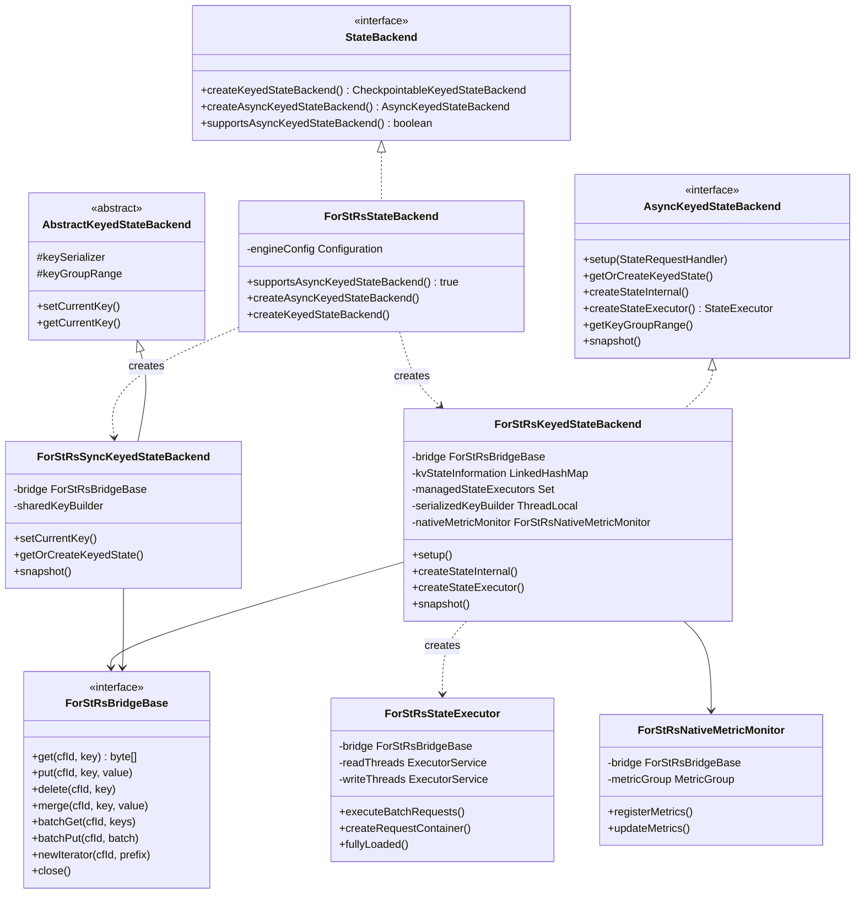
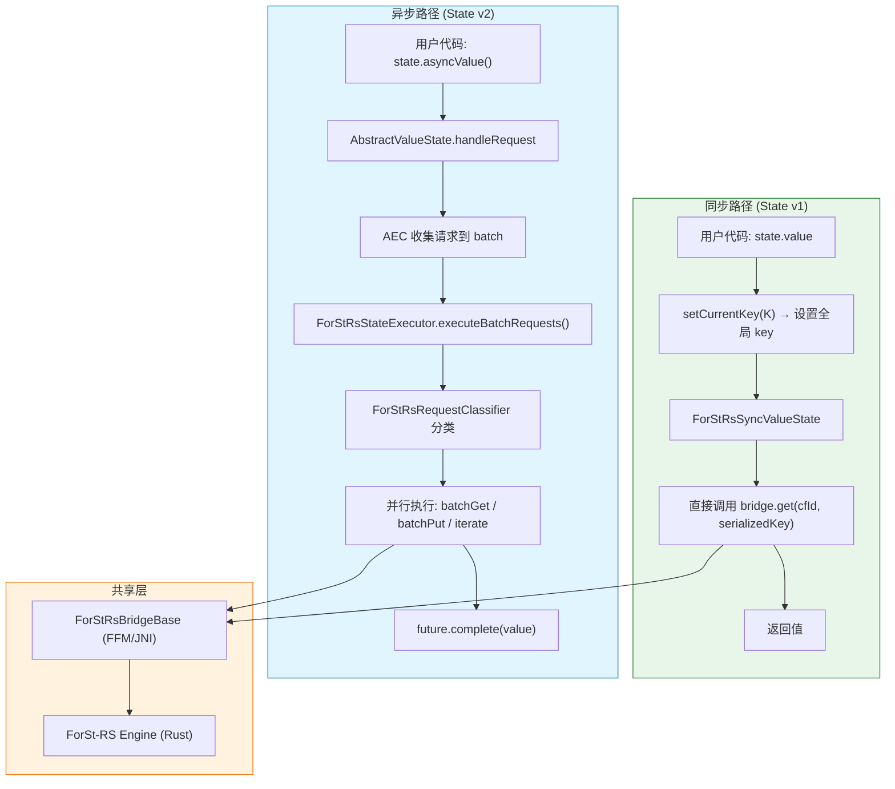
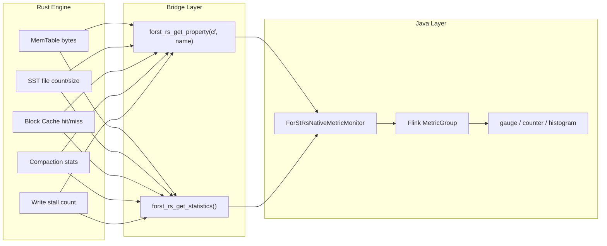
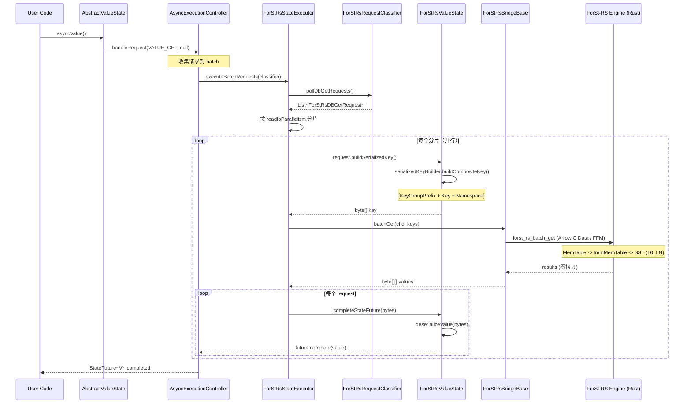
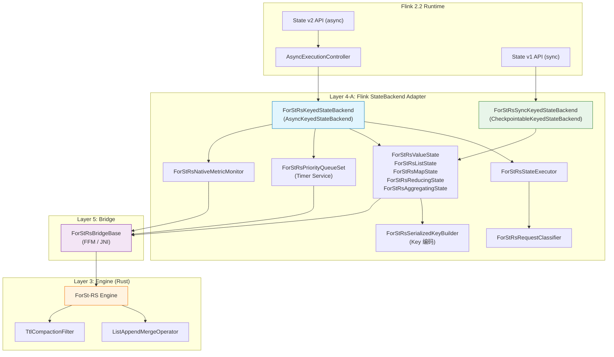

# Flink StateBackend 适配层设计

## 0. 文档元数据
- **文档 ID**: 2.9
- **状态**: completed
- **依赖**: 1.4 (StateBackend API), 1.12 (场景清单), 1.14 (Schema Evolution), 2.1 (总体架构), 2.5 (FFM 桥接层)
- **验证方式**: Java 类层次图完整；5 种状态类型 Key/Value 编码格式覆盖；双轨执行模型图；覆盖 1.12 全部 P0 场景；Key 编码与 ForSt 兼容
- **最后更新**: 2026-04-19

---

## 1. 设计目标与约束

### 1.1 设计目标

Flink StateBackend 适配层是 ForSt-RS 五层架构（文档 2.1）中 Layer 4-A 的具体实现。它在 Java 侧提供完整的 Flink 2.2 状态后端能力，通过 Layer 5 Bridge（文档 2.5）调用 Rust 引擎。核心目标：

1. **完整实现 AsyncKeyedStateBackend 接口**：替换 `ForStKeyedStateBackend`，成为 Flink 异步状态后端的新实现（文档 1.4 Section 3.1.3）
2. **5 种状态类型全覆盖**：ValueState / ListState / MapState / ReducingState / AggregatingState，功能与 ForSt 完全等价（文档 1.12 场景 1-5，均为 P0）
3. **双轨兼容**：同时支持 Sync（State v1）和 Async（State v2）两条执行路径（文档 2.1 R6）
4. **Key 编码兼容**：保持 `[KeyGroupPrefix][Key][Namespace][UserKey]` 编码格式不变，支持从 ForSt 无缝迁移（文档 1.4 Section 3.4.5）
5. **Merge Operator 语义等价**：在 Rust 侧实现 ListState 所需的 StringAppendOperator 语义（文档 1.12 场景 2）
6. **PriorityQueue 实现**：为 Timer Service 提供基于 ForSt-RS 的优先级队列（文档 1.12 场景 10）
7. **Native Metrics 暴露**：将 Rust 引擎内部统计信息映射到 Flink MetricGroup（文档 2.1 Section 3.1 `get_property`）

### 1.2 已确定的约束

| 约束 ID | 来源 | 内容 |
|---------|------|------|
| C4 | 文档 1.14 / 2.1 | ForSt-RS 不管 Schema Evolution，透传 opaque bytes。Schema 兼容性判定和数据迁移完全在 TypeSerializer 层完成 |
| C5 | 文档 1.4 / 2.5 | 最小桥接接口集 22 个 C ABI 函数（12 DB + 5 Checkpoint + 5 Config） |
| C9 | 设计规范 | 允许修改 Flink 源码（Planner/Runtime 均可改） |
| C-KEY | 文档 1.14 Section 8.1 | Key 序列化器和 Namespace 序列化器不支持 migration（直接抛异常），只有 Value 序列化器的 migration 被支持 |
| C-ASYNC | 文档 1.4 Section 3.5 | 异步版无全局 `currentKey`，key 通过 `RecordContext<K>` 传递；序列化器使用 ThreadLocal 保证多线程安全 |

### 1.3 与 1.12 场景矩阵的覆盖关系

| 场景 | 优先级 | 本文档覆盖范围 | 关键依赖 |
|------|--------|---------------|---------|
| 1. ValueState get/put | P0 | Section 3（状态适配） | 桥接层 get/put |
| 2. ListState add/get/clear | P0 | Section 3 + Section 6（Merge Operator） | Rust 侧 StringAppendOperator |
| 3. MapState 全操作 | P0 | Section 3（含 Iterator） | 桥接层 iterator + prefix_scan |
| 4. AggregatingState | P0 | Section 3 | AEC 层 read-modify-write |
| 5. ReducingState | P0 | Section 3 | AEC 层 read-modify-write |
| 6. Incremental Checkpoint | P0 | 文档 2.7（Checkpoint 集成） | 桥接层 checkpoint 操作 |
| 7. Full Checkpoint | P0 | 文档 2.7 | 同上 |
| 8. Restore | P0 | 文档 2.7 | 桥接层 restore 操作 |
| 10. Timer Service | P1 | Section 7（PriorityQueue） | 桥接层 get/put/iterator |
| 11. Async state access | P1 | Section 4（双轨兼容） | ForStRsStateExecutor |
| 12. TTL state | P1 | Section 6.2（Compaction Filter） | Rust 侧 CompactionFilter trait |
| 13. State migration | P1 | Section 5.4（透传策略） | 基础 KV API（C4 约束） |

---

## 2. 方案设计

### 2.1 Java 侧类层次设计

ForSt-RS 适配层的核心是 `ForStRsKeyedStateBackend`，它实现 `AsyncKeyedStateBackend` 接口，是异步状态后端的主入口。同步路径通过 `ForStRsSyncKeyedStateBackend` 提供，二者共享底层 `ForStRsBridgeBase` 桥接实例。

#### 2.1.1 类继承体系

```
StateBackend (工厂接口)
  |
  +-- ForStRsStateBackend (工厂实现)
        |
        +-- supportsAsyncKeyedStateBackend() -> true
        +-- createAsyncKeyedStateBackend() -> ForStRsKeyedStateBackend
        +-- createKeyedStateBackend() -> ForStRsSyncKeyedStateBackend
        +-- createOperatorStateBackend() -> 委托 DefaultOperatorStateBackend

AsyncKeyedStateBackend<K> (异步接口)
  |
  +-- ForStRsKeyedStateBackend<K>
        |-- bridge: ForStRsBridgeBase               // 桥接层实例（文档 2.5）
        |-- kvStateInformation: LinkedHashMap        // 状态 -> ColumnFamily 映射
        |-- managedStateExecutors: Set               // 受管理的执行器
        |-- keySerializer: TypeSerializer<K>         // Key 序列化器
        |-- keyGroupRange: KeyGroupRange             // 分配的 KeyGroup 范围
        |-- keyGroupPrefixBytes: int                 // KeyGroup 前缀字节数（1 或 2）
        |-- serializedKeyBuilder: ThreadLocal<...>   // 线程安全的 Key 序列化构建器
        |-- nativeMetricMonitor: ForStRsNativeMetricMonitor
        |
        +-- setup(StateRequestHandler)
        +-- getOrCreateKeyedState(N, TypeSerializer<N>, StateDescriptor<SV>)
        +-- createStateInternal(N, TypeSerializer<N>, StateDescriptor<SV>)
        +-- createStateExecutor() -> ForStRsStateExecutor
        +-- getKeyGroupRange() -> KeyGroupRange
        +-- snapshot() -> RunnableFuture<SnapshotResult<KeyedStateHandle>>
        +-- switchContext(RecordContext<K>)
        +-- dispose() / close()

CheckpointableKeyedStateBackend<K> (同步接口)
  |
  +-- AbstractKeyedStateBackend<K>
        |
        +-- ForStRsSyncKeyedStateBackend<K>
              |-- bridge: ForStRsBridgeBase          // 共享同一桥接实例
              |-- sharedKeyBuilder: ...              // 非线程安全（同步版单线程）
              |
              +-- setCurrentKey(K) / getCurrentKey()
              +-- getOrCreateKeyedState()
              +-- getPartitionedState()
              +-- snapshot()
```

#### 2.1.2 工厂类设计

```java
public class ForStRsStateBackend implements StateBackend, ConfigurableStateBackend {
    private final Configuration engineConfig;

    @Override
    public boolean supportsAsyncKeyedStateBackend() { return true; }

    @Override
    public <K> AsyncKeyedStateBackend<K> createAsyncKeyedStateBackend(
            KeyedStateBackendParameters<K> params) throws Exception {
        ForStRsBridgeBase bridge = ForStRsBridgeBase.create(engineConfig);
        // 恢复或创建 DB
        restoreOrCreate(bridge, params);
        return new ForStRsKeyedStateBackend<>(bridge, params);
    }

    @Override
    public <K> CheckpointableKeyedStateBackend<K> createKeyedStateBackend(
            KeyedStateBackendParameters<K> params) throws Exception {
        ForStRsBridgeBase bridge = ForStRsBridgeBase.create(engineConfig);
        restoreOrCreate(bridge, params);
        return new ForStRsSyncKeyedStateBackend<>(bridge, params);
    }
}
```

#### 2.1.3 Java 类层次图



### 2.2 五种状态类型的适配

适配层复用 Flink 现有的 `AbstractXxxState` v2 基类（文档 1.4 Section 3.1.4），仅替换 `ForStInnerTable` 的底层实现。每种 ForSt-RS 状态实现类负责：Key/Value 的序列化/反序列化、构建 DB 请求对象。

#### 2.2.1 状态实现类映射

| 状态类型 | ForSt-RS 实现类 | 继承基类 | DB 操作 | ColumnFamily |
|---------|----------------|---------|---------|-------------|
| ValueState | `ForStRsValueState<K,N,V>` | `AbstractValueState<K,N,V>` | get / put / delete | 独立 CF |
| ListState | `ForStRsListState<K,N,V>` | `AbstractListState<K,N,V>` | get / merge / put / delete | 独立 CF |
| MapState | `ForStRsMapState<K,N,UK,UV>` | `AbstractMapState<K,N,UK,UV>` | get / put / delete / iterator / prefix_scan | 独立 CF |
| ReducingState | `ForStRsReducingState<K,N,V>` | `AbstractReducingState<K,N,V>` | get / put / delete | 独立 CF |
| AggregatingState | `ForStRsAggregatingState<K,N,IN,ACC,OUT>` | `AbstractAggregatingState<K,N,IN,ACC,OUT>` | get / put / delete | 独立 CF |

#### 2.2.2 ForStRsInnerTable 接口

```java
/**
 * ForSt-RS 版本的 InnerTable，连接状态类型与桥接层。
 * 替换原 ForStInnerTable 中对 RocksDB ColumnFamilyHandle 的依赖。
 */
public interface ForStRsInnerTable<K, N, V> {
    /** 获取 ColumnFamily ID（对应桥接层的 cfId） */
    int getColumnFamilyId();

    /** 序列化复合 Key: [KeyGroupPrefix][Key][Namespace][UserKey?] */
    byte[] serializeKey(ContextKey<K, N> key) throws IOException;

    /** 序列化 Value */
    byte[] serializeValue(V value) throws IOException;

    /** 反序列化 Value */
    V deserializeValue(byte[] value) throws IOException;

    /** 构建 DB Get 请求 */
    ForStRsDBGetRequest<?, ?, ?, ?> buildDBGetRequest(
            StateRequest<?, ?, ?, ?> stateRequest);

    /** 构建 DB Put 请求 */
    ForStRsDBPutRequest<?, ?, ?> buildDBPutRequest(
            StateRequest<?, ?, ?, ?> stateRequest);
}
```

#### 2.2.3 状态创建流程

```java
// ForStRsKeyedStateBackend.createStateInternal()
@Override
public <N, SV, S extends State> S createStateInternal(
        N defaultNamespace,
        TypeSerializer<N> namespaceSerializer,
        StateDescriptor<SV> stateDesc) {

    // 1. 获取或创建 ColumnFamily
    int cfId = getOrCreateColumnFamily(stateDesc.getName());

    // 2. 按类型创建状态实例
    switch (stateDesc.getType()) {
        case VALUE:
            return new ForStRsValueState<>(cfId, bridge, keySerializer,
                namespaceSerializer, stateDesc.getSerializer(),
                keyGroupPrefixBytes, defaultNamespace);
        case LIST:
            return new ForStRsListState<>(cfId, bridge, keySerializer,
                namespaceSerializer, stateDesc.getSerializer(),
                keyGroupPrefixBytes, defaultNamespace);
        case MAP:
            MapStateDescriptor<UK, UV> mapDesc = (MapStateDescriptor) stateDesc;
            return new ForStRsMapState<>(cfId, bridge, keySerializer,
                namespaceSerializer, mapDesc.getKeySerializer(),
                mapDesc.getValueSerializer(), keyGroupPrefixBytes, defaultNamespace);
        case REDUCING:
            return new ForStRsReducingState<>(...);
        case AGGREGATING:
            return new ForStRsAggregatingState<>(...);
    }
}
```

### 2.3 五种状态类型的 Key/Value 编码格式

Key 编码保持与 ForSt 完全兼容（文档 1.4 Section 3.4.5），确保从 ForSt 到 ForSt-RS 的无缝迁移。Value 编码由 Flink 的 TypeSerializer 在 Java 层完成，ForSt-RS 引擎透传 opaque bytes（约束 C4）。

#### 2.3.1 ValueState 编码

```
Key: [KeyGroupPrefix (1-2B)] [SerializedKey] [SerializedNamespace]
Value: [SerializedValue]   -- TypeSerializer<V>.serialize(value) 产生的 opaque bytes

示例 (keyGroupPrefixBytes=2):
Key:   | 0x00 0x07 | key_bytes... | ns_bytes... |
Value: | value_bytes...                          |
```

- **KeyGroupPrefix**: 1 或 2 字节，取决于 `maxParallelism`。`maxParallelism <= 128` 时 1 字节，否则 2 字节
- **SerializedKey**: `TypeSerializer<K>.serialize(key)` 的输出
- **SerializedNamespace**: `TypeSerializer<N>.serialize(namespace)` 的输出
- **SerializedValue**: `TypeSerializer<V>.serialize(value)` 的输出

#### 2.3.2 ListState 编码

```
Key: [KeyGroupPrefix (1-2B)] [SerializedKey] [SerializedNamespace]
Value (完整): [elem1_bytes] [delimiter] [elem2_bytes] [delimiter] ... [elemN_bytes]
Value (merge operand): [serialized_element_bytes]

delimiter = ListDelimitedSerializer 使用的分隔符标记
```

- **Get**: 读取完整 value bytes，在 Java 侧通过 `ListDelimitedSerializer.deserializeList()` 拆分为元素列表
- **Add (merge)**: 通过 `bridge.merge(cfId, key, elementBytes)` 追加，Rust 侧 MergeOperator 负责拼接
- **Update (覆盖写)**: 通过 `bridge.put(cfId, key, fullListBytes)` 完整覆盖

#### 2.3.3 MapState 编码

MapState 是最复杂的状态类型，每个 `(key, namespace, userKey)` 三元组对应一个独立的 KV 条目。

```
Key: [KeyGroupPrefix (1-2B)] [SerializedKey] [SerializedNamespace] [SerializedUserKey]
Value: [isNull: boolean (1B)] [SerializedUserValue]

前缀 (用于 iterator/isEmpty/clear):
Prefix: [KeyGroupPrefix (1-2B)] [SerializedKey] [SerializedNamespace]
```

- **Get(UK)**: 完整 key（含 UserKey）-> `bridge.get(cfId, fullKey)` -> 反序列化 value（含 isNull 前缀）
- **Put(UK, UV)**: 完整 key + serialized value -> `bridge.put(cfId, fullKey, valueWithNullFlag)`
- **Iterator/Keys/Values**: 基于前缀扫描 `bridge.newIterator(cfId, prefix)` 或 `bridge.prefixScan(cfId, prefix, limit)`
- **Contains(UK)**: 完整 key -> `bridge.get(cfId, fullKey)` 检查是否存在
- **IsEmpty**: 前缀 -> `bridge.newIterator(cfId, prefix)` 检查是否有首条记录
- **Clear**: 前缀扫描所有 userKey 并逐一删除

#### 2.3.4 ReducingState 编码

```
Key: [KeyGroupPrefix (1-2B)] [SerializedKey] [SerializedNamespace]
Value: [SerializedReducedValue]    -- 单个累积值
```

- **Get**: 直接读取并反序列化
- **Add**: AEC 层执行 read-modify-write：`get旧值 -> reduceFunction.reduce(旧值, 新值) -> put结果`。底层 ForSt-RS 只看到独立的 get 和 put 操作

#### 2.3.5 AggregatingState 编码

```
Key: [KeyGroupPrefix (1-2B)] [SerializedKey] [SerializedNamespace]
Value: [SerializedAccumulator]     -- ACC 类型的累积器
```

- **Get**: 读取 ACC bytes -> 反序列化为 ACC -> `aggregateFunction.getResult(ACC)` -> OUT
- **Add**: AEC 层执行 read-modify-write：`get ACC -> aggregateFunction.add(input, acc) -> put 新ACC`

#### 2.3.6 编码格式汇总表

| 状态类型 | Key 格式 | Value 格式 | 特殊 DB 操作 |
|---------|---------|-----------|-------------|
| ValueState | `KGP + Key + NS` | `V_bytes` | get / put / delete |
| ListState | `KGP + Key + NS` | `elem1 \| delim \| elem2 \| ...` | get / **merge** / put / delete |
| MapState | `KGP + Key + NS + UserKey` | `isNull(1B) + UV_bytes` | get / put / delete / **iterator** / **prefix_scan** |
| ReducingState | `KGP + Key + NS` | `Reduced_V_bytes` | get / put / delete |
| AggregatingState | `KGP + Key + NS` | `ACC_bytes` | get / put / delete |

其中 `KGP` = KeyGroupPrefix (1-2 bytes), `NS` = Namespace。

### 2.4 双轨兼容设计 (Sync + Async)

Flink 2.2 保持同步（State v1）和异步（State v2）两条执行路径并存（文档 1.4 Section 3.5）。ForSt-RS 适配层通过共享桥接实例、差异化执行策略实现双轨兼容。

#### 2.4.1 双轨执行模型



#### 2.4.2 同步版实现要点

`ForStRsSyncKeyedStateBackend` 继承 `AbstractKeyedStateBackend<K>`，提供同步执行路径：

| 维度 | 同步版 | 异步版 |
|------|--------|--------|
| 继承体系 | `extends AbstractKeyedStateBackend<K>` | `implements AsyncKeyedStateBackend<K>` |
| State API | State v1 (`o.a.f.api.common.state.*`) | State v2 (`o.a.f.api.common.state.v2.*`) |
| Key 管理 | `setCurrentKey(K)` / `getCurrentKey()` | 通过 `RecordContext<K>` 传递 |
| 执行模型 | 每次操作同步调用 `bridge.get()` / `bridge.put()` | AEC 收集批次 -> StateExecutor 批量执行 |
| 读取方式 | `bridge.get(cfId, key)` 单条 | `bridge.batchGet(cfId, keys)` 批量 |
| 写入方式 | 累积到 WriteBatchBuffer，定期 `bridge.batchPut()` flush | `ForStRsWriteBatchOperation` 一次性提交 |
| 序列化器线程安全 | 非线程安全的共享 `sharedKeyBuilder` | ThreadLocal `serializedKeyBuilder` |
| 状态实现 | `ForStRsSyncValueState` 等 | `ForStRsValueState` 等 |

#### 2.4.3 异步执行器 (ForStRsStateExecutor)

```java
public class ForStRsStateExecutor implements StateExecutor {
    private final ForStRsBridgeBase bridge;
    private final ExecutorService coordinatorThread;
    private final ExecutorService readThreads;
    private final ExecutorService writeThreads;
    private final AtomicInteger ongoing = new AtomicInteger(0);

    @Override
    public CompletableFuture<Void> executeBatchRequests(
            AsyncRequestContainer requestContainer) {
        ForStRsRequestClassifier classifier =
                (ForStRsRequestClassifier) requestContainer;

        return CompletableFuture.runAsync(() -> {
            List<ForStRsDBGetRequest> gets = classifier.pollDbGetRequests();
            List<ForStRsDBPutRequest> puts = classifier.pollDbPutRequests();
            List<ForStRsDBIterRequest> iters = classifier.pollDbIterRequests();

            CompletableFuture<?>[] futures = new CompletableFuture[3];

            // 并行执行三类操作
            futures[0] = executeBatchGet(gets);     // -> bridge.batchGet()
            futures[1] = executeBatchPut(puts);     // -> bridge.batchPut()
            futures[2] = executeIterations(iters);  // -> bridge.newIterator()

            CompletableFuture.allOf(futures).join();
        }, coordinatorThread);
    }

    @Override
    public boolean fullyLoaded() {
        return ongoing.get() >= readThreads.getCorePoolSize();
    }

    @Override
    public AsyncRequestContainer createRequestContainer() {
        return new ForStRsRequestClassifier();
    }
}
```

#### 2.4.4 请求分类器 (ForStRsRequestClassifier)

请求分类逻辑与 ForSt 原版 `ForStStateRequestClassifier` 完全一致（文档 1.4 Section 3.4.1），分为 Get / Put / Iter 三组：

| StateRequestType | 分类 | DB 操作 |
|-----------------|------|---------|
| VALUE_GET, LIST_GET, MAP_GET, REDUCING_GET, AGGREGATING_GET | Get | `bridge.batchGet()` |
| MAP_CONTAINS, MAP_IS_EMPTY | Get (特殊) | `bridge.get()` / `bridge.newIterator()` |
| VALUE_UPDATE, LIST_UPDATE, LIST_ADD, LIST_ADD_ALL, MAP_PUT, MAP_REMOVE, REDUCING_ADD, AGGREGATING_ADD, CLEAR(非Map) | Put | `bridge.batchPut()` / `bridge.merge()` |
| MAP_PUT_ALL, CLEAR(Map) | Put (批量) | 遍历 + `bridge.batchPut()` |
| MAP_ITER, MAP_ITER_KEY, MAP_ITER_VALUE, ITERATOR_LOADING | Iter | `bridge.newIterator()` / `bridge.prefixScan()` |

### 2.5 Key 编码设计

#### 2.5.1 编码格式（与 ForSt 兼容）

Key 编码沿用 Flink 的 `SerializedCompositeKeyBuilder` 逻辑，格式如下：

```
+-------------------+----------------+---------------------+-----------------+
| KeyGroupPrefix    | SerializedKey  | SerializedNamespace  | UserKey         |
| (1 or 2 bytes)    | (variable len) | (variable len)       | (MapState only) |
+-------------------+----------------+---------------------+-----------------+
```

**KeyGroupPrefix 计算方式**:
```java
int keyGroup = KeyGroupRangeAssignment.assignToKeyGroup(key, maxParallelism);
// maxParallelism <= 128: 1 byte prefix
// maxParallelism > 128:  2 byte prefix (big-endian)
```

**关键兼容性保证**:
- KeyGroupPrefix 的编码方式与 ForSt 完全一致
- 同一 KeyGroup 的所有 key 在 DB 中物理相邻（前缀排序）
- 这使得 Rescaling（文档 1.12 场景 9）的 `clipDBWithKeyGroupRange()` 和 `deleteFilesInRanges()` 操作仍然有效

#### 2.5.2 ForStRsSerializedKeyBuilder

```java
/**
 * 线程安全的 Key 序列化构建器（异步版使用 ThreadLocal 持有）。
 * 与 ForSt SerializedCompositeKeyBuilder 语义一致。
 */
public class ForStRsSerializedKeyBuilder<K> {
    private final TypeSerializer<K> keySerializer;
    private final int keyGroupPrefixBytes;
    private final DataOutputSerializer outputStream;

    /** 构建不含 UserKey 的复合 key（ValueState/ListState/ReducingState/AggregatingState） */
    public <N> byte[] buildCompositeKey(
            int keyGroup, K key, N namespace,
            TypeSerializer<N> namespaceSerializer) throws IOException {
        outputStream.clear();
        // 1. KeyGroup prefix
        writeKeyGroupPrefix(outputStream, keyGroup, keyGroupPrefixBytes);
        // 2. Serialized key
        keySerializer.serialize(key, outputStream);
        // 3. Serialized namespace
        namespaceSerializer.serialize(namespace, outputStream);
        return outputStream.getCopyOfBuffer();
    }

    /** 构建含 UserKey 的复合 key（MapState） */
    public <N, UK> byte[] buildCompositeKeyWithUserKey(
            int keyGroup, K key, N namespace,
            TypeSerializer<N> namespaceSerializer,
            UK userKey, TypeSerializer<UK> userKeySerializer) throws IOException {
        outputStream.clear();
        writeKeyGroupPrefix(outputStream, keyGroup, keyGroupPrefixBytes);
        keySerializer.serialize(key, outputStream);
        namespaceSerializer.serialize(namespace, outputStream);
        userKeySerializer.serialize(userKey, outputStream);
        return outputStream.getCopyOfBuffer();
    }
}
```

#### 2.5.3 ContextKey 与序列化缓存

沿用 ForSt 的 `ContextKey<K, N>` 设计（文档 1.4 Section 3.4.5），通过缓存避免同一 key 在同一批次中被多次序列化：

```java
public class ContextKey<K, N> {
    RecordContext<K> recordContext;  // 包含 key 和 keyGroup
    N namespace;
    Object userKey;                 // MapState 的 user key

    // 序列化缓存
    private byte[] serializedKey;

    public byte[] getOrCreateSerializedKey(
            ForStRsSerializedKeyBuilder<K> builder) throws IOException {
        if (serializedKey == null) {
            serializedKey = builder.buildCompositeKey(
                recordContext.getKeyGroup(),
                recordContext.getKey(),
                namespace,
                namespaceSerializer);
        }
        return serializedKey;
    }
}
```

### 2.6 Merge Operator 语义在 Rust 侧的实现

ListState 的高效 append 操作依赖 Merge Operator（文档 1.12 场景 2）。ForSt 使用 RocksDB 的 `StringAppendOperator`，ForSt-RS 需要在 Rust 侧实现等价语义。

#### 2.6.1 StringAppendOperator 语义

```
操作序列:
  merge(key, "elem1_bytes")
  merge(key, "elem2_bytes")
  merge(key, "elem3_bytes")
  get(key) -> "elem1_bytes" + DELIMITER + "elem2_bytes" + DELIMITER + "elem3_bytes"

其中 DELIMITER = ListDelimitedSerializer 使用的分隔符 (0x00 byte)
```

#### 2.6.2 Rust 侧 MergeOperator 实现

```rust
/// ListState 专用 Merge Operator，等价于 RocksDB StringAppendOperator。
/// 注册到 ListState 对应 ColumnFamily 的 CfOptions.merge_operator。
pub struct ListAppendMergeOperator {
    delimiter: u8,  // 默认 0x00
}

impl MergeOperator for ListAppendMergeOperator {
    fn full_merge(
        &self,
        _key: &[u8],
        existing_value: Option<&[u8]>,
        operands: &[&[u8]],
    ) -> Result<Vec<u8>> {
        let mut result = Vec::new();
        if let Some(existing) = existing_value {
            result.extend_from_slice(existing);
        }
        for operand in operands {
            if !result.is_empty() {
                result.push(self.delimiter);
            }
            result.extend_from_slice(operand);
        }
        Ok(result)
    }

    fn partial_merge(&self, _key: &[u8], left: &[u8], right: &[u8]) -> Result<Vec<u8>> {
        let mut result = Vec::with_capacity(left.len() + 1 + right.len());
        result.extend_from_slice(left);
        result.push(self.delimiter);
        result.extend_from_slice(right);
        Ok(result)
    }

    fn name(&self) -> &str { "ListAppendMergeOperator" }
}
```

#### 2.6.3 Java 侧 merge 调用路径

```
user.asyncAdd(value)
  -> handleRequest(LIST_ADD, value)
    -> ForStRsListState.buildDBPutRequest(stateRequest)
      -> ForStRsDBPutRequest.ofMerge(contextKey, [value], this, future)
        -> ForStRsWriteBatchOperation.process()
          -> bridge.merge(cfId, serializedKey, serializedElementBytes)
            -> Rust: engine.merge(cf, key, value)  // 触发 MergeOperator
```

### 2.7 PriorityQueue (Timer Service) 实现策略

Timer Service 通过 `PriorityQueueSetFactory` 接口创建优先级队列（文档 1.12 场景 10）。ForSt-RS 采用与 ForSt 同步版相同的混合缓存策略。

#### 2.7.1 实现策略

`ForStRsPriorityQueueSet` 使用 Rust DB 持久化 + Java `TreeSet` 内存缓存的混合模式：

```java
public class ForStRsPriorityQueueSet<T extends HeapPriorityQueueElement>
        implements InternalPriorityQueue<T> {

    private final ForStRsBridgeBase bridge;
    private final int cfId;                         // 优先级队列专用 CF
    private final TreeOrderedSetCache cache;        // 内存缓存层
    private final TypeSerializer<T> elementSerializer;

    @Override
    public T peek() {
        if (cache.isEmpty()) {
            loadFromDb();
        }
        return cache.peekFirst();
    }

    @Override
    public T poll() {
        T element = peek();
        if (element != null) {
            cache.remove(element);
            byte[] key = serializeElement(element);
            bridge.delete(cfId, key);
        }
        return element;
    }

    @Override
    public boolean add(T element) {
        byte[] key = serializeElement(element);
        byte[] value = DUMMY_VALUE;
        bridge.put(cfId, key, value);
        return cache.add(element);
    }

    private void loadFromDb() {
        // 使用 iterator 从 DB 加载数据到 cache
        try (ForStRsIterator iter = bridge.newIterator(cfId, null)) {
            while (iter.isValid() && cache.size() < cacheCapacity) {
                T element = deserializeElement(iter.key());
                cache.add(element);
                iter.next();
            }
        }
    }
}
```

#### 2.7.2 Key 编码

优先级队列元素的 key 编码保证排序语义：

```
Key: [KeyGroupPrefix (1-2B)] [SerializedElement]
Value: [dummy 1B]   -- 值不重要，仅 key 参与排序
```

`SerializedElement` 由 `TypeSerializer<T>` 序列化，需保证字节序排序与元素优先级一致。

### 2.8 Native Metrics 暴露机制

ForSt-RS 通过桥接层的 `getProperty()` 和 `getStatistics()` 接口暴露 Rust 引擎内部指标。

#### 2.8.1 指标采集架构



#### 2.8.2 指标映射表

| Rust 属性名 | Flink Metric 名称 | 类型 | 说明 |
|-------------|-------------------|------|------|
| `forst.mem-table-flush-pending` | `memTableFlushPending` | Gauge | 待 flush 的 MemTable 数量 |
| `forst.compaction-pending` | `compactionPending` | Gauge | 待 Compaction 标志 |
| `forst.cur-size-active-mem-table` | `curSizeActiveMemTable` | Gauge | 当前活跃 MemTable 大小 |
| `forst.cur-size-all-mem-tables` | `curSizeAllMemTables` | Gauge | 所有 MemTable 总大小 |
| `forst.num-live-versions` | `numLiveVersions` | Gauge | 活跃 Version 数量 |
| `forst.estimate-num-keys` | `estimateNumKeys` | Gauge | 估计的 key 总数 |
| `forst.estimate-live-data-size` | `estimateLiveDataSize` | Gauge | 估计的活跃数据大小 |
| `forst.num-running-flushes` | `numRunningFlushes` | Gauge | 正在执行的 flush 数量 |
| `forst.num-running-compactions` | `numRunningCompactions` | Gauge | 正在执行的 Compaction 数量 |
| `forst.block-cache-usage` | `blockCacheUsage` | Gauge | Block Cache 使用量 |
| `forst.block-cache-hit` | `blockCacheHit` | Counter | Block Cache 命中次数 |
| `forst.block-cache-miss` | `blockCacheMiss` | Counter | Block Cache 未命中次数 |

#### 2.8.3 采集实现

```java
public class ForStRsNativeMetricMonitor implements Closeable {
    private final ForStRsBridgeBase bridge;
    private final MetricGroup metricGroup;

    public void registerMetrics() {
        // 为每个 ColumnFamily 注册 gauge
        for (int cfId : registeredColumnFamilies) {
            MetricGroup cfGroup = metricGroup.addGroup("column_family", cfName);
            cfGroup.gauge("curSizeActiveMemTable", () -> {
                String val = bridge.getProperty(cfId, "forst.cur-size-active-mem-table");
                return val != null ? Long.parseLong(val) : 0L;
            });
            // ... 其他指标
        }

        // 全局统计
        metricGroup.gauge("blockCacheUsage", () -> {
            Map<String, String> stats = bridge.getStatistics();
            return Long.parseLong(stats.getOrDefault("block_cache_usage", "0"));
        });
    }
}
```

---

## 3. 接口定义

### 3.1 ForStRsKeyedStateBackend 核心接口

```java
public class ForStRsKeyedStateBackend<K> implements AsyncKeyedStateBackend<K> {

    // ===== 生命周期 =====
    void setup(StateRequestHandler handler);
    void dispose();
    void close();

    // ===== 状态管理 =====
    <N, SV, S extends State> S getOrCreateKeyedState(
            N defaultNamespace, TypeSerializer<N> nsSerializer,
            StateDescriptor<SV> stateDesc);
    <N, SV, S extends State> S createStateInternal(
            N defaultNamespace, TypeSerializer<N> nsSerializer,
            StateDescriptor<SV> stateDesc);

    // ===== 执行器 =====
    StateExecutor createStateExecutor();

    // ===== Checkpoint =====
    RunnableFuture<SnapshotResult<KeyedStateHandle>> snapshot(
            long checkpointId, long timestamp,
            CheckpointStreamFactory streamFactory,
            CheckpointOptions options);

    // ===== PriorityQueue =====
    <T extends HeapPriorityQueueElement & PriorityComparable<? super T> & Keyed<?>>
    KeyGroupedInternalPriorityQueue<T> create(
            String stateName, TypeSerializer<T> byteOrderedElementSerializer);

    // ===== 元信息 =====
    KeyGroupRange getKeyGroupRange();
    void switchContext(RecordContext<K> context);
}
```

### 3.2 桥接层调用接口（复用 2.5 定义）

适配层通过 `ForStRsBridgeBase`（文档 2.5 Section 2.4）与 Rust 引擎交互。核心调用映射：

| 适配层操作 | 桥接层方法 | C ABI 函数 |
|-----------|-----------|-----------|
| ValueState.get | `bridge.get(cfId, key)` | `forst_rs_get` |
| ValueState.put | `bridge.put(cfId, key, value)` | `forst_rs_put` |
| ValueState.clear | `bridge.delete(cfId, key)` | `forst_rs_delete` |
| ListState.add | `bridge.merge(cfId, key, value)` | `forst_rs_merge` |
| MapState.iterator | `bridge.newIterator(cfId, prefix)` | `forst_rs_iterator_create` |
| 批量 get | `bridge.batchGet(cfId, keys)` | `forst_rs_batch_get` |
| 批量 put | `bridge.batchPut(cfId, batch)` | `forst_rs_batch_put` |
| 前缀扫描 | `bridge.prefixScan(cfId, prefix, limit)` | `forst_rs_prefix_scan` |
| 创建 CF | `bridge.createColumnFamily(name, opts)` | `forst_rs_create_column_family` |
| 指标查询 | `bridge.getProperty(cfId, name)` | `forst_rs_get_property` |
| 统计信息 | `bridge.getStatistics()` | `forst_rs_get_statistics` |

---

## 4. 架构图 / 数据流图

### 4.1 异步 ValueState.get 完整调用链



### 4.2 适配层在五层架构中的位置



---

## 5. 性能分析

### 5.1 与 ForSt 原版的性能对比

| 维度 | ForSt (RocksDB JNI) | ForSt-RS 适配层 | 改善 |
|------|---------------------|-----------------|------|
| 异步 get 路径拷贝次数 | 3 次 (Java->JNI->C++->JNI->Java) | 0-1 次 (FFM 零拷贝) | -67%~-100% |
| 异步 batchGet 100 keys | 300 次 JNI 拷贝 | 0 次 (Arrow C Data) | -100% |
| 异步 batchPut 100 puts | 200 次 JNI 拷贝 | 0 次 (Arrow C Data) | -100% |
| 单次 FFM 调用开销 | ~57ns (JNI) | ~23ns (FFM) | -60% |
| ListState merge 语义 | RocksDB StringAppendOperator | Rust ListAppendMergeOperator | 等价 |
| MapState iterator | RocksDB JNI iterator | Rust native iterator + FFM | 减少 JNI 往返 |
| Checkpoint 同步阶段 | 100ms-1s (flush 阻塞) | <10ms (VersionSet 快照) | 10-100x |

### 5.2 适配层自身的开销

| 开销 | 原因 | 影响评估 |
|------|------|---------|
| Key 序列化 | Java 层 TypeSerializer 序列化 key/namespace | 不变（与 ForSt 等价，受 C4 约束无法消除） |
| Value 序列化 | Java 层 TypeSerializer 序列化 value | 不变（受 C4 约束，ForSt-RS 透传 opaque bytes） |
| ContextKey 缓存 | 同 key 多次操作避免重复序列化 | 正面影响（减少序列化次数） |
| ThreadLocal KeyBuilder | 异步版每个线程独立序列化实例 | 极低（ThreadLocal 查找 ~5ns） |

### 5.3 Schema Evolution 不增加额外开销

基于文档 1.14 的论证（Section 8），ForSt-RS 不需要为 Schema Evolution 实现任何额外接口或逻辑：

1. Schema 兼容性判定在 `TypeSerializerSnapshot` 层完成（纯 Java 堆操作）
2. Migration 时 StateBackend 只需提供基础的 iterator + writeBatch 能力
3. Key 不参与迁移，只迁移 Value（旧序列化器读 -> 新序列化器写）
4. 这些操作全部是 ForSt-RS 作为 KV 存储引擎本来就需要实现的基础 API

---

## 6. 与其他模块的交互

### 6.1 与 2.1 总体架构

本文档对应 2.1 架构中的 Layer 4-A（Flink StateBackend Adapter）。所有 Java 类（ForStRsKeyedStateBackend、5 种状态实现、StateExecutor 等）运行在 JVM 内，通过 Layer 5 Bridge（文档 2.5 的 `ForStRsBridgeBase`）调用 Rust 引擎。

### 6.2 与 2.5 FFM 桥接层

适配层是桥接层的直接消费者。关键交互点：
- **批量读写**：`ForStRsStateExecutor` 的 `executeBatchGet()` / `executeBatchPut()` 调用 `bridge.batchGet()` / `bridge.batchPut()`，通过 Arrow C Data Interface 实现零拷贝
- **单点操作**：同步路径和 MapState 的 contains/isEmpty 使用 `bridge.get()`
- **Merge 操作**：ListState.add 使用 `bridge.merge()`，触发 Rust 侧 MergeOperator
- **Iterator**：MapState 的 iterator/keys/values 使用 `bridge.newIterator()` 或 `bridge.prefixScan()`
- **ColumnFamily 管理**：状态创建时调用 `bridge.createColumnFamily()`
- **指标采集**：`ForStRsNativeMetricMonitor` 通过 `bridge.getProperty()` / `bridge.getStatistics()` 获取引擎指标

### 6.3 与 2.7 Checkpoint 集成

Checkpoint/Restore 逻辑由独立的 2.7 文档定义。适配层的 `snapshot()` 方法委托给 Checkpoint 模块：
- 同步阶段：`bridge.snapshotVersionSet()` 获取元数据 blob + `bridge.getSstFileNumbers()` 获取活跃文件列表
- 异步阶段：差分追踪新增 SST 文件，上传到 Checkpoint 存储
- 恢复：`bridge.restoreFromMetadata(blob)` + `bridge.ingestExternalFiles(paths)`

### 6.4 与 Flink Runtime

适配层需要与 Flink Runtime 的以下组件交互：
- **AsyncExecutionController (AEC)**：异步状态请求的收集和分派。ForStRsKeyedStateBackend 通过 `setup(StateRequestHandler)` 注册到 AEC
- **RecordContext<K>**：异步版的 key 上下文传递。通过 `switchContext(RecordContext<K>)` 回调接收当前处理的 key
- **TtlStateFactory**：TTL 状态包装。在 `getOrCreateKeyedState()` 中，如果 StateDescriptor 配置了 TTL，通过 TtlStateFactory 包装原始状态
- **KeyedBackendSerializationProxy**：Checkpoint 元数据序列化。包含 Key Serializer Snapshot 和每个状态的 StateMetaInfoSnapshot

---

## 7. 风险与替代方案

### 7.1 风险登记

| 风险 | 影响 | 概率 | 缓解措施 |
|------|------|------|---------|
| Merge Operator 语义不完全等价 | 高（ListState 数据正确性） | 低 | 基于 ForSt ListState 测试用例构建 Rust 侧回归测试；StringAppendOperator 语义简单（字节拼接 + 分隔符），实现风险低 |
| Key 编码格式偏差导致迁移失败 | 高（无法从 ForSt 迁移） | 低 | 复用 Flink 的 SerializedCompositeKeyBuilder 逻辑（Java 侧完成编码）；Rust 侧不解析 key 格式（opaque bytes） |
| 异步版 State Migration 缺失 | 中 | 高 | ForSt 异步版同样未实现（TODO 标记，文档 1.14 Section 6.3）。ForSt-RS 与 ForSt 保持一致的行为（抛 UnsupportedOperationException）。基于 C4 约束，未来实现时仅需 iterator + writeBatch 基础 API |
| TTL CompactionFilter 兼容性 | 中 | 中 | Rust 侧 CompactionFilter trait（文档 2.1 Section 3.7）需正确解析 TTL 时间戳前缀。测试覆盖各种过期场景 |
| PriorityQueue 在大状态下性能退化 | 中 | 低 | 采用混合缓存策略（TreeSet + DB），小数据量时全内存操作。与 ForSt 的 `ForStDBCachingPriorityQueueSet` 策略一致 |
| 双轨维护成本 | 中 | 中 | 同步版和异步版共享 ForStRsInnerTable 实现和 Key 编码逻辑，差异仅在执行模型。中长期随 Flink 社区废弃同步路径而缩减 |

### 7.2 替代方案

#### 替代方案 A: 复用 ForSt Java 层，仅替换 JNI 底层

- **描述**: 保留 `ForStKeyedStateBackend` / `ForStValueState` 等全部 Java 类，仅替换底层 `org.forstdb.*` JNI 调用为 ForSt-RS 桥接
- **优点**: Java 层改动最小，风险最低
- **缺点**: ForSt Java 层与 RocksDB JNI 深度耦合（ColumnFamilyHandle、ReadOptions、WriteOptions 等类型贯穿所有层级），替换成本实际不低；无法利用 Arrow 批量传输优势
- **结论**: **不采用**。适配层需要针对 ForSt-RS 的 Arrow 批量接口重新设计执行路径

#### 替代方案 B: 仅实现异步路径，不支持同步路径

- **描述**: 只实现 `AsyncKeyedStateBackend`，强制用户使用异步 API
- **优点**: 代码量减半，无需维护同步版
- **缺点**: Flink 2.2 仍有大量用户使用 State v1 同步 API；社区生态中第三方 connector 多数使用同步 API
- **结论**: **不采用**。双轨兼容是 P0 需求（文档 2.1 R6）。但同步版可延后到 Phase 2 实现

---

## 8. 决策记录

### D-2.9-01: 适配层 Java 类独立于 ForSt 原版

**决策**: 创建独立的 `ForStRsKeyedStateBackend`、`ForStRsValueState` 等 Java 类，而非修改 ForSt 原版 Java 类。

**理由**:
1. ForSt 原版 Java 类与 RocksDB JNI 类型深度耦合（`ColumnFamilyHandle`、`RocksDB`、`WriteBatch` 等），无法通过简单替换底层解耦
2. ForSt-RS 的桥接接口（`ForStRsBridgeBase`）使用 `int cfId` 而非 `ColumnFamilyHandle` 对象，数据传输使用 Arrow RecordBatch 而非 `byte[]` 数组
3. 独立实现允许针对 ForSt-RS 优化执行路径（例如异步 batchGet 直接使用 Arrow C Data Interface）
4. 不影响 ForSt 原版代码，降低与 Flink 社区的冲突

### D-2.9-02: Key 编码在 Java 侧完成

**决策**: Key 的 `[KeyGroupPrefix][Key][Namespace][UserKey]` 编码在 Java 侧的 `ForStRsSerializedKeyBuilder` 中完成，Rust 侧接收 opaque key bytes。

**理由**:
1. Key 编码依赖 Flink 的 `TypeSerializer`（Java 对象），在 Rust 侧无法执行
2. 保持与 ForSt 的编码格式 100% 兼容，支持 Checkpoint 无缝迁移
3. 符合 C4 约束（ForSt-RS 透传 opaque bytes）

### D-2.9-03: Merge Operator 在 Rust 侧实现

**决策**: ListState 的 StringAppendOperator 在 Rust 引擎层实现（`ListAppendMergeOperator`），而非在 Java 层模拟 read-modify-write。

**理由**:
1. Merge Operator 是 LSM-Tree 的核心特性，在 Compaction 时自动合并 operand，避免读放大
2. Java 层模拟 read-modify-write 会增加每次 add 操作的 IO（先 get 再 put），失去 merge 的性能优势
3. Rust `MergeOperator` trait 已在 2.1 架构中定义（Section 3.11），ListAppendMergeOperator 是其简单实现

### D-2.9-04: 双轨兼容通过共享桥接实例实现

**决策**: 同步版和异步版共享同一个 `ForStRsBridgeBase` 实例和底层 Rust DB 实例。

**理由**:
1. 避免资源浪费（两套 DB 实例占用双倍内存和文件句柄）
2. 桥接层接口（`get`/`put`/`batchGet`/`batchPut`）本身是线程安全的，支持并发调用
3. 同步版直接调用 `bridge.get()`/`bridge.put()`，异步版通过 StateExecutor 批量调用 `bridge.batchGet()`/`bridge.batchPut()`，调用模式虽不同但底层接口一致

### D-2.9-05: PriorityQueue 采用混合缓存策略

**决策**: Timer Service 的 PriorityQueue 采用 Java TreeSet 内存缓存 + ForSt-RS DB 持久化的混合模式，与 ForSt 的 `ForStDBCachingPriorityQueueSet` 策略一致。

**理由**:
1. Timer Service 的访问模式以 peek/poll 为主（访问最小元素），内存缓存可以覆盖绝大部分请求
2. 大状态场景（百万级 Timer）需要 DB 持久化兜底
3. 复用 ForSt 已验证的混合策略，降低实现风险

---

*-- 文档 2.9 完 --*
