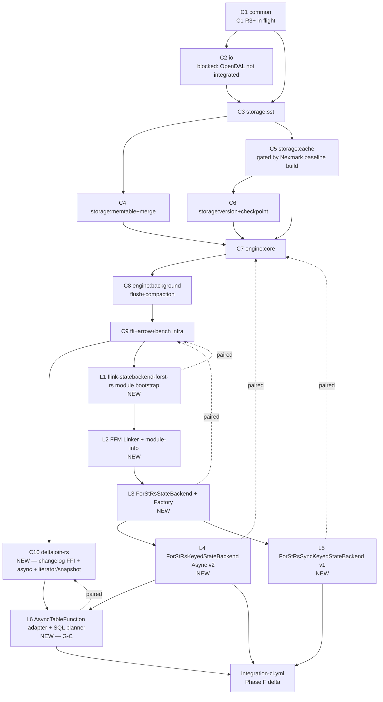

# B1 — Phase B PR Split Plan

> **For agentic workers:** B1 is a **split-plan vessel**, not a full implementation plan. Each work unit listed below gets its own focused implementation plan written via `superpowers:writing-plans` when it starts. For C1–C9 work, the per-round implementation already lives at `.planning/refactor-review/COMMIT_MANIFEST.md` + per-round findings — execute via `superpowers:executing-plans` against the existing C1 R3+ round. For new units (C10, L1–L6), write the per-unit plan when that unit's predecessor lands.

**Goal:** Map all v3.2 Phase D work into discrete, dependency-ordered, dual-repo work units covering G-A (compat) / G-B (forst-rs backend + FFM) / G-C (Delta Join hookup), preserving the existing C1–C9 frozen vocabulary while extending it for goals not yet covered.

**Architecture:** v3.2 wraps C1–C9. Phase D = ongoing C1–C9 review-loop + new C10 (Delta Join Rust-side FFI) + new L1–L6 (Flink-side paired PRs for `flink-statebackend-forst-rs` module + `AsyncTableFunction<RowData>` adapter). Reviewer protocol = `REVIEW_PROTOCOL.md` 10 fixed dimensions; termination = `H=0 ∧ M=0 × 10 / 120-cap` per `A1_reconciliation §2.3`.

**Tech Stack:** Rust workspace (7 crates, MSRV 1.85) + Java/Maven (JDK 25 + FFM API + `jdk.incubator.vector`) + Apache Arrow (`arrow` 54 with `ffi` feature) + OpenDAL (to be added) + Tokio + criterion + JMH + Flink mini-cluster.

---

## 0. Authority Chain

| Layer | Source | Status |
|---|---|---|
| Arch invariants | `docs/design/2.1`–`2.13` (29K lines) | ✅ Stable; status-drift in `2.11` reconciled 2026-05-08 |
| Refactor authority | `.planning/refactor-review/A1_reconciliation.md @ 33f85b1c5` | ✅ Approved 2026-04-30 |
| C1–C9 manifest | `.planning/refactor-review/COMMIT_MANIFEST.md` | ✅ Frozen vocabulary; do NOT rename |
| Reviewer protocol | `.planning/refactor-review/REVIEW_PROTOCOL.md` | ✅ 10 dims + H=0 ∧ M=0 × 10 / 120-cap |
| State machine | `.planning/refactor-review/SESSION_HANDOFF.md` | ✅ STATE source-of-truth |
| Phase A wrap layer | `docs/superpowers/planning/v3.2/reports/A1_status_assessment.md` | ✅ Finalized 2026-05-08 |
| Phase B (this doc) | `docs/superpowers/planning/v3.2/reports/B1_pr_split_plan.md` | ✅ This doc |

**On conflict**: A1_reconciliation > docs/design > A1_status_assessment > B1. v3.2 Master Prompt is informing-only (per `A1_reconciliation:4` precedent over Master Prompt v2).

---

## 1. Naming-Convention Rationale

**Convention picked**: `Cn` for ForSt-RS-side, `Lk` for Flink-side. Pairs `Cn ↔ Lk` (when applicable) reviewed together.

**Rationale**:
- `Cn` (n=1..10) preserves A1_reconciliation §2.1 frozen vocabulary for C1–C9; C10 is a strict extension, not a rename.
- `Lk` (k=1..6) marks Flink-side commits clearly distinct from ForSt-side — no risk of confusion in joint review or in cross-repo CI labels.
- Avoids v3.2's prompt suggestion of `F-PR-XX` / `L-PR-XX` (two-letter prefix, indices in PR space) which would imply a regenerated list. `Cn`/`Lk` is the existing vocabulary plus a small extension.
- Maps cleanly onto `REVIEW_PROTOCOL.md` C-round counter and SESSION_HANDOFF state-machine.

---

## 2. Three-Goal Coverage Map

| Goal | Units that realize it | Notes |
|---|---|---|
| **G-A: ForSt compat** | C1, C2, C3, C4, C5, C6, C7, C8, C9 (existing manifest) + L1–L5 (Flink-side `flink-statebackend-forst-rs` module) | Existing C1–C9 already targets G-A semantics; L1–L5 surface them in Java via FFM-first per docs/2.5 D-02-02 (user-confirmed §8.3 (b)). |
| **G-B: forst-rs backend + FFM** | C9 (Rust-side FFI + Arrow surface) + L2 (FFM Linker setup) + L3 (`ForStRsStateBackend` impl) | Rust side already largely landed (28 frs_* exports); G-B is mostly Java-side from here. |
| **G-C: Delta Join hookup** | **C10** (new — Rust-side changelog FFI + async + iterator/snapshot) + L6 (new — `AsyncTableFunction<RowData>` adapter + SQL planner glue) | Re-framed: this Flink fork has no Fluss; G-C = adapter, not replacement. |
| Infra (cross-cutting) | (existing) ci-rust/ci-bench/ci-e2e/ci-java/ci-release/ci-security/nexmark-baseline workflows + (new) `integration-ci.yml` (Phase F delta) | Phase F delta is single-workflow addition. |

---

## 3. Dependency DAG

**Critical-path notes:**
- **C1 → C2 → C3** is the load-bearing prefix. C1 R3+ active; C2 is blocked on OpenDAL integration (largest single gap per A1 §5.2).
- **C5 is gated** by `baselines_built: false` — RocksDB v8.11.3 + original ForSt baseline build is hardware-time work (per `A1_reconciliation §4.3`).
- **C10 unblocks L6**, but C10 itself depends on C9 stabilizing (current C9 code is landed but not formally reviewed; R5–R13 sweeps touched FFI files).
- **L-series serialize after C9** for the FFM substrate to land before consumers.

---

## 4. Parallel-Execution Strategy

### 4.1 Strict serial windows
- **C1 → C2 → C3**: hard serial. C1 R3+ must converge to `H=0 ∧ M=0 × 10` (with the deferred 2 architectural Histogram Hs resolved via arch-pivot session — see §6.1) before C2 can start.
- **L1 → L2 → L3**: hard serial. Module bootstrap → FFM Linker → StateBackend impl.

### 4.2 Parallel windows
- **C4 + C5** can run in parallel after C3 (memtable and cache are decoupled).
- **C6** can begin alongside C5 (version+checkpoint depends on C3 SST format, not on cache).
- **L4 (Async v2) + L5 (Sync v1)** can run in parallel after L3.
- **C10 + L1–L5** can run in parallel after C9 stabilizes (C10 is Rust-side changelog; L-series is Java-side state backend).

### 4.3 Reviewer-pool concurrency
Per `REVIEW_PROTOCOL.md`: each round dispatches **10 parallel sub-agents** (one per dimension). Cross-Cn parallelism is bounded by Tech VP (Coordinator) attention; recommend at most 2 active C-rounds in parallel (e.g., C4 + C5).

---

## 5. Cross-Repo Pairing & Joint E2E

### 5.1 Pairings
| Cn (ForSt-side) | Lk (Flink-side) | Joint E2E lane |
|---|---|---|
| C9 (FFI + Arrow) | L1 (module bootstrap), L3 (StateBackend) | minimal: load `libforst_rs.so` from Flink, register `ForStRsStateBackend` |
| C7 (engine core) | L4 (Async v2), L5 (Sync v1) | extended: 5 state types via mini-cluster |
| C10 (Delta Join changelog FFI) | L6 (AsyncTableFunction adapter) | dedicated Delta Join 2-way join |
| C2 (io) once OpenDAL lands | (none — Flink callers transparent) | object-store E2E with MinIO |

### 5.2 Joint E2E execution
- New workflow `integration-ci.yml` (Phase F delta — see §7) triggers when paired Cn + Lk both labeled `ready-for-integration`.
- Pre-merge requirement: paired joint E2E green for at least 1 full run.

### 5.3 Merge order
Always **ForSt-side (provider) first, Flink-side (consumer) second**, for any pair.

---

## 6. Per-Unit Scope Summaries

> Each unit gets its own implementation plan written via `superpowers:writing-plans` when it starts. The summaries below capture scope, dependencies, acceptance — sufficient context for the per-unit plan author. **No task breakdown here** — that lives in the per-unit plan.

### 6.1 C1 — common (in flight, R3 ready)

- **Scope**: types, coding (varint), checksum (CRC32C), arena, metrics (Counter/Gauge/Histogram), config
- **Status**: R1 done (H=26, M=52), R2 done (H=4 fixed, 2 architectural Hs deferred), R3 ready to dispatch per `SESSION_HANDOFF.md:current_round = 2`
- **Blocking**: 2 architectural Hs (Histogram non-atomic snapshot + CAS NaN poisoning) — need focused arch-pivot session per `A1_reconciliation §3` before consecutive_clean can reach 10
- **Acceptance**: 10 consecutive rounds with H=0 ∧ M=0; `cargo bench` perf gate ≥3× RocksDB on Arena alloc (only bench with real headroom per R1 architectural finding); other 12 benches gated to "best-effort" or arch-pivoted to reach 3×
- **Files**: `crates/forst-rs-common/`
- **Per-round plan**: dispatch via `REVIEW_PROTOCOL.md` round procedure; findings file `.planning/refactor-review/C1-R{N}-findings.md`

### 6.2 C2 — io

- **Scope**: replace `MockObjectStore` with **OpenDAL-backed** `ObjectStore`; implement Range-Get coalescing; implement async prefetch; implement Hot/Warm/Cold tiering (extend ShardedClockCache + L2 NVMe SSD + L3 OpenDAL)
- **Major new dep**: `opendal` (workspace `Cargo.toml` addition); v3.2 §R8 mandates this
- **Status**: blocked on C1 R3+ convergence; OpenDAL integration is the largest single Phase D gap per A1 §5.2
- **Acceptance**: 10 consecutive rounds H=0 ∧ M=0; perf gate ≥3× direct AWS SDK / Hadoop FS on object-store benches with local MinIO
- **Files**: `crates/forst-rs-io/{object_store.rs,router.rs,async_io.rs}` + new tier modules

### 6.3 C3 — storage:sst

- **Scope**: SST writer/reader/footer/bloom/index already landed; review-only round work
- **Status**: code landed (per W5–W8 plans done 2026-04-22); review rounds not yet started
- **Acceptance**: same; perf gate ≥3× RocksDB SST scan; ≥1× point-lookup
- **Files**: `crates/forst-rs-storage/sst/*`

### 6.4 C4 — storage:memtable+merge

- **Scope**: VectorizedMemTable + ListAppendMergeOperator; review-only
- **Status**: code landed (W9 plan done 2026-04-22)
- **Acceptance**: ≥3× RocksDB skiplist on insert+lookup
- **Files**: `crates/forst-rs-storage/memtable/`, `crates/forst-rs-storage/merge_operator.rs`

### 6.5 C5 — storage:cache

- **Scope**: ShardedClockCache; review-only
- **Status**: code landed; **gated by `baselines_built: false`** — entry blocked until RocksDB v8.11.3 + original ForSt baselines built locally per `A1_reconciliation §4.3`
- **Acceptance**: ≥3–5× LRU; ≥3× RocksDB block cache; baseline build is a prerequisite, hardware-time
- **Files**: `crates/forst-rs-storage/cache/`

### 6.6 C6 — storage:version+checkpoint

- **Scope**: VersionSet (ArcSwap), VersionEdit, checkpoint blob; **incremental checkpoint missing** — needs implementation
- **Status**: full snapshot landed; incremental missing per A1 §5.2
- **Acceptance**: ≥5× RocksDB MANIFEST switching (no-MANIFEST mode); incremental checkpoint ≤80% time of original ForSt
- **Files**: `crates/forst-rs-storage/version/`, `crates/forst-rs-engine/checkpoint.rs`
- **New scope**: incremental checkpoint logic (delta-encode SSTs added since previous checkpoint)

### 6.7 C7 — engine:core

- **Scope**: DbImpl, ColumnFamily, WriteBatch, SnapshotView, WriteController
- **Status**: code landed
- **Acceptance**: ≥3–5× RocksDB on batch+scan; ≥1× on point-lookup
- **Files**: `crates/forst-rs-engine/{db,column_family,write_batch,snapshot_view,write_controller}.rs`

### 6.8 C8 — engine:background

- **Scope**: Flush, Compaction, CompactionFilter, FileDeletionGuard
- **Status**: code landed (W13–W15 + R3 sweep)
- **Acceptance**: ≥3× RocksDB flush throughput + compaction rate; TTL filter correctness
- **Files**: `crates/forst-rs-engine/{flush,compaction,compaction_filter,file_deletion_guard}.rs`

### 6.9 C9 — FFI + Arrow + bench infra

- **Scope**: 28 `frs_*` exports landed; Arrow C Data Interface zero-copy path landed; bench infra landed (4 benches in `forst-rs-bench`)
- **Status**: code landed (W16 + R1–R2 fix(ffi) + R10/R11/R13 hardening); review rounds not yet formally started but R-sweeps have addressed many issues
- **Acceptance**: ≥5× JNI on FFI overhead bench; bench baseline-comparison live (depends on C5 baseline build)
- **Files**: `crates/forst-rs-ffi/src/lib.rs`, `crates/forst-rs-bench/benches/*`
- **R-sweep reconciliation needed**: when C9 enters formal review, decide whether R5/R10/R11/R13 sweep commits roll into round counts or stand as separate-track defensive hardening (see A1 §10.2)

### 6.10 C10 — deltajoin-rs (NEW)

- **Scope**: Rust-side support for Delta Join hookup (G-C)
  1. **Changelog FFI**: `frs_changelog_subscribe(db, cf, callback, user_data) -> handle` + `frs_changelog_poll(handle, batch_out, max) -> count` + `frs_changelog_unsubscribe(handle)`. Engine-side: tap Compaction events to emit changelog records (per docs/2.13 §6).
  2. **Async FFI variants**: `frs_get_async`, `frs_batch_get_async`. Implementation: Tokio runtime + cross-FFI futures via callback handle (per docs/2.5 §3.4 async pattern).
  3. **Iterator FFI**: `frs_iter_create(db, cf, snapshot_handle) -> iter` + `frs_iter_seek(iter, key)` + `frs_iter_next_arrow(iter, batch_out)` + `frs_iter_release(iter)`. Required for G-A semantic completeness too.
  4. **Snapshot FFI**: `frs_snapshot_create(db) -> snapshot` + `frs_snapshot_release(snapshot)`. Wraps existing `forst-rs-engine::snapshot_view::SnapshotView`.
- **Dependencies**: C9 stabilized (FFI surface needs to be stable enough that adding 8 more exports doesn't conflict with in-flight review rounds).
- **Status**: not started; per-unit implementation plan to be written when C9 review converges.
- **Acceptance**: 10 consecutive H=0 ∧ M=0 rounds; perf gate ≥80% of Fluss `LookupBatch` semantically equivalent (hardware-time, optional per A1 §10).
- **Files**: `crates/forst-rs-ffi/src/lib.rs` (+~8 exports), `crates/forst-rs-engine/src/changelog.rs` (new module).

### 6.11 L1 — flink-statebackend-forst-rs module bootstrap (NEW)

- **Scope**: create `flink-state-backends/flink-statebackend-forst-rs/` Maven module on Flink-side (`forst-rs-jdk25` branch). `pom.xml` + `src/main/java/{module-info.java placeholder, package skeleton}` + register in `flink-state-backends/pom.xml`.
- **Dependencies**: C9 stable so Java side can declare ABI version.
- **Acceptance**: `mvn -pl flink-state-backends/flink-statebackend-forst-rs verify` passes (empty test suite OK); module appears in `mvn -pl flink-state-backends help:active-profiles`.
- **Files (Flink repo)**: `flink-state-backends/flink-statebackend-forst-rs/{pom.xml,src/main/java/org/apache/flink/state/forstrs/package-info.java}` + `flink-state-backends/pom.xml` (register child module).
- **Cross-repo pair**: C9.

### 6.12 L2 — FFM Linker + module-info (NEW)

- **Scope**: Java FFM (`java.lang.foreign.{Arena, MemorySegment, Linker}`) Linker setup loading `libforst_rs.so` symbols. `module-info.java` opens caller modules to FFM. JVM args `--enable-native-access=ALL-UNNAMED` documented.
- **Dependencies**: L1.
- **Acceptance**: integration test loads cdylib, calls `frs_db_open` via FFM, gets back a non-NULL handle; JFR shows zero heap-to-native copies.
- **Files (Flink repo)**: `flink-state-backends/flink-statebackend-forst-rs/src/main/java/org/apache/flink/state/forstrs/ffm/{ForStRsLinker,ArenaLifetime,MemorySegmentArrowBuf}.java` + `module-info.java`.
- **Cross-repo pair**: C9 (verifies ABI consumability).

### 6.13 L3 — ForStRsStateBackend + Factory (NEW)

- **Scope**: implement `ForStRsStateBackend` (impl `StateBackend`) + `ForStRsStateBackendFactory` (SPI). Config namespace `state.backend.forstrs.*`. Native lib loader using JDK 25 `Linker` (no `forstjni` JNI).
- **Dependencies**: L2.
- **Acceptance**: SPI discovery via `META-INF/services/org.apache.flink.runtime.state.StateBackendFactory`; `StateBackendLoader.fromApplicationOrConfigOrDefault(...)` returns a `ForStRsStateBackend`.
- **Files (Flink repo)**: `flink-state-backends/flink-statebackend-forst-rs/src/main/java/org/apache/flink/state/forstrs/{ForStRsStateBackend,ForStRsStateBackendFactory,ForStRsOptions}.java` + `META-INF/services/`.
- **Cross-repo pair**: C9.

### 6.14 L4 — ForStRsKeyedStateBackend (Async v2) (NEW)

- **Scope**: implement `AsyncKeyedStateBackend` per Flink 2.2 dual-track API (per docs/1.4). 5 state types (Value/List/Map/Reducing/Aggregating). Key encoding `[KeyGroupPrefix][Key][Namespace]` (per docs/2.9 §4.2).
- **Dependencies**: L3.
- **Acceptance**: `flink-state-backend-common-test` parameterized with `ForStRsStateBackend` passes; mini-cluster job using all 5 state types runs E2E.
- **Files (Flink repo)**: `flink-state-backends/flink-statebackend-forst-rs/src/main/java/org/apache/flink/state/forstrs/async/*.java`.
- **Cross-repo pair**: C7.

### 6.15 L5 — ForStRsSyncKeyedStateBackend (v1) (NEW)

- **Scope**: implement `KeyedStateBackend` (sync) — same 5 state types via blocking FFM downcalls. **Decision: retain v1 sync path?** — open question per A1 §1.4 OQ6. Default = retain for backwards-compat.
- **Dependencies**: L3.
- **Acceptance**: same as L4 but on sync API.
- **Files (Flink repo)**: `flink-state-backends/flink-statebackend-forst-rs/src/main/java/org/apache/flink/state/forstrs/sync/*.java`.
- **Cross-repo pair**: C7.

### 6.16 L6 — AsyncTableFunction adapter + SQL planner glue (NEW, G-C)

- **Scope**: implement `ForStRsLookupTableSource` (`DynamicTableSource` + `LookupTableSource`) producing `ForStRsAsyncLookupFunction extends AsyncTableFunction<RowData>` that wraps `ForStRsLookupKv` calls (`get`/`getAsync`/`batchGet`/`prefixScan`/`subscribeChangelog`). Wire SQL planner via `Catalog`/`DynamicTableSourceFactory`. Add `ConfigOption` `table.exec.delta-join.kv-backend` accepting `forst-rs`. Test with stock Flink Delta Join operator (`StreamingDeltaJoinOperator`) consuming `ForStRsLookupTableSource`.
- **Dependencies**: C10 (changelog FFI) + L4 (state backend).
- **Acceptance**: 2-way Delta Join job (Orders ⋈ Users, 100M events per side) runs E2E backed by ForSt-RS lookup; v3.2 §14.3 deployment-complexity bar trivially satisfied (no Fluss); throughput/latency targets best-effort (Fluss-baseline comparison deferred per A1 §8.5).
- **Files (Flink repo)**: `flink-state-backends/flink-statebackend-forst-rs/src/main/java/org/apache/flink/state/forstrs/deltajoin/{ForStRsLookupTableSource,ForStRsLookupTableSourceFactory,ForStRsAsyncLookupFunction,ForStRsLookupKv}.java` + planner wiring under `flink-table/flink-table-planner` (minimal — register factory).
- **Cross-repo pair**: C10.

### 6.17 integration-ci.yml — Phase F delta (NEW workflow)

- **Scope**: GitHub Actions workflow (lives in this repo's `.github/workflows/integration-ci.yml`). Trigger: any PR labeled `ready-for-integration` AND a paired Flink-side PR exists. Steps: checkout both repos → `cargo build --release -p forst-rs-ffi` → copy `target/release/libforst_rs.so` to Flink workspace `lib/` → `mvn -pl flink-state-backends/flink-statebackend-forst-rs verify` → run dedicated Delta Join 2-way E2E (mini-cluster).
- **Dependencies**: L1 (so the Maven module exists).
- **Acceptance**: workflow runs green on a synthetic paired-PR test.
- **Files**: `.github/workflows/integration-ci.yml` (this repo) + small caller in Flink repo `.github/workflows/forst-rs-integration.yml` invoking the same steps.

---

## 7. Phase D Entry Conditions

Before Phase D dispatches the first new round, these must be true:

1. ✅ **Phase A finalized** (this turn — A1 §10 Decisions Recorded; housekeeping landed)
2. ✅ **Phase B written** (this doc)
3. ⚠️ **Phase C decision** — see §8 below
4. ⚠️ **C1 R2 deferred Hs**: schedule the focused Histogram arch-pivot session before C1 R3+ can reach `consecutive_clean = 10`. Independent of B → D transition; can run in parallel with other Cn rounds if any are unblocked, but no Cn can finalize while its arch-pivot debt is unpaid.

---

## 8. Phase C — Branch Baseline + Worktree Layout

**Phase C in v3.2 wrap-mode is largely SKIPPED** because the existing convention (per A1_reconciliation + SESSION_HANDOFF practice) is "review against `crates/forst-rs-common/` at HEAD" — the worktree convention was abandoned for laptop convenience after session A. Re-introducing 4 worktrees + 2 backup branches would violate `A1_reconciliation §2.1` path-stability.

**What v3.2 §C wanted** vs **what we do**:
| v3.2 §C requirement | v3.2 wrap-mode action |
|---|---|
| Create `forst-rs-bak` backup branch + push to remote | **SKIP** — git history itself is the backup; tags can mark milestones if needed |
| Create `forst-rd-jdk25-bak` backup branch + push to remote | **SKIP** — same |
| Create 4 worktrees in `~/worktrees/` | **SKIP** — review against repo HEAD per existing convention |
| User authorization for `git push -u origin <bak>` | **NOT REQUESTED** — no push needed |

If the user later wants to re-enable a backup-and-worktree scheme (e.g., before a risky arch-pivot), this is a separate decision and should be made then with explicit authorization.

---

## 9. Phase D Recommended First Action

**Resume C1 R3** per `SESSION_HANDOFF.md:current_round = 2; round_2_status: COMPLETE_FIXES_LANDED; CRITICAL_BLOCKER: RESOLVED`. Per the existing convention:

1. Check whether the focused **Histogram arch-pivot session** (for the 2 deferred R2 Hs) has happened. If not, **schedule that first** — pivot resets the round counter, so dispatching R3 before pivot wastes review effort.
2. Once arch-pivot lands (commit + new round counter reset), dispatch R3 via `REVIEW_PROTOCOL.md` round procedure: 10 parallel sub-agents (one per dimension), aggregate, fix H+M, commit, advance.
3. Update SESSION_HANDOFF state block.

This is not v3.2-specific work — it's the existing C1 round-loop continuing under v3.2 wrap. **Phase D entry on this round-loop does NOT require additional v3.2 ceremony.**

---

## 10. Phase B Self-Review

Per writing-plans skill self-review checklist:

**1. Spec coverage** (against A1 §4 three-goal Gap + §5 Stage verdicts + §6 Refactor strategy):
- G-A: ✅ C1–C9 (existing) + L1–L5 (new) cover all G-A gap items in A1 §4.1
- G-B: ✅ C9 + L2 + L3 cover G-B gap items in A1 §4.2
- G-C: ✅ C10 + L6 cover G-C gap items in A1 §4.3, including all 5 R14 capabilities (get / getAsync / batchGet / prefixScan / subscribeChangelog) and snapshot consistency (via L4's Checkpoint barrier alignment)
- OpenDAL gap (largest per A1 §5.2): ✅ assigned to C2
- Incremental checkpoint gap: ✅ assigned to C6 (new scope expansion)
- Iterator/snapshot/async FFI gaps: ✅ assigned to C10
- 2 deferred Histogram architectural Hs: ✅ called out in §7 Phase D entry conditions
- Phase F delta: ✅ §6.17

**2. Placeholder scan**: zero "TBD"/"TODO"/"implement later" in the plan. Section §6 explicitly defers task-level breakdown to per-unit plans (which is the correct level — B1 is a split plan, not implementation plans).

**3. Type/name consistency**:
- `ForStRsStateBackend` (L3) → `ForStRsKeyedStateBackend` (L4) → `ForStRsSyncKeyedStateBackend` (L5): consistent capitalization
- `ForStRsLookupKv` (referenced in A1 §4.3 + L6) → matches v3.2 §R14 spec exactly
- `ForStRsLookupTableSource` (L6) is a new name introduced here; not in A1 — but A1 §4.3 row "Flink Delta Join operator hookup point" said "New SQL connector or DynamicTableSource" so this is valid
- `frs_changelog_subscribe` / `frs_changelog_poll` / `frs_changelog_unsubscribe` (C10) — naming consistent with existing `frs_*` convention

---

## 11. Execution Handoff

Per writing-plans skill terminal step. **B1 is a split plan, not an implementation plan**, so the choice is different:

1. **Per-unit writing-plans on demand (recommended for new units)** — when a new C/L unit unblocks (predecessor lands), invoke `superpowers:writing-plans` to author its focused implementation plan; then `superpowers:executing-plans` to run it.

2. **REVIEW_PROTOCOL round-loop (for in-flight C1)** — invoke `superpowers:executing-plans` against `.planning/refactor-review/REVIEW_PROTOCOL.md` round procedure; dispatch 10 parallel sub-agents per round.

3. **No batch execution at B1 level** — the 16-unit project (~12 months per A1_reconciliation §3 estimate) cannot realistically execute in one autonomous session.

**Phase B → D bridge**: this turn finalized A; B1 written. Phase C is largely skipped (§8). Phase D is the C1 R3 round, which requires the Histogram arch-pivot first. **Recommend: STOP here and await user direction on whether to schedule the arch-pivot session next.**

---

**End B1.** Phase B deliverable produced. Phase C skipped per §8. Phase D entry conditions §7 surfaced; recommended next action §9 = schedule Histogram arch-pivot before C1 R3 dispatch.
