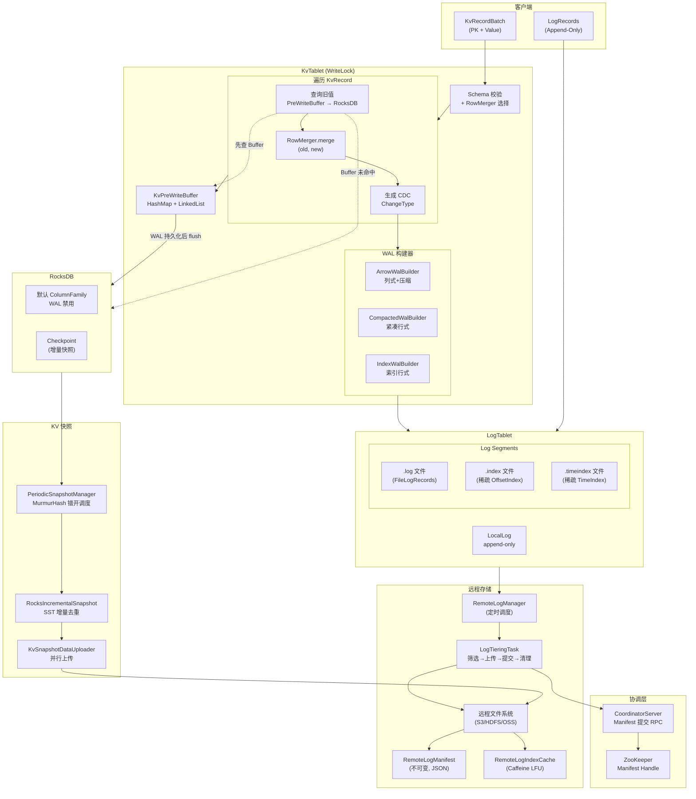

# 1.10 Fluss 存储层布局深度分析

> **分析目标：** 深入理解 Fluss 存储层的数据组织方式、编码格式、持久化路径和容错机制，为 ForSt-RS Phase 1 重构提供准确的架构认知基础。

---

## 1. 分析背景（Context）

### 1.1 分析范围

本文档聚焦 Fluss 存储层的六个核心主题：

| 主题 | 核心关注点 |
|------|-----------|
| KvTablet 数据组织 | PK 到存储的映射、ColumnFamily 策略、Key 编码 |
| Arrow WAL 格式 | ArrowWalBuilder 如何编码记录、内存管理 |
| LogTablet 段结构 | Log Segment 文件组织、索引、读写路径 |
| Remote Log Tiering | RemoteLogManager 上传策略、Manifest 管理 |
| KV Snapshot 机制 | 增量快照、远程上传 |
| Arrow 使用模式 | 记录编码、内存布局、压缩 |

### 1.2 分析动机

ForSt-RS 计划用 Rust 重写底层存储引擎。理解当前 Java 实现的精确数据布局和交互协议，是确保新引擎二进制兼容的前提。

---

## 2. 源码证据索引（Source Evidence）

### 2.1 已分析文件清单

| 模块 | 文件 | 关键发现 |
|------|------|---------|
| `fluss-server` | `KvTablet.java` | 写入主路径：validate schema → create WalBuilder → lookup old value → merge → write PreWriteBuffer → append WAL |
| `fluss-server` | `KvPreWriteBuffer.java` | HashMap + LinkedList 双结构保证点查与有序 flush |
| `fluss-server` | `RocksDBKv.java` | 单默认 ColumnFamily、WAL 禁用、ResourceGuard 并发保护 |
| `fluss-server` | `RocksDBKvBuilder.java` | JNI 加载重试 3 次，路径 `{instanceBasePath}/db` |
| `fluss-server` | `KvManager.java` | 共享 RateLimiter、路径 `/{db}/{table-name}-{table_id}/kv-{bucket-id}` |
| `fluss-server` | `ArrowWalBuilder.java` | ManagedPagedOutputView 内存管理、`nioBuffer()` 深拷贝 TODO |
| `fluss-server` | `CompactedWalBuilder.java` | CompactedRow 编码、无限写入大小 |
| `fluss-server` | `IndexWalBuilder.java` | 索引格式 WAL 构建器 |
| `fluss-common` | `ArrowWriter.java` | 池化、INITIAL_CAPACITY=1024、BUFFER_USAGE_RATIO=0.95、自适应容量估计 |
| `fluss-common` | `MemoryLogRecordsArrowBuilder.java` | 布局: `[header][statistics(V1+)][changeTypes][arrow data]` |
| `fluss-common` | `LogRecordBatchFormat.java` | V0(48B) / V1(+statistics) / V2(+LeaderEpoch) 三版本格式 |
| `fluss-server` | `LogSegment.java` | `.log` + `.index` + `.timeindex`，稀疏索引 |
| `fluss-server` | `LocalLog.java` | append-only，MAX_FILTER_SCAN_SEGMENTS=16 |
| `fluss-server` | `OffsetIndex.java` | 8 字节条目（4B 相对偏移 + 4B 物理位置），内存映射，二分查找 |
| `fluss-server` | `DefaultRemoteLogStorage.java` | FileSystem 抽象、UUID 段目录、并行上传 |
| `fluss-server` | `RemoteLogManager.java` | ScheduledExecutorService、随机初始延迟 |
| `fluss-server` | `LogTieringTask.java` | 候选段筛选 → 复制 → 提交 Manifest → 删除过期段，重试 10 次 |
| `fluss-server` | `RemoteLogManifest.java` | 不可变 RemoteLogSegment 列表、`trimAndMerge()` 合并、JSON 序列化 |
| `fluss-server` | `RemoteLogIndexCache.java` | Caffeine LFU 缓存、后台清理线程、磁盘预热 |
| `fluss-server` | `RocksIncrementalSnapshot.java` | RocksDB Checkpoint、SST 文件增量去重 |
| `fluss-server` | `KvSnapshotDataUploader.java` | CompletableFuture 并行上传、16KB 读缓冲 |
| `fluss-server` | `PeriodicSnapshotManager.java` | guardedExecutor 线程安全、MurmurHash 错开调度 |
| `fluss-server` | `RowMerger.java` | Default / FirstRow / Versioned / Aggregate 四种合并策略 |
| `fluss-server` | `KvRecoverHelper.java` | 两阶段恢复：HW 前直接写 RocksDB，HW 后写 PreWriteBuffer |

---

## 3. 核心发现（Findings）

### 3.1 KvTablet 数据组织

#### 3.1.1 整体架构

`KvTablet` 是主键表的核心存储抽象，采用 **RocksDB + KvPreWriteBuffer + WAL(LogTablet)** 三层结构：

```
客户端写入 KvRecordBatch
        │
        ▼
   ┌─────────────────────────────────────────┐
   │  KvTablet (WriteLock 保护)               │
   │  ┌─────────────────────────────────┐    │
   │  │ 1. Schema 校验 + RowMerger 选择  │    │
   │  │ 2. 遍历 KvRecord:               │    │
   │  │    a. 从 PreWriteBuffer/RocksDB  │    │
   │  │       查询旧值                    │    │
   │  │    b. RowMerger.merge(old, new)  │    │
   │  │    c. 生成 CDC ChangeType        │    │
   │  │    d. WalBuilder.append(CDC)     │    │
   │  │    e. PreWriteBuffer.put(kv)     │    │
   │  │ 3. LogTablet.appendAsLeader(WAL) │    │
   │  └─────────────────────────────────┘    │
   └─────────────────────────────────────────┘
        │                    │
        ▼                    ▼
  KvPreWriteBuffer      LogTablet (WAL)
        │                    │
        ▼ (WAL 持久化后)       │
     RocksDB              持久化 .log 文件
```

**源码证据：** `KvTablet.putAsLeader()` 方法（第 364-448 行）展示了完整的写入流程。

#### 3.1.2 PK 到存储的映射

- **Key 编码：** 客户端将主键序列化为 `byte[]`，通过 `KvPreWriteBuffer.Key.of(keyBytes)` 包装
- **Key 哈希：** 使用 `MurmurHashUtils` 计算哈希，基于 `MemorySegment` 的字节级相等性比较
- **Value 编码：** `BinaryValue` 封装 `(schemaId, BinaryRow)` 二元组，schemaId 支持 Schema 演化时的版本识别

**关键设计：** Fluss 将 KV 数据按 `byte[]` 形式直接写入 RocksDB，**不做 Schema 对齐转换**（性能考虑），但 WAL 始终使用最新 Schema 编码。

#### 3.1.3 ColumnFamily 策略

**当前策略：单默认 ColumnFamily。**

```java
// RocksDBKv.java 第 65 行注释：
// We are not using the default column family for KV ops, but we still need to
// remember this handle so that we can close it properly when the kv is closed.
```

每个 KvTablet 对应一个独立的 RocksDB 实例，没有使用多 ColumnFamily 来区分数据类型。所有 KV 数据存储在默认 CF 中。

**RocksDB 配置特点：**
- `WriteOptions` 禁用了 RocksDB 自身的 WAL（Fluss 有自己的 WAL 机制）
- 共享 `RateLimiter` 跨所有 KvTablet 实例（`KvManager` 级别管理）
- `ResourceGuard` 防止 Checkpoint 期间的并发关闭

#### 3.1.4 KvPreWriteBuffer 双数据结构

```
┌──────────────────────────────────────────────────────┐
│  KvPreWriteBuffer                                     │
│  ┌────────────────────┐  ┌────────────────────────┐  │
│  │ HashMap<Key,KvEntry>│  │ LinkedList<KvEntry>     │  │
│  │ (点查 O(1))         │  │ (按 LSN 有序，flush 遍历)│  │
│  └────────────────────┘  └────────────────────────┘  │
│                                                       │
│  KvEntry: key + value + logSequenceNumber             │
│           + previousEntry (用于 truncate 回滚)         │
│                                                       │
│  flush(logOffset): 遍历 LinkedList，刷入 RocksDB       │
│  truncateTo(offset, reason): 回滚错误/重复批次          │
└──────────────────────────────────────────────────────┘
```

**设计原理：** WAL-first 一致性保证。数据先写入 PreWriteBuffer，仅当 WAL 持久化后才 flush 到 RocksDB。如果 WAL 未持久化就直接写入 RocksDB，用户可能读到后来丢失的数据。

#### 3.1.5 ChangelogImage 模式

| 模式 | 行为 | 性能影响 |
|------|------|---------|
| `WAL` | DefaultRowMerger 下跳过旧值查询，直接产生 UPDATE_AFTER | 高性能，跳过 RocksDB 读取 |
| `FULL` | 必须查询旧值，产生 UPDATE_BEFORE + UPDATE_AFTER | 完整 CDC 语义，额外 IO 开销 |

**源码证据：** `KvTablet.processUpsert()` 第 557-559 行：
```java
if (changelogImage == ChangelogImage.WAL
        && !autoIncrementUpdater.hasAutoIncrement()
        && currentMerger instanceof DefaultRowMerger) {
    // 跳过旧值查询优化
```

#### 3.1.6 RowMerger 策略

| 合并器 | 语义 | 用途 |
|--------|------|------|
| `DefaultRowMerger` | 新值覆盖旧值 | 标准 Upsert |
| `FirstRowRowMerger` | 保留首条记录，忽略后续更新 | 去重/幂等场景 |
| `VersionedRowMerger` | 带版本号的合并 | 多版本并发 |
| `AggregateRowMerger` | 聚合函数合并 | 实时聚合表 |

---

### 3.2 Arrow WAL 格式

#### 3.2.1 三种 WAL 格式

Fluss 支持三种 WAL 编码格式，通过 `LogFormat` 配置选择：

| 格式 | 构建器 | 特点 |
|------|--------|------|
| `ARROW` | `ArrowWalBuilder` | 列式存储，支持压缩和 Filter Pushdown |
| `COMPACTED` | `CompactedWalBuilder` | 紧凑行式编码 |
| `INDEXED` | `IndexWalBuilder` | 带索引的行式编码 |

#### 3.2.2 ArrowWalBuilder 工作流

```
ArrowWalBuilder
  │
  ├── MemorySegmentPool → ManagedPagedOutputView（分页内存管理）
  │
  ├── ArrowWriter（从 ArrowWriterPool 获取，池化复用）
  │     ├── VectorSchemaRoot（列式容器）
  │     ├── ArrowFieldWriter[]（每列一个写入器）
  │     └── CompressionCodec（可选压缩）
  │
  ├── MemoryLogRecordsArrowBuilder
  │     └── 构建: [Header][Statistics][ChangeTypes][Arrow IPC Data]
  │
  └── build() → MemoryLogRecords
        └── bytesView.getByteBuf().nioBuffer()
            // TODO: 存在深拷贝问题，待优化支持跨 Segment
```

**关键代码路径（ArrowWalBuilder.java）：**
- `append(ChangeType, InternalRow)` → 委托给 `MemoryLogRecordsArrowBuilder`
- `build()` → `recordsBuilder.close()` → `recordsBuilder.build()` → `nioBuffer()` 转换
- `deallocate()` → 回收 ArrowWriter 到池 + 归还 MemorySegment

#### 3.2.3 ArrowWriter 池化机制

```
ArrowWriterPool
  │
  ├── writerKey → ArrowWriter 映射
  │
  └── ArrowWriter
        ├── VectorSchemaRoot（Apache Arrow 标准列式容器）
        ├── INITIAL_CAPACITY = 1024（初始行容量）
        ├── BUFFER_USAGE_RATIO = 0.95f（满度阈值）
        │
        ├── isFull(): 自适应估计最大记录数
        │   └── 基于历史数据自动调整预估
        │
        ├── serializeToOutputView():
        │   ├── VectorUnloader（提取 ArrowRecordBatch）
        │   ├── CompressionCodec 压缩
        │   └── ArrowCompressionRatioEstimator 追踪压缩比
        │
        └── epoch-based recycling（幂等回收）
```

**池化设计意义：** Arrow 的 `VectorSchemaRoot` 分配涉及 off-heap 内存，创建/销毁开销大。通过 `ArrowWriterPool` 按 schema key 复用 Writer 实例，避免频繁的内存分配和 GC 压力。

---

### 3.3 LogRecordBatch 二进制格式

#### 3.3.1 三版本演进

**V0（基础版本，自 0.1）：**
```
+──────────┬──────────┬──────────┐
│BaseOffset│ Length   │ Magic(0) │
│ 8 bytes  │ 4 bytes  │ 1 byte   │
+──────────┴──────────┴──────────┤
│CommitTimestamp       │ CRC      │
│ 8 bytes              │ 4 bytes  │
+──────────┬──────────┬──────────┤
│SchemaId  │Attributes│LastOffset│
│ 2 bytes  │ 1 byte   │ Delta 4B │
+──────────┴──────────┴──────────┤
│WriterID              │BatchSeq  │
│ 8 bytes              │ 4 bytes  │
+──────────────────────┬─────────┤
│RecordCount           │Records  │
│ 4 bytes              │(变长)    │
+──────────────────────┴─────────┘
Header = 48 bytes
```

**V1（+Statistics，自 1.0）：**
- 在 RecordCount 之后增加 `StatisticsLength(4B)` + `Statistics Data(变长)`
- 统计信息包含：min/max 值、null 计数（每列），支持 Filter Pushdown

**V2（+LeaderEpoch，自 1.0）：**
- 在 CommitTimestamp 之后增加 `LeaderEpoch(4B)`
- 用于跨 TabletServer 的一致 LeaderEpoch 缓存

**CRC 覆盖范围：** 从 SchemaId 到批次末尾（使用 CRC-32C Castagnoli 多项式）。`CommitTimestamp` 和 `LeaderEpoch` 位于 CRC 之前，因为它们由服务端确定。

#### 3.3.2 Attributes 位域

```
 ------------------------------------------
 |  Unused (1-7)   |  AppendOnly Flag (0) |
 ------------------------------------------
```

Bit 0 标记是否为 Append-Only 模式，其余位保留。

#### 3.3.3 LastOffsetDelta 的特殊语义

`lastOffset = baseOffset + LastOffsetDelta`，而非 `baseOffset + recordCount - 1`。这是因为存在 recordCount=0 的合法批次（例如删除不存在的 key 时不产生 CDC 日志，但需要递增 batchSequence 以避免 `OutOfOrderSequenceException`）。

---

### 3.4 LogTablet 段结构

#### 3.4.1 文件组成

每个 LogSegment 由三个文件组成，以 base offset 命名：

```
{base_offset}.log        # FileLogRecords - 实际的日志记录数据
{base_offset}.index      # OffsetIndex - 逻辑偏移→物理位置的稀疏索引
{base_offset}.timeindex  # TimeIndex - 时间戳→偏移的稀疏索引
```

**源码证据（LogSegment.java Javadoc）：**
> A segment of the log. Each segment has two components: a log and an index... A segment with a base offset of [base_offset] would be stored in two files.

#### 3.4.2 稀疏索引机制

```
                     索引间隔
                 ┌─────────────┐
OffsetIndex:     │ 每 N 字节    │
                 │ 写入一条条目  │
                 └─────────────┘

条目格式 (8 bytes):
┌──────────────────┬──────────────────┐
│ 相对偏移 (4B)     │ 物理位置 (4B)     │
│ offset - baseOff │ 在 .log 文件中位置│
└──────────────────┴──────────────────┘

查找流程:
  1. 二分查找 OffsetIndex 找到 ≤ target 的最大条目
  2. 从该物理位置开始顺序扫描 .log 文件
  3. 找到目标 offset 的记录
```

**索引条目写入条件：** 当 `bytesSinceLastIndexEntry > indexIntervalBytes` 时写入新条目。这是**稀疏索引**而非全量索引，在存储开销和查找效率之间取得平衡。

**OffsetIndex 实现特点：**
- 内存映射文件（mmap），避免系统调用开销
- 预分配文件大小（可配置最大条目数）
- `LazyIndex<OffsetIndex>` 延迟加载，降低冷启动开销

#### 3.4.3 Segment 滚动条件

`LogSegment.shouldRoll()` 检查以下条件：
- Segment 大小超过阈值
- 索引已满（条目数达到最大值）
- Offset 溢出（相对偏移超过 4 字节表示范围）

#### 3.4.4 Filter Pushdown 读取路径

`LogSegment.readWithFilter()` 支持**仅 Arrow 格式**的服务端过滤下推：
- 利用 V1/V2 格式中的 Statistics 数据（min/max/nullCount）
- 在不反序列化完整记录的情况下跳过不匹配的 batch
- `LocalLog.MAX_FILTER_SCAN_SEGMENTS = 16` 限制每次 fetch 的最大扫描段数

---

### 3.5 Remote Log Tiering

#### 3.5.1 整体架构

```
TabletServer
  │
  ├── RemoteLogManager (ScheduledExecutorService)
  │     │
  │     ├── Map<TableBucket, RemoteLogTablet>
  │     │     └── RemoteLogManifest (不可变快照)
  │     │
  │     └── LogTieringTask (per bucket, 定时调度)
  │           │
  │           ├── 1. 筛选候选段（inactive + below HW）
  │           ├── 2. copyLogSegmentFiles → RemoteLogStorage
  │           ├── 3. commitRemoteLogManifest → Coordinator RPC
  │           └── 4. deleteExpiredSegments
  │
  └── RemoteLogIndexCache (Caffeine LFU)
        └── 缓存远程索引文件到本地磁盘
```

#### 3.5.2 Tiering 策略

**候选段筛选条件（LogTieringTask.runOnce）：**
1. 段必须是**非活跃段**（已完成写入并 sealed）
2. 段的最大偏移必须**低于 High Watermark**（已被所有 ISR 副本确认）
3. 每次任务最多上传 `maxUploadSegmentsPerTask` 个段

**上传流程：**
```
1. 为每个候选段生成 UUID 作为远程目录标识
2. 并行上传 .log / .index / .timeindex / .writer_snapshot 到远程
3. 创建新的 RemoteLogManifest（trimAndMerge）
4. 通过 Coordinator RPC 提交 Manifest
5. 提交成功后删除本地已过期的段
```

**重试机制：** Manifest 提交最多重试 10 次，处理 `RetriableException`。

#### 3.5.3 远程存储路径布局

```
{$remote.data.dir}/log/
  └── {database}/
      └── {tableName}_{tableId}/
          └── {bucketId}/
              └── {segment_uuid}/
                  ├── {remote_log_start_offset}.log
                  ├── {remote_log_start_offset}.index
                  ├── {remote_log_start_offset}.timeindex
                  └── {remote_log_end_offset}.writer_snapshot
```

UUID 目录设计保证了不同上传批次的文件不会冲突，即使同一个 offset 范围被重新上传。

#### 3.5.4 RemoteLogManifest 管理

```
RemoteLogManifest（不可变）
  │
  ├── List<RemoteLogSegment>
  │     ├── remoteLogSegmentId (UUID)
  │     ├── remoteLogStartOffset
  │     ├── remoteLogEndOffset
  │     └── segmentSizeInBytes
  │
  ├── trimAndMerge(deletedSegments, newSegments)
  │     → 创建新的不可变 Manifest
  │
  └── JSON 序列化 → 远程存储
      └── ZooKeeper 存储 Manifest Handle（指向远程 Manifest 的路径）
```

**一致性保证：** Manifest 通过 Coordinator RPC 原子提交，ZooKeeper 存储 Handle 确保即使 TabletServer 故障也能恢复最新的远程日志视图。

#### 3.5.5 RemoteLogIndexCache

```
RemoteLogIndexCache (Caffeine)
  │
  ├── 基于 LFU（Least Frequently Used）淘汰策略
  ├── 按 entry size 加权（非条目计数）
  ├── 每个条目包含: OffsetIndex + TimeIndex + ReadWriteLock
  │
  ├── 后台清理线程处理被淘汰的条目（删除磁盘文件）
  │
  └── 启动时从磁盘缓存目录预热
```

---

### 3.6 KV Snapshot 机制

#### 3.6.1 增量快照流程

```
PeriodicSnapshotManager
  │
  ├── 调度策略：
  │   ├── MurmurHash(tableBucket) 计算初始延迟（错开各 bucket）
  │   ├── guardedExecutor 包装 KvTablet 的写锁
  │   └── 动态可配置快照间隔（LongSupplier）
  │
  └── 触发 RocksIncrementalSnapshot.asyncSnapshot()
        │
        ├── Step 1: RocksDB Checkpoint.create()
        │   └── 创建原生 RocksDB 快照到临时目录
        │
        ├── Step 2: 分类快照文件
        │   ├── SST 文件 → shared scope（可跨快照去重）
        │   └── 其他文件 (MANIFEST, CURRENT, OPTIONS)
        │         → exclusive scope（每次都上传）
        │
        ├── Step 3: 增量去重
        │   ├── PreviousSnapshot 记录已上传的 SST 文件
        │   ├── 新快照中已存在于 PreviousSnapshot 的 SST → 跳过上传
        │   └── 仅上传新增的 SST 文件
        │
        └── Step 4: KvSnapshotDataUploader 并行上传
              ├── CompletableFuture 线程池
              ├── 16KB 读缓冲
              ├── CloseableRegistry 资源管理
              └── tmpResourcesRegistry 失败时清理
```

#### 3.6.2 TabletState 快照

除了 RocksDB 数据文件，快照还捕获 `TabletState`：
- `flushedLogOffset` — 已 flush 到 RocksDB 的 WAL 偏移
- `rowCount` — 当前行数（WAL 模式下禁用）
- `autoIncrementIDRanges` — 自增 ID 范围

这确保恢复后 KvTablet 能从正确的 WAL 偏移继续重放。

#### 3.6.3 恢复流程（KvRecoverHelper）

```
两阶段恢复:

Phase 1: [快照偏移 → High Watermark]
  ├── 直接写入 RocksDB（通过 KvBatchWriter）
  ├── 跳过 PreWriteBuffer，最大化恢复速度
  └── 数据已被 ISR 确认，无需 WAL 保护

Phase 2: [High Watermark → Log End]
  ├── 写入 PreWriteBuffer
  └── 遵循正常写入路径，等待 WAL 持久化确认

特殊处理:
  ├── 支持从远程存储获取 localLogStartOffset 之前的数据
  ├── Schema 演化兼容
  └── 自增 ID 范围恢复
```

---

### 3.7 Arrow 使用模式总结

#### 3.7.1 列式编码流程

```
InternalRow (Fluss 行格式)
    │
    ▼
ArrowFieldWriter[] (每列一个)
    │ 写入 VectorSchemaRoot
    ▼
VectorSchemaRoot (Apache Arrow 列式容器)
    │
    ▼
VectorUnloader → ArrowRecordBatch (IPC 格式)
    │
    ├── 可选: CompressionCodec 压缩
    │         └── ArrowCompressionRatioEstimator 自适应追踪
    │
    ▼
MessageSerializer → WriteChannel → PagedMemorySegmentWritableChannel
    │
    ▼
ManagedPagedOutputView (Fluss 分页内存)
    │
    ▼
MemoryLogRecords (最终日志记录)
```

#### 3.7.2 内存管理

| 层次 | 组件 | 内存类型 |
|------|------|---------|
| Arrow Vectors | `BufferAllocator` | Off-heap (Netty) |
| 分页输出 | `ManagedPagedOutputView` | `MemorySegmentPool` 管理 |
| 最终构建 | `MultiBytesView.getByteBuf().nioBuffer()` | NIO DirectByteBuffer |

**已知问题（ArrowWalBuilder.java TODO）：** `nioBuffer()` 在底层 ByteBuf 为 Composite 时会触发深拷贝。计划优化 `MemoryLogRecords` 支持跨 Segment 以避免拷贝。

#### 3.7.3 压缩策略

- 使用 Arrow 原生压缩框架（`CompressionCodec`）
- `ArrowCompressionRatioEstimator` 动态追踪压缩比
- 压缩比用于 `ArrowWriter.isFull()` 的自适应容量估计：根据历史压缩比预测实际数据大小，避免过早或过晚触发 batch 完成

---

### 3.8 借鉴/不可借鉴分析

#### 3.8.1 可借鉴设计（>=3 项）

**1. KvPreWriteBuffer 的 WAL-first 一致性模型**

- **设计：** 写入数据先缓存在内存 Buffer，仅当 WAL 持久化后才 flush 到存储引擎。HashMap 支持 O(1) 点查（用于旧值查询），LinkedList 支持按 LSN 顺序 flush。
- **借鉴理由：** 这是一个精巧的 **write-ahead 一致性保证** 设计。ForSt-RS 需要保持完全一致的语义——先 WAL 后存储，否则可能读到最终丢失的数据。`previousEntry` 指针支持回滚的设计也值得保留，用于处理重复批次和错误恢复。
- **ForSt-RS 适用性：** 直接在 Rust 中实现等价的双数据结构（HashMap + 有序链表），利用 Rust 的所有权模型可以更安全地管理 entry 生命周期。

**2. LogRecordBatch 渐进式格式演进（V0 → V1 → V2）**

- **设计：** Magic 字节在固定偏移（第 12 字节），解析器先读取 Magic 决定后续字段布局。CRC 覆盖 SchemaId 到末尾，CommitTimestamp/LeaderEpoch 位于 CRC 之前（服务端填充）。
- **借鉴理由：** 二进制格式的向前/向后兼容设计是分布式系统的核心能力。V1 增加 Statistics 实现了 Filter Pushdown，V2 增加 LeaderEpoch 实现了一致性缓存，每次演进都是增量式的。这种 **Magic-driven 版本分发** 模式是 ForSt-RS 必须完全兼容的。
- **ForSt-RS 适用性：** ForSt-RS 的存储格式必须能读写所有三个版本。建议在 Rust 中用 enum + match 实现版本分发，比 Java 的 switch-case 更安全（编译器保证穷尽匹配）。

**3. RocksDB 增量快照 + SST 文件去重**

- **设计：** 利用 RocksDB 原生 Checkpoint 创建一致性快照，通过 `PreviousSnapshot` 追踪已上传的 SST 文件实现跨快照增量去重。SST 文件具有 shared scope（可跨快照共享），MANIFEST 等文件具有 exclusive scope（每次都上传）。
- **借鉴理由：** SST 文件的不可变性是增量快照的基础——一旦写入就不再修改，因此可以安全地跨快照引用。这种 **基于文件不可变性的去重策略** 是 LSM-tree 存储引擎的经典模式。ForSt-RS 如果继续使用 LSM-tree 架构，完全可以沿用这一机制。
- **ForSt-RS 适用性：** Rust 版本的快照管理可以利用类型系统区分 SharedScope 和 ExclusiveScope 文件，编译期保证不会误处理。

**4. RemoteLogManifest 的不可变合并策略**

- **设计：** `trimAndMerge(deletedSegments, newSegments)` 不修改原有 Manifest，而是创建新的不可变实例。通过 Coordinator RPC 原子提交，ZooKeeper 存储 Handle 指向最新 Manifest。
- **借鉴理由：** 不可变数据结构天然线程安全、无需锁保护，且支持原子性的 "全有或全无" 更新。这种 **Copy-on-Write Manifest** 模式广泛应用于 Iceberg/Delta Lake 等数据湖系统。
- **ForSt-RS 适用性：** Rust 的所有权模型与不可变数据结构天然契合，可以用 `Arc<Manifest>` 实现零拷贝共享。

#### 3.8.2 不可借鉴设计（>=3 项）

**1. 单默认 ColumnFamily 策略**

- **现状：** 每个 KvTablet 使用独立的 RocksDB 实例，仅使用默认 ColumnFamily。
- **不可借鉴理由：** 每个 bucket 一个 RocksDB 实例意味着 **资源碎片化**——每个实例独立的 memtable、block cache、WAL 管道、compaction 线程。在大规模集群中（数千 bucket），这会导致大量内存浪费和系统调用开销。ForSt-RS 应考虑 **共享 RocksDB 实例 + 多 ColumnFamily** 或全新的存储引擎设计，实现资源池化。
- **替代方案：** 多租户存储引擎，或按 TabletServer 共享单个 LSM-tree 实例（类似 TiKV 的 Raft + RocksDB 架构）。

**2. ArrowWalBuilder 的 nioBuffer() 深拷贝**

- **现状：** `build()` 方法通过 `bytesView.getByteBuf().nioBuffer()` 转换，当底层 ByteBuf 为 Composite 时会触发完整的字节拷贝。
- **不可借鉴理由：** 源码中已有 TODO 标注这是一个已知的性能问题。对于大批次写入，这次额外拷贝可能成为吞吐瓶颈。ForSt-RS 应从一开始就设计 **零拷贝的跨 Segment 日志记录**，避免中间转换。
- **替代方案：** 使用 scatter-gather IO（`writev` 系统调用），直接将分页内存写入文件通道，无需合并为连续缓冲区。

**3. ZooKeeper 作为 Manifest Handle 存储**

- **现状：** Remote Log Manifest 的 Handle（指向远程 Manifest 文件的路径）存储在 ZooKeeper 中。
- **不可借鉴理由：** ZooKeeper 是一个 **强一致性的元数据存储**，用于存储频繁更新的小数据（如路径指针）是合理的，但它引入了额外的外部依赖和运维复杂性。随着 Fluss 生态的发展，应考虑 **内置 Raft 共识** 或 etcd 等更轻量的替代方案，减少 ZooKeeper 依赖（参考 Kafka KRaft 的演进方向）。
- **替代方案：** 在 Coordinator 中嵌入 Raft 共识协议，Manifest Handle 作为状态机的一部分持久化。

**4. RocksDB JNI 加载的重试机制**

- **现状：** `RocksDBKvBuilder` 使用 3 次重试加载 RocksDB JNI 库。
- **不可借鉴理由：** JNI 是 Java 与原生代码交互的桥梁，本身引入了类型安全、内存管理和线程安全等方面的风险。ForSt-RS 使用纯 Rust 实现存储引擎，完全消除了 JNI 层，无需处理 JNI 加载失败的问题。这也是 ForSt-RS 的核心价值之一——**消除 JNI 带来的序列化/反序列化开销和崩溃风险**。

---

## 4. 存储架构图（Mermaid）



---

## 5. 与 ForSt-RS 重构的关系

### 5.1 ForSt-RS 需要精确保持的不变量

| 不变量 | 说明 | 涉及组件 |
|--------|------|---------|
| 二进制格式兼容 | LogRecordBatchFormat V0/V1/V2 的精确字节布局 | `LogRecordBatchFormat.java` |
| WAL-first 语义 | 数据必须先写 WAL，持久化后才能写存储引擎 | `KvPreWriteBuffer`, `KvTablet` |
| Key 编码一致 | 主键序列化为 `byte[]` 的编码方式不能改变 | `KvRecord`, `BinaryValue` |
| 快照文件格式 | SST 文件的远程路径和 Handle 格式 | `RocksIncrementalSnapshot`, `KvSnapshotDataUploader` |
| Manifest 协议 | RemoteLogManifest 的 JSON 格式和提交 RPC 协议 | `RemoteLogManifest`, `LogTieringTask` |

### 5.2 ForSt-RS 可以改进的领域

| 领域 | 当前痛点 | ForSt-RS 机会 |
|------|---------|--------------|
| JNI 开销 | RocksDB 通过 JNI 访问，每次调用有序列化/边界检查开销 | 纯 Rust 直接调用，零 FFI 开销 |
| 内存拷贝 | ArrowWalBuilder 的 `nioBuffer()` 深拷贝 | scatter-gather IO + 零拷贝设计 |
| 资源碎片 | 每 bucket 一个 RocksDB 实例 | 共享存储引擎实例，统一 memtable/cache |
| 并发模型 | ReadWriteLock + synchronized | Rust async + Send/Sync 编译期安全 |
| 压缩控制 | 依赖 RocksDB 内置 Compaction | 可定制 Compaction 策略，与 Tiering 协调 |

### 5.3 迁移风险点

1. **PreWriteBuffer 的精确语义：** `truncateTo()` 的 `DUPLICATED` 和 `ERROR` 两种回滚模式必须在 Rust 中精确复制，否则会导致重复数据或数据丢失。
2. **RowMerger 插件体系：** 四种合并策略的行为差异（尤其是 FirstRow 的 "忽略后续更新" 和 Aggregate 的 "聚合函数"）需要在接口层保持一致。
3. **Schema 演化的 PaddingRow：** 只支持 ADD COLUMN LAST，尾部填 null 的策略简化了兼容性，但 ForSt-RS 必须保持相同的 padding 语义。

---

## 6. 开放问题（Open Questions）

### 6.1 架构层面

1. **单 RocksDB 实例 vs 共享实例：** ForSt-RS 是否应该改为多 bucket 共享一个存储引擎实例？这将显著改变 Snapshot 和 Compaction 的粒度。

2. **Arrow WAL 格式的必要性：** 在 KV 表场景下，WAL 本质上是 CDC 日志。Arrow 列式格式对 CDC 的小批次写入是否是最优选择？是否应考虑更紧凑的行式 CDC 格式？

3. **Remote Log Manifest 的原子性：** 当前通过 Coordinator RPC + ZooKeeper 保证原子性。如果 ForSt-RS 引入内置共识，Manifest 管理是否可以简化？

### 6.2 实现层面

4. **KvPreWriteBuffer 的内存上限：** 当前没有看到明确的 Buffer 大小限制。在高写入吞吐下，如果 WAL 持久化延迟，Buffer 可能无限增长。ForSt-RS 是否需要引入背压机制？

5. **Filter Pushdown 的扩展性：** 当前仅支持 Arrow 格式的 Statistics-based 过滤。ForSt-RS 是否应在存储层原生支持 bloom filter 或 zone map？

6. **增量快照的 SST 文件引用计数：** 当前通过 `uploadedSstFiles` Map 追踪已上传 SST。在多个快照并发进行时，如何防止正在被引用的 SST 文件被 Compaction 删除？

---

## 附录：关键源文件路径

```
fluss-server/src/main/java/org/apache/fluss/server/kv/
├── KvTablet.java                    # KV 写入主路径
├── KvManager.java                   # KV 生命周期管理
├── prewrite/KvPreWriteBuffer.java   # WAL-first 缓冲
├── rocksdb/RocksDBKv.java           # RocksDB 封装
├── rocksdb/RocksDBKvBuilder.java    # RocksDB 实例构建
├── wal/ArrowWalBuilder.java         # Arrow WAL 构建
├── wal/CompactedWalBuilder.java     # Compacted WAL 构建
├── wal/IndexWalBuilder.java         # Indexed WAL 构建
├── wal/WalBuilder.java              # WAL 构建器接口
├── rowmerger/RowMerger.java         # 合并策略接口
├── snapshot/RocksIncrementalSnapshot.java  # 增量快照
├── snapshot/KvSnapshotDataUploader.java    # 快照上传
├── snapshot/PeriodicSnapshotManager.java   # 定时快照调度
└── KvRecoverHelper.java             # 两阶段恢复

fluss-server/src/main/java/org/apache/fluss/server/log/
├── LogSegment.java                  # 日志段
├── LocalLog.java                    # 本地日志管理
├── LogTablet.java                   # 日志 Tablet
└── remote/
    ├── RemoteLogManager.java        # 远程日志管理入口
    ├── LogTieringTask.java          # Tiering 任务
    ├── DefaultRemoteLogStorage.java # 远程存储实现
    ├── RemoteLogManifest.java       # 不可变 Manifest
    └── RemoteLogIndexCache.java     # 远程索引缓存

fluss-common/src/main/java/org/apache/fluss/
├── record/LogRecordBatchFormat.java         # 批次二进制格式
├── record/MemoryLogRecordsArrowBuilder.java # Arrow 记录构建器
├── row/arrow/ArrowWriter.java               # Arrow 列式写入器
└── row/arrow/ArrowWriterPool.java           # ArrowWriter 池
```
