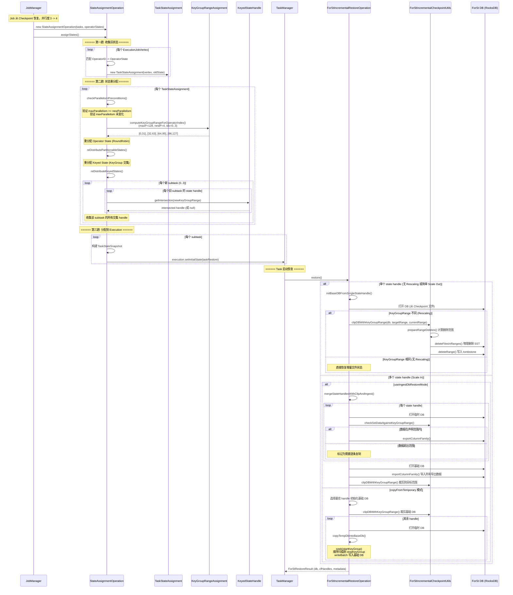
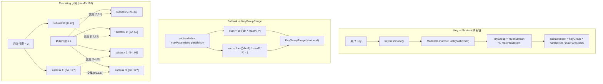
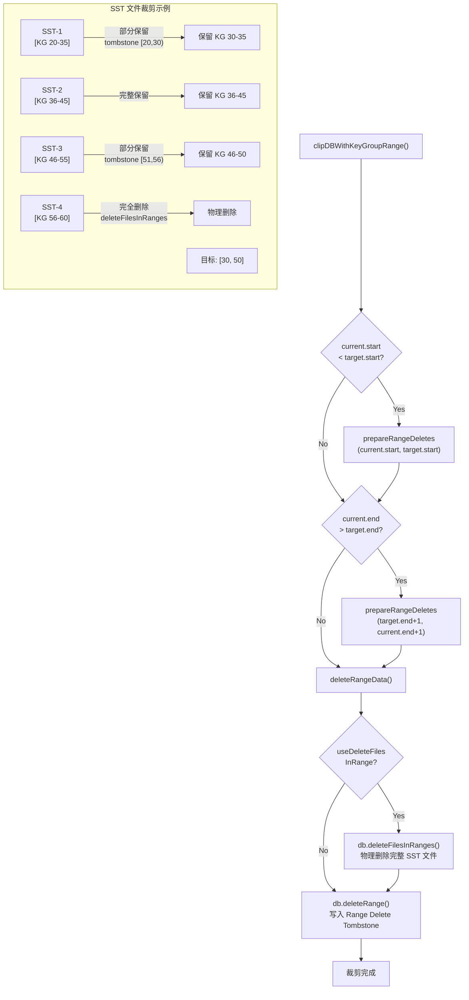

# Flink KeyGroup 重分配与 Rescaling 机制深度分析

## 0. 文档元数据
- **文档 ID**: 1.13
- **状态**: completed
- **依赖**: [1.4 Flink 2.2 StateBackend API 分析](./1.4_flink22_statebackend_api.md)
- **最后更新**: 2026-04-19
- **源码仓库**: `~/code/baidu/bce-bmr/flink-src` (分支 `bmr-2.1.0`)

---

## 1. Context

Flink 的有状态算子在并行度变更（Scale In/Out）时，需要将旧并行度下各 subtask 持有的 Keyed State 重新分配到新并行度下的各 subtask。这一过程称为 **Rescaling**。其核心抽象是 **KeyGroup** -- 一种将 key 空间预先划分为固定数量分区的机制，使得 Rescaling 只需按 KeyGroup 粒度重分配，而无需逐条记录迁移。

本文档从源码层面深入分析：
1. **KeyGroupRangeAssignment** -- hash 函数和 KeyGroup 到 subtask 的映射公式
2. **StateAssignmentOperation** -- Rescaling 完整流程
3. **ForStIncrementalCheckpointUtils.clipDBWithKeyGroupRange()** -- SST 裁剪
4. **对 ForSt-RS 的接口约束**

---

## 2. 源码证据

### 2.1 关键文件清单

| 分类 | 文件路径 | 说明 |
|------|---------|------|
| **KeyGroup 范围** | `flink-runtime/.../state/KeyGroupRange.java` | KeyGroup 连续范围表示 [start, end] |
| **分配算法** | `flink-runtime/.../state/KeyGroupRangeAssignment.java` | hash 函数 + KeyGroup/subtask 映射公式 |
| **状态分配操作** | `flink-runtime/.../checkpoint/StateAssignmentOperation.java` | Checkpoint 恢复时的状态重分配主逻辑 |
| **SST 裁剪** | `flink-statebackend-forst/.../ForStIncrementalCheckpointUtils.java` | ForSt DB 按 KeyGroup 裁剪 |
| **增量恢复** | `flink-statebackend-forst/.../restore/ForStIncrementalRestoreOperation.java` | ForSt 增量 Checkpoint 恢复完整流程 |
| **Hash 函数** | `flink-core/.../util/MathUtils.java` | murmurHash 实现 |
| **Key 序列化** | `flink-runtime/.../state/CompositeKeySerializationUtils.java` | KeyGroup 前缀序列化/反序列化 |

---

## 3. 发现

### 3.1 KeyGroup 概念模型

KeyGroup 是 Flink 将 key 空间划分为固定数量分区的抽象单元。其设计目标是：

1. **预分区**: 在 Job 启动时，key 空间被预分为 `maxParallelism` 个 KeyGroup（编号 0 ~ maxParallelism-1）
2. **连续分配**: 每个 subtask 负责一段**连续**的 KeyGroup 范围 `[start, end]`
3. **Rescaling 友好**: 并行度变更时只需重新计算每个 subtask 的 KeyGroup 范围边界，KeyGroup 本身不变

```
maxParallelism = 128, parallelism = 4 时：

subtask 0: KeyGroup [0,   31]   (32 个)
subtask 1: KeyGroup [32,  63]   (32 个)
subtask 2: KeyGroup [64,  95]   (32 个)
subtask 3: KeyGroup [96, 127]   (32 个)

Scale Out 到 parallelism = 8 时：

subtask 0: KeyGroup [0,   15]   (16 个)
subtask 1: KeyGroup [16,  31]   (16 个)
subtask 2: KeyGroup [32,  47]   (16 个)
...
subtask 7: KeyGroup [112, 127]  (16 个)
```

关键约束：**maxParallelism 一旦设定不可更改**，因为它决定了 KeyGroup 总数和 hash 映射。

### 3.2 KeyGroupRangeAssignment -- 计算公式详解

#### 3.2.1 Key -> KeyGroup 映射 (hash 函数)

```
KeyGroup = murmurHash(key.hashCode()) % maxParallelism
```

源码 (`KeyGroupRangeAssignment.java:63-77`):

```java
public static int assignToKeyGroup(Object key, int maxParallelism) {
    return computeKeyGroupForKeyHash(key.hashCode(), maxParallelism);
}

public static int computeKeyGroupForKeyHash(int keyHash, int maxParallelism) {
    return MathUtils.murmurHash(keyHash) % maxParallelism;
}
```

**murmurHash 实现** (`MathUtils.java:137-155`):

```java
public static int murmurHash(int code) {
    code *= 0xcc9e2d51;
    code = Integer.rotateLeft(code, 15);
    code *= 0x1b873593;
    code = Integer.rotateLeft(code, 13);
    code = code * 5 + 0xe6546b64;
    code ^= 4;
    code = bitMix(code);          // Murmur3 32-bit finalizer
    // 保证返回非负值
    if (code >= 0) return code;
    else if (code != Integer.MIN_VALUE) return -code;
    else return 0;
}
```

这是 MurmurHash3 的 32 位 finalizer 变体。对 `key.hashCode()` 做二次 hash 的原因是：Java 对象的 `hashCode()` 分布可能不均匀，murmurHash 具有完全雪崩（full avalanche）特性，确保 KeyGroup 分配均匀。

**关键性质**:
- 输入: 任意 int (key.hashCode())
- 输出: [0, maxParallelism) 范围内的非负整数
- 确定性: 相同的 key 始终映射到相同的 KeyGroup（无论并行度如何变化）

#### 3.2.2 KeyGroup -> Subtask 映射

```
subtaskIndex = keyGroupId * parallelism / maxParallelism
```

源码 (`KeyGroupRangeAssignment.java:124-127`):

```java
public static int computeOperatorIndexForKeyGroup(
        int maxParallelism, int parallelism, int keyGroupId) {
    return keyGroupId * parallelism / maxParallelism;
}
```

这是一个**整数除法**（向下取整），保证了：
- 每个 subtask 被分配**连续**的 KeyGroup 范围
- KeyGroup 分配尽可能均匀（差异最多 1 个）

#### 3.2.3 Subtask -> KeyGroupRange 映射 (逆向计算)

给定 subtask index，计算其负责的 KeyGroup 范围 `[start, end]`:

```
start = (operatorIndex * maxParallelism + parallelism - 1) / parallelism
end   = ((operatorIndex + 1) * maxParallelism - 1) / parallelism
```

源码 (`KeyGroupRangeAssignment.java:93-106`):

```java
public static KeyGroupRange computeKeyGroupRangeForOperatorIndex(
        int maxParallelism, int parallelism, int operatorIndex) {
    int start = ((operatorIndex * maxParallelism + parallelism - 1) / parallelism);
    int end = ((operatorIndex + 1) * maxParallelism - 1) / parallelism;
    return new KeyGroupRange(start, end);
}
```

**公式推导**:

`start` 公式是 `ceil(operatorIndex * maxParallelism / parallelism)` 的整数版本:
- `ceil(a/b) = (a + b - 1) / b` (整数向上取整)
- 即 `start = ceil(operatorIndex * maxParallelism / parallelism)`

`end` 公式是 `floor(((operatorIndex + 1) * maxParallelism - 1) / parallelism)`:
- 等价于 `(operatorIndex + 1) * maxParallelism / parallelism - 1` 在连续情况下
- 确保不同 subtask 的范围恰好相邻且无重叠

**数值验证** (maxParallelism=128, parallelism=3):
| subtaskIndex | start 计算 | end 计算 | KeyGroupRange | 数量 |
|:---:|:---|:---|:---|:---:|
| 0 | ceil(0*128/3) = 0 | floor((1*128-1)/3) = 42 | [0, 42] | 43 |
| 1 | ceil(1*128/3) = 43 | floor((2*128-1)/3) = 85 | [43, 85] | 43 |
| 2 | ceil(2*128/3) = 86 | floor((3*128-1)/3) = 127 | [86, 127] | 42 |

总计 43 + 43 + 42 = 128，覆盖完整 KeyGroup 空间。

#### 3.2.4 maxParallelism 默认值计算

当用户未显式配置 maxParallelism 时，Flink 自动计算默认值:

```
defaultMaxParallelism = min(
    max(roundUpToPowerOfTwo(parallelism * 1.5), 128),
    32768
)
```

源码 (`KeyGroupRangeAssignment.java:137-147`):

```java
public static int computeDefaultMaxParallelism(int operatorParallelism) {
    return Math.min(
        Math.max(
            MathUtils.roundUpToPowerOfTwo(
                operatorParallelism + (operatorParallelism / 2)),
            DEFAULT_LOWER_BOUND_MAX_PARALLELISM),  // 128
        UPPER_BOUND_MAX_PARALLELISM);              // 32768 (1 << 15)
}
```

**设计考量**:
- **下界 128**: 即使 parallelism=1，也预留 128 个 KeyGroup，允许后续扩容到 128 并行度
- **上界 32768 (Short.MAX_VALUE + 1)**: 避免整数溢出（公式中有 `keyGroupId * parallelism` 的乘法）
- **1.5 倍**: 允许用户在不修改 maxParallelism 的情况下扩容约 50%
- **向上取整到 2 的幂**: 优化 hash 分布

#### 3.2.5 KeyGroup 前缀字节数

KeyGroup ID 作为 RocksDB key 的前缀，其字节数取决于 maxParallelism:

```java
// CompositeKeySerializationUtils.java:169-171
public static int computeRequiredBytesInKeyGroupPrefix(int totalKeyGroupsInJob) {
    return totalKeyGroupsInJob > (Byte.MAX_VALUE + 1) ? 2 : 1;
}
```

- maxParallelism <= 128: 1 字节前缀
- maxParallelism > 128: 2 字节前缀

序列化方式为大端序（Big-Endian），确保 KeyGroup 前缀在字典序下有序:

```java
// CompositeKeySerializationUtils.java:157-163
public static void serializeKeyGroup(int keyGroup, byte[] startKeyGroupPrefixBytes) {
    final int keyGroupPrefixBytes = startKeyGroupPrefixBytes.length;
    for (int j = 0; j < keyGroupPrefixBytes; ++j) {
        startKeyGroupPrefixBytes[j] =
            extractByteAtPosition(keyGroup, keyGroupPrefixBytes - j - 1);
    }
}
```

### 3.3 StateAssignmentOperation -- Rescaling 完整流程

`StateAssignmentOperation` 是 Flink Checkpoint 恢复时的状态重分配入口。当 Job 从 Checkpoint/Savepoint 恢复且并行度发生变化时，此类负责将旧 subtask 的状态按新的 KeyGroup 范围重新分配。

#### 3.3.1 核心流程

`assignStates()` 方法执行三趟（Three-Pass）处理:

**第一趟 -- 收集旧状态与构建映射**:
```
for each ExecutionJobVertex:
    1. 根据 OperatorID 查找旧 OperatorState
    2. 创建 TaskStateAssignment（封装旧状态 + 新并行度信息）
    3. 建立 producer -> consumer 的映射关系
```

**第二趟 -- 状态重分配 (repartition)**:
```
for each TaskStateAssignment:
    if hasNonFinishedState || hasUpstreamOutputStates || hasDownstreamInputStates:
        assignAttemptState(stateAssignment)
```

**第三趟 -- 实际分配到 Execution**:
```
for each TaskStateAssignment:
    assignTaskStateToExecutionJobVertices(stateAssignment)
        -> 为每个 subtask 构建 TaskStateSnapshot
        -> 设置到 Execution.setInitialState()
```

#### 3.3.2 assignAttemptState -- 状态重分配核心

`assignAttemptState()` 是 Rescaling 的核心方法，处理四类状态:

```java
private void assignAttemptState(TaskStateAssignment taskStateAssignment) {
    // 1. 检查并行度前置条件
    checkParallelismPreconditions(taskStateAssignment);

    // 2. 计算新的 KeyGroup 分区
    List<KeyGroupRange> keyGroupPartitions = createKeyGroupPartitions(
        maxParallelism, newParallelism);

    // 3. 重分配 Managed Operator State (RoundRobin 策略)
    reDistributePartitionableStates(..., RoundRobinOperatorStateRepartitioner.INSTANCE, ...);

    // 4. 重分配 Raw Operator State (RoundRobin 策略)
    reDistributePartitionableStates(..., RoundRobinOperatorStateRepartitioner.INSTANCE, ...);

    // 5. 重分配 Input Channel State (基于 SubtaskStateMapper)
    reDistributeInputChannelStates(taskStateAssignment);

    // 6. 重分配 Result Subpartition State (基于输出映射)
    reDistributeResultSubpartitionStates(taskStateAssignment);

    // 7. 重分配 Keyed State (基于 KeyGroup 范围交集)
    reDistributeKeyedStates(keyGroupPartitions, taskStateAssignment);
}
```

#### 3.3.3 reDistributeKeyedStates -- Keyed State 重分配

Keyed State 的重分配是 Rescaling 最关键的部分:

```java
private void reDistributeKeyedStates(
        List<KeyGroupRange> keyGroupPartitions,
        TaskStateAssignment stateAssignment) {
    stateAssignment.oldState.forEach((operatorID, operatorState) -> {
        for (int subTaskIndex = 0; subTaskIndex < newParallelism; subTaskIndex++) {
            // 对每个新 subtask，收集与其 KeyGroupRange 有交集的旧状态句柄
            Tuple2<List<KeyedStateHandle>, List<KeyedStateHandle>> subKeyedStates =
                reAssignSubKeyedStates(
                    operatorState,
                    keyGroupPartitions,
                    subTaskIndex,
                    newParallelism,
                    oldParallelism);
            // 分别存储 Managed 和 Raw Keyed State
            stateAssignment.subManagedKeyedState.put(instanceID, subKeyedStates.f0);
            stateAssignment.subRawKeyedState.put(instanceID, subKeyedStates.f1);
        }
    });
}
```

**重分配逻辑**:

```java
private Tuple2<...> reAssignSubKeyedStates(...) {
    if (newParallelism == oldParallelism) {
        // 无 Rescaling：直接取原 subtask 的状态
        return operatorState.getState(subTaskIndex).getManagedKeyedState();
    } else {
        // 有 Rescaling：收集所有旧 subtask 中与新 KeyGroupRange 有交集的状态
        subManagedKeyedState = getManagedKeyedStateHandles(
            operatorState, keyGroupPartitions.get(subTaskIndex));
        subRawKeyedState = getRawKeyedStateHandles(
            operatorState, keyGroupPartitions.get(subTaskIndex));
    }
}
```

**extractIntersectingState** -- 交集提取:

```java
public static void extractIntersectingState(
        Collection<? extends KeyedStateHandle> originalSubtaskStateHandles,
        KeyGroupRange rangeToExtract,
        List<KeyedStateHandle> extractedStateCollector) {
    for (KeyedStateHandle keyedStateHandle : originalSubtaskStateHandles) {
        if (keyedStateHandle != null) {
            // 调用 KeyedStateHandle.getIntersection() 获取交集视图
            KeyedStateHandle intersected = keyedStateHandle.getIntersection(rangeToExtract);
            if (intersected != null) {
                extractedStateCollector.add(intersected);
            }
        }
    }
}
```

这个方法遍历所有旧 subtask 的所有 state handle，对每个 handle 调用 `getIntersection(newRange)` 获取交集。`getIntersection()` 不会复制数据，而是创建一个**视图**，引用原始数据中属于目标 KeyGroup 范围的部分。

#### 3.3.4 并行度前置条件检查

```java
private static void checkParallelismPreconditions(
        OperatorState operatorState, ExecutionJobVertex executionJobVertex) {
    // 1. 新并行度不能超过 maxParallelism
    if (operatorState.getMaxParallelism() < executionJobVertex.getParallelism()) {
        throw new IllegalStateException(
            "maxParallelism (" + operatorState.getMaxParallelism()
            + ") < parallelism (" + executionJobVertex.getParallelism() + ")");
    }

    // 2. maxParallelism 必须匹配（或可以 rescale）
    if (operatorState.getMaxParallelism() != executionJobVertex.getMaxParallelism()) {
        if (executionJobVertex.canRescaleMaxParallelism(...)) {
            executionJobVertex.setMaxParallelism(operatorState.getMaxParallelism());
        } else {
            throw new IllegalStateException("maxParallelism changed, not supported");
        }
    }
}
```

**关键约束**: `maxParallelism` 一旦在 Checkpoint 中固化，恢复时必须保持一致。这是因为 `maxParallelism` 决定了 KeyGroup 数量，而 KeyGroup 的分配是确定性的 -- 改变 `maxParallelism` 会导致所有 key 的 KeyGroup 映射失效。

### 3.4 ForSt SST 裁剪 -- clipDBWithKeyGroupRange

当 Rescaling 发生时，从旧 Checkpoint 恢复的 ForSt DB 可能包含不属于新 subtask KeyGroup 范围的数据。`clipDBWithKeyGroupRange()` 通过 RocksDB 的 Range Delete 高效删除这些多余数据。

#### 3.4.1 裁剪原理

```java
public static void clipDBWithKeyGroupRange(
        RocksDB db,
        List<ColumnFamilyHandle> columnFamilyHandles,
        KeyGroupRange targetKeyGroupRange,       // 新 subtask 的 KeyGroup 范围
        KeyGroupRange currentKeyGroupRange,      // 当前 DB 的 KeyGroup 范围
        int keyGroupPrefixBytes,
        boolean useDeleteFilesInRange) throws RocksDBException {

    List<byte[]> deleteFilesRanges = new ArrayList<>(4);

    // 裁剪左侧（低于目标范围的 KeyGroup）
    if (currentKeyGroupRange.getStartKeyGroup() < targetKeyGroupRange.getStartKeyGroup()) {
        prepareRangeDeletes(keyGroupPrefixBytes,
            currentKeyGroupRange.getStartKeyGroup(),
            targetKeyGroupRange.getStartKeyGroup(),
            deleteFilesRanges);
    }

    // 裁剪右侧（高于目标范围的 KeyGroup）
    if (currentKeyGroupRange.getEndKeyGroup() > targetKeyGroupRange.getEndKeyGroup()) {
        prepareRangeDeletes(keyGroupPrefixBytes,
            targetKeyGroupRange.getEndKeyGroup() + 1,
            currentKeyGroupRange.getEndKeyGroup() + 1,
            deleteFilesRanges);
    }

    deleteRangeData(db, columnFamilyHandles, deleteFilesRanges, useDeleteFilesInRange);
}
```

**视觉示例**:

```
旧 KeyGroupRange: [20, 60]     currentKeyGroupRange
新 KeyGroupRange: [30, 50]     targetKeyGroupRange

需要删除:
  左侧: [20, 30)   <- prepareRangeDeletes(20, 30)
  右侧: [51, 61)   <- prepareRangeDeletes(51, 61)

                 currentKeyGroupRange
       |<--------- [20 ... 60] ---------->|
                |<--- target --->|
                [30 ... ... ... 50]
       |DELETE  |    KEEP       |  DELETE  |
       [20, 30)                  [51, 61)
```

#### 3.4.2 Range Delete 操作

```java
private static void deleteRangeData(
        RocksDB db,
        List<ColumnFamilyHandle> columnFamilyHandles,
        List<byte[]> deleteRanges,
        boolean useDeleteFilesInRange) throws RocksDBException {

    for (ColumnFamilyHandle columnFamilyHandle : columnFamilyHandles) {
        // Step 1: 如果启用，先删除整个范围内的 SST 文件（物理删除，快速释放空间）
        if (useDeleteFilesInRange) {
            db.deleteFilesInRanges(columnFamilyHandle, deleteRanges, false);
        }

        // Step 2: 放置 Range Delete Tombstone（逻辑删除，确保正确性）
        for (int i = 0; i < deleteRanges.size() / 2; i++) {
            db.deleteRange(columnFamilyHandle,
                deleteRanges.get(i * 2),       // beginKey (inclusive)
                deleteRanges.get(i * 2 + 1));  // endKey (exclusive)
        }
    }
}
```

**两步删除策略**:
1. `deleteFilesInRanges`: 物理删除整个 SST 文件（如果文件 key 范围完全在删除范围内），**立即释放磁盘空间**
2. `deleteRange`: 写入 Range Delete Tombstone，确保 SST 文件中跨越范围边界的记录也被正确删除

#### 3.4.3 SST 数据范围检查

在使用 Ingest DB 恢复模式时，需要验证 SST 文件中的实际数据是否在 KeyGroup 声明范围内:

```java
public static RangeCheckResult checkSstDataAgainstKeyGroupRange(
        RocksDB db, int keyGroupPrefixBytes, KeyGroupRange dbExpectedKeyGroupRange) {
    // 序列化期望的 KeyGroup 范围边界
    byte[] beginKeyGroupBytes = serialize(dbExpectedKeyGroupRange.getStartKeyGroup());
    byte[] endKeyGroupBytes = serialize(dbExpectedKeyGroupRange.getEndKeyGroup() + 1);

    // 获取 DB 中所有 SST 文件的实际 key 范围
    KeyRange dbKeyRange = getDBKeyRange(db);  // 遍历所有 LiveFileMetaData

    // 比较实际范围是否在声明范围内
    return RangeCheckResult.of(beginKeyGroupBytes, endKeyGroupBytes,
        dbKeyRange.minKey, dbKeyRange.maxKey, keyGroupPrefixBytes);
}
```

如果 SST 数据超出声明的 KeyGroup 范围（例如由于之前的 deleteRange tombstone 残留），则不能使用 Ingest 模式，需要回退到逐条复制模式。

#### 3.4.4 最佳初始状态句柄选择

恢复时如果有多个旧 subtask 的状态可用，需要选择"最佳"的作为基础 DB:

```java
public static <T extends KeyedStateHandle> int findTheBestStateHandleForInitial(
        List<T> restoreStateHandles,
        KeyGroupRange targetKeyGroupRange,
        double overlapFractionThreshold) {

    // 评分标准：
    // 1. 首先比较交集 KeyGroup 数量（越多越好）
    // 2. 然后比较重叠比例（越高越好）
    // 3. 重叠比例低于阈值的直接淘汰
    Score bestScore = Score.MIN;
    for (T handle : restoreStateHandles) {
        KeyGroupRange intersect = handle.getKeyGroupRange().getIntersection(targetKeyGroupRange);
        double overlapFraction = intersect.size() / handle.getKeyGroupRange().size();
        if (overlapFraction >= overlapFractionThreshold) {
            Score score = new Score(intersect.size(), overlapFraction);
            if (score > bestScore) bestScore = score;
        }
    }
}
```

### 3.5 ForSt 增量恢复完整流程

`ForStIncrementalRestoreOperation.restore()` 是 ForSt 从增量 Checkpoint 恢复的入口。它根据恢复场景选择不同的策略。

#### 3.5.1 恢复策略分支

```
restore()
  |
  +-- restoreStateHandles.size() == 1
  |     |
  |     +-- initBaseDBFromSingleStateHandle()
  |           |
  |           +-- keyGroupRange 相同 (无 Rescaling)
  |           |     -> 直接打开 DB，恢复增量文件状态
  |           |
  |           +-- keyGroupRange 不同 (Rescaling)
  |                 -> 打开 DB
  |                 -> clipDBWithKeyGroupRange() 裁剪多余 KeyGroup
  |
  +-- restoreStateHandles.size() > 1  (Scale In 或部分 Scale Out)
        |
        +-- useIngestDbRestoreMode = true
        |     -> mergeStateHandlesWithClipAndIngest()
        |        1. 打开每个旧 DB 为临时实例
        |        2. 检查 SST 数据是否在声明范围内
        |        3. 如果在范围内: export CF -> clip -> ingest 到基础 DB
        |        4. 如果超出范围: 回退到逐条复制
        |
        +-- useIngestDbRestoreMode = false
              -> mergeStateHandlesWithCopyFromTemporaryInstance()
                 1. 选择最佳 handle 初始化基础 DB + clip
                 2. 其余 handle 打开为临时 DB
                 3. 逐条复制目标 KeyGroup 范围内的数据到基础 DB
```

#### 3.5.2 逐条复制模式 (copyTempDbIntoBaseDb)

```java
private void copyTempDbIntoBaseDb(
        RestoredDBInstance tmpRestoreDBInfo,
        ForStDBWriteBatchWrapper writeBatchWrapper,
        byte[] startKeyGroupPrefixBytes,
        byte[] stopKeyGroupPrefixBytes) {

    for (each columnFamily) {
        try (ForStIteratorWrapper iterator = openIterator(tmpDB, cf)) {
            // seek 到目标 KeyGroup 范围的起始位置
            iterator.seek(startKeyGroupPrefixBytes);

            while (iterator.isValid()) {
                // 检查 key 是否仍在目标范围内
                if (beforeThePrefixBytes(iterator.key(), stopKeyGroupPrefixBytes)) {
                    writeBatchWrapper.put(targetCF, iterator.key(), iterator.value());
                } else {
                    break;  // 超出范围，因为 key 是有序的，直接终止
                }
                iterator.next();
            }
        }
    }
}
```

此方法利用了 RocksDB key 的有序性 -- KeyGroup 前缀按大端序排列，因此同一 KeyGroup 范围内的 key 是连续的，可以通过 seek + 顺序扫描高效读取。

---

## 4. 时序图

### 4.1 Rescaling 全流程时序图



### 4.2 KeyGroup 映射计算流程



### 4.3 ForSt SST 裁剪流程



---

## 5. KeyGroup 计算公式汇总

### 5.1 核心公式

| 公式名称 | 公式 | 含义 |
|---------|------|------|
| **Key -> KeyGroup** | `KG = murmurHash(key.hashCode()) % maxP` | 确定性映射，maxP 固定则结果不变 |
| **KeyGroup -> Subtask** | `idx = KG * P / maxP` (整数除法) | 给定 KG 找所属 subtask |
| **Subtask -> Range.start** | `start = ceil(idx * maxP / P)` | subtask 的 KG 范围下界 |
| **Subtask -> Range.end** | `end = floor(((idx+1) * maxP - 1) / P)` | subtask 的 KG 范围上界 |
| **默认 maxP** | `min(max(roundUp2(P*1.5), 128), 32768)` | 用户未配置时的默认值 |
| **KG 前缀字节** | `maxP > 128 ? 2 : 1` | RocksDB key 中 KG 前缀的字节数 |

其中：`maxP` = maxParallelism, `P` = parallelism, `KG` = KeyGroupId, `idx` = subtaskIndex

### 5.2 不变量

1. **映射确定性**: 相同的 key 在相同的 maxParallelism 下永远映射到相同的 KeyGroup
2. **范围连续性**: 每个 subtask 的 KeyGroupRange 是连续的 `[start, end]`
3. **范围互斥**: 不同 subtask 的 KeyGroupRange 互不重叠
4. **范围覆盖**: 所有 subtask 的 KeyGroupRange 合并后恰好覆盖 `[0, maxParallelism-1]`
5. **maxP 不可变**: maxParallelism 一旦在首次 Checkpoint 中固化，后续恢复时不可更改
6. **P <= maxP**: 并行度不能超过 maxParallelism

### 5.3 RocksDB Key 编码格式

```
+-------------------+------------------+-------------------+------------------+
| KeyGroup Prefix   | Serialized Key   | Serialized NS     | [User Key]       |
| (1 or 2 bytes)    | (variable)       | (variable)        | (MapState only)  |
| Big-Endian        | + opt. length    | + opt. length     |                  |
+-------------------+------------------+-------------------+------------------+
```

- **KeyGroup Prefix**: 大端序编码，确保相同 KeyGroup 的所有 key 在字典序下连续
- **Serialized Key**: Flink TypeSerializer 序列化结果
- **Serialized Namespace**: Flink TypeSerializer 序列化结果
- **ambiguousKeyPossible**: 当 key 和 namespace 都是变长类型时，额外追加长度字段以消除歧义

KeyGroup 前缀的大端序保证了裁剪操作的正确性：`seek(startKeyGroupPrefix)` 可以精确定位到目标范围的第一条记录。

---

## 6. 对 ForSt-RS 的接口约束

### 6.1 Rescaling 对存储引擎的要求

基于以上分析，ForSt-RS 在实现时必须支持以下 Rescaling 相关操作：

| 操作 | RocksDB 对应 API | 用途 | 优先级 |
|------|-----------------|------|--------|
| **Range Delete** | `db.deleteRange(cf, beginKey, endKey)` | 按 KeyGroup 范围裁剪 DB | 必须 |
| **Delete Files In Ranges** | `db.deleteFilesInRanges(cf, ranges, includeEnd)` | 物理删除整个 SST 文件以快速释放空间 | 高优 |
| **Live Files Metadata** | `db.getLiveFilesMetaData()` | 获取 SST 文件的 min/max key 用于范围检查 | 高优 |
| **Export Column Family** | `Checkpoint.exportColumnFamily(cf, path)` | Ingest DB 恢复模式下导出 CF | 中优 |
| **Import Column Family** | `db.createColumnFamilyWithImport(cf, metadata)` | Ingest DB 恢复模式下导入 CF | 中优 |
| **Iterator Seek** | `iterator.seek(keyGroupPrefix)` | 定位到 KeyGroup 范围起始位置 | 必须 |
| **Iterator Scan** | `iterator.isValid()` / `.key()` / `.value()` / `.next()` | 顺序扫描 KeyGroup 范围内的数据 | 必须 |
| **WriteBatch** | `writeBatch.put(cf, key, value)` | 批量写入从旧 DB 复制的数据 | 必须 |
| **Checkpoint** | `Checkpoint.create(db)` | 创建 DB 检查点用于导出 | 中优 |

### 6.2 Key 编码兼容性约束

ForSt-RS **必须**保持与现有 ForSt/RocksDB 完全一致的 Key 编码格式：

1. **KeyGroup 前缀**: 大端序、1 或 2 字节（取决于 maxParallelism）
2. **字典序排序**: SST 文件中的 key 必须按 unsigned byte 字典序排列
3. **前缀连续性**: 相同 KeyGroup 的所有 key 必须在排序中连续

这是因为 `clipDBWithKeyGroupRange` 和 `copyTempDbIntoBaseDb` 都依赖于 key 的字典序特性来进行范围操作。

### 6.3 Rescaling 恢复路径约束

ForSt-RS 需要支持以下恢复路径（按优先级排序）：

**必须支持 (Phase 1)**:
1. **无 Rescaling 恢复**: 直接打开 DB，KeyGroupRange 完全匹配
2. **单 Handle Rescaling**: 打开 DB + clipDBWithKeyGroupRange
3. **Copy-from-Temp 模式**: 从多个旧 DB 逐条复制数据到基础 DB

**高优支持 (Phase 2)**:
4. **Ingest DB 模式**: export/import + clip，性能优于逐条复制

### 6.4 与 1.4 文档的关联

参照 [1.4 Flink 2.2 StateBackend API](./1.4_flink22_statebackend_api.md) 第 3.6 节的最小接口集，Rescaling 额外要求以下 JNI 边界操作：

| 操作 | 1.4 文档已覆盖 | Rescaling 新增 |
|------|:---:|:---:|
| multiGet | Y | - |
| singleGet | Y | - |
| writeBatch.put/merge/delete | Y | - |
| newIterator + seek + scan | Y | - |
| **deleteRange** | - | Y |
| **deleteFilesInRanges** | - | Y |
| **getLiveFilesMetaData** | - | Y |
| **exportColumnFamily** | - | Y |
| **createColumnFamilyWithImport** | - | Y |

即 ForSt-RS 在 1.4 文档定义的 12 个核心 DB 操作基础上，还需额外实现 5 个 Rescaling 专用操作。

---

## 7. Open Questions

1. **Range Delete Tombstone 对性能的影响**: `clipDBWithKeyGroupRange` 写入的 tombstone 会在后续 compaction 中被清理，但在清理前可能影响读取性能。ForSt-RS 是否需要在裁剪后触发主动 compaction？

2. **Ingest DB 模式的兼容性**: 当前 Ingest DB 模式依赖 RocksDB 的 `Checkpoint.exportColumnFamily()` 和 `createColumnFamilyWithImport()`，这两个是 RocksDB 高级特性。ForSt-RS 初期可以不支持 Ingest 模式，仅支持 Copy-from-Temp 模式。

3. **overlapFractionThreshold 的调优**: 选择最佳初始 handle 时的重叠阈值是可配置的。在大规模 Rescaling 时（如 100 -> 200），阈值设置是否影响恢复时间？

4. **SST 数据范围检查的必要性**: `checkSstDataAgainstKeyGroupRange` 检查是为了处理 deleteRange tombstone 残留导致的范围超界。ForSt-RS 如果保证 compaction 后无残留 tombstone，是否可以简化此逻辑？

5. **maxParallelism 变更的可能性**: 当前 Flink 严格禁止 maxParallelism 变更。如果未来 Flink 支持 maxParallelism 变更（需要全量 key 重新 hash），ForSt-RS 需要提供全量数据遍历和重写能力。
