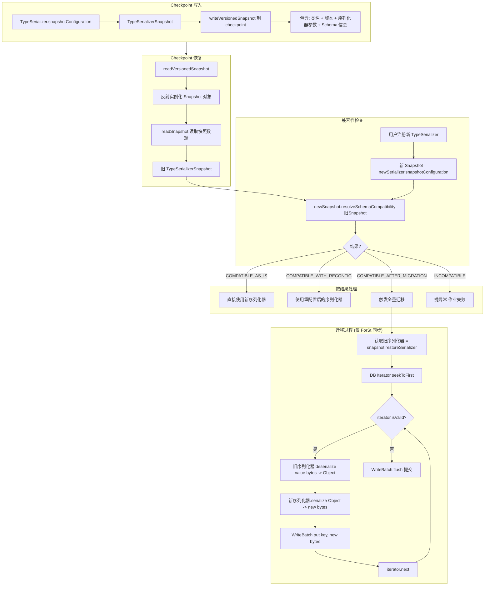
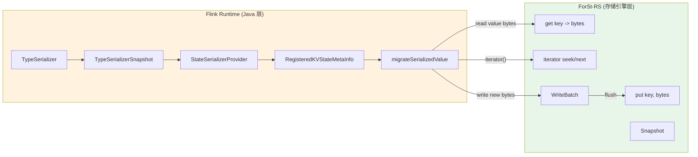

# Flink TypeSerializerSnapshot 与 Schema Evolution 机制深度分析

## 0. 文档元数据
- **文档 ID**: 1.14
- **状态**: completed
- **依赖**: 1.4 (Flink 2.2 StateBackend API 分析)
- **最后更新**: 2026-04-19
- **源码仓库**: `~/code/baidu/bce-bmr/flink-src` (分支 `bmr-2.1.0`)

---

## 1. Context

当用户升级 Flink 作业时，状态中存储的数据可能需要从旧的序列化格式迁移到新格式。Flink 通过 `TypeSerializerSnapshot` 机制实现了这一 Schema Evolution 能力。这套机制的核心设计思想是：**将 Schema 兼容性判定和数据迁移完全封装在 TypeSerializer 层，使 StateBackend 无需关心数据的语义格式。**

本文档从源码层面深入分析：
1. TypeSerializerSnapshot 的完整生命周期
2. `resolveSchemaCompatibility` 的 4 种判定结果及判定逻辑
3. Migration 时 StateBackend 的实际行为
4. **关键论证：为什么 ForSt-RS 不需要管 Schema Evolution**

---

## 2. 源码证据

### 2.1 关键文件清单

| 分类 | 文件路径 | 说明 |
|------|---------|------|
| **核心接口** | `flink-core/.../typeutils/TypeSerializerSnapshot.java` | Snapshot 接口定义 |
| **兼容性结果** | `flink-core/.../typeutils/TypeSerializerSchemaCompatibility.java` | 4 种兼容性结果 |
| **Provider** | `flink-runtime/.../state/StateSerializerProvider.java` | 序列化器提供者，桥接新旧序列化器 |
| **元信息** | `flink-runtime/.../state/RegisteredKeyValueStateBackendMetaInfo.java` | Keyed State 元信息 |
| **元信息快照** | `flink-runtime/.../state/metainfo/StateMetaInfoSnapshot.java` | 元信息序列化快照 |
| **Heap 恢复** | `flink-runtime/.../state/heap/HeapRestoreOperation.java` | Heap 后端 checkpoint 恢复 |
| **Heap Savepoint 恢复** | `flink-runtime/.../state/heap/HeapSavepointRestoreOperation.java` | Heap 后端 savepoint 恢复 |
| **全量快照恢复** | `flink-runtime/.../state/restore/FullSnapshotRestoreOperation.java` | 通用全量快照恢复 |
| **Heap 注册** | `flink-runtime/.../state/heap/HeapKeyedStateBackend.java` | Heap 后端状态注册与兼容性检查 |
| **ForSt 同步** | `flink-statebackend-forst/.../sync/ForStSyncKeyedStateBackend.java` | ForSt 同步后端（含完整迁移实现） |
| **ForSt 异步** | `flink-statebackend-forst/.../ForStKeyedStateBackend.java` | ForSt 异步后端（迁移未实现） |
| **ForSt 增量恢复** | `flink-statebackend-forst/.../restore/ForStIncrementalRestoreOperation.java` | ForSt 增量恢复 |
| **POJO Snapshot** | `flink-core/.../runtime/PojoSerializerSnapshot.java` | 典型的 Snapshot 实现示例 |

---

## 3. TypeSerializerSnapshot 完整生命周期

### 3.1 概念模型

`TypeSerializerSnapshot` 是序列化器在某一时刻的配置快照。它的三大职责是：

1. **捕获序列化器参数和 Schema** -- 记录序列化器的配置信息和数据格式
2. **兼容性检查** -- 判断新序列化器能否读取旧格式数据
3. **工厂功能** -- 在需要迁移时，从快照恢复能读取旧格式数据的序列化器

### 3.2 生命周期流程

```
=== Checkpoint 写入阶段 ===

TypeSerializer (当前)
  |
  +-- snapshotConfiguration()
        |
        +-- TypeSerializerSnapshot (创建快照)
              |
              +-- writeSnapshot(DataOutputView)   写入 checkpoint
              |     |
              |     包含:
              |       - Snapshot 类名 (writeVersionedSnapshot 写入)
              |       - Snapshot 版本号 (getCurrentVersion)
              |       - 序列化器参数/配置
              |       - Schema 信息
              |       - 嵌套序列化器的快照 (如 POJO 的字段序列化器)

=== Checkpoint 恢复阶段 ===

Checkpoint 二进制数据
  |
  +-- readVersionedSnapshot(DataInputView, ClassLoader)
        |
        +-- 1. 读取 Snapshot 类名
        +-- 2. 反射实例化 Snapshot 对象 (需要无参构造器)
        +-- 3. 读取版本号
        +-- 4. readSnapshot(version, DataInputView, ClassLoader) 读取快照数据
        |
        +-- TypeSerializerSnapshot (旧快照，从 checkpoint 恢复)

=== Schema 兼容性检查阶段 ===

新 TypeSerializer (用户作业中的)
  |
  +-- snapshotConfiguration()
        |
        +-- 新 TypeSerializerSnapshot
              |
              +-- resolveSchemaCompatibility(旧 TypeSerializerSnapshot)
                    |
                    +-- 返回 TypeSerializerSchemaCompatibility<T>
                          (4 种结果之一)

=== 按结果处理 ===

COMPATIBLE_AS_IS         -> 直接使用新序列化器
COMPATIBLE_WITH_RECONFIG -> 使用重配置后的序列化器
COMPATIBLE_AFTER_MIGRATION -> 迁移: 旧序列化器读 -> 新序列化器写
INCOMPATIBLE             -> 抛异常，作业恢复失败
```

### 3.3 TypeSerializerSnapshot 接口 (源码)

```java
// flink-core/.../TypeSerializerSnapshot.java
@PublicEvolving
public interface TypeSerializerSnapshot<T> {

    // 获取当前快照格式的版本号
    int getCurrentVersion();

    // 将快照序列化到输出流
    void writeSnapshot(DataOutputView out) throws IOException;

    // 从输入流反序列化快照
    void readSnapshot(int readVersion, DataInputView in, ClassLoader userCodeClassLoader)
            throws IOException;

    // 从快照恢复一个能读取旧格式数据的序列化器
    TypeSerializer<T> restoreSerializer();

    // 核心方法：检查当前序列化器与旧序列化器的 Schema 兼容性
    TypeSerializerSchemaCompatibility<T> resolveSchemaCompatibility(
            TypeSerializerSnapshot<T> oldSerializerSnapshot);
}
```

关键设计点：
- **`restoreSerializer()`**: 这是迁移的关键。它从旧快照中恢复一个序列化器，用于**读取旧格式的数据**。
- **`resolveSchemaCompatibility()`**: 由**新**的 Snapshot 调用，传入**旧**的 Snapshot，判定兼容性方向是 `new.resolve(old)`。

### 3.4 静态工具方法

```java
// 写入：类名 + 版本 + 快照数据
static void writeVersionedSnapshot(DataOutputView out, TypeSerializerSnapshot<?> snapshot) {
    out.writeUTF(snapshot.getClass().getName());  // 类名用于反射恢复
    out.writeInt(snapshot.getCurrentVersion());     // 版本号
    snapshot.writeSnapshot(out);                    // 实际数据
}

// 读取：反射实例化 + 读取版本 + 读取数据
static <T> TypeSerializerSnapshot<T> readVersionedSnapshot(DataInputView in, ClassLoader cl) {
    final TypeSerializerSnapshot<T> snapshot =
            TypeSerializerSnapshotSerializationUtil.readAndInstantiateSnapshotClass(in, cl);
    int version = in.readInt();
    snapshot.readSnapshot(version, in, cl);
    return snapshot;
}
```

---

## 4. resolveSchemaCompatibility 的 4 种判定结果

### 4.1 结果类型定义

```java
// flink-core/.../TypeSerializerSchemaCompatibility.java
enum Type {
    COMPATIBLE_AS_IS,                         // 完全兼容，直接使用
    COMPATIBLE_AFTER_MIGRATION,               // 需要全量迁移后兼容
    COMPATIBLE_WITH_RECONFIGURED_SERIALIZER,  // 需要重配置序列化器
    INCOMPATIBLE                              // 完全不兼容
}
```

### 4.2 各结果的语义与处理

#### 4.2.1 COMPATIBLE_AS_IS（完全兼容）

**含义**: 新序列化器可以直接读取旧格式数据，无需任何转换。

**触发条件示例**:
- 序列化器未发生任何变化
- 仅变更了不影响序列化格式的配置

**StateBackend 行为**: 无需任何操作，直接使用新序列化器。

#### 4.2.2 COMPATIBLE_WITH_RECONFIGURED_SERIALIZER（重配置兼容）

**含义**: 新序列化器需要从旧快照中吸收某些配置后才能兼容。

**触发条件示例**:
- POJO 类添加了新字段，序列化器需要知道旧字段的位置映射
- 嵌套序列化器的某些参数需要更新

**StateBackend 行为**: 使用 `getReconfiguredSerializer()` 获取重配置后的序列化器替换原始的。

**关键代码**:
```java
// StateSerializerProvider.LazilyRegisteredStateSerializerProvider
if (result.isCompatibleWithReconfiguredSerializer()) {
    this.registeredSerializer = result.getReconfiguredSerializer();
}
```

#### 4.2.3 COMPATIBLE_AFTER_MIGRATION（迁移后兼容）

**含义**: 新序列化器无法直接读取旧数据，但可以通过"旧序列化器读 -> 新序列化器写"的全量扫描迁移来实现兼容。

**触发条件示例**:
- POJO 类删除了字段
- 字段类型发生了变化但仍可转换
- 序列化格式本身发生了不兼容的变更

**StateBackend 行为**: **这是核心迁移场景**，需要执行全量数据转换。

**迁移过程（以 ForSt 同步后端为例）**:
```
1. 获取旧序列化器: snapshot.restoreSerializer()
2. 获取新序列化器: 用户注册的新序列化器
3. 全量扫描 DB:
   for each (key, oldValueBytes) in ColumnFamily:
     oldValue = oldSerializer.deserialize(oldValueBytes)  // 用旧序列化器反序列化
     newValueBytes = newSerializer.serialize(oldValue)     // 用新序列化器重新序列化
     db.put(key, newValueBytes)                            // 写回
```

#### 4.2.4 INCOMPATIBLE（不兼容）

**含义**: 新旧序列化器完全不兼容，无法进行迁移。

**触发条件示例**:
- Java 类完全变更（不同的 POJO 类）
- 序列化器类型完全不同

**StateBackend 行为**: 抛出 `StateMigrationException`，作业恢复失败。

### 4.3 判定逻辑的调用链

```
新 TypeSerializer
  |
  +-- snapshotConfiguration()
        |
        +-- 新 TypeSerializerSnapshot
              |
              +-- resolveSchemaCompatibility(旧 TypeSerializerSnapshot)
                    |
                    +-- 具体判定逻辑 (由各 Snapshot 实现决定)
                          |
                          例如 PojoSerializerSnapshot:
                          1. 检查 POJO 类是否相同 -> 不同则 INCOMPATIBLE
                          2. 检查注册子类快照是否完整 -> 缺失则 INCOMPATIBLE
                          3. 逐字段检查:
                             - 新字段: COMPATIBLE_AFTER_MIGRATION
                             - 删除字段: COMPATIBLE_AFTER_MIGRATION
                             - 字段序列化器变更: 递归检查
                          4. 汇总所有字段和子类的兼容性结果
```

### 4.4 PojoSerializerSnapshot 典型判定 (源码摘要)

```java
// PojoSerializerSnapshot.resolveSchemaCompatibility()
@Override
public TypeSerializerSchemaCompatibility<T> resolveSchemaCompatibility(
        TypeSerializerSnapshot<T> oldSerializerSnapshot) {

    if (!(oldSerializerSnapshot instanceof PojoSerializerSnapshot)) {
        return TypeSerializerSchemaCompatibility.incompatible();
    }

    // 1. 类必须相同
    if (previousPojoClass != snapshotData.getPojoClass()) {
        return TypeSerializerSchemaCompatibility.incompatible();
    }

    // 2. 注册子类快照必须完整
    if (registeredSubclassSerializerSnapshots.hasAbsentKeysOrValues()) {
        return TypeSerializerSchemaCompatibility.incompatible();
    }

    // 3. 逐字段检查兼容性
    // ... 字段增删 -> COMPATIBLE_AFTER_MIGRATION
    // ... 字段序列化器变更 -> 递归判定
}
```

---

## 5. StateSerializerProvider -- 桥接新旧序列化器

### 5.1 设计概述

`StateSerializerProvider` 是 Flink 运行时中管理序列化器生命周期的核心组件。它封装了新旧序列化器的绑定和兼容性检查逻辑。

### 5.2 双向工作模式

```
模式 A: 先有旧快照 (恢复路径)
  LazilyRegisteredStateSerializerProvider
    1. 创建时: 持有旧 TypeSerializerSnapshot
    2. 后续: 注册新序列化器 -> 检查兼容性

模式 B: 先有新序列化器 (注册路径)
  EagerlyRegisteredStateSerializerProvider
    1. 创建时: 持有新 TypeSerializer
    2. 后续: 设置旧快照 -> 检查兼容性
```

### 5.3 关键方法

```java
// 获取当前 schema 的序列化器 (用于读写当前数据)
TypeSerializer<T> currentSchemaSerializer()

// 获取旧 schema 的序列化器 (用于读取旧数据，仅在迁移时使用)
TypeSerializer<T> previousSchemaSerializer()
  -> 内部调用 previousSerializerSnapshot.restoreSerializer()

// 为恢复的状态注册新序列化器
TypeSerializerSchemaCompatibility<T> registerNewSerializerForRestoredState(
    TypeSerializer<T> newSerializer)
  -> 调用 newSerializer.snapshotConfiguration()
       .resolveSchemaCompatibility(previousSerializerSnapshot)
```

### 5.4 兼容性检查触发点

兼容性检查在两个时机触发：

**时机 1: 恢复阶段 -- Key 序列化器检查**

在 `HeapRestoreOperation.restore()` 和 `FullSnapshotRestoreOperation.readMetaData()` 中：

```java
TypeSerializerSchemaCompatibility<K> keySerializerSchemaCompat =
    keySerializerProvider.setPreviousSerializerSnapshotForRestoredState(
        serializationProxy.getKeySerializerSnapshot());

// Key 序列化器不支持 migration (因为 key 编码影响数据分区)
if (keySerializerSchemaCompat.isCompatibleAfterMigration()
        || keySerializerSchemaCompat.isIncompatible()) {
    throw new StateMigrationException("...");
}
```

**时机 2: 状态注册阶段 -- State/Namespace 序列化器检查**

在 `HeapKeyedStateBackend.tryRegisterStateTable()` 和 `ForStSyncKeyedStateBackend.updateRestoredStateMetaInfo()` 中：

```java
// Namespace 序列化器检查
TypeSerializerSchemaCompatibility<N> namespaceCompatibility =
    restoredKvMetaInfo.updateNamespaceSerializer(namespaceSerializer);
if (namespaceCompatibility.isCompatibleAfterMigration()
        || namespaceCompatibility.isIncompatible()) {
    throw new StateMigrationException("...");  // Namespace 不支持 migration
}

// State 序列化器检查
TypeSerializerSchemaCompatibility<SV> stateCompatibility =
    restoredKvMetaInfo.updateStateSerializer(newStateSerializer);
if (stateCompatibility.isCompatibleAfterMigration()) {
    migrateStateValues(stateDesc, stateMetaInfo);  // 触发全量迁移
} else if (stateCompatibility.isIncompatible()) {
    throw new StateMigrationException("...");
}
```

---

## 6. Migration 时各 StateBackend 的行为对比

### 6.1 Heap StateBackend

**对 State 序列化器的 Migration**: 支持，但实现简单。

Heap 后端将状态存储为 Java 对象 (`StateTable<K, N, V>`)，不涉及序列化/反序列化。因此：
- `COMPATIBLE_AFTER_MIGRATION` 时，Heap 后端直接抛 `StateMigrationException`
- Heap 后端依赖 savepoint 恢复路径（`HeapSavepointRestoreOperation`），在恢复时用旧序列化器反序列化，之后内存中就是 Java 对象
- 下次 checkpoint 时用新序列化器序列化即可

关键约束：**Key 序列化器和 Namespace 序列化器不支持 migration** -- 因为它们影响数据的分组和索引结构。

```java
// HeapKeyedStateBackend.tryRegisterStateTable() 行 236-243
TypeSerializerSchemaCompatibility<N> namespaceCompatibility =
    restoredKvMetaInfo.updateNamespaceSerializer(namespaceSerializer);
if (namespaceCompatibility.isCompatibleAfterMigration()
        || namespaceCompatibility.isIncompatible()) {
    throw new StateMigrationException(
        "For heap backends, the new namespace serializer must be compatible...");
}
```

### 6.2 ForSt 同步后端 (ForStSyncKeyedStateBackend)

**对 State 序列化器的 Migration**: 完整支持，通过全量扫描 + 重写实现。

```java
// ForStSyncKeyedStateBackend.migrateStateValues() 行 747-825
private <N, S extends State, SV> void migrateStateValues(
        StateDescriptor<S, SV> stateDesc,
        Tuple2<ColumnFamilyHandle, RegisteredKeyValueStateBackendMetaInfo<N, SV>> stateMetaInfo)
        throws Exception {

    // 对于 MapState，额外检查 key schema 兼容性
    // (MapState 只允许 value schema 变更，不允许 key schema 变更)
    if (stateDesc.getType() == StateDescriptor.Type.MAP) {
        if (!checkMapStateKeySchemaCompatibility(...)) {
            throw new StateMigrationException("...");
        }
    }

    // 核心迁移逻辑：全量扫描 + 重写
    State state = createState(stateDesc, stateMetaInfo);
    AbstractForStSyncState<?, ?, SV> forstState = (AbstractForStSyncState<?, ?, SV>) state;

    Snapshot forstSnapshot = db.getSnapshot();  // 创建一致性快照
    try (ForStIteratorWrapper iterator = getForStIterator(db, stateMetaInfo.f0, readOptions);
         ForStDBWriteBatchWrapper batchWriter = new ForStDBWriteBatchWrapper(db, ...)) {

        iterator.seekToFirst();
        DataInputDeserializer serializedValueInput = new DataInputDeserializer();
        DataOutputSerializer migratedSerializedValueOutput = new DataOutputSerializer(512);

        while (iterator.isValid()) {
            serializedValueInput.setBuffer(iterator.value());

            // 关键: 用旧序列化器读，用新序列化器写
            forstState.migrateSerializedValue(
                serializedValueInput,
                migratedSerializedValueOutput,
                stateMetaInfo.f1.getPreviousStateSerializer(),  // 旧序列化器
                stateMetaInfo.f1.getStateSerializer());          // 新序列化器

            batchWriter.put(stateMetaInfo.f0, iterator.key(),
                migratedSerializedValueOutput.getCopyOfBuffer());

            migratedSerializedValueOutput.clear();
            iterator.next();
        }
    } finally {
        db.releaseSnapshot(forstSnapshot);
    }
}
```

**迁移流程分解**:
1. 获取 DB 一致性快照 (`db.getSnapshot()`)
2. 创建 ColumnFamily 迭代器 (`seekToFirst()`)
3. 遍历每个 KV 条目:
   - 用**旧序列化器** (`getPreviousStateSerializer()`) 反序列化 value bytes 为 Java 对象
   - 用**新序列化器** (`getStateSerializer()`) 重新序列化 Java 对象为 value bytes
   - **Key 不变**，只重写 Value
4. 通过 `WriteBatch` 批量写回 DB
5. 释放快照

**关键观察**:
- **Key 不参与迁移**: Key 编码格式 (`[KeyGroup][Key][Namespace][UserKey]`) 不变
- **只迁移 Value**: 迁移的本质是 `oldSerializer.deserialize(bytes) -> newSerializer.serialize(object)`
- **ForSt 只提供遍历和批量写入能力**: DB 本身不关心 Value 的语义格式

### 6.3 ForSt 异步后端 (ForStKeyedStateBackend)

**对 State 序列化器的 Migration**: 尚未实现。

```java
// ForStKeyedStateBackend 行 473-477
if (!stateSerializer.equals(previousStateSerializer)
        && newStateSerializerCompatibility.isCompatibleAfterMigration()) {
    // TODO: 2024/6/6 wangfeifan - Implement state migration
    throw new UnsupportedOperationException("State migration not support yet.");
}
```

这意味着 ForSt 异步后端（Flink 2.x 的主路径）目前不支持 Schema Evolution migration。当遇到需要迁移的情况时会直接抛异常。

---

## 7. Checkpoint 中 Schema 信息的存储结构

### 7.1 元信息层次

```
Checkpoint/Savepoint 二进制文件
  |
  +-- KeyedBackendSerializationProxy (序列化代理)
        |
        +-- Key Serializer Snapshot      -- Key 的序列化器快照
        +-- 压缩标志
        +-- List<StateMetaInfoSnapshot>  -- 每个注册状态的元信息快照
              |
              +-- StateMetaInfoSnapshot[0]
              |     +-- name: "myValueState"
              |     +-- backendStateType: KEY_VALUE
              |     +-- options: {KEYED_STATE_TYPE: "VALUE"}
              |     +-- serializerSnapshots:
              |     |     NAMESPACE_SERIALIZER -> TypeSerializerSnapshot (namespace)
              |     |     VALUE_SERIALIZER -> TypeSerializerSnapshot (state value)
              |     +-- serializers: (备用)
              |
              +-- StateMetaInfoSnapshot[1]
              |     +-- name: "myMapState"
              |     +-- ...
              +-- ...
```

### 7.2 恢复时的元信息重建

```
Checkpoint 读取
  |
  +-- KeyedBackendSerializationProxy.read(inView)
        |
        +-- 读取 Key Serializer Snapshot
        +-- 读取每个 StateMetaInfoSnapshot
              |
              +-- StateMetaInfoSnapshot 构造
                    |
                    +-- RegisteredKeyValueStateBackendMetaInfo(snapshot)
                          |
                          +-- StateSerializerProvider.fromPreviousSerializerSnapshot(
                          |       snapshot.getTypeSerializerSnapshot(NAMESPACE_SERIALIZER))
                          +-- StateSerializerProvider.fromPreviousSerializerSnapshot(
                          |       snapshot.getTypeSerializerSnapshot(VALUE_SERIALIZER))
                          |
                          此时只有旧快照，没有新序列化器
                          |
                          等待 registerNewSerializerForRestoredState() 被调用
```

---

## 8. 关键论证：为什么 ForSt-RS 不需要管 Schema Evolution

### 8.1 论证链

```
前提 1: Flink 在 TypeSerializer 层处理 Schema 兼容性
  |-- TypeSerializerSnapshot.resolveSchemaCompatibility() 在 Flink Runtime 层执行
  |-- 判定逻辑完全由序列化器的 Snapshot 实现决定
  |-- 与 StateBackend 存储引擎无关
  |
前提 2: StateBackend 存储 opaque bytes
  |-- ForSt DB 中存储的是 key bytes 和 value bytes
  |-- DB 不解释、不解析这些 bytes 的含义
  |-- 序列化/反序列化完全在 Java 层的 ForStInnerTable 中完成
  |
前提 3: Migration 时 Flink 负责 read-old/write-new
  |-- 迁移过程: iterator.seekToFirst() -> 遍历 -> 旧序列化器读 -> 新序列化器写 -> put
  |-- ForSt DB 只提供: 遍历、读取、写入
  |-- 迁移的业务逻辑在 Java 层 (migrateSerializedValue)
  |
结论: ForSt-RS 只需支持"批量遍历 + 批量写入"
  |-- 不需要理解 value bytes 的格式
  |-- 不需要实现任何 Schema 相关逻辑
  |-- 只需保证 iterator/get/put/writeBatch 语义正确
```

### 8.2 逐层分析

#### 第一层：Schema 判定完全在 TypeSerializer 层

- `resolveSchemaCompatibility()` 在 `StateSerializerProvider` 中被调用
- 它操作的是 `TypeSerializerSnapshot` 对象，这些对象存在于 Flink Runtime 的 Java 堆中
- 整个判定过程不涉及任何 DB 操作
- ForSt-RS 对此过程完全透明

#### 第二层：StateBackend 存储 opaque bytes

ForSt 中的 KV 数据格式:
```
Key:   [KeyGroupPrefix(1-2B)] [SerializedKey] [SerializedNamespace] [UserKey(MapState)]
Value: [SerializedValue]  -- 由 TypeSerializer.serialize() 产生的 opaque bytes
```

ForSt DB 对这些 bytes 的处理:
- **写入**: `writeBatch.put(cfHandle, keyBytes, valueBytes)` -- 原样存储
- **读取**: `db.get(cfHandle, keyBytes) -> valueBytes` -- 原样返回
- **遍历**: `iterator.key() -> keyBytes, iterator.value() -> valueBytes` -- 原样返回

DB 层**从不解析**这些 bytes 的内部结构。bytes 的语义完全由 Java 层的序列化器处理。

#### 第三层：Migration 只需要 DB 的基础操作

从 `ForStSyncKeyedStateBackend.migrateStateValues()` 源码可以看出，迁移过程需要的 DB 操作是：

| 操作 | 用途 | ForSt-RS 需实现？ |
|------|------|------------------|
| `db.getSnapshot()` | 创建一致性视图 | 是（snapshot 语义） |
| `db.newIterator(cfHandle)` | 创建 ColumnFamily 迭代器 | 是 |
| `iterator.seekToFirst()` | 定位到第一个条目 | 是 |
| `iterator.isValid()` / `key()` / `value()` / `next()` | 遍历 | 是 |
| `WriteBatch.put(cfHandle, key, value)` | 写入新 value | 是 |
| `db.write(WriteOptions, WriteBatch)` | 提交写入 | 是 |
| `db.releaseSnapshot()` | 释放快照 | 是 |

这些操作全部是 ForSt-RS 作为 KV 存储引擎本来就需要实现的基础 API。**不需要为 Schema Evolution 添加任何额外接口。**

#### 第四层：Key 不参与迁移

一个非常重要的事实是：**Schema Evolution 只迁移 Value，不迁移 Key**。

```java
// migrateStateValues() 中:
while (iterator.isValid()) {
    // Key 原样保留
    byte[] key = iterator.key();

    // 只处理 Value
    forstState.migrateSerializedValue(
        serializedValueInput,       // 旧 value bytes
        migratedSerializedValueOutput, // 新 value bytes
        previousStateSerializer,    // 旧序列化器
        currentStateSerializer);    // 新序列化器

    // Key 不变，只更新 Value
    batchWriter.put(cfHandle, key, migratedSerializedValueOutput.getCopyOfBuffer());
    iterator.next();
}
```

这意味着：
- Key 编码格式 (`[KeyGroup][Key][Namespace][UserKey]`) **永远不变**
- Key 序列化器如果需要 migration，直接抛异常（不支持）
- Namespace 序列化器如果需要 migration，也直接抛异常
- 只有 Value 序列化器的 migration 被支持

ForSt-RS 不需要关心 Key 或 Value 的编码格式是否发生了变化。它只需要忠实地存储和返回 bytes。

### 8.3 异步后端的特殊情况

ForSt 异步后端（Flink 2.x 主路径）目前**根本不支持** State migration:

```java
// ForStKeyedStateBackend 行 473-477
if (newStateSerializerCompatibility.isCompatibleAfterMigration()) {
    // TODO: 2024/6/6 - Implement state migration
    throw new UnsupportedOperationException("State migration not support yet.");
}
```

即使未来异步后端实现了 migration，其实现模式也将是：
1. 使用 `iterator` 全量遍历 ColumnFamily
2. 在 Java 层执行序列化转换
3. 通过 `WriteBatch` 写回

这个模式与同步后端完全一致，ForSt-RS 不需要额外支持任何东西。

### 8.4 总结论证

```
+============================================================================+
|                                                                            |
|  ForSt-RS 不需要实现任何 Schema Evolution 相关逻辑                           |
|                                                                            |
|  原因:                                                                      |
|  1. Schema 兼容性判定在 TypeSerializer 层完成 (Java 堆内操作)                 |
|  2. DB 存储 opaque bytes，不解析数据格式                                     |
|  3. Migration 是 Java 层的 "旧序列化器读 -> 新序列化器写"                     |
|  4. DB 只需提供: 遍历 + 读取 + 批量写入                                      |
|  5. 这些都是 KV 存储引擎的基础 API                                           |
|                                                                            |
+============================================================================+
```

---

## 9. Schema Evolution 流程图

### 9.1 完整 Schema Evolution 流程



### 9.2 StateBackend 在 Schema Evolution 中的角色



---

## 10. ForSt-RS 接口要求

### 10.1 Schema Evolution 不增加额外接口

ForSt-RS 为支持（未来的）Schema Evolution migration，不需要实现任何超出基础 KV 引擎 API 的接口。以下是支持迁移所需的最小操作集（与正常运行时所需的完全相同）：

| 操作 | 方法签名 | 正常运行时需要？ | Migration 需要？ |
|------|---------|:---:|:---:|
| 打开 DB | `open(path, options)` | Y | Y |
| 读取 | `get(cfHandle, key) -> bytes` | Y | - |
| 批量读 | `multiGet(cfHandles, keys) -> List<bytes>` | Y | - |
| 创建 WriteBatch | `new WriteBatch()` | Y | Y |
| WriteBatch.put | `put(cfHandle, key, value)` | Y | Y |
| WriteBatch.flush | `db.write(WriteOptions, WriteBatch)` | Y | Y |
| 创建迭代器 | `newIterator(cfHandle)` | Y | Y |
| 迭代器操作 | `seek/seekToFirst/isValid/key/value/next` | Y | Y |
| 创建快照 | `getSnapshot()` | Y | Y |
| 释放快照 | `releaseSnapshot()` | Y | Y |
| 创建 ColumnFamily | `createColumnFamily(desc)` | Y | - |

**结论**: Migration 所需的操作是正常运行时操作的子集。ForSt-RS 的基础 API 设计天然支持 Schema Evolution。

### 10.2 需要注意的语义保证

虽然 ForSt-RS 不需要额外接口，但以下语义保证对迁移过程至关重要：

1. **Snapshot 一致性**: `getSnapshot()` 返回的快照必须提供一致性视图，迁移期间的新写入不能影响迭代器的遍历结果
2. **WriteBatch 原子性**: 迁移的所有写入通过单个或多个 WriteBatch 提交，需要保证 batch 内的原子性
3. **迭代器稳定性**: 在遍历过程中，迭代器必须能正确地从第一条记录遍历到最后一条
4. **ColumnFamily 隔离**: 迁移针对单个 ColumnFamily 进行，不影响其他 ColumnFamily

---

## 11. Open Questions

1. **异步后端 Migration 实现**: ForSt 异步后端标记了 `TODO: 2024/6/6 - Implement state migration`，当这个功能实现后，是否会引入新的 DB 操作需求？从源码分析来看不会，因为迁移的核心操作（遍历 + 重写）已被基础 API 覆盖。

2. **并行迁移**: 当前迁移是串行的（单线程遍历整个 ColumnFamily）。未来是否可能引入并行迁移（按 KeyGroup 分片并行执行）？如果是，ForSt-RS 需要支持按前缀范围创建迭代器（`seek(prefix)` + 前缀匹配停止条件），但这也是现有 API 已经支持的。

3. **迁移期间的可用性**: 迁移是阻塞式的，在状态首次被访问时触发。对于大状态，这可能导致长时间阻塞。这是 Flink 框架层的问题，与 ForSt-RS 无关。

---

## 12. 技术总结

| 维度 | 结论 |
|------|------|
| **Schema 判定层** | TypeSerializer / TypeSerializerSnapshot (Java 堆内) |
| **迁移执行层** | StateBackend Java 实现层 (migrateSerializedValue) |
| **存储引擎层** | 只提供 opaque bytes 的存取能力 |
| **ForSt-RS 责任** | 零 -- 无需任何 Schema 相关逻辑 |
| **ForSt-RS 需提供** | 标准 KV 引擎 API (get/put/iterate/writeBatch/snapshot) |
| **异步后端现状** | Migration 未实现 (抛 UnsupportedOperationException) |
| **同步后端现状** | 完整实现，通过 iterator + writeBatch 执行全量扫描迁移 |
