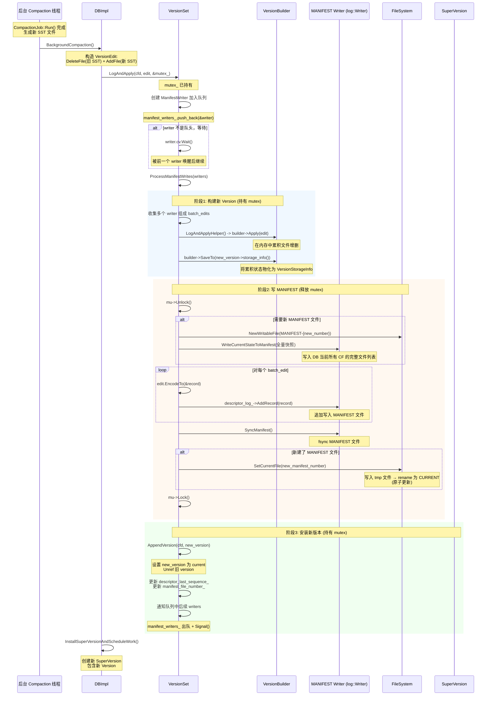
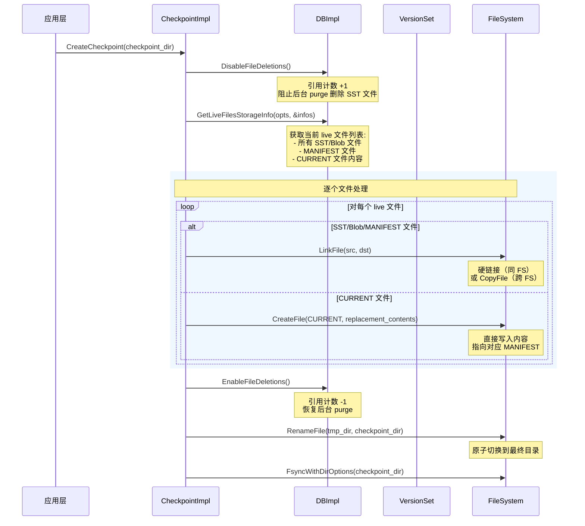
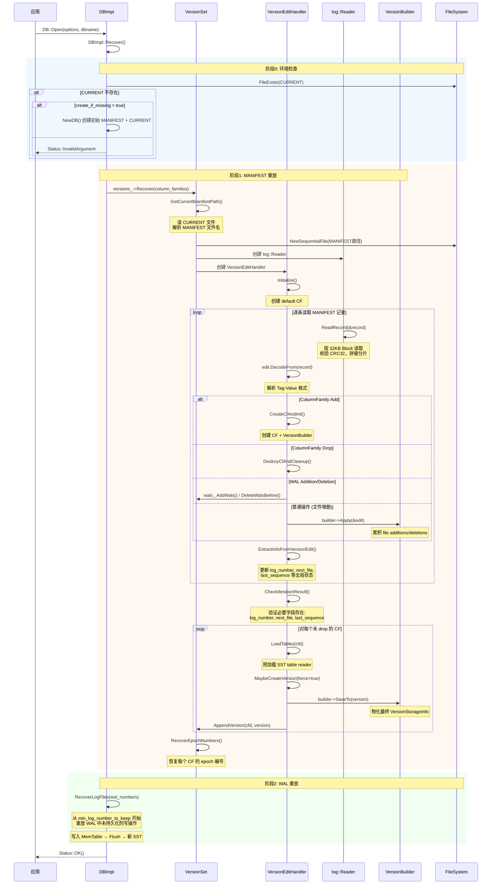

# ForSt MANIFEST 文件机制源码分析

## 0. 文档元数据
- **文档 ID**: 1.15
- **状态**: completed
- **依赖**: 1.2 (ForSt 运行时架构)
- **最后更新**: 2026-04-19
- **源码仓库**: `~/code/github/ForSt`（基于 RocksDB 上游 + Flink 环境适配）

---

## 1. 概述

MANIFEST 是 ForSt/RocksDB 中记录数据库版本历史的持久化日志文件。每次 Flush、Compaction、Column Family 操作都会产生一条 VersionEdit 记录，追加写入 MANIFEST 文件。DB 重启时通过重放 MANIFEST 中的所有 VersionEdit，重建内存中的 Version（即 SST 文件布局）。

**核心组件关系**：

```
CURRENT 文件 (文本, 指向当前 MANIFEST)
    │
    ▼
MANIFEST-{number} (log 格式, 包含一系列 VersionEdit 记录)
    │
    ▼ 重放
VersionSet (内存中管理所有 Version 的链表)
    │
    ├── Version_0 (初始快照)
    ├── Version_1 (Flush 后)
    ├── Version_2 (Compaction 后)
    └── Version_N (当前版本 = "current")
```

**关键源文件**：

| 文件 | 作用 |
|------|------|
| `db/version_edit.h` / `.cc` | VersionEdit 数据结构与序列化 |
| `db/version_set.h` / `.cc` | VersionSet 管理、LogAndApply、Recover |
| `db/version_edit_handler.cc` | MANIFEST 重放逻辑（VersionEdit 应用） |
| `db/version_builder.cc` | 将 VersionEdit 增量合并到 Version |
| `db/log_format.h` / `log_writer.h` | 底层日志记录格式（32KB Block） |
| `file/filename.cc` | CURRENT 文件更新（原子 rename） |
| `db/db_impl/db_impl_open.cc` | DB::Open 恢复入口 |
| `db/db_impl/db_impl_compaction_flush.cc` | Flush/Compaction 提交 |
| `utilities/checkpoint/checkpoint_impl.cc` | Checkpoint 创建 |

---

## 2. MANIFEST 文件格式

### 2.1 物理层：log::Writer 记录格式

MANIFEST 文件复用了 WAL 的 log 格式（`db/log_format.h`）。文件被划分为固定大小的 **Block**（32KB），每条记录有 7 字节头部：

```
+-------------------+
| Block (32KB)      |
|  +--------------+ |
|  | Header (7B)  | |    Header = CRC32 (4B) + Length (2B) + Type (1B)
|  | Payload      | |    Type: kFullType=1 | kFirstType=2 | kMiddleType=3 | kLastType=4
|  +--------------+ |
|  | Record 2 ... | |
|  +--------------+ |
+-------------------+
```

> **源码**: `db/log_format.h:45-48`
> ```cpp
> constexpr unsigned int kBlockSize = 32768;
> constexpr int kHeaderSize = 4 + 2 + 1;  // checksum + length + type
> ```

当单条 VersionEdit 记录超过一个 Block 的剩余空间时，会被拆分为 First/Middle/Last 多个片段。

### 2.2 逻辑层：VersionEdit 序列化

每条 MANIFEST 记录的 payload 是一个序列化的 `VersionEdit`。序列化采用 **Tag-Value** 格式（Varint32 编码的 Tag + 对应的 Value）。

> **源码**: `db/version_edit.h:36-75` — Tag 枚举定义

```cpp
enum Tag : uint32_t {
  kComparator        = 1,    // comparator 名称
  kLogNumber         = 2,    // 当前 WAL 日志号
  kNextFileNumber    = 3,    // 下一个可用文件号
  kLastSequence      = 4,    // 最新序列号
  kCompactCursor     = 5,    // Compaction 游标
  kDeletedFile       = 6,    // 删除的 SST 文件 (level, file_number)
  kNewFile4          = 103,  // 新增 SST 文件（最新格式 v4）
  kColumnFamily      = 200,  // Column Family ID
  kColumnFamilyAdd   = 201,  // 创建 CF
  kColumnFamilyDrop  = 202,  // 删除 CF
  kInAtomicGroup     = 300,  // 原子组标记
  kBlobFileAddition  = 400,  // Blob 文件新增
  kBlobFileGarbage   = 401,  // Blob 文件垃圾
  // ...
  kTagSafeIgnoreMask = 1 << 13,  // 未知 Tag 可安全忽略的掩码
};
```

### 2.3 VersionEdit::EncodeTo 序列化流程

> **源码**: `db/version_edit.cc:96-322`

编码顺序为：
1. **全局元信息**：DbId, Comparator, LogNumber, PrevLogNumber, NextFileNumber, MaxColumnFamily, MinLogNumberToKeep, LastSequence
2. **Compaction 游标**：CompactCursor (level + InternalKey)
3. **删除文件**：kDeletedFile (level + file_number)
4. **新增文件** (kNewFile4)：level, file_number, file_size, smallest_key, largest_key, smallest_seqno, largest_seqno，后跟自定义字段（tag-length-value 循环直到 kTerminate）
5. **Blob 文件操作**：BlobFileAddition, BlobFileGarbage
6. **WAL 操作**：WalAddition, WalDeletion
7. **Column Family 操作**：CF id, CF add/drop
8. **原子组**：AtomicGroup 标记 + remaining_entries

**kNewFile4 自定义字段格式**（`version_edit.cc:151-262`）：

```
+-----------------------------+
| custom_tag (varint32)       |   // e.g., kOldestAncesterTime=5
+-----------------------------+
| field_length (varint32)     |
+-----------------------------+
| field_data (variable)       |
+-----------------------------+
|          ......             |
+-----------------------------+
| kTerminate (varint32 = 1)   |   // 自定义字段结束标志
+-----------------------------+
```

包含的自定义字段有：OldestAncesterTime, FileCreationTime, EpochNumber, FileChecksum, FileChecksumFuncName, PathId, Temperature, NeedCompaction, OldestBlobFileNumber, UniqueId, CompensatedRangeDeletionSize, TailSize, UserDefinedTimestampsPersisted。

### 2.4 前向兼容性

- Tag 高位含 `kTagSafeIgnoreMask`（bit 13）的未知 Tag 可被安全跳过
- 自定义字段 Tag 高位含 `kCustomTagNonSafeIgnoreMask`（bit 6）的字段若不认识则 **必须** 报错
- 这使得新版本可以添加字段而旧版本可以安全忽略

> **源码**: `db/version_edit.cc:800-812`
> ```cpp
> default:
>   if (tag & kTagSafeIgnoreMask) {
>     uint32_t field_len;
>     if (!GetVarint32(&input, &field_len) || ...) {
>       msg = "safely ignoreable tag length error";
>     } else {
>       input.remove_prefix(static_cast<size_t>(field_len));
>     }
>   } else {
>     msg = "unknown tag";
>   }
> ```

---

## 3. 场景1：Compaction 提交 — LogAndApply 时序

### 3.1 整体流程

当 Compaction 完成后，需要将新旧文件变更持久化到 MANIFEST。核心函数是 `VersionSet::LogAndApply()` -> `ProcessManifestWrites()`。

### 3.2 时序图



### 3.3 关键代码引用

**1) LogAndApply 入口 — 排队等待**

> `db/version_set.cc:5769-5830`

```cpp
Status VersionSet::LogAndApply(...) {
  mu->AssertHeld();
  // ...
  for (int i = 0; i < num_cfds; ++i) {
    writers.emplace_back(mu, column_family_datas[i], ...);
    manifest_writers_.push_back(&writers[i]);
  }
  // 等待成为队头
  while (!first_writer.done && &first_writer != manifest_writers_.front()) {
    first_writer.cv.Wait();
  }
  if (first_writer.done) {
    return first_writer.status; // 被其他 writer 代为完成
  }
  return ProcessManifestWrites(writers, mu, ...);
}
```

**2) ProcessManifestWrites — 批量收集 + 写 MANIFEST**

> `db/version_set.cc:5177-5709` (核心逻辑)

```cpp
// 阶段1: 持有 mutex，构建 Version
for (auto& e : last_writer->edit_list) {
  Status s = LogAndApplyHelper(last_writer->cfd, builder, e,
                               &max_last_sequence, mu);
  batch_edits.push_back(e);
}
// builder->SaveTo(new_version->storage_info())

// 阶段2: 释放 mutex，写 MANIFEST
mu->Unlock();
for (auto& e : batch_edits) {
  std::string record;
  e->EncodeTo(&record, ...);
  io_s = descriptor_log_->AddRecord(record);  // 写 MANIFEST
}
io_s = SyncManifest(db_options_, descriptor_log_->file());
// 若新 MANIFEST，更新 CURRENT
if (new_descriptor_log) {
  io_s = SetCurrentFile(fs_, dbname_, pending_manifest_file_number_, ...);
}
mu->Lock();

// 阶段3: 安装新版本
for (int i = 0; i < versions.size(); ++i) {
  AppendVersion(versions[i]->cfd_, versions[i]); // 原子切换 current
}
```

**3) AppendVersion — 原子切换**

> `db/version_set.cc:5159-5174`

```cpp
void VersionSet::AppendVersion(ColumnFamilyData* cfd, Version* v) {
  assert(v->refs_ == 0);
  Version* current = cfd->current();
  if (current != nullptr) {
    current->Unref();
  }
  cfd->SetCurrent(v);  // 原子切换
  v->Ref();
  // 加入双向链表
  v->prev_ = cfd->dummy_versions()->prev_;
  v->next_ = cfd->dummy_versions();
  v->prev_->next_ = v;
  v->next_->prev_ = v;
}
```

### 3.4 组提交（Group Commit）

`ProcessManifestWrites` 支持将多个并发的 `LogAndApply` 请求合并为一次 MANIFEST 写入。队头 writer 会扫描 `manifest_writers_` 队列，将所有非 CF 操作的 writer 的 edit 合并到同一批次。这减少了磁盘 IO 次数，提高了吞吐量。

> `db/version_set.cc:5216-5318`
> ```cpp
> while (it != manifest_writers_.cend()) {
>   if ((*it)->edit_list.front()->IsColumnFamilyManipulation()) {
>     break; // CF 操作不参与组提交
>   }
>   last_writer = *(it++);
>   // ... 收集 edits
> }
> ```

---

## 4. 场景2：Checkpoint 对齐 — MANIFEST 与 SST 一致性

### 4.1 Checkpoint 机制

Checkpoint 创建一个数据库在某个时间点的一致性快照，包含所有 SST 文件、MANIFEST 文件和 CURRENT 文件。

### 4.2 时序图



### 4.3 一致性保证分析

Checkpoint 的 MANIFEST-SST 一致性通过以下机制保证：

**1) DisableFileDeletions**

> `checkpoint_impl.cc:118`
> ```cpp
> s = db_->DisableFileDeletions();
> ```

在获取 live 文件列表到完成所有文件链接期间，禁止后台线程删除 SST 文件。这确保了 MANIFEST 中引用的所有 SST 文件在 checkpoint 创建过程中不会被 purge。

**2) GetLiveFilesStorageInfo — 原子获取文件列表**

该方法在持有 DB mutex 期间获取当前 Version 引用的所有文件列表，包含：
- 所有 live SST 文件（由当前 Version 引用）
- 当前 MANIFEST 文件（截断到当前大小，`trim_to_size=true`）
- CURRENT 文件的内容（`replacement_contents`）
- WAL 文件（如果需要）

**3) MANIFEST trim_to_size**

MANIFEST 文件在 checkpoint 时会被截断复制到 `manifest_file_size_`，确保不包含可能正在写入的不完整记录。

**4) 硬链接的原子性**

对于本地文件系统，SST 文件通过硬链接创建。硬链接是原子操作，且不增加磁盘空间。即使源文件后来被 purge（unlink），checkpoint 中的链接仍然有效。

### 4.4 与 Flink Checkpoint 的关系

在 Flink 环境中，ForSt 状态后端的 Checkpoint 不使用 RocksDB 的原生 Checkpoint API，而是通过 Flink 自己的 Checkpoint 机制：

1. Flink 触发 Checkpoint 时，调用 ForSt 的 `GetLiveFilesStorageInfo` 获取文件列表
2. 将 SST 文件上传到持久化存储（S3/HDFS）
3. 通过 `FlinkFileSystem` 的 `link()` 操作在远程 FS 上创建引用
4. MANIFEST 信息被序列化为 Flink 的 State 元数据

**关键差异**：Flink 环境下 `FlinkDirectory::Fsync()` 是空实现（远程 FS 语义不同），因此 CURRENT 文件的原子性保证依赖于 Flink 的 Checkpoint 协议而非本地文件系统的 fsync。

---

## 5. 场景3：灾难恢复 — DB::Open 读取 MANIFEST 重建版本

### 5.1 整体流程

DB::Open 恢复分为两大阶段：(1) MANIFEST 重放重建 VersionSet；(2) WAL 重放恢复未持久化数据。

### 5.2 时序图



### 5.3 关键代码引用

**1) 读取 CURRENT 文件获取 MANIFEST 路径**

> `db/version_set.cc:5901-5930`

```cpp
Status VersionSet::GetCurrentManifestPath(...) {
  std::string fname;
  Status s = ReadFileToString(fs, CurrentFileName(dbname), &fname);
  // fname 内容示例: "MANIFEST-000042\n"
  fname.resize(fname.size() - 1); // 移除尾部换行
  FileType type;
  bool parse_ok = ParseFileName(fname, manifest_file_number, &type);
  // type 必须为 kDescriptorFile
  *manifest_path = dbname + "/" + fname;
}
```

**2) MANIFEST 重放主循环**

> `db/version_edit_handler.cc:24-99`

```cpp
void VersionEditHandlerBase::Iterate(log::Reader& reader, Status* log_read_status) {
  while (reader.ReadRecord(&record, &scratch) && ...) {
    VersionEdit edit;
    s = edit.DecodeFrom(record);
    if (edit.IsInAtomicGroup()) {
      // 原子组：缓存直到组完整
      s = read_buffer_.AddEdit(&edit);
      if (read_buffer_.IsFull()) {
        for (auto& e : read_buffer_.replay_buffer()) {
          s = ApplyVersionEdit(e, &cfd);
        }
        read_buffer_.Clear();
      }
    } else {
      s = ApplyVersionEdit(edit, &cfd);
    }
  }
  CheckIterationResult(reader, &s);
}
```

**3) VersionBuilder::Apply — 累积增量**

> `db/version_builder.cc:847-908`

```cpp
Status Apply(const VersionEdit* edit) {
  // 先处理 blob 文件（SST 依赖 blob）
  for (auto& addition : edit->GetBlobFileAdditions())
    ApplyBlobFileAddition(addition);
  for (auto& garbage : edit->GetBlobFileGarbages())
    ApplyBlobFileGarbage(garbage);
  // 删除旧 SST
  for (auto& [level, file_number] : edit->GetDeletedFiles())
    ApplyFileDeletion(level, file_number);
  // 添加新 SST
  for (auto& [level, meta] : edit->GetNewFiles())
    ApplyFileAddition(level, meta);
  // Compaction 游标
  for (auto& [level, cursor] : edit->GetCompactCursors())
    ApplyCompactCursors(level, cursor);
  return Status::OK();
}
```

**4) CheckIterationResult — 恢复后验证**

> `db/version_edit_handler.cc:375-492`

```cpp
void VersionEditHandler::CheckIterationResult(const log::Reader& reader, Status* s) {
  // 必须包含 log_number, next_file, last_sequence
  if (!version_edit_params_.HasLogNumber() || ...)
    *s = Status::Corruption("no ... entry in MANIFEST");
  // 未打开的 CF 不允许（除非 read_only）
  if (MustOpenAllColumnFamilies() && !column_families_not_found_.empty())
    *s = Status::InvalidArgument("Column families not opened: ...");
  // 更新 VersionSet 全局状态
  version_set_->next_file_number_.store(version_edit_params_.GetNextFile() + 1);
  version_set_->last_sequence_.store(last_seq);
  version_set_->manifest_file_size_ = reader.GetReadOffset();
}
```

### 5.4 原子组（Atomic Group）

跨多个 CF 的操作需要原子性（全部应用或全部跳过）。通过 `VersionEdit::MarkAtomicGroup(remaining_entries)` 标记：

- 一组 N 个 edit 中，第 i 个的 `remaining_entries = N - 1 - i`
- 最后一个 edit 的 `remaining_entries = 0`
- 恢复时缓存到 `read_buffer_` 直到 `remaining_entries = 0` 才批量应用
- 若组不完整（如在中间崩溃），整组被跳过

---

## 6. MANIFEST 滚动（Rollover）

### 6.1 触发条件

当 MANIFEST 文件大小超过 `max_manifest_file_size`（默认 1GB）时，在下次 `ProcessManifestWrites` 中触发滚动。

> `db/version_set.cc:5371-5376`
> ```cpp
> if (!descriptor_log_ ||
>     manifest_file_size_ > db_options_->max_manifest_file_size) {
>   new_descriptor_log = true;
> }
> ```

### 6.2 滚动流程

1. 分配新文件号 `pending_manifest_file_number_`
2. 创建新 MANIFEST 文件
3. 调用 `WriteCurrentStateToManifest()` 写入**全量快照**（当前所有 CF 的完整文件列表）
4. 追加本次的增量 VersionEdit
5. Sync 新 MANIFEST
6. 更新 CURRENT 文件指向新 MANIFEST
7. 旧 MANIFEST 加入 `obsolete_manifests_` 待清理

### 6.3 WriteCurrentStateToManifest 全量快照

> `db/version_set.cc:6464-6636`

写入顺序：
1. DB ID (可选)
2. WAL 信息（additions + deletions）
3. 对每个 CF：
   - CF 元信息（name, comparator, timestamps 配置）
   - 所有 SST 文件（逐 level 遍历 `vstorage->LevelFiles(level)`）
   - 所有 Blob 文件及其垃圾统计
   - Compaction 游标
   - LogNumber, MinLogNumberToKeep, LastSequence

```cpp
for (auto cfd : *column_family_set_) {
  // 写 CF 信息
  edit.AddColumnFamily(cfd->GetName());
  edit.SetComparatorName(...);
  // 写所有文件
  for (int level = 0; level < cfd->NumberLevels(); level++) {
    for (const auto& f : vstorage->LevelFiles(level)) {
      edit.AddFile(level, f->fd.GetNumber(), ...);
    }
  }
  log->AddRecord(edit.EncodeTo(&record));
}
```

---

## 7. CURRENT 文件的原子更新

CURRENT 文件是一个简单的文本文件，内容为当前 MANIFEST 文件的相对路径（如 `MANIFEST-000042\n`）。

### 7.1 更新流程

> `file/filename.cc:387-417`

```cpp
IOStatus SetCurrentFile(FileSystem* fs, const std::string& dbname,
                        uint64_t descriptor_number,
                        FSDirectory* dir_contains_current_file) {
  std::string manifest = DescriptorFileName(dbname, descriptor_number);
  // manifest = "dbname/MANIFEST-000042"
  // 提取相对路径: "MANIFEST-000042"
  std::string tmp = TempFileName(dbname, descriptor_number);
  // 1. 写入临时文件
  IOStatus s = WriteStringToFile(fs, contents.ToString() + "\n", tmp, true);
  if (s.ok()) {
    // 2. 原子 rename: tmp → CURRENT
    s = fs->RenameFile(tmp, CurrentFileName(dbname), IOOptions(), nullptr);
  }
  if (s.ok()) {
    // 3. fsync 包含 CURRENT 的目录
    if (dir_contains_current_file != nullptr) {
      s = dir_contains_current_file->FsyncWithDirOptions(...);
    }
  }
}
```

**原子性保证**：
- `rename()` 在 POSIX 文件系统上是原子操作
- 即使 crash 在 rename 后、fsync 前，文件系统日志保证 rename 的持久性
- 对于非本地 FS（如 Flink 环境），rename 的原子性依赖于具体 FS 实现

---

## 8. 与 RocksDB 原版差异

### 8.1 MANIFEST 核心逻辑无差异

ForSt 的 MANIFEST 机制（VersionEdit、VersionSet、VersionBuilder、CURRENT 文件等）与 RocksDB 上游 **完全一致**。ForSt 的 git 提交历史显示，这些文件只合并了 RocksDB 上游的变更，没有 ForSt 特有的修改。

### 8.2 命名空间差异

```cpp
// RocksDB: #define ROCKSDB_NAMESPACE rocksdb
// ForSt:   #define ROCKSDB_NAMESPACE forstdb
```

所有 MANIFEST 相关类（`VersionEdit`, `VersionSet`, `VersionBuilder` 等）都在 `ROCKSDB_NAMESPACE` 内，因此在 ForSt 中实际命名空间为 `forstdb`。这不影响 MANIFEST 文件格式本身（磁盘格式与 RocksDB 二进制兼容）。

### 8.3 FlinkFileSystem 对 MANIFEST 操作的影响

| 操作 | 本地 FS | Flink FS (远程) | 影响 |
|------|---------|----------------|------|
| MANIFEST 写入 | 本地文件 IO | 通过 JNI 桥接到 Flink FS | 延迟增加（JNI 开销） |
| MANIFEST sync | `fsync()` | `FlinkWritableFile::Sync()` → JNI → Flink FS flush | 语义可能不同 |
| CURRENT rename | POSIX `rename()` 原子 | `FlinkFileSystem` rename → JNI | 原子性取决于远程 FS |
| 目录 fsync | `fsync(dir_fd)` | `FlinkDirectory::Fsync()` **空实现** | 远程 FS 不需要 |

**关键风险**：在远程 FS 上，CURRENT 文件的 `rename` 可能不是原子的。RocksDB 代码中已有相关注释：

> `db/version_set.cc:5682-5694`
> ```
> // On non-local FS, it is possible that the rename operation
> // succeeded on the server (remote) side, but the client somehow
> // returns a non-ok status to RocksDB. Note that this does not
> // violate atomicity.
> ```

### 8.4 Flink Checkpoint 场景的特殊性

在 Flink 环境中，ForSt 的 MANIFEST 恢复流程与标准 DB::Open 相同。但 Flink 的增量 Checkpoint 机制引入了额外复杂性：

1. **SST 文件分散存储**：Flink 将 SST 文件上传到分布式存储，而非本地目录
2. **MANIFEST 重建**：Flink 恢复时需要先将 SST 文件下载到本地，再通过 MANIFEST 重建 Version
3. **WAL 通常禁用**：Flink 的 Checkpoint 已提供 exactly-once 语义，ForSt 的 WAL 通常被禁用以减少远程 IO

---

## 9. 关键数据结构小结

### VersionEdit 核心字段

| 字段 | 类型 | 含义 |
|------|------|------|
| `log_number_` | uint64 | 当前 WAL 文件号 |
| `next_file_number_` | uint64 | 下一个可用文件号 |
| `last_sequence_` | uint64 | 最新序列号 |
| `deleted_files_` | set<(level, file_num)> | 删除的 SST 文件 |
| `new_files_` | vector<(level, FileMetaData)> | 新增的 SST 文件 |
| `blob_file_additions_` | vector<BlobFileAddition> | 新增 Blob 文件 |
| `column_family_` | uint32 | 目标 CF ID |
| `is_in_atomic_group_` | bool | 是否属于原子组 |
| `remaining_entries_` | uint32 | 原子组中剩余条目数 |

### FileMetaData 核心字段

| 字段 | 含义 |
|------|------|
| `fd` | FileDescriptor（file_number, path_id, file_size, smallest/largest_seqno） |
| `smallest` / `largest` | SST 文件的最小/最大 InternalKey |
| `epoch_number` | Flush/Ingest 的顺序号（L0 排序用） |
| `file_checksum` | 文件校验和 |
| `temperature` | 存储温度提示 |
| `oldest_blob_file_number` | 引用的最老 Blob 文件号 |

---

## 10. Open Questions

1. **Flink 环境下 MANIFEST 滚动的安全性**：当 MANIFEST 文件在远程 FS 上滚动时，`SetCurrentFile` 的 rename 原子性无法保证。Flink 状态后端是否有额外机制处理此问题？

2. **MANIFEST 大小对恢复时间的影响**：大型数据库的 MANIFEST 可能包含数百万条记录。ForSt/Flink 是否有机制加速 MANIFEST 重放（如并行重放、或在 Checkpoint 时创建 MANIFEST 快照）？

3. **Atomic Group 在 Flink 多 CF 场景的应用**：Flink 状态后端是否使用多 Column Family？如果是，Atomic Group 机制在 Flink Checkpoint 恢复中如何参与？

4. **WAL 禁用时的 last_sequence 一致性**：当 `disableWAL=true` 时，`last_sequence` 仅通过 MANIFEST 持久化。若 crash 发生在 MemTable 写入后、Flush 前，MANIFEST 中的 `last_sequence` 可能落后于实际值。Flink 的 Checkpoint 机制如何处理此不一致？
