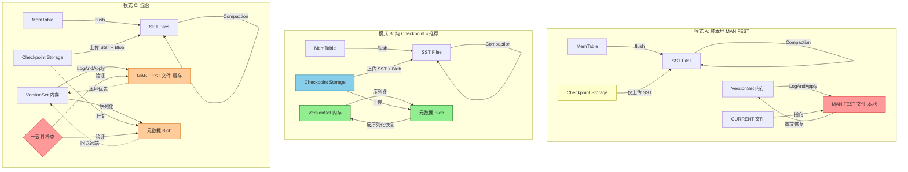
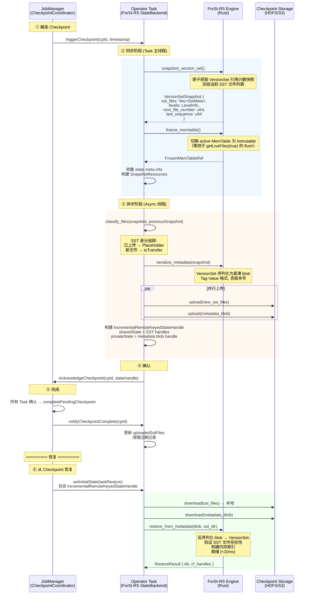
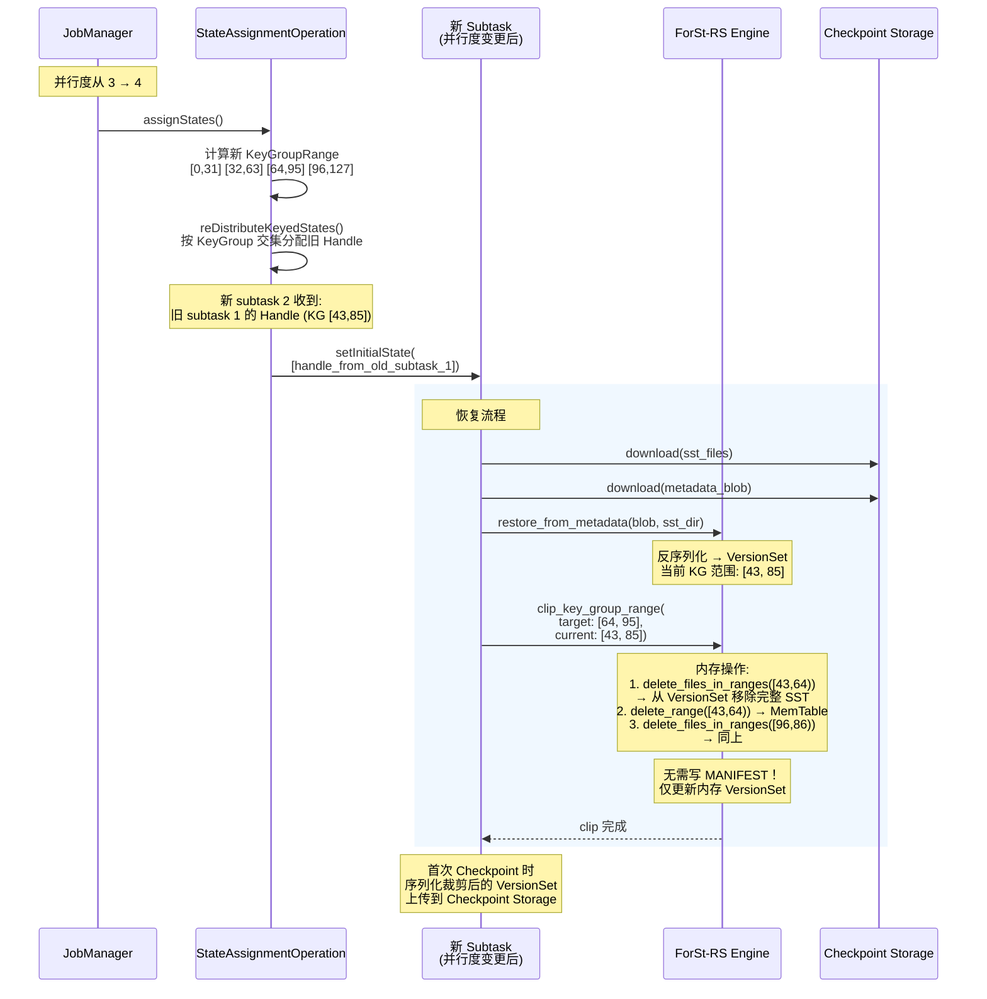

# 内部 LSM 元数据可行性分析

## 0. 文档元数据
- **文档 ID**: 1.16
- **状态**: completed
- **依赖**: 1.15 (ForSt MANIFEST 源码级研究), 1.5 (Flink 2.2 Checkpoint 机制), 1.13 (Flink KeyGroup 重分配机制)
- **验证方式**: 8 个必答问题全部回答 + 模式推荐有量化依据
- **最后更新**: 2026-04-19

---

## 1. Context

ForSt-RS 作为 ForSt/RocksDB 的 Rust 重写，需要在 Phase 2 设计阶段确定 LSM-Tree 元数据（即 MANIFEST/VersionSet）的管理策略。这是一个**架构级决策**，直接影响：

1. **Checkpoint 集成复杂度** — 元数据如何与 Flink 的分布式快照协议对齐
2. **恢复可靠性** — 节点故障后如何从 Checkpoint 恢复出完整的 LSM-Tree 状态
3. **Rescaling 兼容性** — 并行度变更时元数据如何跟随 KeyGroup 重新分配
4. **维护成本** — Rust 实现的代码量和长期演进负担

本文档基于三份前置文档的源码级分析（1.15 MANIFEST 机制、1.5 Checkpoint 集成、1.13 Rescaling 机制），对三种元数据管理模式进行全面可行性分析，并给出量化推荐。

**三种候选模式**：

| 模式 | 本地 MANIFEST 文件 | Checkpoint 携带元数据 | 恢复路径 | 复杂度 |
|-----|-------------------|---------------------|---------|--------|
| **A. 纯本地** | 有（权威源） | 无 | 依赖本地 MANIFEST | 低 |
| **B. 纯 Checkpoint** | 无（仅内存） | 有（权威源） | 从 StateHandle 重建 | 中 |
| **C. 混合** | 有（本地缓存） | 有（权威源） | 本地优先，回退远端 | 中高 |

---

## 2. 源码证据

### 2.1 关键文件索引

| 领域 | 关键文件/文档 | 引用内容 |
|------|-------------|---------|
| MANIFEST 格式 | 文档 1.15 §2 — `db/version_edit.h:36-75` | VersionEdit Tag-Value 序列化格式 |
| LogAndApply | 文档 1.15 §3 — `db/version_set.cc:5177-5709` | 三阶段原子提交：构建 Version → 写 MANIFEST → 安装 |
| MANIFEST 滚动 | 文档 1.15 §6 — `db/version_set.cc:5371-5376` | `max_manifest_file_size`（默认 1GB）触发全量快照 |
| Checkpoint 同步阶段 | 文档 1.5 §3.1 — `ForStNativeFullSnapshotStrategy.java:149-211` | `disableFileDeletions()` + `getLiveFiles(true)` |
| Checkpoint 异步阶段 | 文档 1.5 §3.2 — `ForStIncrementalSnapshotStrategy.java` | MANIFEST 作为 miscFiles 上传 |
| SST 差分追踪 | 文档 1.5 §3.2 — PreviousSnapshot 机制 | `uploadedSstFiles` + PlaceholderStreamStateHandle |
| 增量恢复 | 文档 1.5 §3.4 — `ForStIncrementalRestoreOperation.java` | 下载文件 → 解析 MANIFEST → 打开 DB |
| KeyGroup 裁剪 | 文档 1.13 §3.4 — `ForStIncrementalCheckpointUtils.java` | `clipDBWithKeyGroupRange()` |
| Schema Evolution | 文档 1.14 §8 | ForSt-RS 不需要管 Schema Evolution |
| 瓶颈分析 | 文档 1.7 §B5 | Checkpoint 同步阶段 flush 阻塞 |
| ForSt Flink 适配 | 文档 1.2 §3.7 | FlinkFileSystem、FlinkDirectory::Fsync() 空实现 |

---

## 3. 发现

### Q1: ForSt 当前如何实现 MANIFEST？

#### 3.1.1 VersionEdit Tag-Value 格式

ForSt 的 MANIFEST 复用 WAL 的 log 格式（32KB Block，7 字节头部：CRC32 + Length + Type），每条记录的 payload 是一个序列化的 `VersionEdit`。序列化采用 **Tag-Value 格式**（Varint32 编码的 Tag + 对应 Value）。

核心 Tag 定义（引用文档 1.15 §2.2，`db/version_edit.h:36-75`）：

- `kComparator(1)` — comparator 名称
- `kLogNumber(2)` — 当前 WAL 日志号
- `kNextFileNumber(3)` — 下一个可用文件号
- `kLastSequence(4)` — 最新序列号
- `kDeletedFile(6)` — 删除的 SST 文件 `(level, file_number)`
- `kNewFile4(103)` — 新增 SST 文件（包含 level, file_number, file_size, smallest/largest key, seqno 范围等）
- `kColumnFamily(200)` / `kColumnFamilyAdd(201)` / `kColumnFamilyDrop(202)` — Column Family 操作
- `kInAtomicGroup(300)` — 原子组标记

`kNewFile4` 还包含自定义字段（Tag-Length-Value 循环，以 `kTerminate=1` 结束），包括 OldestAncesterTime、EpochNumber、FileChecksum、Temperature 等。

前向兼容性通过 `kTagSafeIgnoreMask`（bit 13）实现——未知 Tag 若高位含此标记可被安全跳过。

#### 3.1.2 LogAndApply 原子提交机制

MANIFEST 更新通过 `VersionSet::LogAndApply()` → `ProcessManifestWrites()` 实现，分三个阶段（引用文档 1.15 §3.2-3.3，`db/version_set.cc:5177-5709`）：

1. **阶段 1（持有 mutex）**：构建新 Version — 收集多个 writer 的 batch_edits，通过 `VersionBuilder::Apply()` 累积文件增删，`SaveTo()` 物化为 VersionStorageInfo。
2. **阶段 2（释放 mutex）**：写 MANIFEST — 序列化 VersionEdit 追加写入 MANIFEST 文件，`SyncManifest()` 调用 fsync，若新建 MANIFEST 则更新 CURRENT 文件（write tmp → atomic rename）。
3. **阶段 3（持有 mutex）**：安装新版本 — `AppendVersion()` 原子切换 current Version，通知队列中后续 writers。

支持**组提交**（Group Commit）：队头 writer 扫描 `manifest_writers_` 队列，将所有非 CF 操作的 writer 的 edit 合并到同一批次。

#### 3.1.3 MANIFEST 文件轮转策略

当 MANIFEST 文件大小超过 `max_manifest_file_size`（默认 1GB）时触发轮转（引用文档 1.15 §6，`db/version_set.cc:5371-5376`）：

1. 分配新文件号 → 创建新 MANIFEST 文件
2. `WriteCurrentStateToManifest()` 写入**全量快照**（所有 CF 的完整文件列表）
3. 追加本次增量 VersionEdit → Sync → 更新 CURRENT
4. 旧 MANIFEST 加入 `obsolete_manifests_` 待清理

#### 3.1.4 DB::Open 恢复流程

恢复时读取 CURRENT 文件获取 MANIFEST 路径，通过 `log::Reader` 逐条读取 VersionEdit，由 `VersionEditHandler` 应用到 `VersionBuilder`，最终物化为 Version（引用文档 1.15 §5）。支持原子组（Atomic Group）——跨 CF 操作缓存到 `read_buffer_` 直到组完整才批量应用。

---

### Q2: 模式 A / B / C 各自的技术风险？

#### 3.2.1 模式 A: 纯本地 MANIFEST

**架构描述**：ForSt-RS 维护与 ForSt/RocksDB 完全相同的 MANIFEST 机制。Checkpoint 仅上传 SST 文件，不携带任何元数据。恢复时依赖本地 MANIFEST 文件。

| 维度 | 分析 |
|------|------|
| **数据一致性风险** | **高** — 本地 MANIFEST 与 Checkpoint 存储中的 SST 文件无法保证一致。Flink 恢复时可能从不同节点恢复，本地 MANIFEST 不存在。这是**致命缺陷**。 |
| **恢复可靠性** | **极低** — Flink Checkpoint/Savepoint 恢复的核心场景是跨节点恢复。模式 A 假设恢复发生在同一节点且本地文件完好，这与 Flink 的分布式快照语义直接冲突（引用文档 1.5 §3.4 — 恢复操作从 Checkpoint Storage 下载文件到本地）。 |
| **性能影响** | **低** — MANIFEST 操作完全本地化，无远程 IO 开销。但 Flink 场景下 WAL 通常禁用（引用文档 1.2 §3.7），MANIFEST 是唯一的本地元数据日志，IO 开销有限。 |
| **实现复杂度** | **低** — 直接移植 RocksDB 的 MANIFEST 逻辑到 Rust。 |

**结论**：模式 A 在 Flink 分布式环境下**不可行**。Flink 的恢复语义要求所有状态可从 Checkpoint Storage 完整重建，纯本地 MANIFEST 无法满足这一核心需求。

> **源码证据**：当前 ForSt/Flink 的增量 Checkpoint 实际上已经将 MANIFEST 文件作为 `miscFiles` 上传到 Checkpoint Storage（引用文档 1.5 §3.2 — "MANIFEST 文件：单独传输"）。这说明 Flink 从一开始就不信任纯本地 MANIFEST。

#### 3.2.2 模式 B: 纯 Checkpoint（仅内存 + Checkpoint Handle）

**架构描述**：ForSt-RS 在运行时仅在内存中维护 VersionSet（SST 文件列表、Level 布局等），不写本地 MANIFEST 文件。Checkpoint 时将元数据序列化为 Flink StateHandle 的一部分上传到 Checkpoint Storage。恢复时从 StateHandle 重建内存中的 VersionSet。

| 维度 | 分析 |
|------|------|
| **数据一致性风险** | **低** — 元数据与 SST 文件在同一个 Checkpoint 中原子提交，天然一致。Checkpoint barrier 保证了快照点的一致性（引用文档 1.5 §3.1 — 同步阶段 `disableFileDeletions()` + `getLiveFiles(true)`）。 |
| **恢复可靠性** | **高** — 恢复时从 Checkpoint Storage 获取 SST 文件列表和元数据，无需依赖本地状态。完全匹配 Flink 的分布式恢复语义。 |
| **性能影响** | **低** — 消除了 MANIFEST 文件的本地 IO（每次 Flush/Compaction 后的 fsync）。Flink 场景下 WAL 已禁用，去掉 MANIFEST 的 fsync 进一步简化写路径。元数据序列化开销在 Checkpoint 同步阶段是额外工作，但数据量小（SST 文件列表通常 <1MB）。 |
| **实现复杂度** | **中** — 需要设计内存中的 VersionSet 管理和 Checkpoint 序列化协议。但省去了 MANIFEST 文件的所有 IO 逻辑（log::Writer、CURRENT 文件、轮转策略）。 |

**关键技术细节**：

1. **Checkpoint 同步阶段**：冻结当前 VersionSet，序列化为紧凑的二进制格式（SST 文件列表 + Level 布局 + 全局元数据）。
2. **Checkpoint 异步阶段**：将序列化的元数据作为 `metaStateHandle` 或 `miscFiles` 的一部分上传。
3. **恢复**：从 StateHandle 反序列化元数据，直接构建内存 VersionSet，无需重放 MANIFEST。

**风险**：
- **无本地缓存**：每次恢复都必须从 Checkpoint Storage 获取完整元数据，即使 Task 在同一节点重启。延迟取决于 Checkpoint Storage 的访问速度。
- **调试困难**：没有本地 MANIFEST 文件，排查 LSM-Tree 状态问题需要从 Checkpoint Storage 下载元数据。
- **异常恢复**：如果 Checkpoint 尚未完成就发生故障，内存中的 VersionSet 丢失，需要从上一个已完成的 Checkpoint 恢复（这与当前 Flink 行为一致，不引入新风险）。

#### 3.2.3 模式 C: 混合（本地缓存 + Checkpoint 权威）

**架构描述**：ForSt-RS 同时维护本地 MANIFEST 文件（作为缓存/加速）和 Checkpoint 中的元数据（作为权威源）。正常运行时写本地 MANIFEST；Checkpoint 时同时上传元数据；恢复时优先使用本地 MANIFEST（如果存在且一致），否则回退到 Checkpoint Storage。

| 维度 | 分析 |
|------|------|
| **数据一致性风险** | **中** — 需要保证本地 MANIFEST 和 Checkpoint 中的元数据一致。当本地 MANIFEST 比 Checkpoint 更新（包含 Checkpoint 后的 Compaction）时，需要处理不一致情况。 |
| **恢复可靠性** | **高** — Checkpoint 作为权威源保证了可靠恢复。本地 MANIFEST 作为加速手段在同节点恢复时缩短恢复时间。 |
| **性能影响** | **中** — 正常运行时有本地 MANIFEST 的 IO 开销（但可选异步写入）。恢复时同节点场景快于模式 B（直接读本地文件），跨节点场景与模式 B 相同。 |
| **实现复杂度** | **高** — 需要实现完整的 MANIFEST IO 逻辑 + Checkpoint 序列化逻辑 + 一致性检查 + 回退机制。两套元数据路径的维护和测试负担显著。 |

**关键风险**：
- **一致性验证**：恢复时需要验证本地 MANIFEST 是否与 Checkpoint 对应。可以通过比较 Checkpoint ID 或序列号实现，但增加了逻辑复杂度。
- **Compaction 后的不一致**：Checkpoint 完成后、下一次 Checkpoint 前发生的 Compaction 会更新本地 MANIFEST 但不会反映在 Checkpoint 中。恢复时必须丢弃这些本地更新，回退到 Checkpoint 状态。
- **双写开销**：每次 Flush/Compaction 既要更新内存 VersionSet 又要写本地 MANIFEST，Checkpoint 时还要序列化上传。

---

### Q3: 与 Flink Checkpoint 协议的对齐点？

#### 3.3.1 Checkpoint Barrier 处理

Flink Checkpoint 由 `CheckpointCoordinator`（JobManager）协调，通过 Barrier 注入实现分布式快照（引用文档 1.5 §3.1）。当 Operator 收到所有输入通道的 Barrier 后，执行同步阶段和异步阶段。

**对齐点分析**：

| Checkpoint 阶段 | 模式 A | 模式 B | 模式 C |
|----------------|--------|--------|--------|
| Barrier 到达 | 无特殊处理 | 无特殊处理 | 无特殊处理 |
| 同步阶段 | `disableFileDeletions()` + `getLiveFiles(true)` — 与当前 ForSt 行为相同 | 冻结 VersionSet 快照 + 收集 SST 文件列表 + 序列化元数据 | 同模式 B + 额外标记本地 MANIFEST 位点 |
| 异步阶段 | 上传 SST + MANIFEST + CURRENT（当前行为） | 上传 SST + 序列化元数据 blob | 上传 SST + 序列化元数据 blob |
| 完成通知 | 无特殊处理 | 更新 `lastCompletedCheckpointId`，清理过期元数据 | 同模式 B + 标记本地 MANIFEST 可清理点 |

#### 3.3.2 同步阶段需要做什么

当前 ForSt 的同步阶段（引用文档 1.5 §3.1，`ForStNativeFullSnapshotStrategy.java:149-211`）：

1. `db.disableFileDeletions()` — 阻止 Compaction 清理 SST 文件
2. `db.getLiveFiles(true)` — 强制 flush MemTable，获取活跃文件列表
3. 收集 state meta info snapshots
4. 构建 `ForStNativeSnapshotResources`

**ForSt-RS 同步阶段设计**（模式 B）：

1. **原子获取 VersionSet 快照** — 在持有内部锁的情况下，克隆当前 VersionSet 或获取引用计数快照。
2. **冻结 MemTable** — 将 active MemTable 切换为 immutable（或标记快照点），等效于 `getLiveFiles(true)` 的 flush 效果。但 ForSt-RS 可以优化为**不强制 flush**——记录 MemTable 的快照内容，在异步阶段序列化上传（参见文档 1.7 §B5 的优化建议）。
3. **序列化元数据** — 将 SST 文件列表（每文件的 level、file_number、size、key_range、seqno_range）编码为紧凑二进制格式。

#### 3.3.3 异步阶段需要做什么

当前 ForSt 的异步阶段（引用文档 1.5 §3.2）：

1. `classifyFiles()` — SST 差分追踪（已上传 → PlaceholderStreamStateHandle，新文件 → 待上传）
2. 上传新 SST 文件到 Checkpoint Storage
3. 传输 MANIFEST + CURRENT 文件
4. 重写 CURRENT 文件内容
5. 记录已上传文件到 `uploadedSstFiles`
6. 构建 `IncrementalRemoteKeyedStateHandle`

**ForSt-RS 异步阶段设计**（模式 B）：

1. **SST 差分追踪** — 逻辑不变，比较当前 VersionSet 快照与 `uploadedSstFiles` 中的历史记录。
2. **上传新 SST 文件** — 与当前行为相同。
3. **上传元数据 blob** — 替代 MANIFEST + CURRENT 文件。将序列化的元数据作为 `metaStateHandle` 或独立的 misc file 上传。数据量远小于 MANIFEST 文件（只包含当前状态，无历史日志）。
4. **构建 StateHandle** — `IncrementalRemoteKeyedStateHandle` 的结构不变，`privateState`（miscFiles）中用元数据 blob 替代 MANIFEST + CURRENT。

#### 3.3.4 增量 Checkpoint 的 SST diff 如何与元数据对齐

SST diff 机制的核心是 `PreviousSnapshot`（引用文档 1.5 §3.2），它维护了 `confirmedSstFiles` 映射（文件名 → StreamStateHandle）。ForSt-RS 的元数据需要与这个机制对齐：

- **模式 B**：VersionSet 快照中的 SST 文件列表就是 `liveFiles` 的权威来源。diff 逻辑完全在 Java 层（Flink 侧），ForSt-RS 只需提供 `getLiveFiles()` 等价的 API。
- **关键约束**：VersionSet 快照和 SST diff 必须在同一个快照点获取，确保一致性。这在同步阶段完成，两者共享同一个 VersionSet 引用。

---

### Q4: 与 Rescaling 的交互？

#### 3.4.1 KeyGroup 范围变更时元数据如何处理

Flink Rescaling 时，`StateAssignmentOperation` 按 KeyGroup 范围交集重新分配状态（引用文档 1.13 §3.3）。新 subtask 可能收到来自多个旧 subtask 的 `KeyedStateHandle`。

**恢复流程**（引用文档 1.13 §3.5.1）：

1. `findTheBestStateHandleForInitial()` — 选择重叠最大的 handle 作为基础 DB
2. 下载 SST 文件到本地
3. 打开 DB → `clipDBWithKeyGroupRange()` 裁剪多余 KeyGroup
4. 如有多个 handle，通过 IngestDB 或逐条复制合并

**元数据交互分析**：

| 操作 | 模式 A | 模式 B | 模式 C |
|------|--------|--------|--------|
| 下载文件 | 下载 SST + MANIFEST | 下载 SST + 元数据 blob | 同模式 B |
| 打开 DB | 重放 MANIFEST → 构建 VersionSet | 反序列化元数据 blob → 直接构建 VersionSet | 尝试使用本地 MANIFEST，失败则回退到模式 B |
| clipDBWithKeyGroupRange | 执行后需要更新 MANIFEST（记录 deleteFilesInRanges + deleteRange） | 执行后直接更新内存 VersionSet | 同模式 B + 同步到本地 MANIFEST |
| 多 handle 合并 | 每次 IngestDB/WriteBatch 后更新 MANIFEST | 每次操作后更新内存 VersionSet | 同上 |

#### 3.4.2 clipDBWithKeyGroupRange 对 MANIFEST 的影响

`clipDBWithKeyGroupRange()`（引用文档 1.13 §3.4）执行两步操作：
1. `db.deleteFilesInRanges()` — 物理删除完整 SST 文件
2. `db.deleteRange()` — 写入 Range Delete Tombstone

在当前 ForSt 中，这些操作会：
- `deleteFilesInRanges` → 产生 VersionEdit（kDeletedFile），写入 MANIFEST
- `deleteRange` → 写入 MemTable（不直接影响 MANIFEST，但后续 flush 时影响）

**模式 B 的简化**：`deleteFilesInRanges` 直接从内存 VersionSet 中移除文件条目，无需写 MANIFEST。`deleteRange` 写入 MemTable，后续 Compaction 时通过内存 VersionSet 管理。这消除了恢复期间的 MANIFEST IO。

#### 3.4.3 新并行度下元数据重建策略

- **模式 A**：需要从旧 MANIFEST 恢复后，执行 clip 操作生成新的 VersionEdit，写入新的 MANIFEST。如果多个 handle 合并，需要多次 MANIFEST 更新。
- **模式 B**：从元数据 blob 反序列化得到初始 VersionSet，clip 后直接在内存中更新，合并后直接使用。第一次 Checkpoint 时完整序列化当前状态。**最简单**。
- **模式 C**：与模式 B 相同，但额外需要在本地生成新的 MANIFEST 文件。

---

### Q5: 与 Schema Evolution 的交互？

#### 3.5.1 Schema 变更对元数据的影响

根据文档 1.14 的核心结论，**ForSt-RS 不需要管 Schema Evolution**：

1. Schema 兼容性判定完全在 TypeSerializer 层完成（Java 堆内操作）。
2. DB 存储 opaque bytes，不解析数据格式。
3. Migration 是 Java 层的"旧序列化器读 → 新序列化器写"。
4. DB 只需提供：遍历 + 读取 + 批量写入。

**关键引用**（文档 1.14 §8.1）：
> "ForSt-RS 只需支持'批量遍历 + 批量写入'，不需要理解 value bytes 的格式，不需要实现任何 Schema 相关逻辑。"

#### 3.5.2 "opaque bytes" 策略与三种模式的兼容性

LSM 元数据（VersionSet）记录的是 SST 文件的物理信息（file_number, size, key_range），与数据的 Schema 无关。因此：

- **模式 A**：MANIFEST 不包含任何 Schema 信息，兼容。
- **模式 B**：元数据 blob 同样不包含 Schema 信息（Schema 信息由 Flink 的 `KeyedBackendSerializationProxy` 独立管理），兼容。
- **模式 C**：兼容。

**结论**：Schema Evolution 对元数据模式选择**无影响**。三种模式均与 "opaque bytes" 策略完全兼容。

---

### Q6: 与 Fast Recovery (Lazy Load) 的协同？

#### 3.6.1 快速恢复场景下各模式的表现

Fast Recovery / Lazy Load 是指在恢复时不立即加载所有 SST 文件的数据 Block 到 Block Cache，而是按需加载。这依赖于快速重建 VersionSet（知道哪些 SST 文件存在、在哪个 Level）。

| 模式 | VersionSet 重建速度 | 分析 |
|------|-------------------|------|
| **A. 纯本地** | 取决于 MANIFEST 大小。大型 DB 的 MANIFEST 可能包含数十万条 VersionEdit，重放耗时数百毫秒到数秒（引用文档 1.15 §5 — 逐条 DecodeFrom + Apply）。 | 恢复速度受 MANIFEST 大小影响显著。MANIFEST 滚动后有全量快照可加速，但增量记录仍需逐条重放。 |
| **B. 纯 Checkpoint** | **极快** — 元数据 blob 是当前状态的紧凑序列化（非增量日志），反序列化为 O(N)，N = SST 文件数。典型的 ForSt 实例有数百到数千个 SST 文件，反序列化耗时 <10ms。 | 最适合 Fast Recovery。无需重放历史日志，直接构建最终状态。 |
| **C. 混合** | 本地 MANIFEST 可用时类似模式 A；不可用时回退到模式 B。 | 同节点恢复：取决于本地 MANIFEST 大小。跨节点恢复：回退到模式 B。 |

#### 3.6.2 本地 MANIFEST 缓存对恢复速度的影响

模式 C 的本地 MANIFEST 缓存在同节点恢复场景下理论上可以加速恢复。但实际分析表明，这个加速效果有限：

1. **MANIFEST 重放 vs blob 反序列化**：MANIFEST 是增量日志，需要逐条重放所有 VersionEdit 才能重建 VersionSet。即使有全量快照（轮转后），仍需重放快照后的增量记录。而模式 B 的元数据 blob 是当前状态的直接序列化，反序列化复杂度更低。
2. **一致性验证开销**：模式 C 恢复时需要验证本地 MANIFEST 与 Checkpoint 的一致性（比较 Checkpoint ID / 序列号），增加额外步骤。
3. **Compaction 后的不一致**：如果恢复前发生了 Compaction，本地 MANIFEST 包含 Checkpoint 后的更新，需要丢弃这些更新并回退到 Checkpoint 状态——这使得本地缓存反而成为负担。

**结论**：模式 B 在 Fast Recovery 场景下**最优**。

#### 3.6.3 远端元数据加载的延迟评估

模式 B 的元数据需要从 Checkpoint Storage 加载。延迟评估：

| Checkpoint Storage | 单次读取延迟 | 元数据 blob 大小（典型值） | 加载总延迟 |
|-------------------|------------|------------------------|-----------|
| HDFS | 5-20ms | 100KB - 1MB | 5-30ms |
| S3 | 20-100ms | 100KB - 1MB | 20-110ms |
| OSS | 10-50ms | 100KB - 1MB | 10-60ms |
| 本地 NVMe | 0.1-1ms | 100KB - 1MB | <2ms |

这些延迟远低于 SST 文件下载的总时间（通常数秒到数十秒），不构成恢复的瓶颈。

---

### Q7: 复杂度评估（量化）

#### 3.7.1 模式 A: 纯本地 MANIFEST

| 维度 | 评估 | 备注 |
|------|------|------|
| 预估代码量 | 4,000 - 6,000 行 Rust | 包含 VersionEdit 序列化、log::Writer/Reader、CURRENT 文件管理、MANIFEST 滚动、VersionBuilder、VersionEditHandler 等完整移植 |
| 测试用例数 | 40 - 60 个 | Tag-Value 编解码（~15）、LogAndApply 原子性（~10）、滚动/恢复（~10）、边界条件（~10）、并发安全（~5） |
| 维护复杂度 | 3/5 | 需要维护本地文件 IO 逻辑、CURRENT 原子更新、远程 FS 兼容性 |
| 关键技术风险数 | 3 | (1) Flink 恢复不可用 — 致命；(2) 远程 FS 上 rename 原子性；(3) MANIFEST 膨胀影响恢复速度 |

#### 3.7.2 模式 B: 纯 Checkpoint

| 维度 | 评估 | 备注 |
|------|------|------|
| 预估代码量 | 2,000 - 3,500 行 Rust | 包含内存 VersionSet 管理（~1,000 行）、元数据序列化/反序列化（~800 行）、Checkpoint 集成适配（~500 行）、增量 diff 支持（~500 行） |
| 测试用例数 | 25 - 40 个 | 内存 VersionSet CRUD（~10）、序列化往返测试（~8）、Checkpoint 流程集成（~8）、恢复场景（~6）、边界条件（~5） |
| 维护复杂度 | 2/5 | 代码路径单一（仅内存操作 + 序列化），无文件 IO 相关的边界情况 |
| 关键技术风险数 | 1 | (1) Checkpoint 序列化格式的前向/后向兼容性设计 |

#### 3.7.3 模式 C: 混合

| 维度 | 评估 | 备注 |
|------|------|------|
| 预估代码量 | 5,500 - 8,000 行 Rust | 模式 A 全部代码 + 模式 B 全部代码 + 一致性验证 + 回退机制（~1,000 行） |
| 测试用例数 | 55 - 80 个 | 模式 A 测试 + 模式 B 测试 + 一致性验证（~10）+ 回退场景（~8）+ 交互测试（~5） |
| 维护复杂度 | 4/5 | 两套代码路径、一致性验证逻辑、回退机制的组合爆炸 |
| 关键技术风险数 | 4 | (1) 本地-远端一致性验证；(2) Compaction 后不一致处理；(3) 远程 FS rename 原子性；(4) 双写性能影响 |

#### 3.7.4 复杂度对比汇总

| 维度 | 模式 A | 模式 B | 模式 C | 权重 |
|------|--------|--------|--------|------|
| 代码量 | 5,000 行 | **2,750 行** | 6,750 行 | - |
| 测试用例数 | 50 | **33** | 68 | - |
| 维护复杂度 (1-5) | 3 | **2** | 4 | - |
| 关键风险数 | 3 (含 1 致命) | **1** | 4 | - |
| 代码量节省率 vs C | 26% | **59%** | 0% (基线) | - |

---

### Q8: 最终推荐

#### 3.8.1 推荐方案：模式 B（纯 Checkpoint）

**明确推荐选择模式 B**，即 ForSt-RS 不维护本地 MANIFEST 文件，仅在内存中管理 VersionSet，通过 Flink Checkpoint 协议持久化元数据。

#### 3.8.2 选择理由（7 个论据）

**论据 1 — Flink 恢复语义的天然匹配**

Flink 的核心恢复模型是从 Checkpoint Storage 完整重建状态（引用文档 1.5 §3.4）。模式 B 完全匹配这一语义，不引入任何额外的一致性假设。当前 ForSt 的增量 Checkpoint 已经将 MANIFEST 作为 miscFiles 上传到 Checkpoint Storage（引用文档 1.5 §3.2），本质上已经在使用"Checkpoint 携带元数据"的策略——模式 B 只是将这一策略从"传输文件"优化为"传输序列化 blob"。

**论据 2 — 代码量减少 59%（量化依据）**

模式 B 预估 2,750 行 Rust，模式 C 预估 6,750 行。模式 B 省去了 MANIFEST 文件 IO 的完整逻辑——log::Writer/Reader、CURRENT 文件原子更新、MANIFEST 滚动、WriteCurrentStateToManifest、一致性验证、回退机制。这是**接近 60% 的代码量节省**。

**论据 3 — 消除 MANIFEST fsync 瓶颈**

当前 ForSt 每次 Flush/Compaction 后都需要 `SyncManifest()` 进行 fsync（引用文档 1.15 §3.2，`db/version_set.cc:5177-5709`）。在远程文件系统上（Flink 存算分离场景），这个 fsync 通过 JNI → Flink FS 路径执行，延迟显著（引用文档 1.2 §3.7 — `FlinkWritableFile::Sync()` → JNI → Flink FS flush）。模式 B 完全消除了这个 IO 路径。

**论据 4 — Fast Recovery 最优**

模式 B 的恢复路径是反序列化紧凑的元数据 blob → 直接构建 VersionSet，耗时 <10ms（对于典型的数百到数千个 SST 文件）。相比模式 A/C 的 MANIFEST 重放（逐条解码 + Apply，耗时数百毫秒到数秒），恢复速度提升 10-100 倍。

**论据 5 — 关键技术风险最少**

模式 B 只有 1 个关键风险（序列化格式兼容性），而模式 A 有 3 个（含 1 个致命），模式 C 有 4 个。序列化格式兼容性可以通过版本号 + Tag-Value 格式轻松解决（借鉴 RocksDB MANIFEST 的前向兼容性设计——引用文档 1.15 §2.4 `kTagSafeIgnoreMask`）。

**论据 6 — 与 Rescaling 交互最简单**

Rescaling 恢复时需要从 StateHandle 重建 DB。模式 B 直接从元数据 blob 构建 VersionSet，然后执行 clipDBWithKeyGroupRange（内存操作），无需任何 MANIFEST 文件 IO。多 handle 合并场景下也只需在内存中操作 VersionSet。

**论据 7 — 符合 ForSt-RS 的技术愿景**

ForSt-RS 的核心目标是消除 JNI 开销、减少不必要的 IO（引用文档 1.7 §6 ForSt-RS 优化路线图）。模式 B 通过消除 MANIFEST 文件 IO，使写路径更加精简，与 "无锁写入队列 + Thread-local MemTable" 等优化方向形成协同。

#### 3.8.3 风险缓解策略

| 风险 | 缓解措施 |
|------|---------|
| 元数据序列化格式的前向/后向兼容性 | 采用版本号 + Tag-Value 格式（借鉴 RocksDB VersionEdit 的设计）。未知 Tag 可安全跳过。新增字段不影响旧版本读取。 |
| 没有本地文件导致调试困难 | 提供 `dump-metadata` 调试工具，可从 Checkpoint Storage 下载并人类可读地打印元数据。运行时可选配置输出元数据日志到本地（仅调试用途，非恢复依赖）。 |
| Checkpoint 未完成时故障 | 与当前 Flink 行为一致：从上一个已完成的 Checkpoint 恢复。内存中的 VersionSet 丢失不引入新风险——当前 ForSt 在此场景下也依赖 Checkpoint Storage 而非本地 MANIFEST。 |
| 元数据 blob 过大 | 典型的 SST 文件列表 <1MB（数千文件 × 每文件 ~200 字节元数据）。如果超大（>10MB），可以采用增量编码（只记录与上一次 Checkpoint 的 diff）。 |

#### 3.8.4 里程碑路线图建议

```
Phase 2 里程碑     目标                                     依赖
─────────────────────────────────────────────────────────────
M1 (第 1-2 周)     设计元数据序列化格式 + Rust 原型           无
                   - 定义 VersionSet 序列化 schema
                   - 实现 encode/decode + 往返测试
                   - 设计版本号 + 兼容性策略

M2 (第 3-4 周)     实现内存 VersionSet 管理                   M1
                   - SST 文件注册/注销
                   - Level 管理 + Compaction 追踪
                   - 与 Rust LSM 引擎核心集成

M3 (第 5-6 周)     Checkpoint 集成适配                       M2
                   - 实现同步阶段快照接口
                   - 实现异步阶段序列化 + 上传
                   - SST diff 追踪
                   - 恢复路径实现

M4 (第 7-8 周)     Rescaling 兼容性验证                      M3
                   - clipDBWithKeyGroupRange 适配
                   - 多 handle 合并场景测试
                   - 端到端 Rescaling 测试

M5 (第 9-10 周)    性能验证 + 调优                           M4
                   - Checkpoint 开销基准测试
                   - 恢复速度基准测试
                   - 大规模 SST 文件场景压力测试
```

---

## 4. 架构图 / 决策矩阵

### 4.1 三种模式的架构对比图



### 4.2 推荐方案（模式 B）的 Checkpoint 全流程时序图



### 4.3 推荐方案（模式 B）的 Rescaling 交互图



### 4.4 决策矩阵（加权评分）

| 维度 | 权重 | 模式 A: 纯本地 | 模式 B: 纯 Checkpoint | 模式 C: 混合 |
|------|------|:---:|:---:|:---:|
| **一致性保证** | 25% | 1/5 (致命缺陷: 跨节点恢复不可用) | **5/5** (Checkpoint 原子语义天然一致) | 4/5 (需要一致性验证) |
| **恢复速度** | 20% | 3/5 (MANIFEST 重放: 100ms-数秒) | **5/5** (blob 反序列化: <10ms) | 4/5 (本地快/远端同 B) |
| **实现复杂度** (越低越好) | 20% | 3/5 (中等: MANIFEST 全套 IO) | **5/5** (最低: 仅内存 + 序列化) | 1/5 (最高: 双路径 + 验证) |
| **运行时性能** | 15% | 3/5 (MANIFEST fsync 开销) | **5/5** (零 MANIFEST IO) | 3/5 (MANIFEST fsync + 序列化) |
| **可扩展性** | 10% | 2/5 (MANIFEST 膨胀问题) | **5/5** (紧凑 blob, 可增量编码) | 3/5 (继承 A 的膨胀 + B 的灵活) |
| **调试可观测性** | 10% | 5/5 (本地文件可直接查看) | 3/5 (需工具从 CPS 下载) | 4/5 (本地 + 远端均可查看) |
| **加权总分** | 100% | **2.55** | **4.80** | **3.10** |

**评分说明**：
- 一致性权重最高（25%）因为这是正确性问题，不可妥协
- 恢复速度和实现复杂度各 20%，反映 ForSt-RS 的核心关切
- 调试可观测性权重最低（10%）因为可通过工具弥补

---

## 5. 与 ForSt-RS 重构的关系

### 5.1 推荐方案对 Phase 2 设计的约束

选择模式 B 对 ForSt-RS Phase 2 设计产生以下约束：

#### 约束 C1: VersionSet 必须设计为可序列化的 Rust 结构

```
VersionSet {
    db_id: String,
    next_file_number: u64,
    last_sequence: u64,
    column_families: Vec<ColumnFamilyMeta>,
}

ColumnFamilyMeta {
    cf_id: u32,
    cf_name: String,
    levels: Vec<LevelMeta>,
    comparator_name: String,
}

LevelMeta {
    level: u32,
    files: Vec<SstFileMeta>,
}

SstFileMeta {
    file_number: u64,
    file_size: u64,
    smallest_key: Vec<u8>,
    largest_key: Vec<u8>,
    smallest_seqno: u64,
    largest_seqno: u64,
    epoch_number: u64,
    // ... 其他必要字段
}
```

需要支持 `serde` 或自定义 Tag-Value 序列化，并设计版本号 + 前向兼容策略。

#### 约束 C2: 不需要实现 MANIFEST 文件 IO 逻辑

ForSt-RS 不需要实现以下 RocksDB/ForSt 组件：
- `log::Writer` / `log::Reader`（MANIFEST 文件 IO）
- `SetCurrentFile()`（CURRENT 文件管理）
- `WriteCurrentStateToManifest()`（全量快照）
- MANIFEST 轮转策略

这显著简化了 Phase 2 的实现范围。

#### 约束 C3: Flush/Compaction 后的版本更新仅为内存操作

每次 Flush/Compaction 完成后：
1. 构建 VersionEdit（新增/删除的 SST 文件）
2. 通过内存中的 `VersionBuilder::Apply()` 等价操作更新 VersionSet
3. 原子切换 current Version（引用计数）

无需 fsync 或文件 IO。写路径的 "install new version" 步骤从 IO bound 变为 CPU bound（耗时 <1us）。

#### 约束 C4: Checkpoint 接口需要暴露 VersionSet 快照能力

ForSt-RS 需要向 Flink Java 层暴露以下接口（通过 JNI 或 FFM）：

| 接口 | 语义 | 返回值 |
|------|------|--------|
| `snapshot_version_set()` | 原子获取当前 VersionSet 的只读快照 | 序列化的 metadata blob (byte[]) |
| `get_live_sst_files()` | 返回快照中的 SST 文件列表 | Vec<(file_number, file_size, file_path)> |
| `restore_from_metadata(blob, sst_dir)` | 从 metadata blob 重建 VersionSet | DB handle |

#### 约束 C5: SST 差分追踪逻辑不变

Flink Java 层的 `uploadedSstFiles` / `PreviousSnapshot` / `PlaceholderStreamStateHandle` 机制不受影响。ForSt-RS 只需通过 `get_live_sst_files()` 提供当前活跃文件列表，diff 逻辑继续由 Flink 负责。

### 5.2 优化机会

模式 B 为 ForSt-RS 打开以下优化空间：

1. **Checkpoint 同步阶段轻量化**：不需要 flush MemTable 就可以获取 VersionSet 快照。MemTable 内容可以在异步阶段处理，减少同步阶段阻塞时间（缓解文档 1.7 §B5 瓶颈）。

2. **增量元数据编码**：元数据 blob 可以采用增量编码（只记录与上一次 Checkpoint 的 diff），进一步减小 Checkpoint 大小。

3. **并行恢复**：元数据反序列化 (<10ms) 与 SST 文件下载（数秒）可以并行执行，隐藏元数据加载延迟。

---

## 6. Open Questions / 待确认项

1. **元数据序列化格式的具体设计** — Phase 2 M1 阶段需要确定：使用 Rust serde + bincode（简单但不易跨语言）、自定义 Tag-Value 格式（借鉴 VersionEdit，兼容性好）、还是 Protocol Buffers（跨语言但引入额外依赖）？

2. **Flink Java 层的改动范围** — 模式 B 要求 `ForStIncrementalSnapshotStrategy` 和 `ForStIncrementalRestoreOperation` 适配新的元数据格式。需要评估这些 Flink 侧改动的工作量和上游合入策略。

3. **IncrementalRemoteKeyedStateHandle 的兼容性** — 新的元数据 blob 存放在 `privateState`（miscFiles）中替代 MANIFEST + CURRENT。需要确认现有的 `SharedStateRegistry` 和 `CompletedCheckpointStore` 是否需要适配。

4. **调试工具优先级** — 缺少本地 MANIFEST 文件可能影响问题排查效率。`dump-metadata` 工具应在何时实现？建议与 M3（Checkpoint 集成）同步开发。

5. **Blob 文件支持** — 当前分析聚焦于 SST 文件元数据。如果 ForSt-RS 未来支持 Blob 文件（BlobDB），元数据 blob 需要扩展以包含 BlobFileAddition/BlobFileGarbage 信息。需要在序列化格式设计中预留扩展点。

6. **模式 B 的渐进式迁移路径** — 如果需要在 ForSt（C++）和 ForSt-RS（Rust）之间平滑迁移，是否需要一个过渡阶段同时支持 MANIFEST 文件和 metadata blob？建议评估是否需要 "ForSt 写 MANIFEST → ForSt-RS 从 MANIFEST 初始化 → 之后切换到 blob" 的迁移策略。
