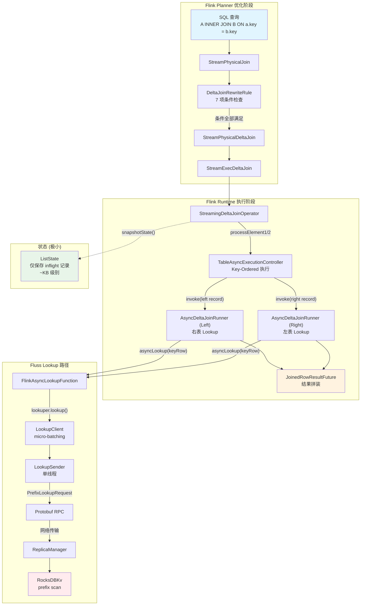
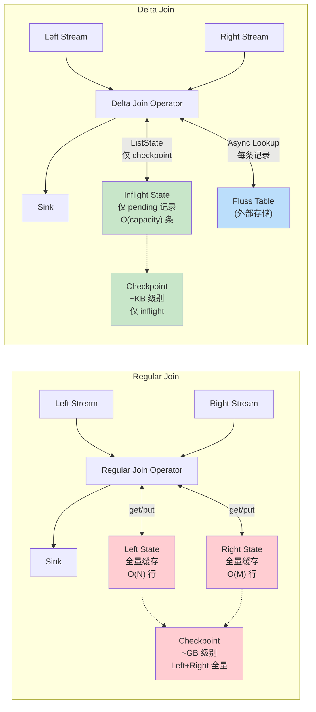
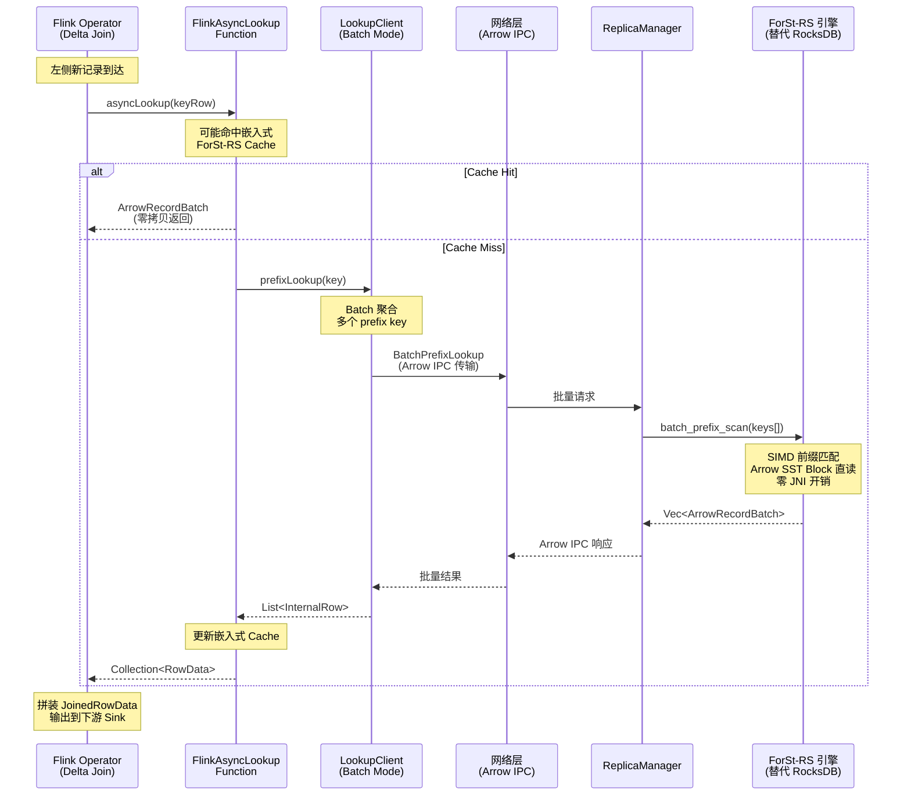

# Delta Join 可行性研究

## 0. 文档元数据
- **文档 ID**: 1.17
- **状态**: completed
- **依赖**: 1.3, 1.4, 1.7, 1.8, 1.9
- **验证方式**: Delta Join 全链路分析完整 + ForSt-RS 优化方案可行性判定
- **最后更新**: 2026-04-19

---

## 1. Context

### 1.1 Delta Join 背景

Delta Join 是 Apache Flink 2.1 引入的新算子（FLIP-486），通过 index-key lookup 机制将双流 Join 中的状态查询转化为对源表的 Lookup 查询，从而大幅减少 Join 状态量。传统双流 Regular Join 需要在 Flink 状态后端中维护两侧的全部数据；Delta Join 利用外部表（如 Fluss）的 Lookup 能力替代状态存储，只需维护增量（delta）数据在 inflight buffer 中，大幅降低状态大小和 Checkpoint 开销。

Apache Fluss 0.8 起透明支持 Delta Join 优化，当 Flink 2.1+ 的流式 Join 查询满足条件时，Planner 自动将 Regular Join 改写为 Delta Join。

### 1.2 与 ForSt-RS 的关系

ForSt-RS 项目旨在用 Rust 重写 ForSt 存储引擎，消除 JNI 开销、引入向量化和 Arrow 列式数据支持。Delta Join 的核心特点是**将状态后端访问转变为外部 Lookup**，这意味着：

1. Delta Join 对 StateBackend 的直接依赖很小（仅 checkpoint inflight 记录）
2. Fluss 服务端的 Lookup 路径（基于 RocksDB 的 KV 存储）是 ForSt-RS 可以优化的核心目标
3. ForSt-RS 的向量化 batch lookup 能力可以显著提升 Delta Join 的端到端性能

---

## 2. 源码证据

### 2.1 Flink Planner 层

#### 2.1.1 DeltaJoinRewriteRule -- 优化规则入口

**文件**: `flink-table-planner/.../rules/physical/stream/DeltaJoinRewriteRule.java`

```java
// DeltaJoinRewriteRule.java:67-77
@Override
public boolean matches(RelOptRuleCall call) {
    TableConfig tableConfig = unwrapTableConfig(call);
    OptimizerConfigOptions.DeltaJoinStrategy deltaJoinStrategy =
            tableConfig.get(OptimizerConfigOptions.TABLE_OPTIMIZER_DELTA_JOIN_STRATEGY);
    if (OptimizerConfigOptions.DeltaJoinStrategy.NONE == deltaJoinStrategy) {
        return false;
    }
    StreamPhysicalJoin join = call.rel(0);
    return DeltaJoinUtil.canConvertToDeltaJoin(join);
}
```

规则注册于 `FlinkStreamRuleSets.scala:537`，在物理优化阶段执行。

#### 2.1.2 DeltaJoinUtil.canConvertToDeltaJoin -- 七项优化条件

**文件**: `flink-table-planner/.../plan/utils/DeltaJoinUtil.java:83-108`

```java
public static boolean canConvertToDeltaJoin(StreamPhysicalJoin join) {
    // 1. 仅支持 INNER JOIN
    if (!isJoinTypeSupported(flinkJoinType)) return false;
    // 2. 至少一对 join key
    if (!areJoinConditionsSupported(join)) return false;
    // 3. 下游接受 duplicate changes
    if (!canJoinOutputDuplicateChanges(join)) return false;
    // 4. 所有输入必须是 INSERT-ONLY（Flink 2.1）或无 DELETE 的 CDC（Flink 2.2）
    if (!areAllInputsInsertOnly(join)) return false;
    // 5. 上游节点在白名单内（TableSourceScan, Exchange）
    if (!areAllJoinInputsInWhiteList(join)) return false;
    // 6+7. 表源支持 async Lookup 且 join key 包含至少一个完整索引
    return areAllJoinTableScansSupported(join);
}
```

#### 2.1.3 索引检查逻辑

**文件**: `DeltaJoinUtil.java:252-298`

```java
private static boolean isTableScanSupported(TableScan tableScan, int[] lookupKeys) {
    // ...
    DynamicTableSource source = tableSourceTable.tableSource();
    if (!(source instanceof LookupTableSource)) return false;

    int[][] idxsOfAllIndexes = getColumnIndicesOfAllTableIndexes(tableSourceTable);
    if (idxsOfAllIndexes.length == 0) return false;

    Set<Integer> lookupKeysSet = Arrays.stream(lookupKeys).boxed().collect(Collectors.toSet());
    boolean lookupKeyContainsOneIndex =
            Arrays.stream(idxsOfAllIndexes)
                    .anyMatch(idxsOfIndex ->
                            Arrays.stream(idxsOfIndex).allMatch(lookupKeysSet::contains));
    if (!lookupKeyContainsOneIndex) return false;

    return LookupJoinUtil.isAsyncLookup(tableSourceTable, lookupKeysSet, ...);
}
```

**关键发现**: Delta Join 要求表源必须实现 `LookupTableSource` 接口、提供至少一个索引、且 join key 必须包含该索引的全部列。这是 Fluss 通过 `bucket.key` 配置的 prefix key 索引来满足的。

### 2.2 Flink Runtime 层

#### 2.2.1 StreamExecDeltaJoin -- 执行计划翻译

**文件**: `flink-table-planner/.../exec/stream/StreamExecDeltaJoin.java:204-271`

核心翻译逻辑创建了 **两个** `AsyncDeltaJoinRunner`，分别用于左侧记录查询右表和右侧记录查询左表：

```java
// StreamExecDeltaJoin.java:290-314
AsyncDeltaJoinRunner leftLookupTableAsyncFunction =
        createAsyncDeltaJoinRunner(..., leftLookupKeys, false);  // 右侧记录 -> lookup 左表
AsyncDeltaJoinRunner rightLookupTableAsyncFunction =
        createAsyncDeltaJoinRunner(..., rightLookupKeys, true);  // 左侧记录 -> lookup 右表

return new StreamingDeltaJoinOperatorFactory(
        rightLookupTableAsyncFunction,
        leftLookupTableAsyncFunction,
        leftJoinKeySelector,
        rightJoinKeySelector, ...);
```

**关键发现**: Delta Join 是**双向 Lookup**，左右两侧各有独立的 Async Lookup Function。

#### 2.2.2 StreamingDeltaJoinOperator -- 核心算子

**文件**: `flink-table-runtime/.../join/deltajoin/StreamingDeltaJoinOperator.java`

**状态使用模式**（行 98, 230-255）:
```java
private static final String STATE_NAME = "_delta_join_operator_async_wait_state_";

// initializeState(): 使用 ListState 保存 inflight 的记录用于 checkpoint 恢复
recoveredStreamElements =
    context.getKeyedStateStore()
        .getListState(new ListStateDescriptor<>(STATE_NAME, stateSerializer));
```

**处理逻辑**（行 300-358）:
```java
@Override
public void processElement1(StreamRecord<RowData> element) throws Exception {
    processElement(element, LEFT_INPUT_INDEX);
}

private void processElement(StreamRecord<RowData> element, int inputIndex) throws Exception {
    Preconditions.checkArgument(
            RowKind.INSERT == element.getValue().getRowKind(),
            "Currently, delta join only supports to consume append only stream.");
    tryProcess();  // 背压控制：等待 inflight 数 < capacity
    asyncExecutionController.submitRecord(record, null, inputIndex);
}
```

**调用链**（行 313-326）:
```java
public void invoke(AecRecord<RowData, RowData> element) throws Exception {
    final ReusableKeyedResultHandler resultHandler = resultHandlerBuffer.take();
    resultHandler.reset(element);
    if (isLeft) {
        leftTriggeredUserFunction.asyncInvoke(element.getRecord().getValue(), resultHandler);
    } else {
        rightTriggeredUserFunction.asyncInvoke(element.getRecord().getValue(), resultHandler);
    }
}
```

**Checkpoint 逻辑**（行 380-418）: 在 snapshot 时遍历 `asyncExecutionController.pendingElements()`，将所有正在等待的记录序列化到 `ListState`。

#### 2.2.3 AsyncDeltaJoinRunner -- 异步 Lookup 执行器

**文件**: `flink-table-runtime/.../join/deltajoin/AsyncDeltaJoinRunner.java`

```java
// AsyncDeltaJoinRunner.java:141-151
@Override
public void asyncInvoke(RowData input, ResultFuture<RowData> resultFuture) throws Exception {
    JoinedRowResultFuture outResultFuture = resultFutureBuffer.take();
    outResultFuture.reset(input, resultFuture);
    fetcher.asyncInvoke(input, outResultFuture);  // 调用生成的 AsyncFunction
}
```

`fetcher` 是通过 `LookupJoinCodeGenerator.generateAsyncLookupFunction()` 代码生成的异步查找函数，最终调用 `FlinkAsyncLookupFunction.asyncLookup()` 或对应的 `AsyncTableFunction.eval()`。

**JoinedRowResultFuture**（行 220-256）完成 lookup 结果到 Join 输出行的拼装：
```java
if (treatRightAsLookupTable) {
    outRow = new JoinedRowData(streamRow.getRowKind(), streamRow, lookupRow);
} else {
    outRow = new JoinedRowData(streamRow.getRowKind(), lookupRow, streamRow);
}
```

#### 2.2.4 TableAsyncExecutionController -- Key-Ordered 执行

**文件**: `flink-table-runtime/.../join/lookup/keyordered/TableAsyncExecutionController.java`

```java
// TableAsyncExecutionController.java:43-55
/**
 * The TableAsyncExecutionController is used to keep key ordered process mode for
 * async operator. It allows for out of order processing on different keys and
 * sequential processing of StreamElement on the same key.
 */
```

**关键发现**: 同一 key 的记录严格按序处理，不同 key 可以并发。这是 Delta Join 保证最终一致性的基础。

### 2.3 Fluss 侧

#### 2.3.1 FlinkTableSource -- LookupTableSource 实现

**文件**: `fluss-flink-common/.../source/FlinkTableSource.java:401-439`

```java
@Override
public LookupRuntimeProvider getLookupRuntimeProvider(LookupContext context) {
    LookupNormalizer lookupNormalizer = LookupNormalizer.validateAndCreateLookupNormalizer(
            context.getKeys(), primaryKeyIndexes, bucketKeyIndexes, ...);
    if (lookupAsync) {
        AsyncLookupFunction asyncLookupFunction =
                new FlinkAsyncLookupFunction(flussConfig, tablePath, ...);
        if (cache != null) {
            return PartialCachingAsyncLookupProvider.of(asyncLookupFunction, cache);
        } else {
            return AsyncLookupFunctionProvider.of(asyncLookupFunction);
        }
    } // ...
}
```

#### 2.3.2 FlinkAsyncLookupFunction -- 异步 Lookup 核心

**文件**: `fluss-flink-common/.../source/lookup/FlinkAsyncLookupFunction.java:130-163`

```java
@Override
public CompletableFuture<Collection<RowData>> asyncLookup(RowData keyRow) {
    RowData normalizedKeyRow = lookupNormalizer.normalizeLookupKey(keyRow);
    InternalRow flussKeyRow = lookupRow.replace(normalizedKeyRow);
    CompletableFuture<Collection<RowData>> future = new CompletableFuture<>();
    lookuper.lookup(flussKeyRow)
            .whenComplete((result, throwable) -> {
                if (throwable != null) { /* error handling */ }
                else { handleLookupSuccess(future, result.getRowList(), remainingFilter); }
            });
    return future;
}
```

**关键发现**: Lookup 类型分为两种：
- **精确 Lookup** (`LookupType.LOOKUP`): 通过全量主键查找
- **前缀 Lookup** (`LookupType.PREFIX_LOOKUP`): 通过 bucket key（前缀键）查找，返回匹配的所有行

#### 2.3.3 LookupClient -- 客户端批量化

**文件**: `fluss-client/.../lookup/LookupClient.java:54-113`

```java
// LookupClient 使用单线程后台发送模式
private ExecutorService createThreadPool() {
    // according to benchmark, increase the thread pool size improve not so much
    return Executors.newFixedThreadPool(1, new ExecutorThreadFactory(LOOKUP_THREAD_PREFIX));
}

public CompletableFuture<List<byte[]>> prefixLookup(
        TablePath tablePath, TableBucket tableBucket, byte[] keyBytes) {
    PrefixLookupQuery prefixLookup = new PrefixLookupQuery(tablePath, tableBucket, keyBytes);
    lookupQueue.appendLookup(prefixLookup);
    return prefixLookup.future();
}
```

**关键发现**: Lookup 请求先入队到 `LookupQueue`，由后台 `LookupSender` 线程批量发送。这是一种 micro-batching 机制。

#### 2.3.4 RocksDBKv -- 服务端前缀查找

**文件**: `fluss-server/.../kv/rocksdb/RocksDBKv.java:115-131`

```java
public List<byte[]> prefixLookup(byte[] prefixKey) {
    List<byte[]> pkList = new ArrayList<>();
    RocksIterator iterator = db.newIterator(defaultColumnFamilyHandle, readOptions);
    try {
        iterator.seek(prefixKey);
        while (iterator.isValid() && BytesUtils.prefixEquals(prefixKey, iterator.key())) {
            pkList.add(iterator.value());
            iterator.next();
        }
    } finally { /* cleanup */ }
    return pkList;
}
```

**关键发现**: 前缀查找依赖 RocksDB Iterator 的 `seek()` + 前缀扫描。每次查找都需要创建新的 Iterator，涉及 JNI 调用和跨语言边界的数据拷贝。

---

## 3. 发现

### 3.1 P1: Delta Join 机制全貌

#### 3.1.1 优化条件总结

DeltaJoinRewriteRule 的七项优化条件：

| # | 条件 | 检查方法 | 说明 |
|---|------|---------|------|
| 1 | INNER JOIN | `isJoinTypeSupported()` | 仅支持内连接 |
| 2 | 至少一对等值 join key | `areJoinConditionsSupported()` | `JoinInfo.pairs()` 非空 |
| 3 | 下游接受 duplicate changes | `canJoinOutputDuplicateChanges()` | 需要幂等 sink |
| 4 | 输入为 INSERT-ONLY（2.1）/ 无 DELETE CDC（2.2） | `areAllInputsInsertOnly()` | `ChangelogMode.containsOnly(INSERT)` |
| 5 | 上游节点在白名单内 | `areAllJoinInputsInWhiteList()` | `{TableSourceScan, Exchange}` |
| 6 | 表源实现 `LookupTableSource` | `isTableScanSupported()` | 且支持 async lookup |
| 7 | Join key 包含至少一个完整索引 | `getColumnIndicesOfAllTableIndexes()` | Fluss 的 prefix key 索引 |

**适用 SQL 模式**:
```sql
-- Flink 2.1: 仅 INSERT-ONLY 源
INSERT INTO sink
SELECT * FROM left_src INNER JOIN right_src ON left_src.key = right_src.key;

-- Flink 2.2: 支持无 DELETE 的 CDC 源
INSERT INTO sink
SELECT * FROM left_src INNER JOIN right_src ON left_src.key = right_src.key
WHERE left_src.filter_col > 0;
```

#### 3.1.2 执行逻辑

当新记录到达时的处理流程：

1. **左侧新记录到达** (`processElement1`):
   - 背压检查 (`tryProcess`): 如果 inflight 数 >= capacity，通过 `mailboxExecutor.yield()` 等待
   - 提交到 `TableAsyncExecutionController`，按 join key 分组
   - AEC 按 key 顺序触发 `invoke()` 方法
   - `invoke()` 调用 `leftTriggeredUserFunction.asyncInvoke()`，即对右表的异步 Lookup
   - Lookup 返回后，`JoinedRowResultFuture.complete()` 将左侧记录与右表 lookup 结果拼接为 `JoinedRowData`

2. **右侧新记录到达** (`processElement2`):
   - 完全对称的处理流程，但 lookup 目标是左表

#### 3.1.3 与 Flink AsyncState API 的关系

`AsyncDeltaJoinRunner` 继承自 `RichAsyncFunction`，使用 Flink 传统的异步 I/O 框架（`AsyncFunction` + `ResultFuture`），**不依赖** Flink 2.2 的 State v2 异步状态 API（FLIP-426）。

`TableAsyncExecutionController` 是一个**独立于** `AsyncExecutionController` 的实现，专门为 Delta Join 设计。其与 Flink 核心 AEC 的关键区别是：它不涉及 State 访问，仅控制 lookup 请求的 key-ordered 执行。

#### 3.1.4 Delta Join vs Regular Join 状态量对比

| 维度 | Regular Join | Delta Join |
|------|-------------|------------|
| **左侧状态** | 全量缓存左表数据 (MapState) | 仅保存 inflight 记录 (ListState) |
| **右侧状态** | 全量缓存右表数据 (MapState) | 仅保存 inflight 记录 (ListState) |
| **状态增长** | O(左表行数 + 右表行数) | O(并发 inflight 数)，默认 capacity=100 |
| **Checkpoint 大小** | 与数据量成正比（可达 GB 级别） | 仅 inflight 记录，通常 KB~MB 级 |
| **恢复时间** | 需从 checkpoint 恢复全量数据 | 仅恢复 inflight 记录并重新 lookup |
| **额外网络开销** | 无 | 每条记录需双向 Lookup（网络 RPC） |
| **适用场景** | 通用 | 表源支持高效 Lookup 的场景 |

**定量估算**: 假设双流 Join 的两侧各 1 亿行，每行 200 字节：
- Regular Join 状态量: ~40GB（两侧各 20GB）
- Delta Join 状态量: ~20KB（假设 capacity=100，每条记录 200 字节）
- 状态减少比例: **>99.99%**

### 3.2 P2: Fluss 的 Lookup 支撑能力

#### 3.2.1 Prefix Key Lookup 数据路径

完整路径：
```
Flink Operator (asyncInvoke)
  -> FlinkAsyncLookupFunction.asyncLookup()
    -> Lookuper.lookup(InternalRow)  [Fluss Client]
      -> LookupClient.prefixLookup(tablePath, bucket, keyBytes)
        -> LookupQueue.appendLookup()  [入队 micro-batch]
        -> LookupSender (后台线程)
          -> makePrefixLookupRequest()  [构建 RPC 请求]
          -> TabletServerGateway.prefixLookup()  [网络 RPC]
            -> ReplicaManager.prefixLookup()  [TabletServer]
              -> Replica.prefixLookup()
                -> RocksDBKv.prefixLookup()
                  -> RocksIterator.seek(prefixKey) + 前缀扫描
```

**关键路径特征**:
- Client 端: 单线程 `LookupSender` 通过 `LookupQueue` 做 micro-batching
- 网络层: Protobuf RPC（`PrefixLookupRequest`/`PrefixLookupResponse`）
- Server 端: RocksDB Iterator + prefix scan，每次请求创建新 Iterator

#### 3.2.2 Lookup Cache 机制

Flink 侧通过 `FlinkTableSource.getLookupRuntimeProvider()` 支持 Lookup Cache：

- **无缓存模式**: `AsyncLookupFunctionProvider.of(asyncLookupFunction)`
- **部分缓存模式**: `PartialCachingAsyncLookupProvider.of(asyncLookupFunction, cache)`
  - 由 Flink 框架管理 `LookupCache`（通常基于 Caffeine/Guava Cache）
  - Cache Miss 时触发实际的 Fluss Lookup
  - 可通过 `'lookup.cache' = 'partial'` 配置启用

在 `Flink22DeltaJoinITCase` 测试中，Delta Join Cache 通过 `TABLE_EXEC_DELTA_JOIN_CACHE_ENABLED` 配置控制。

#### 3.2.3 当前 Lookup 性能瓶颈

基于文档 1.3 和 1.7 的分析，Lookup 路径的主要瓶颈：

| 瓶颈 | 位置 | 影响 | 来源 |
|------|------|------|------|
| **JNI 调用开销** | RocksDBKv.prefixLookup() | 每次 lookup 至少 2 次 JNI 调用（创建 Iterator + seek） | 文档 1.3 |
| **Iterator 创建** | `db.newIterator()` | 需获取 SuperVersion 引用、分配内存 | 文档 1.2 |
| **数据拷贝** | RocksIterator.key()/value() | 每条结果 2 次拷贝（C++ -> Java byte[]） | 文档 1.3 |
| **序列化/反序列化** | Client/Server 两端 | key 序列化 + 结果反序列化 + Protobuf 编解码 | 文档 1.7 |
| **单线程 LookupSender** | LookupClient | 所有 lookup 请求共享单一发送线程 | LookupClient.java:95 |
| **逐条处理** | prefixLookup() | 每次 lookup 独立创建 Iterator，无 batch 语义 | RocksDBKv.java:115 |

### 3.3 P3: ForSt-RS 与 Delta Join 的关系

#### 3.3.1 Delta Join 的状态使用模式

Delta Join 对 StateBackend 的依赖**非常有限**：

| 状态操作 | 使用位置 | 类型 | 频率 |
|---------|---------|------|------|
| `getKeyedStateStore().getListState()` | `initializeState()` | ListState | 仅初始化时 |
| `recoveredStreamElements.get()` | `triggerRecoveryProcess()` | ListState 读 | 仅恢复时 |
| `recoveredStreamElements.update()` | `snapshotState()` | ListState 写 | 每次 checkpoint |
| `recoveredStreamElements.clear()` | `clearLegacyState()` | ListState 清理 | 每次 checkpoint |
| `getKeyedStateBackend().getKeys()` | `getAllStateKeys()` | 遍历 key | 每次 checkpoint |

**关键发现**: Delta Join **不使用 ValueState/MapState**，仅使用 ListState 保存 checkpoint 期间的 inflight 记录。状态量极小（默认 capacity=100 条 inflight 记录）。因此，**ForSt-RS 优化 StateBackend 对 Delta Join 的直接影响微乎其微**。

#### 3.3.2 ForSt-RS 的 Lookup 优化空间

Delta Join 的核心性能瓶颈在 **Fluss Server 的 Lookup 路径**，而非 Flink StateBackend。ForSt-RS 对 Fluss 侧的优化才是关键：

**路径 A: Fluss KV 存储引擎替换**

Fluss 的 `RocksDBKv` 使用 RocksDB 作为 KV 存储引擎（每个 bucket 一个独立实例）。ForSt-RS 替换此层可以：

1. **消除 JNI 开销**: Rust 引擎无需 JNI 调用，点查延迟降低 ~60%（文档 1.8 R7 估算）
2. **减少数据拷贝**: Arrow 列式数据可在 Java/Rust 之间零拷贝共享（文档 1.9）
3. **共享引擎实例**: 消除每 bucket 独立 RocksDB 实例的资源碎片化（文档 1.8 R1）

**路径 B: 向量化 Batch Lookup**

当前 `prefixLookup()` 是逐条处理：每次创建 Iterator、seek、扫描。ForSt-RS 可以提供：

1. **Batch Prefix Scan**: 多个 prefix key 合并为单次引擎调用
2. **Arrow RecordBatch 输出**: 扫描结果直接输出为 Arrow 列式格式，避免逐行 byte[] 拷贝
3. **SIMD 前缀比较**: 利用 SIMD 加速 `prefixEquals` 检查

**路径 C: Flink 侧 Lookup Cache 优化**

ForSt-RS 作为嵌入式缓存引擎：

1. **嵌入式 KV Cache**: 在 Flink TaskManager 内嵌 ForSt-RS 实例作为 Lookup Cache
2. **Arrow 零拷贝 Cache**: 缓存 Arrow RecordBatch，避免反序列化开销
3. **前缀索引**: 利用 LSM-Tree 的有序特性加速前缀查找

#### 3.3.3 向量化 Batch Lookup 对 Delta Join 的潜在影响

Delta Join 的 `TableAsyncExecutionController` 已经按 key 分组管理 inflight 请求。如果 ForSt-RS 提供 batch lookup API：

1. **Client 端聚合**: LookupSender 已有 micro-batching 机制（`LookupQueue`），可以增强为按 bucket 聚合多个 prefix key 的 batch lookup
2. **Server 端向量化**: 多个 prefix key 的查找可以共享一个 Iterator 会话，减少 Iterator 创建开销
3. **网络层合并**: 多个 lookup 请求合并为单个 RPC，减少网络往返

**估算影响**:
- 单次 Lookup 延迟: ~1-5ms（网络 RPC + RocksDB Iterator）
- Batch Lookup（10 keys）: ~2-8ms（网络合并 + 共享 Iterator）
- 延迟改善: 聚合场景下 ~30-60% throughput 提升

#### 3.3.4 Arrow 零拷贝在 Delta Join 场景的应用空间

Delta Join 数据流中的 Arrow 零拷贝机会：

| 环节 | 当前格式 | Arrow 零拷贝机会 | 可行性 |
|------|---------|-----------------|--------|
| Flink -> Fluss Client | `RowData` -> `byte[]` | `RowData` -> `ArrowRecordBatch` | 中（需改造 LookupClient） |
| Fluss Client -> Server | Protobuf `bytes` | Arrow IPC | 低（需改造 RPC 协议） |
| Server KV 存储 | RocksDB `byte[]` | Arrow SST Block | 高（ForSt-RS 核心目标） |
| Server -> Fluss Client | Protobuf `bytes` | Arrow IPC | 低（同上） |
| Fluss Client -> Flink | `byte[]` -> `RowData` | `ArrowRecordBatch` -> `RowData` | 中（需改造 FlinkAsyncLookupFunction） |

### 3.4 P4: 可行性评估

#### 3.4.1 ForSt-RS 是否需要为 Delta Join 做特殊适配？

**结论: 不需要特殊适配，但可以提供增强优化。**

理由：
1. Delta Join 对 Flink StateBackend 的依赖极小（仅 ListState），ForSt-RS 替换 ForSt 后自然兼容
2. Delta Join 的性能瓶颈在 Fluss Server 的 Lookup 路径，这正是 ForSt-RS 作为 Fluss KV 引擎可以优化的地方
3. ForSt-RS 无需为 Delta Join 的 Flink Operator 层做任何修改

#### 3.4.2 ForSt-RS 可以提供的独特优势

| 优势 | 描述 | 影响程度 |
|------|------|---------|
| **零 JNI 开销** | Rust 引擎通过 FFM/direct call 替代 JNI | 点查延迟降低 30-60% |
| **Arrow 列式存储** | KV 数据以 Arrow RecordBatch 存储于 SST | 批量扫描吞吐提升 3-5x |
| **Batch Prefix Scan** | 多 prefix key 合并扫描 | Delta Join 吞吐提升 30-60% |
| **共享引擎实例** | 多 bucket 共享存储引擎 | 内存节省 50%+ |
| **SIMD 加速** | 前缀比较、hash 计算向量化 | 计算密集路径加速 2-4x |
| **io_uring IO** | 异步非阻塞 IO | IO 密集场景吞吐提升 |

#### 3.4.3 推荐的 ForSt-RS Delta Join 优化路径

**短期（Phase 2-3，0-6 个月）**: ForSt-RS 基础引擎 + Fluss KV 集成

- ForSt-RS 替换 Fluss `RocksDBKv`，消除 JNI 开销
- 提供 Rust 原生的 `prefix_scan(key) -> Iterator` API
- 判定: **可行** -- ForSt-RS 的核心功能即包含此能力

**中期（Phase 4-5，6-12 个月）**: Batch Lookup + Arrow 输出

- 提供 `batch_prefix_scan(keys[]) -> Vec<ArrowRecordBatch>` API
- 改造 Fluss LookupSender 支持 batch prefix lookup RPC
- 改造 FlinkAsyncLookupFunction 支持 batch 语义
- 判定: **有条件可行** -- 需要 Fluss Client/Server RPC 协议配合改造

**长期（Phase 6+，12+ 个月）**: 嵌入式 Lookup Cache + 全链路 Arrow 零拷贝

- 在 Flink TaskManager 内嵌 ForSt-RS 作为 Lookup Cache
- 全链路 Arrow IPC 传输（替换 Protobuf bytes）
- 利用 FFM 实现 Java -> Rust 零拷贝
- 判定: **有条件可行** -- 需要 Flink 版本支持 FFM + Fluss RPC 协议重构

#### 3.4.4 风险评估

| 风险 | 级别 | 缓解措施 |
|------|------|---------|
| ForSt-RS 引擎稳定性 | 高 | 充分的 ITCase 覆盖 + 灰度发布 |
| Fluss RPC 协议变更兼容性 | 中 | 向后兼容的协议演进 + 特性开关 |
| Arrow 列式存储的写放大 | 中 | 混合存储策略（热数据行式 + 冷数据列式） |
| 嵌入式 Cache 内存管理 | 中 | 严格的内存预算 + LRU 淘汰 |
| Flink FFM 依赖（JDK 22+） | 低 | FFM 可选 + 保留 JNI 回退路径 |

---

## 4. 架构图 / 时序图

### 4.1 Delta Join 全链路架构图



### 4.2 Delta Join vs Regular Join 对比图



### 4.3 ForSt-RS 优化后的 Delta Join 数据流



---

## 5. 与 ForSt-RS 重构的关系

### 5.1 直接影响关系矩阵

| ForSt-RS 能力 | 对 Delta Join 的影响 | 影响路径 | 优先级 |
|--------------|---------------------|---------|--------|
| **R1: 流式场景适配** | 间接 -- 优化 Fluss KV 引擎的点查/前缀查找延迟 | Fluss Server 端 | P0 |
| **R2: 数据向量化** | 直接 -- Arrow SST Block 支持批量前缀扫描 | Fluss Server 端 | P0 |
| **R3: IO 向量化** | 间接 -- io_uring 加速 SST 文件读取 | Fluss Server 端 | P1 |
| **R4: 计算向量化** | 直接 -- SIMD 加速前缀比较和 hash 计算 | Fluss Server 端 | P2 |
| **R5: 加速策略** | 直接 -- SBBF Bloom Filter + Block min/max 统计加速前缀查找 | Fluss Server 端 | P1 |
| **R6: 双轨兼容** | 无关 -- Delta Join 不依赖 State v2 API | N/A | N/A |
| **R7: FFM 替代 JNI** | 间接 -- 如果 Fluss Server 内嵌 ForSt-RS 则消除 JNI | Fluss Server 端 | P1 |

### 5.2 核心洞察

**Delta Join 是 ForSt-RS 优化 Fluss Lookup 路径的最佳验证场景**。

原因：
1. **清晰的性能基线**: Regular Join 的状态量已知，Delta Join 的 Lookup 延迟可精确测量
2. **明确的优化目标**: Lookup 延迟直接决定 Delta Join 的端到端性能
3. **可度量的收益**: 吞吐量、P99 延迟、资源消耗均可对比
4. **渐进式集成**: 可以先优化 Server 端 KV 引擎，再扩展到 Client 端 Cache

### 5.3 与前置文档的关联

| 前置文档 | 关联内容 | 对 Delta Join 的意义 |
|---------|---------|---------------------|
| 1.3 ForSt JNI 接口 | `multiGet` N*3 次拷贝、Iterator JNI 开销 | 解释了 Fluss prefixLookup 的 JNI 瓶颈 |
| 1.4 StateBackend API | 异步 State v2 API 体系 | 确认 Delta Join 不依赖 State v2 |
| 1.7 瓶颈分析 | 五维度瓶颈矩阵 | 定位 Lookup 路径的序列化和 JNI 瓶颈 |
| 1.8 Gap 分析 | R1-R13 差距评估 | ForSt-RS 各能力对 Delta Join 的适用性映射 |
| 1.9 Arrow 零拷贝 | Java/Rust FFM 零拷贝方案 | 全链路 Arrow 传输的技术基础 |

---

## 6. Open Questions / 待确认项

### 6.1 Fluss Lookup 协议演进

当前 Fluss 的 Lookup RPC 使用 Protobuf `bytes` 传输 KV 数据。如果要实现全链路 Arrow IPC，需要：
- 新增 Arrow IPC 格式的 Lookup RPC 端点
- 向后兼容的协议版本协商
- 评估 Arrow IPC overhead 对小批量 lookup 的影响

### 6.2 嵌入式 ForSt-RS Cache 的内存管理

在 Flink TaskManager 内嵌 ForSt-RS 作为 Lookup Cache 需要解决：
- 与 Flink Managed Memory 的集成（TaskManager 内存预算分配）
- Cache 失效策略（TTL vs LRU vs 版本号）
- 与 Flink 现有 `LookupCache` 框架的集成方式

### 6.3 Batch Prefix Lookup 的 Key 聚合策略

当前 `TableAsyncExecutionController` 按 key 顺序串行处理，batch 化需要考虑：
- 跨 key 的 batch 聚合是否破坏 key-ordered 语义
- batch window 的大小和超时如何配置
- 与 Fluss LookupQueue 的 micro-batching 机制的协同

### 6.4 Flink 版本演进的影响

Delta Join 仍在快速演进中（2.1 -> 2.2 已新增 CDC 源、Filter/Projection、Cache 支持），后续版本可能：
- 支持 LEFT/RIGHT/FULL OUTER JOIN
- 支持多路 Join (A JOIN B JOIN C)
- 支持通用二级索引（非仅 prefix key）
- ForSt-RS 的 Lookup 优化需要跟踪 Flink 侧的演进

### 6.5 Delta Join 最终一致性模型

Delta Join 采用最终一致性（eventual consistency）模型：
- 同一 key 的不同时间点 lookup 可能返回不同结果
- 下游 sink 必须支持幂等更新（upsert）
- ForSt-RS 的 Cache 失效策略需要与此一致性模型对齐

---

## 7. 可行性判定汇总

| 优化方向 | 判定 | 条件/说明 |
|---------|------|----------|
| ForSt-RS 替换 Fluss RocksDBKv | **可行** | ForSt-RS 提供兼容的 get/prefixScan API 即可 |
| Rust 原生 Prefix Scan（消除 JNI） | **可行** | ForSt-RS 核心功能，预计延迟降低 30-60% |
| Batch Prefix Scan API | **有条件可行** | 需要 Fluss Client/Server 协同改造 LookupSender 和 RPC 协议 |
| Arrow SST Block 直读 | **有条件可行** | 需要 ForSt-RS SST 文件格式支持 Arrow RecordBatch（文档 1.11） |
| 全链路 Arrow IPC 传输 | **有条件可行** | 需要 Fluss RPC 协议重构 + 评估小批量 overhead |
| 嵌入式 ForSt-RS Lookup Cache | **有条件可行** | 需要 Flink Managed Memory 集成 + FFM (JDK 22+) |
| SIMD 前缀比较加速 | **可行** | Rust `std::arch` SIMD + arrow-rs 计算内核 |
| 改造 Flink Delta Join Operator | **不可行** | Delta Join Operator 在 Flink 侧，ForSt-RS 不应直接修改 |
