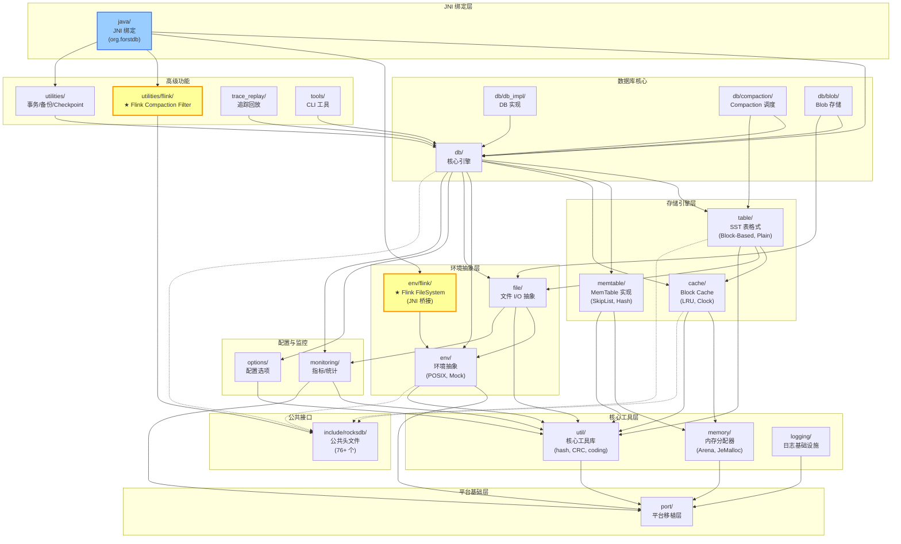

# ForSt 模块清单

## 0. 文档元数据
- **文档 ID**: 1.1
- **状态**: completed
- **依赖**: 无
- **验证方式**: 检查模块清单覆盖率 vs 仓库顶层目录
- **最后更新**: 2026-04-19

## 1. Context

ForSt (Fork of RocksDB for STate) 是 Apache Flink 的 C++ 状态存储引擎，基于 Facebook RocksDB 分支开发。仓库位于 `~/code/github/ForSt`，当前分支 `rt_recode`。

ForSt 在 RocksDB 核心引擎基础上增加了：
- **Flink FileSystem 环境抽象**（通过 JNI 回调 Flink 的 FileSystem API）
- **Flink 状态 Compaction Filter**（支持 TTL 过期清理 Flink 状态）
- **JNI 绑定层**（Java 包名 `org.forstdb`，为 Flink 提供 Java API）
- **Flink 文件系统测试 Mock**（`java/flinktestmock/`）

项目使用 C++17 标准，通过 CMake 和 Makefile 构建，源文件总量约 1,500+ 个（.cc/.h/.java）。

## 2. 源码证据

### 2.1 构建系统中的 Flink 特有源文件

**文件**: `src.mk:112-117`
```makefile
  env/flink/env_flink.cc
  env/flink/jvm_util.cc
  env/flink/jni_helper.cc
  env/flink/env_flink_test_suite.cc
  utilities/flink/flink_compaction_filter.cc
  utilities/flink/flink_compaction_filter_test.cc
```

### 2.2 Flink 环境实现入口

**文件**: `env/flink/env_flink.cc:28-35`
```cpp
// This file defines a Flink environment for ForSt. It uses the JNI call
// to access Flink FileSystem. All files created by one instance of ForSt
// will reside on the actual Flink FileSystem.
namespace ROCKSDB_NAMESPACE {

// Appends to an existing file in Flink FileSystem.
class FlinkWritableFile : public FSWritableFile {
 private:
  const std::string file_path_;
  const jobject file_system_instance_;
  jobject fs_data_output_stream_instance_;
  JavaClassCache* class_cache_;
```

### 2.3 JNI Helper 中的 Java 类缓存

**文件**: `env/flink/jni_helper.h:28-30`
```cpp
// A cache for java classes to avoid calling FindClass frequently
class JavaClassCache {
 public:
  // Frequently-used class type representing jclasses which will be cached.
```

### 2.4 Flink Compaction Filter

**文件**: `utilities/flink/flink_compaction_filter.h:30-44`
```cpp
/**
 * Compaction filter for removing expired Flink state entries with ttl.
 *
 * Note: this compaction filter is a special implementation, designed for usage
 * only in Apache Flink project.
 */
class FlinkCompactionFilter : public CompactionFilter {
 public:
  enum StateType {
    Disabled,
    Value,
    List
  };
  class TimeProvider {
    virtual int64_t CurrentTimestamp() const = 0;
  };
```

### 2.5 核心 DB 接口

**文件**: `include/rocksdb/db.h:157`
```cpp
class DB {
```

### 2.6 Env 抽象接口

**文件**: `include/rocksdb/env.h:147`
```cpp
class Env : public Customizable {
```

### 2.7 Cache 接口

**文件**: `include/rocksdb/advanced_cache.h:44`
```cpp
class Cache {
```

## 3. 发现

### 3.1 模块清单表

| # | 模块 | 路径 | 源文件数 | 职责 | 关键类/文件 | 对外接口 | 依赖关系 |
|---|------|------|---------|------|------------|---------|---------|
| 1 | **db** (核心引擎) | `db/` | 290 | 数据库核心：打开/关闭、读写、flush、version 管理、WAL | `db/db_impl/db_impl.cc`, `db/version_set.cc`, `db/column_family.cc`, `db/write_batch.cc` | `include/rocksdb/db.h` (`class DB`) | env, table, cache, memtable, file, util, options, monitoring |
| 2 | **db/db_impl** (引擎实现) | `db/db_impl/` | 14 | DB 接口的核心实现，拆分为 open/write/compaction/files 等子文件 | `db_impl.cc`, `db_impl_write.cc`, `db_impl_compaction_flush.cc`, `db_impl_open.cc` | 内部（通过 `class DB` 暴露） | db/compaction, db/blob, env, table |
| 3 | **db/compaction** (Compaction) | `db/compaction/` | 26 | LSM-Tree compaction 调度与执行：Level/Universal/FIFO 策略 | `compaction_job.cc`, `compaction_picker.cc`, `compaction_picker_universal.cc`, `compaction_iterator.cc` | 内部 | db, table, file, util |
| 4 | **db/blob** (Blob 存储) | `db/blob/` | 42 | BlobDB：大 value 分离存储，blob 文件读写与 GC | `blob_file_builder.cc`, `blob_file_reader.cc`, `blob_source.cc`, `blob_file_cache.cc` | 内部 | db, file, cache |
| 5 | **table** (SST 表格式) | `table/` | 126 | SST 文件格式：Block-Based（默认）、Plain、Cuckoo、Adaptive | `table/block_based/block_based_table_reader.cc`, `table/block_based/block_based_table_builder.cc`, `table/block_based/filter_policy.cc` | `include/rocksdb/table.h` (`class TableFactory`) | cache, file, util, env |
| 6 | **cache** (缓存) | `cache/` | 33 | Block Cache 实现：LRU Cache、HyperClock Cache、Compressed Secondary Cache、Tiered Secondary Cache | `lru_cache.cc`, `clock_cache.cc`, `compressed_secondary_cache.cc`, `tiered_secondary_cache.cc`, `sharded_cache.cc` | `include/rocksdb/cache.h`, `include/rocksdb/advanced_cache.h` (`class Cache`), `include/rocksdb/secondary_cache.h` | memory, util |
| 7 | **memtable** (内存表) | `memtable/` | 13 | MemTable 数据结构实现：SkipList（默认）、HashSkipList、HashLinkList、Vector | `skiplistrep.cc`, `hash_skiplist_rep.cc`, `hash_linklist_rep.cc`, `vectorrep.cc`, `write_buffer_manager.cc` | `include/rocksdb/memtablerep.h` (`class MemTableRep`), `include/rocksdb/write_buffer_manager.h` | memory, util |
| 8 | **env** (环境抽象) | `env/` | 34 | OS 环境抽象：文件系统、线程、时钟；含 POSIX、Flink、Mock 实现 | `env.cc`, `env_posix.cc`, `fs_posix.cc`, `io_posix.cc`, `mock_env.cc`, `composite_env.cc` | `include/rocksdb/env.h` (`class Env`), `include/rocksdb/file_system.h` (`class FileSystem`) | port, util |
| 9 | **env/flink** (Flink 环境) | `env/flink/` | 8 | **ForSt 特有**：通过 JNI 桥接 Flink FileSystem，实现远程文件系统访问 | `env_flink.cc` (`FlinkWritableFile`, `FlinkSequentialFile`, `FlinkRandomAccessFile`), `jni_helper.cc` (`JavaClassCache`), `jvm_util.cc` | 通过 JNI 暴露给 Java 层 (`org.forstdb.FlinkEnv`) | env (继承 `FileSystem`), JNI |
| 10 | **file** (文件 I/O) | `file/` | 26 | 文件 I/O 高级抽象：预读缓冲、随机读取、顺序写入、SST 文件管理 | `random_access_file_reader.cc`, `writable_file_writer.cc`, `file_prefetch_buffer.cc`, `sst_file_manager_impl.cc`, `delete_scheduler.cc` | `include/rocksdb/sst_file_manager.h` | env, util, monitoring |
| 11 | **include/rocksdb** (公共头文件) | `include/rocksdb/` | 104 | 所有公共 C++ API 头文件（76 个顶层 + 28 个 utilities/ 子目录） | `db.h`, `env.h`, `options.h`, `cache.h`, `table.h`, `status.h`, `slice.h`, `iterator.h`, `write_batch.h`, `compaction_filter.h` | 所有公共接口定义 | 无（纯头文件） |
| 12 | **java** (JNI 绑定) | `java/` | 442 | Java/JNI 绑定层：Java API (`org.forstdb`)、~85 个 JNI .cc 文件、Flink 测试 Mock | `java/forstjni/` (85 .cc 文件), `java/src/main/java/org/forstdb/` (Java API), `java/flinktestmock/` (Flink FS mock) | Java 包 `org.forstdb.*` | 所有 C++ 模块（通过 JNI） |
| 13 | **util** (核心工具库) | `util/` | 112 | 底层工具：hash、CRC32、编码、压缩、并发原语、bloom filter | `crc32c.cc`, `coding.cc`, `compression.cc`, `xxhash.cc`, `comparator.cc`, `thread_local.cc`, `rate_limiter.cc` | `include/rocksdb/slice.h`, `include/rocksdb/status.h`, `include/rocksdb/comparator.h`, `include/rocksdb/rate_limiter.h` | port |
| 14 | **utilities** (高级功能) | `utilities/` | 218 | 高级组件：transactions、backup、checkpoint、TTL、merge operators、write_batch_with_index | `transactions/`, `backup/`, `checkpoint/`, `blob_db/`, `write_batch_with_index/`, `persistent_cache/` | `include/rocksdb/utilities/` (28 个头文件) | db, env, util |
| 15 | **utilities/flink** (Flink Compaction Filter) | `utilities/flink/` | 3 | **ForSt 特有**：Flink 状态 TTL compaction filter，支持 Value/List 状态过期清理 | `flink_compaction_filter.cc`, `flink_compaction_filter.h` | 通过 JNI (`org.forstdb.FlinkCompactionFilter`) | `include/rocksdb/compaction_filter.h` |
| 16 | **options** (配置选项) | `options/` | 19 | 配置选项解析与序列化：DBOptions、ColumnFamilyOptions、options 文件读写 | `options.cc`, `db_options.cc`, `cf_options.cc`, `options_helper.cc`, `options_parser.cc`, `configurable.cc` | `include/rocksdb/options.h`, `include/rocksdb/advanced_options.h` | util |
| 17 | **monitoring** (监控指标) | `monitoring/` | 31 | 性能监控：Statistics、Histogram、PerfContext、IOStatsContext、线程状态追踪 | `statistics.cc`, `histogram.cc`, `perf_context.cc`, `iostats_context.cc`, `thread_status_updater.cc` | `include/rocksdb/statistics.h`, `include/rocksdb/perf_context.h`, `include/rocksdb/perf_level.h` | util, port |
| 18 | **memory** (内存分配) | `memory/` | 14 | 内存分配器：Arena（block 分配）、ConcurrentArena（并发）、JeMalloc NoDump、MemKind | `arena.cc`, `concurrent_arena.cc`, `jemalloc_nodump_allocator.cc`, `memkind_kmem_allocator.cc` | `include/rocksdb/memory_allocator.h` | port, util |
| 19 | **port** (平台移植层) | `port/` | 30 | 平台抽象：POSIX 线程/互斥/条件变量/mmap、Windows 实现 | `port_posix.cc`, `mmap.cc`, `port/win/` (6 个文件) | `port/port.h`, `include/rocksdb/port_defs.h` | 无（最底层） |
| 20 | **logging** (日志) | `logging/` | 11 | 日志基础设施：AutoRollLogger（自动轮转）、EventLogger（结构化事件）、LogBuffer | `auto_roll_logger.cc`, `event_logger.cc`, `log_buffer.cc`, `env_logger.h` | `include/rocksdb/` 中 Logger 相关 | env, port |
| 21 | **trace_replay** (追踪回放) | `trace_replay/` | 12 | 操作追踪与回放：Block Cache Tracer、IO Tracer、Trace Record | `block_cache_tracer.cc`, `io_tracer.cc`, `trace_replay.cc`, `trace_record.cc` | `include/rocksdb/trace_reader_writer.h`, `include/rocksdb/trace_record.h` | db, file, util |
| 22 | **tools** (工具) | `tools/` | 33 | CLI 工具：db_bench（性能基准）、ldb（数据库检查）、sst_dump（SST 分析） | `db_bench_tool.cc`, `tools/advisor/`, `tools/block_cache_analyzer/` | `include/rocksdb/db_bench_tool.h`, `include/rocksdb/ldb_tool.h`, `include/rocksdb/sst_dump_tool.h` | db, table, env, util |
| 23 | **plugin** (插件框架) | `plugin/` | 0 | 插件扩展点（目录存在但当前无实现） | `PLUGINS.md` | 动态加载接口 | — |
| 24 | **test_util** (测试工具) | `test_util/` | 15 | 测试基础设施：TestHarness、TestFS（故障注入文件系统） | `testharness.cc`, `testutil.cc`, `mock_time_env.h` | 内部测试使用 | env, util |

### 3.2 ForSt 特有功能（与 RocksDB 的差异）

ForSt 在标准 RocksDB 基础上新增了以下 Flink 特有组件：

#### 3.2.1 Flink FileSystem 环境 (`env/flink/`)

| 文件 | 职责 |
|------|------|
| `env_flink.cc/h` | `FlinkFileSystem` 实现，继承自 `FileSystem`；内含 `FlinkWritableFile`、`FlinkSequentialFile`、`FlinkRandomAccessFile`、`FlinkDirectory`，通过 JNI 调用 Flink 的 `FileSystem.create()`、`open()`、`mkdirs()` 等方法 |
| `jni_helper.cc/h` | `JavaClassCache` 类——缓存频繁使用的 Java 类引用（jclass）和方法 ID（jmethodID），避免重复 `FindClass` 调用 |
| `jvm_util.cc/h` | JVM 工具函数：获取当前线程的 `JNIEnv*`、attach/detach 线程到 JVM |
| `env_flink_test_suite.cc/h` | Flink 环境集成测试套件 |

**设计意图**: 使 ForSt 可以直接读写 Flink 管理的远程文件系统（HDFS、S3 等），无需本地 POSIX 文件系统。

#### 3.2.2 Flink Compaction Filter (`utilities/flink/`)

| 文件 | 职责 |
|------|------|
| `flink_compaction_filter.cc/h` | `FlinkCompactionFilter`——在 compaction 过程中检查 Flink 状态条目的 TTL 时间戳，自动清除过期条目；支持 `Value` 和 `List` 两种状态类型 |

**设计意图**: Flink 状态后端使用 TTL 过期机制，此 filter 在 compaction 时自动清除过期 key，避免额外的 GC 开销。

#### 3.2.3 JNI 桥接层 (`java/forstjni/`)

| 文件 | 职责 |
|------|------|
| `env_flink.cc` | `FlinkEnv` 的 JNI 本地方法实现 |
| `flink_compactionfilterjni.cc` | `FlinkCompactionFilter` 的 JNI 本地方法实现 |
| `env_flink_test_suite.cc` | Flink 环境测试的 JNI 绑定 |

#### 3.2.4 Java API (`java/src/main/java/org/forstdb/`)

| 文件 | 职责 |
|------|------|
| `FlinkEnv.java` | Flink 环境的 Java 包装类 |
| `FlinkCompactionFilter.java` | Flink Compaction Filter 的 Java 包装类 |
| `EnvFlinkTestSuite.java` | Flink 环境测试套件的 Java 入口 |

#### 3.2.5 Flink 测试 Mock (`java/flinktestmock/`)

模拟 Flink 核心文件系统接口，用于在不依赖完整 Flink 运行时的情况下测试 ForSt：
- `org.apache.flink.core.fs.FileSystem`、`FileStatus`、`Path`
- `org.apache.flink.state.forst.fs.ForStFlinkFileSystem`、`ByteBufferReadableFSDataInputStream`、`ByteBufferWritableFSDataOutputStream`

#### 3.2.6 包命名差异

ForSt Java 包名为 `org.forstdb`（而非 RocksDB 的 `org.rocksdb`），避免与原版 RocksDB JNI 绑定冲突。

## 4. 模块依赖图



**图例**: ★ 黄色标记 = ForSt 特有模块（非 RocksDB 原版）；蓝色 = JNI 层；虚线 = 头文件引用。

## 5. 与 ForSt-RS 重构的关系

基于模块分析，以下是 Rust 重写的优先级建议：

### 5.1 优先用 Rust 重写的模块

| 模块 | 原因 | 复杂度 |
|------|------|--------|
| `env/flink/` | ForSt 特有，JNI 开销大，Rust FFI 可显著提升性能；文件数少(8)，边界清晰 | 中 |
| `util/` (部分) | hash、CRC、coding 等底层工具可用 Rust crate 替代（如 `crc32fast`） | 低 |
| `memory/` | Arena 分配器可用 Rust 内存安全特性重写，消除 use-after-free 风险 | 中 |
| `cache/` | LRU/Clock Cache 在 Rust 中有成熟实现，且并发安全性更好 | 中-高 |
| `memtable/` | SkipList 等数据结构可用 Rust 无锁并发原语重写 | 高 |

### 5.2 可复用（通过 FFI 调用）的模块

| 模块 | 原因 |
|------|------|
| `table/` (Block-Based) | SST 格式复杂（~126 文件），短期内通过 C FFI 调用更现实 |
| `db/` (核心引擎) | 最复杂的模块（~290 文件），是最后重写的目标 |
| `db/compaction/` | Compaction 逻辑深度耦合 DB 核心，需随 DB 一起迁移 |

### 5.3 可直接废弃的模块

| 模块 | 原因 |
|------|------|
| `java/` (JNI 绑定) | Rust 重写后可用 JNI crate（如 `jni-rs`）替代 85 个手写 JNI .cc 文件 |
| `port/` | Rust 标准库已提供跨平台抽象 |
| `utilities/flink/` | Compaction Filter 可在 Rust 侧直接实现 |
| `logging/` | Rust 生态的 `tracing`/`log` crate 更成熟 |

## 6. Open Questions

1. **env/flink 的性能瓶颈**: `FlinkWritableFile` 每次写入都通过 JNI 调用 Java 方法，Rust FFI 或 direct memory mapped I/O 能否绕过此开销？
2. **SST 格式兼容性**: ForSt-RS 是否需要 100% 兼容 RocksDB Block-Based Table 格式？如果可以只读兼容，重写复杂度可大幅降低。
3. **Compaction Filter 扩展**: `FlinkCompactionFilter` 目前仅支持 Value/List 两种 StateType，MapState 的 TTL 清理是否有计划？
4. **JNI vs JNR vs Panama**: ForSt-RS 的 Java 绑定层应采用哪种技术？JNI crate、JNR-FFI、还是 Java 22+ 的 Foreign Function & Memory API？
5. **增量迁移策略**: 是否可以在同一进程中同时运行 C++ 和 Rust 模块（通过 C ABI 互操作），实现渐进式替换？
6. **`plugin/` 目录为空**: 该插件框架是否有使用计划？ForSt-RS 是否需要保留此扩展点？
