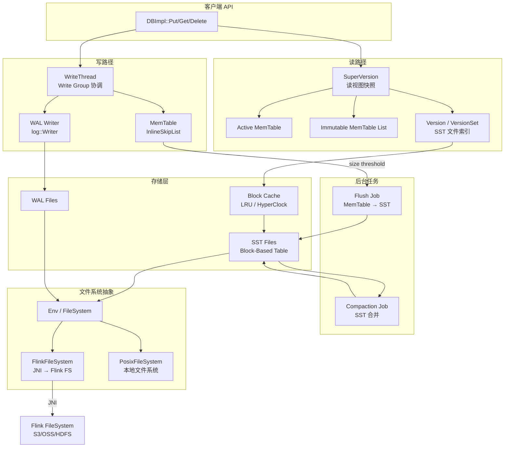
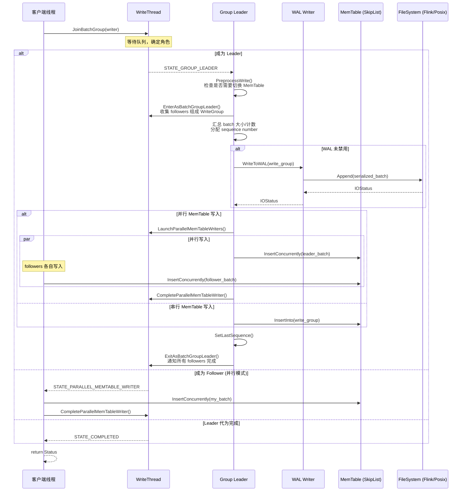
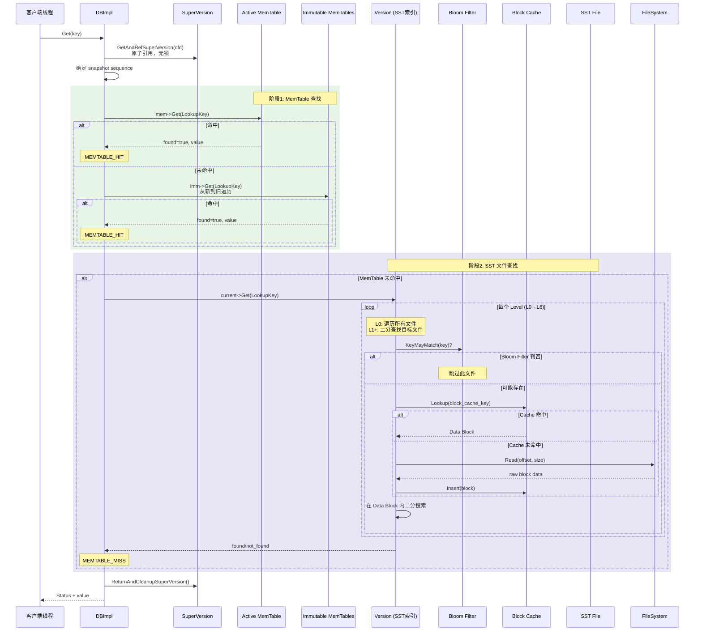

# ForSt 运行时架构

## 0. 文档元数据
- **文档 ID**: 1.2
- **状态**: completed
- **依赖**: 无
- **最后更新**: 2026-04-19
- **源码分支**: `rt_recode` (ForSt 仓库)

---

## 1. Context

ForSt (Fork of RocksDB for Streaming) 是 Apache Flink 社区从 RocksDB 分支出来的嵌入式 KV 存储引擎，专门为流计算状态后端优化。其 C++ 核心引擎保留了 RocksDB 的 LSM-Tree 架构，同时新增了 Flink 文件系统适配层（通过 JNI 桥接）和命名空间变更（`ROCKSDB_NAMESPACE` 定义为 `forstdb`）。

本文档深度追踪 ForSt 的写路径、读路径，分析核心数据结构（MemTable、Block Cache、VersionSet），并标注 Flink 环境特有适配和与 RocksDB 原版的差异点。

---

## 2. 源码证据

| 组件 | 关键源文件 | 作用 |
|------|-----------|------|
| 写入口 | `db/db_impl/db_impl_write.cc` | `DBImpl::WriteImpl()` — 写路径主入口 |
| 读入口 | `db/db_impl/db_impl.cc:2154` | `DBImpl::GetImpl()` — 读路径主入口 |
| Write Group | `db/write_thread.h` | `WriteThread` 状态机、Writer 结构体、WriteGroup 批组 |
| WAL | `db/log_writer.cc` | `log::Writer::AddRecord()` — WAL 记录写入 |
| MemTable | `memtable/skiplistrep.cc` | `SkipListRep` — 跳表 MemTable 实现 |
| 无锁跳表 | `memtable/inlineskiplist.h` | `InlineSkipList` — 内联节点无锁跳表 |
| Version | `db/version_set.cc` | SST 文件查找、Level 管理 |
| LRU Cache | `cache/lru_cache.cc` | `LRUCacheShard` — 分片 LRU 缓存 |
| Clock Cache | `cache/clock_cache.cc` | `HyperClockCache` — 无锁时钟淘汰 |
| 二级缓存 | `cache/compressed_secondary_cache.cc` | 压缩二级缓存 |
| Compaction | `db/compaction/compaction_job.cc` | Compaction 任务执行 |
| Flush | `db/db_impl/db_impl_compaction_flush.cc` | 后台 Flush/Compaction 调度 |
| Flink Env | `env/flink/env_flink.cc` | `FlinkFileSystem` — Flink 文件系统桥接 |
| JNI Helper | `env/flink/jni_helper.cc` | `JavaClassCache` — JNI 方法缓存 |
| 命名空间 | `include/rocksdb/rocksdb_namespace.h` | `#define ROCKSDB_NAMESPACE forstdb` |

---

## 3. 发现

### 3.1 核心数据结构

#### 3.1.1 DBImpl — 引擎入口

`DBImpl` 是整个引擎的核心类（定义于 `db/db_impl/db_impl.h:174`），管理所有运行时状态：

| 成员 | 类型 | 作用 |
|------|------|------|
| `versions_` | `VersionSet*` | 管理所有 CF 的 Version 历史 |
| `write_thread_` | `WriteThread` | 主写入线程协调器 |
| `nonmem_write_thread_` | `WriteThread` | WAL-only 写入队列（two_write_queues 模式） |
| `write_controller_` | `WriteController` | 写入限速控制 |
| `write_buffer_manager_` | `WriteBufferManager*` | 全局 MemTable 内存管理 |
| `mutex_` | `InstrumentedMutex` | 全局 DB 锁 |
| `bg_cv_` | `InstrumentedCondVar` | 后台线程条件变量 |
| `flush_scheduler_` | `FlushScheduler` | Flush 调度器 |
| `env_` | `Env*` | 环境抽象（本地 or Flink） |
| `fs_` | `FileSystemPtr` | 文件系统抽象 |

#### 3.1.2 SuperVersion — 读视图快照

`SuperVersion` 是读路径的核心抽象，包含某一时刻 ColumnFamily 的完整读视图：
- `mem` — 当前活跃 MemTable
- `imm` — Immutable MemTable 列表（`MemTableListVersion`）
- `current` — 当前 `Version`（包含所有 SST 文件元信息）

通过引用计数实现无锁读取，避免在读路径上获取全局 mutex。

#### 3.1.3 VersionSet / Version

- `Version` 表示 DB 在某一时刻的 SST 文件布局
- `VersionSet` 管理所有 `Version` 的链表，通过 `VersionEdit` 增量更新
- SST 文件按 Level 组织，Level 0 允许重叠，Level 1+ 有序不重叠
- 文件查找使用二分搜索（`FindFileInRange`），通过 `LevelFilesBrief` 加速

#### 3.1.4 InlineSkipList — 无锁跳表

```
位置: memtable/inlineskiplist.h
最大高度: kMaxPossibleHeight = 32（默认 max_height=12, branching_factor=4）
```

关键设计：
- **内联存储**: Key 直接分配在 Node 结构内部，减少一次指针间接寻址，改善缓存局部性
- **并发插入**: `InsertConcurrently()` 使用 CAS 原子操作实现无锁并发写入
- **Splice 优化**: 对顺序插入场景，`InsertWithHint()` 利用 Splice 缓存上次插入位置，均摊 O(log D) 复杂度（D 为与上次插入的距离）
- **内存分配**: 通过 `Allocator`（Arena）统一分配，Node 生命周期与 SkipList 绑定，不单独释放

---

### 3.2 写路径详解

写路径从 `DBImpl::Write()` 开始，经过以下关键阶段：

**阶段 1: 入口与参数校验** (`db_impl_write.cc:150-161`)
- `Write()` 调用 `WriteImpl()`，先处理 `protection_bytes_per_key` 校验

**阶段 2: 写模式分派** (`db_impl_write.cc:180-314`)
- 根据配置分派到不同写入模式：
  - `two_write_queues_ && disable_memtable` → `WriteImplWALOnly()`（仅 WAL，用于事务 Prepare）
  - `unordered_write` → 先 WAL 后异步 MemTable
  - `enable_pipelined_write` → `PipelinedWriteImpl()`（流水线模式）
  - **默认路径** → 继续 WriteImpl 主流程

**阶段 3: Write Group 形成** (`db_impl_write.cc:317-322`)
```
WriteThread::Writer w(write_options, my_batch, ...);
write_thread_.JoinBatchGroup(&w);
```
- 每个写请求封装为 `Writer` 对象
- `JoinBatchGroup()` 将 Writer 加入等待队列
- 状态机转换: `STATE_INIT` → `STATE_GROUP_LEADER`（成为 leader）或 `STATE_PARALLEL_MEMTABLE_WRITER`（成为 follower）或 `STATE_COMPLETED`（leader 代为完成）

**阶段 4: Leader 预处理** (`db_impl_write.cc:393-403`)
- Leader 调用 `PreprocessWrite()` —— 检查是否需要切换 MemTable、创建新 WAL 文件
- 获取 `last_sequence`

**阶段 5: 组建批组** (`db_impl_write.cc:411-412`)
```
write_thread_.EnterAsBatchGroupLeader(&w, &write_group);
```
- Leader 从等待队列中收集多个 Writer 组成 `WriteGroup`
- 判断是否可并行写 MemTable（需 `allow_concurrent_memtable_write` 且无 Merge 操作）

**阶段 6: WAL 写入** (`db_impl_write.cc:500-522`)
```
io_s = WriteToWAL(write_group, log_context.writer, ...);
```
- Leader 将整个 WriteGroup 的数据序列化写入 WAL
- WAL Writer (`log::Writer::AddRecord`) 按固定 32KB Block 分片写入，每条记录带 CRC32 校验

**阶段 7: MemTable 插入** (`db_impl_write.cc:559-593`)
- **串行模式**: Leader 调用 `WriteBatchInternal::InsertInto()` 为整个 WriteGroup 写入 MemTable
- **并行模式**: `LaunchParallelMemTableWriters()` 唤醒所有 follower，各自并发写入自己的 batch
  - 并发写入使用 `InsertConcurrently()` → InlineSkipList 的 CAS 无锁插入

**阶段 8: 完成与通知** (`db_impl_write.cc:639-668`)
- 更新 `LastSequence`
- 调用 `ExitAsBatchGroupLeader()` 通知所有 follower 完成

---

### 3.3 读路径详解

读路径从 `DBImpl::Get()` 开始：

**阶段 1: 获取 SuperVersion** (`db_impl.cc:2210`)
```cpp
SuperVersion* sv = GetAndRefSuperVersion(cfd);
```
- 通过原子引用计数获取当前 SuperVersion，**无需获取全局锁**
- 确保读视图在整个 Get 过程中保持一致

**阶段 2: 确定快照** (`db_impl.cc:2224-2258`)
- 使用用户提供的 snapshot 或 `GetLastPublishedSequence()`
- 构造 `LookupKey(key, snapshot)`

**阶段 3: MemTable 查找** (`db_impl.cc:2290-2347`)
```
查找顺序: Active MemTable → Immutable MemTable List
```
- `sv->mem->Get(lkey, ...)` — 在活跃 MemTable 中查找
- `sv->imm->Get(lkey, ...)` — 在所有 Immutable MemTable 中从新到旧查找
- 命中则记录 `MEMTABLE_HIT`，直接返回

**阶段 4: SST 文件查找** (`db_impl.cc:2351-2363`)
```cpp
sv->current->Get(read_options, lkey, value, ...);
```
- 通过当前 `Version` 查找 SST 文件
- Level 0: 遍历所有文件（可能重叠）
- Level 1+: 二分搜索定位目标文件
- 每个 SST 文件查找流程:
  1. **Bloom Filter** 快速判断 key 是否可能存在
  2. **Index Block** 定位 Data Block 位置
  3. **Block Cache** 查找/加载 Data Block
  4. 在 Data Block 内二分搜索

**阶段 5: 后处理** (`db_impl.cc:2365-2447`)
- 释放 SuperVersion 引用
- 记录统计指标

---

### 3.4 MemTable 实现

#### 核心结构

```
SkipListRep (memtable/skiplistrep.cc)
  └── InlineSkipList<KeyComparator> skip_list_
        └── Node (key 内联存储)
              └── 通过 Arena/Allocator 分配
```

#### 内存管理 — Arena

- MemTable 的所有内存通过 `Arena` 分配器统一管理
- Arena 按大块（通常 4KB 对齐）预分配内存，减少 malloc 调用
- MemTable 释放时，整个 Arena 一次性释放，无需逐个释放 Node

#### 并发写入处理

| 方法 | 并发性 | 使用场景 |
|------|--------|----------|
| `Insert()` | 需要外部同步 | 单线程写入 |
| `InsertConcurrently()` | 无锁 CAS | 并行 MemTable 写入 |
| `InsertWithHint()` | 需要外部同步 | 批量顺序插入优化 |
| `InsertWithHintConcurrently()` | 同 hint 不可并发 | 分组并发写入 |

#### MemTable 生命周期

```
Active MemTable (可写)
  → [达到 write_buffer_size]
  → Immutable MemTable (只读, 等待 Flush)
  → [后台 Flush]
  → Level 0 SST 文件
  → [释放 MemTable 及其 Arena]
```

---

### 3.5 Block Cache 体系

ForSt 继承了 RocksDB 的多层缓存架构：

#### 3.5.1 LRU Cache (`cache/lru_cache.cc`)

**分片架构**:
- `LRUCache` 由多个 `LRUCacheShard` 组成（通常 16 个分片）
- 每个分片独立加锁（`DMutex`），减少锁争用
- 分片选择: `hash >> (32 - num_shard_bits)`

**三级优先级**:
- `high_pri_pool` — 高优先级条目（Index/Filter Block）
- `low_pri_pool` — 低优先级条目（Data Block）
- `bottom_pri` — 最低优先级
- 淘汰顺序: bottom → low → high

**哈希表**: `LRUHandleTable` 使用开放寻址 + 链式哈希，负载因子 <= 1 时自动 Resize

#### 3.5.2 HyperClockCache (`cache/clock_cache.cc`)

**无锁设计**:
- 使用 CLOCK 算法替代 LRU，避免维护双向链表
- 引用计数通过 `atomic<uint64_t>` 的 acquire/release counter 实现
- 状态机编码在 `meta` 字段中（Visible/Invisible/Construction/Empty）

**时钟淘汰**:
- 每个条目有 countdown 计数器
- `HIGH` 优先级: `kHighCountdown`，`LOW`: `kLowCountdown`，`BOTTOM`: `kBottomCountdown`
- 扫描时递减 countdown，countdown 归零且无引用时淘汰

**适用场景**: 高并发读取场景（如 Flink 状态后端的频繁点查）

#### 3.5.3 Compressed Secondary Cache

- 当条目从主缓存被淘汰时，压缩后存入二级缓存
- Lookup 时先查主缓存，未命中则查二级缓存并解压
- 支持 `TieredSecondaryCache` 实现多级缓存层次

---

### 3.6 Compaction 机制

#### 3.6.1 Compaction 策略

| 策略 | 触发条件 | 适用场景 |
|------|----------|----------|
| **Level** | L0 文件数、各 Level 大小超阈值 | 通用场景（默认） |
| **Universal** | Sorted Run 数量、空间放大率 | 写密集、空间放大敏感 |
| **FIFO** | 总大小超限、TTL 过期 | 时序数据、TTL 场景 |

#### 3.6.2 Compaction 触发原因

源码中定义的触发原因（`compaction_job.cc:62-80`）：
- `LevelL0FilesNum` — L0 文件数超过 `level0_file_num_compaction_trigger`
- `LevelMaxLevelSize` — 某 Level 数据量超过目标大小
- `UniversalSizeAmplification` — 空间放大率超阈值
- `UniversalSizeRatio` — 相邻 sorted run 大小比超阈值
- `FIFOMaxSize` / `FIFOTtl` — FIFO 策略触发

#### 3.6.3 后台调度

- `DBImpl::MaybeScheduleFlushOrCompaction()` 检查是否需要调度
- Flush 和 Compaction 使用独立的后台线程池
- `WriteController` 在 L0 文件过多时触发写入限速或停止
- `SstFileManager` 在磁盘空间不足时取消 Compaction

#### 3.6.4 Compaction 执行流程

```
PickCompaction() — 选择输入文件
  → CompactionJob::Prepare() — 创建子任务
  → CompactionJob::Run() — 读取输入、合并、写入新 SST
    → CompactionIterator — 合并迭代器，处理删除标记/过期
    → TableBuilder — 构建新 SST 文件
  → CompactionJob::Install() — 原子更新 Version
```

---

### 3.7 Flink 环境适配

#### 3.7.1 FlinkFileSystem

**位置**: `env/flink/env_flink.cc`, `env/flink/env_flink.h`

`FlinkFileSystem` 继承 `FileSystemWrapper`，通过 JNI 将 ForSt 的文件操作桥接到 Flink 的文件系统抽象（支持 S3、OSS、HDFS 等）。

**核心 IO 类**:

| 类 | Java 对端 | 作用 |
|---|----------|------|
| `FlinkWritableFile` | `ByteBufferWritableFSDataOutputStream` | 写入（Append/Flush/Sync/Close） |
| `FlinkReadableFile` | `ByteBufferReadableFSDataInputStream` | 读取（顺序读 + 随机读） |
| `FlinkDirectory` | 无（空实现） | 目录 Fsync 委托给 Flink FS |

**数据传输机制**: 使用 `NewDirectByteBuffer()` 创建 JNI DirectByteBuffer，实现 C++ 内存与 Java 之间的零拷贝数据传递。

#### 3.7.2 JNI 方法缓存 (`jni_helper.cc`)

`JavaClassCache` 在初始化时一次性缓存所有需要的 Java 类和方法引用：

**缓存的 Java 类**:
- `org.apache.flink.state.forst.fs.StringifiedForStFileSystem`
- `org.apache.flink.state.forst.fs.ForStFileStatus`
- `org.apache.flink.state.forst.fs.ByteBufferReadableFSDataInputStream`
- `org.apache.flink.state.forst.fs.ByteBufferWritableFSDataOutputStream`

**缓存的方法** (共 ~15 个):
- 文件系统操作: `get`、`exists`、`listStatus`、`getFileStatus`、`delete`、`mkdirs`、`rename`、`link`、`open`、`create`
- 流操作: `readFully`（顺序读）、`read`（随机读）、`write`、`flush`、`sync`、`close`、`skip`

**性能考量**: JNI 调用开销是关键瓶颈 —— 每次文件 IO 都需要跨越 JNI 边界。缓存 `jmethodID` 避免了重复的方法查找开销。

#### 3.7.3 JVM 线程绑定 (`jvm_util.cc`)

- `getJNIEnv()` 获取当前线程的 JNI 环境
- C++ 后台线程（Compaction/Flush）需要 `AttachCurrentThread` 到 JVM
- 线程结束时需要 `DetachCurrentThread`

---

### 3.8 与 RocksDB 原版差异

| 差异点 | RocksDB | ForSt | 影响 |
|--------|---------|-------|------|
| **命名空间** | `#define ROCKSDB_NAMESPACE rocksdb` | `#define ROCKSDB_NAMESPACE forstdb` | API 层隔离，避免符号冲突 |
| **Flink 文件系统** | 无 | `env/flink/` 目录，`FlinkFileSystem` 类 | 支持 S3/OSS/HDFS 等远程存储 |
| **JNI 桥接层** | 标准 RocksJava JNI | ForSt 专用 JNI (`jni_helper.cc`, `jvm_util.cc`)，缓存 Flink FS 方法 | 深度集成 Flink 状态后端 |
| **Java 类路径** | `org.rocksdb.*` | `org.apache.flink.state.forst.fs.*` | Flink 项目内的包结构 |
| **许可证** | GPLv2 + Apache 2.0 | 核心文件保留双许可证；Flink 新增文件为 Apache 2.0 | Flink 新增代码统一 Apache 2.0 |
| **目录 Fsync** | 本地文件系统 Fsync | `FlinkDirectory::Fsync()` 空实现，委托给 Flink FS | 远程 FS 的 Fsync 语义不同 |
| **链接操作** | 本地硬链接 | `FlinkFileSystem` 新增 `link` JNI 方法 | 支持远程 FS 的链接语义 |

**核心引擎未改动**: 写路径（WriteImpl/WriteThread/WAL）、读路径（GetImpl/VersionSet）、MemTable（InlineSkipList）、Block Cache（LRU/Clock）、Compaction 等核心逻辑与 RocksDB 一致。ForSt 的差异化主要在**环境适配层**（Env/FileSystem），通过 RocksDB 原有的 `Env` 抽象实现插件化。

---

## 4. 架构图 / 时序图

### 4.1 运行时组件关系图



### 4.2 写路径时序图



### 4.3 读路径时序图



---

## 5. 与 ForSt-RS 重构的关系

以下标注 >= 5 个性能关键节点及其 Rust 重写策略：

### 性能关键节点

| # | 关键节点 | 位置 | 性能瓶颈 | Rust 重写策略 |
|---|---------|------|----------|--------------|
| **1** | **Write Group 形成与 WAL 写入** | `WriteThread::JoinBatchGroup()` + `WriteToWAL()` | 全局锁竞争点；WAL 序列化是写路径串行瓶颈 | 使用 Rust `crossbeam` 无锁队列替代 mutex-based 等待；WAL 写入使用 `io_uring` 异步 IO |
| **2** | **MemTable 并发插入** | `InlineSkipList::InsertConcurrently()` | CAS 重试在高竞争下退化；Arena 分配器在多线程下有 atomic 瓶颈 | 使用 Rust 原子操作 + `crossbeam-skiplist` 或自定义 lock-free skiplist；Arena 改为 thread-local bump allocator |
| **3** | **Block Cache 查找** | `LRUCacheShard::Lookup()` / `HyperClockCache` | LRU 每次访问需要加锁移动链表节点；Clock Cache 的 CAS 循环在高并发下有开销 | Rust 实现 sharded concurrent hashmap（如基于 `dashmap`）；Clock 算法使用 Rust `AtomicU64` 精确控制状态机 |
| **4** | **SST 文件读取 (IO 路径)** | `BlockBasedTableReader::Get()` → `FileSystem::Read()` | 同步 IO 阻塞线程；Flink 环境下 JNI 调用额外开销 | Rust 使用 `tokio` + `io_uring` 异步读取；Flink 环境可通过 Rust FFI 直接调用，绕过 JNI 双重跨语言开销 |
| **5** | **Compaction IO 与 CPU** | `CompactionJob::Run()` | 大量 SST 读写 + 合并排序 CPU 密集 | Rust 异步 IO pipeline；利用 SIMD 加速 key 比较和 CRC32 校验；Compaction 迭代器用 Rust trait 抽象实现零成本多态 |
| **6** | **JNI 跨语言调用** | `env/flink/env_flink.cc` 所有 IO 操作 | 每次文件操作需 JNI 调用，涉及 JVM 线程切换和 GC 暂停风险 | Rust 可直接通过 JNI (`jni` crate) 或更高效的 FFI 机制桥接 Flink FS，减少一层 C++ 中间层；或实现 Rust native FS 插件直接对接云存储 SDK |
| **7** | **Bloom Filter 计算** | `BlockBasedTable` 内置 Bloom/Ribbon Filter | 哈希计算在每次 SST 查找时执行 | Rust SIMD 优化的哈希函数（如 `xxhash-rust`）；Ribbon Filter 算法用 Rust 泛型零成本实现 |

### 重写优先级建议

```
高优先级 (写路径热点):
  [1] Write Group + WAL  — 写入吞吐量的直接瓶颈
  [2] MemTable SkipList   — 内存写入性能的核心

中优先级 (读路径热点):
  [3] Block Cache         — 读取延迟的关键
  [4] SST IO 路径         — 读取长尾延迟的主因

长期优化:
  [5] Compaction          — 后台资源消耗大户
  [6] JNI 桥接           — Flink 集成的性能天花板
  [7] Bloom Filter        — 每次读放大的乘数因子
```

---

## 6. Open Questions

1. **WAL 在 Flink 环境中的必要性**: Flink 有自己的 Checkpoint 机制保证 exactly-once，ForSt 作为状态后端时 WAL 是否可以完全禁用（`disableWAL=true`）以减少远程 IO？当前 Flink 的 ForSt 状态后端是否已经这样做？

2. **JNI 调用频率优化**: 当前每次文件 Read/Write 都经过 JNI。是否可以引入批量 IO 接口（如一次 JNI 调用完成多个 Block 读取），减少 JNI 跨语言开销？

3. **HyperClockCache vs LRU 在 Flink 场景的选择**: Flink 状态后端以点查为主，HyperClockCache 的无锁设计是否显著优于 LRU？需要基准测试数据支撑。

4. **Compaction 对 Flink Checkpoint 的影响**: Compaction 期间大量 IO 可能影响 Checkpoint 的 SST 文件上传速度。是否需要 Compaction 感知 Checkpoint 的调度策略？

5. **Rust 重写的 ABI 兼容性**: ForSt-RS 如果逐模块替换（如先替换 MemTable），C++ 和 Rust 模块之间的 FFI 边界如何设计？是否沿用 RocksDB 的 C API 层作为稳定接口？

6. **`rt_recode` 分支的额外改动**: 当前分析基于 `rt_recode` 分支，需要确认该分支相对 ForSt main 是否有其他未在本文档中覆盖的实验性改动。
