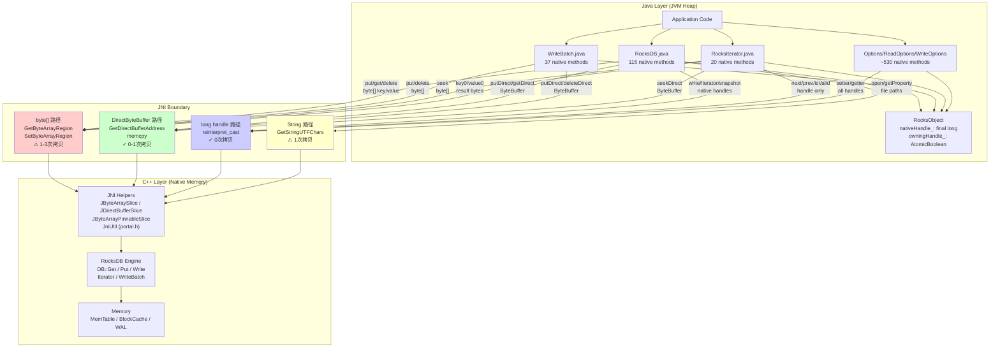
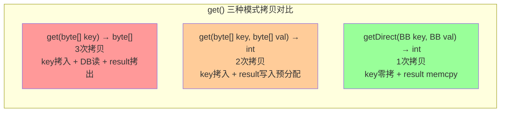

# ForSt JNI 接口梳理

## 0. 文档元数据
- **文档 ID**: 1.3
- **状态**: completed
- **依赖**: 无
- **最后更新**: 2026-04-19
- **源码仓库**: `~/code/github/ForSt` (分支: `rt_recode`)

## 1. Context

ForSt (Fork of RocksDB by Ververica/Apache Flink) 通过 JNI (Java Native Interface) 将 C++ RocksDB 引擎暴露给 Java 应用层。所有数据读写操作必须跨越 JNI 边界，涉及 Java Heap 与 Native Memory 之间的数据拷贝。本文档完整梳理 JNI 接口层的方法清单、数据传递模式和内存拷贝开销。

**关键数字**:
- Java `native` 方法总数: **~1461 个**
- C++ JNI 实现文件 (`java/forstjni/*.cc`): **~50 个**
- 涉及热路径数据拷贝的核心类: `RocksDB` (115), `WriteBatch` (37), `RocksIterator` (20)

## 2. 源码证据

### 2.1 核心源文件

| 层 | 文件路径 | 说明 |
|---|---|---|
| Java | `java/src/main/java/org/forstdb/RocksDB.java` | 主 DB 类, 115 个 native 方法 |
| Java | `java/src/main/java/org/forstdb/RocksIterator.java` | Iterator, 20 个 native 方法 |
| Java | `java/src/main/java/org/forstdb/WriteBatch.java` | WriteBatch, 37 个 native 方法 |
| Java | `java/src/main/java/org/forstdb/RocksObject.java` | native handle 生命周期基类 |
| Java | `java/src/main/java/org/forstdb/AbstractImmutableNativeReference.java` | 所有权管理 (AtomicBoolean) |
| C++ | `java/forstjni/rocksjni.cc` | 主 DB JNI 实现 |
| C++ | `java/forstjni/iterator.cc` | Iterator JNI 实现 |
| C++ | `java/forstjni/write_batch.cc` | WriteBatch JNI 实现 |
| C++ | `java/forstjni/portal.h` | JniUtil 工具类 (copyBytes, k_op_region, k_op_direct, copyToDirect) |
| C++ | `java/forstjni/kv_helper.h` | JByteArraySlice, JDirectBufferSlice, JByteArrayPinnableSlice 等封装 |

### 2.2 关键 C++ Helper 类

| 类 | 定义位置 | 功能 | 拷贝行为 |
|---|---|---|---|
| `JByteArraySlice` | `kv_helper.h:103` | 将 `jbyteArray` 区域拷贝到 native `char[]` 构造 `Slice` | `GetByteArrayRegion` -> `new jbyte[]` (1 次拷贝) |
| `JDirectBufferSlice` | `kv_helper.h:131` | 直接从 DirectByteBuffer 获取指针构造 `Slice` | `GetDirectBufferAddress` (0 次拷贝) |
| `JByteArrayPinnableSlice` | `kv_helper.h:163` | 包装 `PinnableSlice`, 通过 `SetByteArrayRegion` 回写 Java | 读取结果回写 1 次拷贝 |
| `JDirectBufferPinnableSlice` | `kv_helper.h:241` | 包装 `PinnableSlice`, 通过 `memcpy` 写入 DirectBuffer | 读取结果回写 1 次 `memcpy` |
| `JniUtil::k_op_region` | `portal.h:2213` | Seek 等操作, `GetByteArrayRegion` 拷贝 key | 1 次拷贝 |
| `JniUtil::k_op_direct` | `portal.h:2404` | Seek 等操作, `GetDirectBufferAddress` 零拷贝取 key | 0 次拷贝 |
| `JniUtil::copyToDirect` | `portal.h:2423` | 将 C++ Slice 数据 `memcpy` 到 DirectBuffer | 1 次 `memcpy` |
| `JniUtil::copyBytes` | `portal.h:2129` | 将 C++ Slice 拷贝为新 `jbyteArray` | `NewByteArray` + `SetByteArrayRegion` (1 次拷贝) |
| `JniUtil::kv_op` | `portal.h:2139` | WriteBatch put/delete 等, `GetByteArrayElements` 获取 key/value | 1 次拷贝 (可能被 JVM pin) |

## 3. 发现

### 3.1 JNI 方法完整清单 (按类分组, 核心类)

#### 3.1.1 RocksDB (115 个 native 方法)

| native 方法签名 | C++ 实现 | 传输模式 | 拷贝次数 |
|---|---|---|---|
| `open(long optHandle, String path)` | `rocksjni.cc:66` | String (GetStringUTFChars) | 1 |
| `openROnly(long, String, boolean)` | `rocksjni.cc:81` | String | 1 |
| `openAsSecondary(long, String, String)` | `rocksjni.cc:228` | String | 1 |
| `put(long, byte[], int, int, byte[], int, int)` | `rocksjni.cc:609` | JByteArraySlice (key+value) | 2 (key拷1 + value拷1) |
| `put(long, byte[], int, int, byte[], int, int, long)` | `rocksjni.cc:632` | JByteArraySlice (key+value) + long handle (cf) | 2 |
| `put(long, long, byte[], int, int, byte[], int, int)` | `rocksjni.cc:666` | JByteArraySlice + long handles | 2 |
| `put(long, long, byte[], int, int, byte[], int, int, long)` | `rocksjni.cc:691` | JByteArraySlice + long handles | 2 |
| `putDirect(long, long, ByteBuffer, int, int, ByteBuffer, int, int, long)` | `rocksjni.cc:721` | DirectByteBuffer (key+value) | 0 (零拷贝输入) |
| `get(long, byte[], int, int) -> byte[]` | `rocksjni.cc:1561` (via `rocksdb_get_helper:1510`) | byte[] key拷入 + NewByteArray 结果拷出 | 3 (key拷入1 + DB内部读1 + 结果拷出1) |
| `get(long, byte[], int, int, long) -> byte[]` | `rocksjni.cc:1575` | 同上 | 3 |
| `get(long, long, byte[], int, int) -> byte[]` | `rocksjni.cc:1599` | 同上 | 3 |
| `get(long, long, byte[], int, int, long) -> byte[]` | `rocksjni.cc:1615` | 同上 | 3 |
| `get(long, byte[], int, int, byte[], int, int) -> int` | `rocksjni.cc:1704` (via `rocksdb_get_helper:1634`) | byte[] key拷入 + pre-allocated byte[] 结果拷出 | 2 (key拷入 + SetByteArrayRegion 回写) |
| `get(long, byte[], int, int, byte[], int, int, long) -> int` | `rocksjni.cc:1721` | 同上 | 2 |
| `getDirect(long, long, ByteBuffer, int, int, ByteBuffer, int, int, long) -> int` | `rocksjni.cc:1270` | DirectBuffer key (0拷) + memcpy 结果到 DirectBuffer | 1 |
| `multiGet(long, byte[][], int[], int[]) -> byte[][]` | `rocksjni.cc:2157` | byte[][] 每个key拷入 + 每个结果 NewByteArray | N*3 |
| `multiGet(long, long, byte[][], int[], int[], long[]) -> byte[][]` | `rocksjni.cc:2199` | 同上 | N*3 |
| `multiGet(long, long, long[], ByteBuffer[], int[], int[], ByteBuffer[], int[], Status[])` | `rocksjni.cc:2215` | DirectBuffer 版本 | N*1 |
| `write0(long, long, long)` | `rocksjni.cc:1470` | 纯 long handle 传递 | 0 |
| `write1(long, long, long)` | `rocksjni.cc:1490` | 纯 long handle 传递 | 0 |
| `delete(long, byte[], int, int)` | `rocksjni.cc:791` | byte[] key 拷入 | 1 |
| `singleDelete(long, byte[], int)` | `rocksjni.cc:908` | byte[] key 拷入 | 1 |
| `deleteRange(long, byte[], int, int, byte[], int, int)` | `rocksjni.cc:1043` | byte[] beginKey + endKey 各拷1次 | 2 |
| `merge(long, byte[], int, int, byte[], int, int)` | `rocksjni.cc:1296` | byte[] key+value 各拷1次 | 2 |
| `mergeDirect(long, long, ByteBuffer, int, int, ByteBuffer, int, int, long)` | `rocksjni.cc:1403` | DirectBuffer | 0 |
| `iterator(long, long, long) -> long` | `rocksjni.cc:2628` | 纯 long handle | 0 |
| `getSnapshot(long) -> long` | `rocksjni.cc:2704` | 纯 long handle | 0 |
| `releaseSnapshot(long, long)` | `rocksjni.cc` | 纯 long handle | 0 |
| `disposeInternal(long)` | `rocksjni.cc:294` | 纯 long handle | 0 |
| `closeDatabase(long)` | `rocksjni.cc:305` | 纯 long handle | 0 |
| `createColumnFamily(long, byte[], int, long)` | `rocksjni.cc:345` | byte[] cf name | 1 |
| `dropColumnFamily(long, long)` | `rocksjni.cc:556` | 纯 long handle | 0 |
| `flush(long, long, long[])` | `rocksjni.cc` | long handles | 0 |
| `compactFiles(long, ...)` | `rocksjni.cc` | String[] + long handles | N*1 |
| `ingestExternalFile(long, long, String[], int, long)` | `rocksjni.cc` | String[] 文件路径 | N*1 |
| `getProperty(long, long, String)` | `rocksjni.cc:2727` | String | 1+1 (输入+输出) |
| `getLatestSequenceNumber(long) -> long` | `rocksjni.cc` | long | 0 |
| `keyExists(long, long, long, byte[], int, int)` | `rocksjni.cc` | byte[] key | 1 |
| `keyExistsDirect(long, long, long, ByteBuffer, int, int)` | `rocksjni.cc` | DirectBuffer | 0 |

#### 3.1.2 WriteBatch (37 个 native 方法)

| native 方法签名 | C++ 实现 | 传输模式 | 拷贝次数 |
|---|---|---|---|
| `newWriteBatch(int)` | `write_batch.cc` | int 参数 | 0 |
| `newWriteBatch(byte[], int)` | `write_batch.cc` | byte[] 反序列化 | 1 |
| `put(long, byte[], int, byte[], int)` | `write_batch.cc` (via `portal.h kv_op`) | GetByteArrayElements key+value | 2 |
| `put(long, byte[], int, byte[], int, long)` | `write_batch.cc` | 同上 + cf handle | 2 |
| `putDirect(long, ByteBuffer, int, int, ByteBuffer, int, int, long)` | `write_batch.cc` | DirectBuffer key+value | 0 |
| `merge(long, byte[], int, byte[], int)` | `write_batch.cc` | GetByteArrayElements | 2 |
| `delete(long, byte[], int)` | `write_batch.cc` | GetByteArrayElements key | 1 |
| `deleteDirect(long, ByteBuffer, int, int, long)` | `write_batch.cc` | DirectBuffer | 0 |
| `deleteRange(long, byte[], int, byte[], int, byte[], int, byte[], int, long)` | `write_batch.cc` | byte[] begin+end | 2 |
| `singleDelete(long, byte[], int)` | `write_batch.cc` | byte[] key | 1 |
| `data(long) -> byte[]` | `write_batch.cc` | 序列化整个 batch -> NewByteArray | 1 |
| `count0(long) -> int` | `write_batch.cc` | long handle -> int | 0 |
| `clear0(long)` | `write_batch.cc` | long handle | 0 |
| `disposeInternal(long)` | `write_batch.cc` | long handle (delete) | 0 |

#### 3.1.3 RocksIterator (20 个 native 方法)

| native 方法签名 | C++ 实现位置 | 传输模式 | 拷贝次数 |
|---|---|---|---|
| `isValid0(long) -> boolean` | `iterator.cc:38` | long handle | 0 |
| `seekToFirst0(long)` | `iterator.cc:49` | long handle | 0 |
| `seekToLast0(long)` | `iterator.cc:60` | long handle | 0 |
| `next0(long)` | `iterator.cc:71` | long handle | 0 |
| `prev0(long)` | `iterator.cc:81` | long handle | 0 |
| `refresh0(long)` | `iterator.cc:91` | long handle | 0 |
| `seek0(long, byte[], int)` | `iterator.cc:108` | byte[] via `k_op_region` | 1 |
| `seekByteArray0(long, byte[], int, int)` | `iterator.cc:127` | byte[] via `k_op_region` | 1 |
| `seekDirect0(long, ByteBuffer, int, int)` | `iterator.cc:143` | DirectBuffer via `k_op_direct` | 0 |
| `seekForPrev0(long, byte[], int)` | `iterator.cc:176` | byte[] via `k_op_region` | 1 |
| `seekForPrevByteArray0(long, byte[], int, int)` | `iterator.cc:196` | byte[] via `k_op_region` | 1 |
| `seekForPrevDirect0(long, ByteBuffer, int, int)` | `iterator.cc:160` | DirectBuffer via `k_op_direct` | 0 |
| `status0(long)` | `iterator.cc:212` | long handle | 0 |
| `key0(long) -> byte[]` | `iterator.cc:229` | `NewByteArray` + `SetByteArrayRegion` | 1 |
| `keyDirect0(long, ByteBuffer, int, int) -> int` | `iterator.cc:250` | `copyToDirect` (memcpy) | 1 |
| `keyByteArray0(long, byte[], int, int) -> int` | `iterator.cc:268` | `SetByteArrayRegion` 到预分配 buffer | 1 |
| `value0(long) -> byte[]` | `iterator.cc:288` | `NewByteArray` + `SetByteArrayRegion` | 1 |
| `valueDirect0(long, ByteBuffer, int, int) -> int` | `iterator.cc:310` | `copyToDirect` (memcpy) | 1 |
| `valueByteArray0(long, byte[], int, int) -> int` | `iterator.cc:328` | `SetByteArrayRegion` 到预分配 buffer | 1 |
| `disposeInternal(long)` | `iterator.cc:25` | long handle (delete) | 0 |

#### 3.1.4 其他重要类 native 方法统计

| Java 类 | native 方法数 | 主要传输模式 |
|---|---|---|
| Options | 299 | 几乎全部 long handle (配置读写) |
| DBOptions | 166 | long handle |
| ColumnFamilyOptions | 141 | long handle + 少量 byte[]/String |
| Transaction | 75 | long handle + byte[] key/value |
| ReadOptions | 47 | long handle |
| CompactRangeOptions | 20 | long handle |
| WriteOptions | 15 | long handle |
| SstFileWriter | 13 | byte[] key/value + long handle |
| Statistics | 13 | long handle |
| BackupEngine | 11 | long handle + String path |
| SstFileReader | 6 | long handle + String path |
| Env | 8 | long handle |
| FlushOptions | 6 | long handle |
| Checkpoint | 4 | long handle + String path |
| ColumnFamilyHandle | 4 | long handle |

### 3.2 数据传递模式分类

ForSt JNI 接口使用四种核心数据传递模式:

#### 模式 A: `byte[]` 拷贝 (占比最高的数据路径)

```
Java byte[] --GetByteArrayRegion/GetByteArrayElements--> native char[] --> Slice
                         1 次拷贝 (Java Heap -> Native Stack/Heap)
```

**两种实现变体**:
- **`GetByteArrayRegion`**: 分配 `new jbyte[len]`, 调用 `GetByteArrayRegion` 拷贝 Java 数组指定区域。用于 `JByteArraySlice` 和 `k_op_region`。
- **`GetByteArrayElements`**: 可能 pin (零拷贝) 或 copy, 取决于 JVM 实现。用于 `portal.h` 的 `kv_op` / `k_op`。实际上大多数 JVM 实现会拷贝。

**输出方向**:
```
C++ PinnableSlice/Slice --SetByteArrayRegion/NewByteArray--> Java byte[]
                         1 次拷贝 (Native -> Java Heap)
```

#### 模式 B: `DirectByteBuffer` 零拷贝输入 (推荐路径)

```
Java DirectByteBuffer --GetDirectBufferAddress--> char* (直接指针)
                         0 次拷贝 (共享内存)
```

**输出方向**:
```
C++ Slice --memcpy--> DirectByteBuffer 内存区域
                         1 次拷贝 (Native -> Off-Heap)
```

关键类: `JDirectBufferSlice` (`kv_helper.h:131`), `JniUtil::k_op_direct` (`portal.h:2404`), `JniUtil::copyToDirect` (`portal.h:2423`)

#### 模式 C: `long` pointer (native handle 传递)

```
Java long nativeHandle_ ----reinterpret_cast<T*>----> C++ 对象指针
                         0 次拷贝, 0 次分配
```

这是 Options, WriteOptions, ReadOptions, ColumnFamilyHandle, WriteBatch, Iterator 等所有 RocksDB C++ 对象的统一管理方式。约占全部 native 方法的 **70%+** (配置类方法)。

#### 模式 D: `String` (GetStringUTFChars)

```
Java String --GetStringUTFChars--> const char* (Modified UTF-8)
                         1 次拷贝
```

仅用于文件路径 (open, ingestExternalFile, checkpoint) 和属性名 (getProperty)。

### 3.3 五条热路径拷贝链分析

#### 热路径 1: `RocksDB.get(cfHandle, key) -> byte[]`

**Java 调用**: `RocksDB.get(byte[] key)` / `RocksDB.get(ColumnFamilyHandle, byte[] key)`

**完整拷贝链**:

```
Java byte[] key                                           Java byte[] result
     |                                                          ^
     | (1) GetByteArrayRegion → new jbyte[keyLen]              | (3) NewByteArray + SetByteArrayRegion
     v                                                          |
native char[] key                                          PinnableSlice
     |                                                          ^
     | (2) Slice → DB::Get()                                    |
     v                                                          |
 RocksDB 内部 BlockCache/MemTable ──── 内部读取 ────────────────┘
```

**源码位置**: `rocksjni.cc:1510-1554` (`rocksdb_get_helper` 返回 `jbyteArray` 版本)

**拷贝次数**: **3 次**
1. `GetByteArrayRegion`: Java byte[] key -> native jbyte[] (第1510-1516行)
2. DB 内部读取: Block Cache/SST -> PinnableSlice (RocksDB 内部, 可能零拷贝 via pin)
3. `JniUtil::copyBytes` -> `NewByteArray` + `SetByteArrayRegion`: PinnableSlice -> Java byte[] result (第1542-1543行)

**预分配 buffer 变体** (`get` 返回 `int`): `rocksjni.cc:1634-1697`
- 拷贝次数: **2 次** (省去 NewByteArray, 直接 `SetByteArrayRegion` 写入预分配 Java byte[])

**DirectBuffer 变体** (`getDirect`): `rocksjni.cc:1270`
- 拷贝次数: **1 次** (key 零拷贝读取, 结果 memcpy 到 DirectBuffer)

#### 热路径 2: `RocksDB.put(cfHandle, key, value)`

**Java 调用**: `RocksDB.put(ColumnFamilyHandle, byte[] key, byte[] value)`

**完整拷贝链**:

```
Java byte[] key    Java byte[] value
     |                    |
     | (1) GetByteArrayRegion    | (2) GetByteArrayRegion
     v                    v
JByteArraySlice key   JByteArraySlice value
     |                    |
     └─── DB::Put(key.slice(), value.slice()) ───┘
                    |
                    v
           MemTable / WAL
```

**源码位置**: `rocksjni.cc:609-625`

**拷贝次数**: **2 次**
1. `JByteArraySlice` 构造: `GetByteArrayRegion` key -> native jbyte[] (`kv_helper.h:109`)
2. `JByteArraySlice` 构造: `GetByteArrayRegion` value -> native jbyte[]

**DirectBuffer 变体** (`putDirect`): `rocksjni.cc:721`
- 拷贝次数: **0 次** (key/value 均通过 `GetDirectBufferAddress` 直接指针访问)

#### 热路径 3: `RocksDB.multiGet(cfHandles, keys) -> byte[][]`

**Java 调用**: `RocksDB.multiGet(List<ColumnFamilyHandle>, List<byte[]> keys)`

**完整拷贝链** (byte[] 版本):

```
Java byte[][] keys (N 个)
     |
     | 对每个 key: GetByteArrayRegion → new jbyte[]  (N 次拷贝)
     v
std::vector<Slice> keys
     |
     | DB::MultiGet()  (N 个 PinnableSlice 结果)
     v
std::vector<PinnableSlice> values
     |
     | 对每个 value: NewByteArray + SetByteArrayRegion  (N 次拷贝)
     v
Java byte[][] results (N 个)
```

**源码位置**: `rocksjni.cc:2157-2207` (调用 `multi_get_helper`)

**拷贝次数**: **N * 3 次** (N 个 key 拷入 + N 次 DB 内部读取 + N 个 value 拷出)
- 对 100 个 key 的 multiGet: 约 300 次拷贝操作

**DirectBuffer 变体**: `rocksjni.cc:2215` (调用 `multi_get_helper_direct`)
- 拷贝次数: **N * 1 次** (key 零拷贝, 结果 memcpy 到 DirectBuffer)

#### 热路径 4: `WriteBatch.put()` + `RocksDB.write(WriteBatch)`

**Java 调用**: `WriteBatch.put(key, value)` ... `RocksDB.write(writeOpts, writeBatch)`

**完整拷贝链**:

```
=== 阶段 1: 填充 WriteBatch ===
Java byte[] key    Java byte[] value
     |                    |
     | (1) GetByteArrayElements  | (2) GetByteArrayElements
     v                    v
Slice key             Slice value
     |                    |
     └── WriteBatch::Put(key, value) ──┘
                    |
                    v
          WriteBatch 内部 rep_ (序列化存储)
                    |  (3) key+value 被序列化编码到 rep_ string
                    v

=== 阶段 2: 提交 WriteBatch ===
Java long writeBatchHandle
     |
     | reinterpret_cast (0 次拷贝)
     v
WriteBatch* wb ── DB::Write(*writeOpts, wb) ──> MemTable / WAL
```

**源码位置**:
- `WriteBatch.put`: `write_batch.cc` (通过 `portal.h` 的 `kv_op`, 使用 `GetByteArrayElements`)
- `RocksDB.write0`: `rocksjni.cc:1470-1483` (纯 handle 传递, 0 次 JNI 拷贝)

**拷贝次数**:
- 每次 `put`: **2 次** (key + value 从 Java Heap 拷贝到 native)  + WriteBatch 内部序列化 1 次
- `write()` 提交: **0 次** JNI 拷贝 (纯 long handle)
- 批量 100 个 put + 1 次 write: **200 次** JNI 拷贝 + 100 次内部序列化

**DirectBuffer 变体** (`putDirect`):
- 每次 `putDirect`: **0 次** JNI 拷贝 (DirectBuffer 直接指针) + WriteBatch 内部序列化 1 次

#### 热路径 5: `RocksIterator.seek(target)` -> `key()` + `value()`

**Java 调用**: `iterator.seek(byte[])` + `iterator.key()` + `iterator.value()`

**完整拷贝链**:

```
=== seek 阶段 ===
Java byte[] target
     |
     | (1) k_op_region: new char[] + GetByteArrayRegion
     v
Slice target_slice
     |
     | Iterator::Seek(target_slice)
     v
Iterator 定位到目标位置 (内部 Block Cache/MemTable)

=== key() 阶段 ===
Iterator::key() → Slice (指向 Block Cache 内存, 零拷贝)
     |
     | (2) NewByteArray + SetByteArrayRegion
     v
Java byte[] key

=== value() 阶段 ===
Iterator::value() → Slice (指向 Block Cache 内存, 零拷贝)
     |
     | (3) NewByteArray + SetByteArrayRegion
     v
Java byte[] value
```

**源码位置**:
- `seek0`: `iterator.cc:108-116` (通过 `k_op_region`)
- `key0`: `iterator.cc:229-242`
- `value0`: `iterator.cc:288-302`

**拷贝次数**: **3 次** (seek 拷入 1 + key 拷出 1 + value 拷出 1)

**DirectBuffer 变体**:
- `seekDirect0` + `keyDirect0` + `valueDirect0`: **2 次** (seek 0拷贝 + key memcpy 1 + value memcpy 1)

**预分配 byte[] 变体**:
- `seekByteArray0` + `keyByteArray0` + `valueByteArray0`: **3 次** (seek 1 + key SetByteArrayRegion 1 + value SetByteArrayRegion 1), 但避免了 `NewByteArray` 的 GC 压力

### 3.4 内存所有权边界

#### 3.4.1 Native Handle 生命周期模型

```
AbstractNativeReference (AutoCloseable)
    └── AbstractImmutableNativeReference
            ├── owningHandle_: AtomicBoolean   ← 线程安全所有权标志
            ├── close(): CAS(true, false) → disposeInternal()
            └── disOwnNativeHandle(): 转移所有权
                    └── RocksObject
                            ├── nativeHandle_: final long   ← 不可变 C++ 指针
                            ├── disposeInternal() → disposeInternal(nativeHandle_)
                            └── 子类实现 disposeInternal(long) → JNI delete C++ object
```

**关键设计**:
1. `nativeHandle_` 是 `final long`, 在构造时设置, 不可变
2. `owningHandle_` 使用 `AtomicBoolean` 保证 `close()` 的线程安全和幂等性
3. `close()` 使用 `compareAndSet(true, false)` 确保只释放一次
4. `disOwnNativeHandle()` 用于转移所有权 (例如 Snapshot 被 DB 管理时)

#### 3.4.2 各对象所有权关系

| Java 对象 | C++ 对象 | 所有权 | 释放方式 |
|---|---|---|---|
| `RocksDB` | `DB*` | Java 拥有 | `close()` → `closeDatabase()` |
| `ColumnFamilyHandle` | `ColumnFamilyHandle*` | DB 拥有, Java 引用 | `disOwnNativeHandle()` 由 DB 管理 |
| `RocksIterator` | `Iterator*` | Java 拥有 | `close()` → `delete it` |
| `WriteBatch` | `WriteBatch*` | Java 拥有 | `close()` → `delete wb` |
| `Snapshot` | `Snapshot*` | DB 拥有 | `RocksDB.releaseSnapshot()` |
| `Options` / `ReadOptions` / `WriteOptions` | 对应 C++ Options | Java 拥有 | `close()` → `delete opts` |
| `SstFileWriter` | `SstFileWriter*` | Java 拥有 | `close()` → `delete writer` |
| `Checkpoint` | `Checkpoint*` | Java 拥有 | `close()` → `delete checkpoint` |

#### 3.4.3 危险场景

1. **Use-After-Close**: Java 对象 close 后仍调用 native 方法, C++ 指针已 delete → 段错误
2. **Iterator 超越 DB 生命周期**: DB close 后 Iterator 仍在使用 → 未定义行为
3. **ColumnFamilyHandle 双重释放**: 若未正确 `disOwnNativeHandle()`, Java close 和 DB close 都会尝试释放
4. **缺少 finalize**: ForSt 不再使用 `finalize()` (Java 9 弃用), 完全依赖显式 `close()` → 泄漏风险

## 4. 架构图

### 4.1 JNI 调用链 + 数据传输模式分类图



### 4.2 热路径拷贝开销对比



## 5. 与 ForSt-RS 重构的关系

### 5.1 FFM (Foreign Function & Memory) 替代 JNI 的优先级

基于拷贝开销分析, 以下接口应 **优先** 替换为 FFM:

| 优先级 | 接口 | 当前拷贝次数 | FFM 目标 | 理由 |
|---|---|---|---|---|
| **P0** | `DB::Get` (byte[] 版本) | 3次 | 0-1次 | 最高频读操作, PinnableSlice 可直接映射为 MemorySegment |
| **P0** | `DB::MultiGet` (byte[][] 版本) | N*3次 | N*0-1次 | 批量放大效应, 改善最显著 |
| **P0** | `Iterator::key()/value()` (byte[] 版本) | 1次/次 | 0次 | 高频扫描, Slice 可直接作为 MemorySegment 视图 |
| **P1** | `DB::Put` / `WriteBatch::Put` (byte[] 版本) | 2次 | 0次 | 写路径, FFM MemorySegment 可直接传递 |
| **P1** | `Iterator::seek` (byte[] 版本) | 1次 | 0次 | 扫描前置操作 |
| **P2** | Options 系列 getter/setter | 0次 (已是 handle) | 0次 | 无拷贝改善, 但可简化代码 |

### 5.2 FFM 可消除的核心开销

1. **消除 `NewByteArray` + `SetByteArrayRegion` 模式**: FFM 的 `MemorySegment` 可直接映射 C++ `Slice`/`PinnableSlice` 的内存区域, 实现真正零拷贝读取
2. **消除 `GetByteArrayRegion` 输入拷贝**: FFM 可将 Java 堆外内存 (MemorySegment) 直接传递给 C++ 函数
3. **消除 JNI 调用开销**: FFM 的 `MethodHandle` 调用链比 JNI 更短, 无需 JNI 函数查找
4. **简化内存生命周期**: FFM 的 `Arena` 可替代 `RocksObject` 的手动 handle 管理

### 5.3 DirectByteBuffer 路径已经存在

值得注意的是, ForSt 已经为所有热路径提供了 DirectByteBuffer 变体:
- `putDirect`, `getDirect`, `mergeDirect`, `deleteDirect`
- `seekDirect0`, `keyDirect0`, `valueDirect0`
- `multiGet` DirectBuffer 版本

这些路径的拷贝次数已接近 FFM 的理论最优。**FFM 的主要优势不在于进一步减少拷贝, 而在于**:
1. 消除 DirectByteBuffer 分配和管理的 overhead
2. 提供更安全的生命周期管理 (Arena scope)
3. 支持 structured concurrency 下的资源管理
4. 消除 JNI 的全局引用管理开销

## 6. Open Questions

1. **`GetByteArrayElements` 是否 pin**: 在 HotSpot JVM 中, `GetByteArrayElements` 通常执行拷贝而非 pin。如果能确认 pin 行为, `WriteBatch.put` 的实际拷贝次数可能更低。需要在 ForSt 目标 JVM (OpenJDK 11/17) 上验证。

2. **PinnableSlice 的 pin 比例**: `DB::Get` 使用 `PinnableSlice` 可能零拷贝引用 Block Cache 中的数据。实际 pin 命中率取决于 Block Cache 配置和访问模式。

3. **multiGet 的批量优化**: C++ 层面 `DB::MultiGet` 有批量 IO 优化。JNI 层的逐 key 拷贝是否成为瓶颈？DirectBuffer 版本是否被 Flink 实际使用？

4. **Flink 特有的 JNI**: `FlinkCompactionFilter` (`flink_compactionfilterjni.cc`) 和 `env_flink.cc` 有 Flink 特有的 JNI 扩展, 需要进一步分析其数据传递模式。

5. **WriteBatch 序列化开销**: WriteBatch 内部将每次 put/delete 序列化到 `rep_` string, 这层 C++ 内部拷贝无法通过 JNI/FFM 优化消除。是否有替代的 batch 写入方式？

6. **Iterator 安全性**: Iterator 的 `key()`/`value()` 返回的 Slice 指向 Block Cache 内存。如果 FFM 直接暴露这些指针为 MemorySegment, 需要确保 Iterator 生命周期内 Block Cache 不会淘汰对应 Block。`PinData` ReadOption 是否足够？
