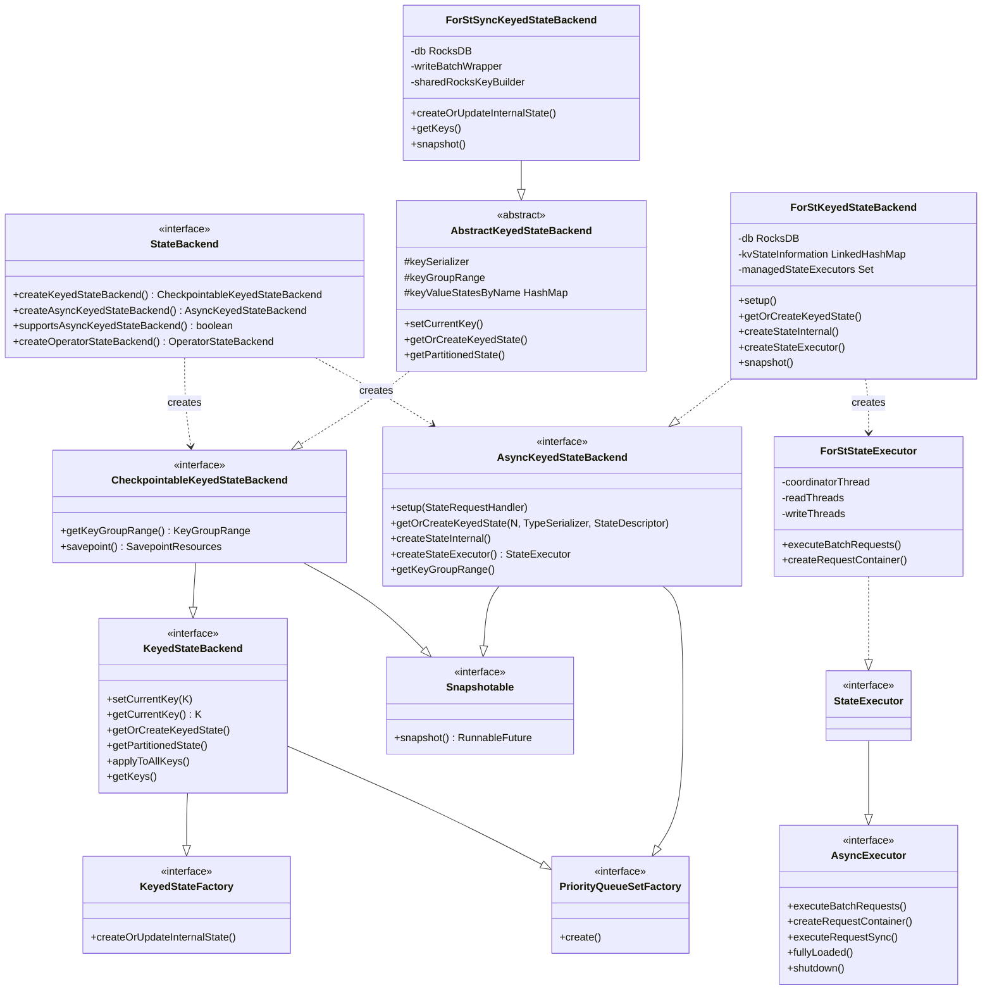
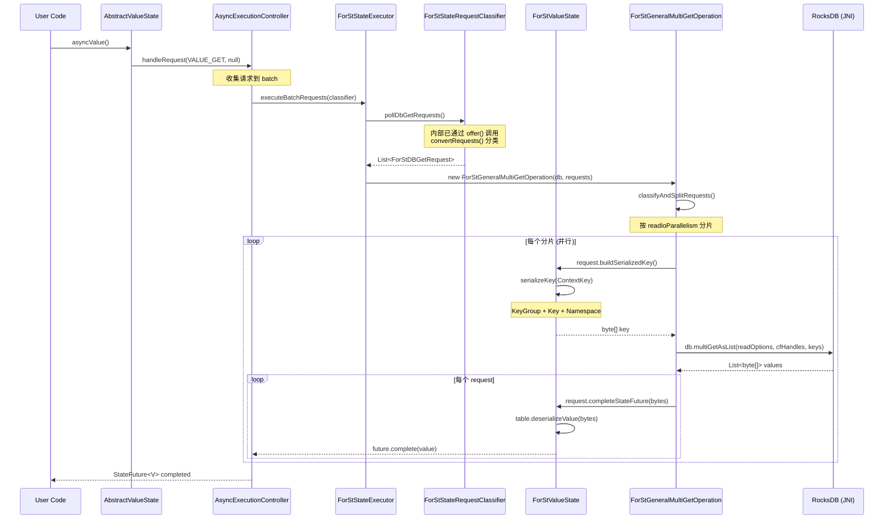
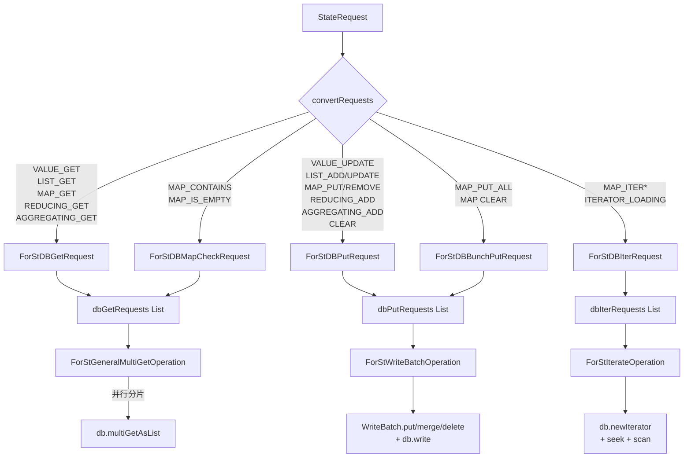

# Flink 2.2 StateBackend API 分析

## 0. 文档元数据
- **文档 ID**: 1.4
- **状态**: completed
- **依赖**: 无
- **最后更新**: 2026-04-19
- **源码仓库**: `~/code/baidu/bce-bmr/flink-src` (分支 `bmr-2.1.0`)

---

## 1. Context

Apache Flink 2.x 引入了全新的异步状态后端 API 体系，核心变化是在原有同步 `KeyedStateBackend` 之上，新增了 `AsyncKeyedStateBackend` 接口和全套 State v2 API（`org.apache.flink.api.common.state.v2.*`）。ForSt（Fork of RocksDB）是 Flink 2.2 中唯一实现了完整异步状态访问模型的 StateBackend，其设计遵循 FLIP-426 的"请求分组 + 批量执行"架构。

本文档从源码层面深入分析：
1. Flink StateBackend 接口继承体系（同步 + 异步）
2. ForSt 对异步体系的完整实现
3. 五种状态类型的 get/put 调用链（追踪到 JNI 边界）
4. 异步执行模型和请求批处理机制
5. 同步版 vs 异步版的关键差异
6. ForSt-RS 需要实现的最小接口集

---

## 2. 源码证据

### 2.1 关键文件清单

| 分类 | 文件路径 | 说明 |
|------|---------|------|
| **顶层接口** | `flink-runtime/.../state/StateBackend.java` | 状态后端工厂接口 |
| **同步 Keyed** | `flink-runtime/.../state/KeyedStateBackend.java` | 同步 Keyed 状态接口 |
| **同步 Keyed** | `flink-runtime/.../state/CheckpointableKeyedStateBackend.java` | 含 Checkpoint 能力 |
| **同步 Keyed** | `flink-runtime/.../state/AbstractKeyedStateBackend.java` | 同步抽象基类 |
| **异步 Keyed** | `flink-runtime/.../state/AsyncKeyedStateBackend.java` | 异步 Keyed 状态接口 |
| **State v2 基类** | `flink-runtime/.../state/v2/AbstractKeyedState.java` | 异步状态根基类 |
| **State v2 基类** | `flink-runtime/.../state/v2/AbstractValueState.java` | 异步 ValueState 基类 |
| **执行器接口** | `flink-runtime/.../asyncprocessing/AsyncExecutor.java` | 异步执行器接口 |
| **执行器接口** | `flink-runtime/.../asyncprocessing/StateExecutor.java` | StateRequest 专用执行器 |
| **ForSt Backend** | `flink-statebackend-forst/.../ForStStateBackend.java` | ForSt 工厂 |
| **ForSt 异步** | `flink-statebackend-forst/.../ForStKeyedStateBackend.java` | 异步实现 |
| **ForSt 同步** | `flink-statebackend-forst/.../sync/ForStSyncKeyedStateBackend.java` | 同步实现 |
| **执行器** | `flink-statebackend-forst/.../ForStStateExecutor.java` | ForSt 批量执行器 |
| **请求分类** | `flink-statebackend-forst/.../ForStStateRequestClassifier.java` | 请求分类器 |
| **MultiGet** | `flink-statebackend-forst/.../ForStGeneralMultiGetOperation.java` | 批量读操作 |
| **WriteBatch** | `flink-statebackend-forst/.../ForStWriteBatchOperation.java` | 批量写操作 |
| **Iterate** | `flink-statebackend-forst/.../ForStIterateOperation.java` | 迭代操作 |
| **DB 请求** | `flink-statebackend-forst/.../ForStDBGetRequest.java` | Get 请求抽象 |
| **DB 请求** | `flink-statebackend-forst/.../ForStDBPutRequest.java` | Put 请求抽象 |
| **DB 请求** | `flink-statebackend-forst/.../ForStDBIterRequest.java` | 迭代请求抽象 |
| **内部表** | `flink-statebackend-forst/.../ForStInnerTable.java` | 状态-ColumnFamily 映射 |
| **上下文键** | `flink-statebackend-forst/.../ContextKey.java` | 复合键上下文 |

---

## 3. 发现

### 3.1 接口继承体系

Flink 2.2 中 StateBackend 存在两条并行的继承链路：**同步路径**和**异步路径**。

#### 3.1.1 顶层工厂接口 `StateBackend`

`StateBackend` 是状态后端的工厂接口，定义了三个核心工厂方法：

```java
public interface StateBackend extends java.io.Serializable {
    // 同步路径：创建可 checkpoint 的 KeyedStateBackend
    <K> CheckpointableKeyedStateBackend<K> createKeyedStateBackend(
            KeyedStateBackendParameters<K> parameters) throws Exception;

    // 异步路径（@Experimental）：创建异步 KeyedStateBackend
    default <K> AsyncKeyedStateBackend<K> createAsyncKeyedStateBackend(
            KeyedStateBackendParameters<K> parameters) throws Exception;

    // 是否支持异步路径
    default boolean supportsAsyncKeyedStateBackend() { return false; }

    // Operator 状态（独立于 Keyed 状态）
    OperatorStateBackend createOperatorStateBackend(
            OperatorStateBackendParameters parameters) throws Exception;
}
```

#### 3.1.2 同步继承链

```
StateBackend (工厂)
  |
  +-- createKeyedStateBackend() 返回:
        |
        CheckpointableKeyedStateBackend<K>
          extends KeyedStateBackend<K>    -- Keyed 状态管理
          extends Snapshotable<...>       -- Checkpoint 快照
          extends Closeable
            |
            KeyedStateBackend<K>
              extends KeyedStateFactory    -- createOrUpdateInternalState()
              extends PriorityQueueSetFactory
              extends Disposable
                |
                核心方法:
                  setCurrentKey(K)         -- 设置当前处理的 key
                  getCurrentKey()          -- 获取当前 key
                  getKeySerializer()       -- key 序列化器
                  getOrCreateKeyedState()  -- 获取或创建状态
                  getPartitionedState()    -- 获取分区状态
                  applyToAllKeys()         -- 遍历所有 key
                  getKeys() / getKeysAndNamespaces()
```

同步抽象基类 `AbstractKeyedStateBackend<K>` 实现了以上所有接口，提供了：
- `keyValueStatesByName` (HashMap) 缓存已创建的状态实例
- TtlStateFactory 包装（TTL 功能）
- MetricsTrackingStateFactory 包装（延迟/大小追踪）
- `getPartitionedState()` 的 lastName/lastState 快速路径缓存

ForSt 同步实现：`ForStSyncKeyedStateBackend extends AbstractKeyedStateBackend<K>`

#### 3.1.3 异步继承链

```
StateBackend (工厂)
  |
  +-- createAsyncKeyedStateBackend() 返回:
        |
        AsyncKeyedStateBackend<K>
          extends Snapshotable<...>              -- Checkpoint 快照
          extends InternalCheckpointListener     -- Checkpoint 回调
          extends PriorityQueueSetFactory        -- 优先级队列
          extends Disposable
          extends Closeable
          extends AsyncExecutionController.SwitchContextListener<K>
            |
            核心方法:
              setup(StateRequestHandler)         -- 初始化 StateRequestHandler
              getOrCreateKeyedState(N, TypeSerializer<N>, StateDescriptor<SV>)
              createStateInternal(N, TypeSerializer<N>, StateDescriptor<SV>)
              createStateExecutor() -> StateExecutor
              getKeyGroupRange()
              switchContext(RecordContext<K>)     -- 异步上下文切换回调
```

关键差异：
- 异步接口**没有** `setCurrentKey()` / `getCurrentKey()`，因为 key 通过 `RecordContext` 传递
- 异步接口**没有继承** `KeyedStateBackend`，是完全独立的接口
- 异步接口新增 `createStateExecutor()` 方法，用于创建批量执行器
- 使用 **State v2 API**（`org.apache.flink.api.common.state.v2.*`），而非原有 State v1

ForSt 异步实现：`ForStKeyedStateBackend<K> implements AsyncKeyedStateBackend<K>`

#### 3.1.4 State v2 API 体系

异步状态基于全新的 `state.v2` 包，所有操作返回 `StateFuture<T>` 而非直接返回值：

```
AbstractKeyedState<K, N, V>  (implements InternalKeyedState<K, N, V>)
  |
  +-- handleRequest(StateRequestType, payload) -> StateFuture<OUT>
  +-- handleRequestSync(StateRequestType, payload) -> OUT
  +-- asyncClear() -> StateFuture<Void>
  +-- clear()
  |
  +-- AbstractValueState<K, N, V>
  |     asyncValue() -> StateFuture<V>     // 委托 handleRequest(VALUE_GET, null)
  |     asyncUpdate(V) -> StateFuture<Void> // 委托 handleRequest(VALUE_UPDATE, value)
  |     value() -> V                        // 同步版
  |     update(V)                           // 同步版
  |
  +-- AbstractListState<K, N, V>
  +-- AbstractMapState<K, N, UK, UV>
  +-- AbstractReducingState<K, N, V>
  +-- AbstractAggregatingState<K, N, IN, ACC, OUT>
```

核心机制：`handleRequest()` 将请求提交给 `StateRequestHandler`（即 `AsyncExecutionController`），由 AEC 收集一批请求后，通过 `StateExecutor.executeBatchRequests()` 批量执行。

### 3.2 五种状态类型的 get/put 调用链

#### 3.2.1 调用链总览

所有五种状态类型遵循统一的分层架构：

```
用户 API 调用
  -> AbstractXxxState.handleRequest(type, payload)
    -> StateRequestHandler（AEC 收集请求到 batch）
      -> StateExecutor.executeBatchRequests(ForStStateRequestClassifier)
        -> ForStStateRequestClassifier.convertRequests() 分类为 Get/Put/Iter
          -> ForStInnerTable.buildDBGetRequest() / buildDBPutRequest()
            -> 生成 ForStDBGetRequest / ForStDBPutRequest / ForStDBIterRequest
              -> ForStGeneralMultiGetOperation / ForStWriteBatchOperation / ForStIterateOperation
                -> RocksDB JNI: db.multiGetAsList() / writeBatch.put() / db.newIterator()
```

#### 3.2.2 ValueState (ForStValueState)

**Get 路径:**
```
user.asyncValue()
  -> AbstractValueState.handleRequest(VALUE_GET, null)
    -> AEC 收集 -> StateExecutor.executeBatchRequests()
      -> ForStStateRequestClassifier.convertRequests(request)
        -> innerTable.buildDBGetRequest(stateRequest)
          -> new ForStDBSingleGetRequest(contextKey, this, future)
            -> 加入 dbGetRequests 列表
              -> ForStGeneralMultiGetOperation.process()
                -> request.buildSerializedKey()  // ForStInnerTable.serializeKey(ContextKey)
                                                 // = SerializedCompositeKeyBuilder 序列化 key+namespace
                -> db.multiGetAsList(readOptions, columnFamilyHandles, keys)  // RocksDB JNI
                -> request.completeStateFuture(bytes)
                  -> ForStDBSingleGetRequest.completeStateFuture()
                    -> table.deserializeValue(bytes) -> future.complete(value)
```

**Put 路径:**
```
user.asyncUpdate(value)
  -> AbstractValueState.handleRequest(VALUE_UPDATE, value)
    -> AEC 收集 -> StateExecutor.executeBatchRequests()
      -> ForStStateRequestClassifier.convertRequests(request)
        -> innerTable.buildDBPutRequest(stateRequest)
          -> ForStDBPutRequest.of(contextKey, value, this, future)
            -> 加入 dbPutRequests 列表
              -> ForStWriteBatchOperation.process()
                -> ForStDBWriteBatchWrapper 创建 WriteBatch
                -> request.process(writeBatch, db)
                  -> writeBatch.put(cfHandle, serializedKey, serializedValue)  // RocksDB JNI
                -> writeBatch.flush()  // 写入 DB
                -> request.completeStateFuture()  // future.complete(null)
```

**Clear 路径:**
```
user.asyncClear()
  -> handleRequest(CLEAR, null)
    -> innerTable.buildDBPutRequest(stateRequest)
      -> ForStDBPutRequest.of(contextKey, null, this, future)  // value=null 表示删除
        -> writeBatch.remove(cfHandle, serializedKey)  // RocksDB JNI delete
```

#### 3.2.3 ListState (ForStListState)

**Get 路径 (LIST_GET):**
```
user.asyncGet()
  -> handleRequest(LIST_GET, null)
    -> ForStListState.buildDBGetRequest(stateRequest)
      -> new ForStDBListGetRequest(contextKey, this, future)  // 返回 StateIterator<V>
        -> db.multiGetAsList() -> bytes
        -> ListDelimitedSerializer.deserializeList(bytes) -> List<V>
        -> 构造 StateIterator 返回
```

**Add 路径 (LIST_ADD):**
```
user.asyncAdd(value)
  -> handleRequest(LIST_ADD, value)
    -> ForStListState.buildDBPutRequest(stateRequest)
      -> ForStDBPutRequest.ofMerge(contextKey, [value], this, future)  // isMerge=true
        -> writeBatch.merge(cfHandle, key, serializedValue)  // RocksDB merge 操作
```

**AddAll 路径 (LIST_ADD_ALL):**
```
user.asyncAddAll(values)
  -> handleRequest(LIST_ADD_ALL, values)
    -> ForStDBPutRequest.ofMerge(contextKey, values, this, future)
```

**Update 路径 (LIST_UPDATE):**
```
-> ForStDBPutRequest.of(contextKey, values, this, future)  // 覆盖写入（非 merge）
```

ListState 特殊之处：使用 RocksDB 的 **StringAppendOperator（merge operator）** 实现高效的 list append 操作，避免 read-modify-write。

#### 3.2.4 MapState (ForStMapState)

MapState 是最复杂的状态类型，因为每个 user key 是一个独立的 RocksDB 条目。

**Get 路径 (MAP_GET):**
```
user.asyncGet(userKey)
  -> handleRequest(MAP_GET, userKey)
    -> ForStMapState.buildDBGetRequest(stateRequest)
      -> new ContextKey(recordContext, namespace, userKey)  // 包含 userKey
      -> new ForStDBSingleGetRequest(contextKey, this, future)
        -> serializeKey(): key = KeyGroup + Key + Namespace + UserKey
        -> db.multiGetAsList() -> value bytes
        -> deserializeValue() // readBoolean(isNull) + deserialize(UV)
```

**Contains 路径 (MAP_CONTAINS):**
```
-> new ForStDBMapCheckRequest(contextKey, this, future, false)
  -> 单独执行 db.get() 检查
```

**IsEmpty 路径 (MAP_IS_EMPTY):**
```
-> new ForStDBMapCheckRequest(contextKey, this, future, true)
  -> 使用 RocksDB iterator 前缀扫描检查
```

**Put 路径 (MAP_PUT):**
```
user.asyncPut(userKey, userValue)
  -> handleRequest(MAP_PUT, Tuple2(userKey, userValue))
    -> ForStMapState.buildDBPutRequest(stateRequest)
      -> ContextKey 包含 userKey
      -> ForStDBPutRequest.of(contextKey, value, this, future)
```

**PutAll 路径 (MAP_PUT_ALL):**
```
user.asyncPutAll(map)
  -> handleRequest(MAP_PUT_ALL, map)
    -> ForStMapState.buildDBBunchPutRequest(stateRequest)
      -> new ForStDBBunchPutRequest(contextKey, map, this, future)
        -> 遍历 map，为每个 entry 写入 writeBatch
```

**Remove 路径 (MAP_REMOVE):**
```
-> ContextKey 包含要删除的 userKey
-> ForStDBPutRequest.of(contextKey, null, this, future)  // value=null 删除
```

**Iterator 路径 (MAP_ITER / MAP_ITER_KEY / MAP_ITER_VALUE):**
```
user.asyncIterator()
  -> handleRequest(MAP_ITER, null)
    -> ForStMapState.buildDBIterRequest(stateRequest)
      -> new ForStDBMapEntryIterRequest / KeyIterRequest / ValueIterRequest
        -> 加入 dbIterRequests 列表
          -> ForStIterateOperation.process()
            -> request.process(db, cacheSizeLimit)
              -> db.newIterator(cfHandle)           // RocksDB JNI
              -> iterator.seek(prefix)               // 前缀扫描
              -> 逐条读取直到 cacheSizeLimit 或前缀不匹配
              -> 反序列化条目 -> 构造 ForStMapIterator
              -> 若未读完，后续通过 ITERATOR_LOADING 请求继续加载
```

**Clear 路径 (MAP_CLEAR):**
```
-> ForStMapState.buildDBBunchPutRequest(stateRequest)
  -> ForStDBBunchPutRequest 特殊处理：前缀扫描删除所有 user key
```

MapState 的 key 编码格式：`[KeyGroupPrefix][Key][Namespace][UserKey]`

#### 3.2.5 ReducingState (ForStReducingState)

**Get 路径 (REDUCING_GET):**
```
user.asyncGet()
  -> handleRequest(REDUCING_GET, null)
    -> ForStReducingState.buildDBGetRequest(stateRequest)
      -> new ForStDBSingleGetRequest(contextKey, this, future)
        -> db.multiGetAsList() -> deserializeValue() -> V
```

**Add 路径 (REDUCING_ADD):**
```
user.asyncAdd(value)
  -> handleRequest(REDUCING_ADD, value)
    -> 注意：AEC 层先执行 read-modify-write (获取旧值 -> reduce -> 写入新值)
    -> ForStReducingState.buildDBPutRequest(stateRequest)
      -> ForStDBPutRequest.of(contextKey, reducedValue, this, future)
        -> writeBatch.put(cfHandle, key, serializedReducedValue)
```

ReducingState 的 add 操作在 AEC 层面是先读后写的，底层 ForSt 只看到 get + put。

#### 3.2.6 AggregatingState (ForStAggregatingState)

**Get 路径 (AGGREGATING_GET):**
```
user.asyncGet()
  -> handleRequest(AGGREGATING_GET, null)
    -> ForStAggregatingState.buildDBGetRequest(stateRequest)
      -> new ForStDBSingleGetRequest(contextKey, this, future)
        -> db.multiGetAsList() -> deserializeValue() -> ACC
        -> AEC 层调用 aggregateFunction.getResult(ACC) -> OUT
```

**Add 路径 (AGGREGATING_ADD):**
```
user.asyncAdd(input)
  -> handleRequest(AGGREGATING_ADD, input)
    -> AEC 层: 获取旧 ACC -> aggregateFunction.add(input, acc) -> 新 ACC
    -> ForStAggregatingState.buildDBPutRequest(stateRequest)
      -> ForStDBPutRequest.of(contextKey, newACC, this, future)
```

与 ReducingState 类似，AggregatingState 的 add 也是 AEC 层的 read-modify-write。

### 3.3 异步执行模型 (ForStStateExecutor)

#### 3.3.1 线程模型

`ForStStateExecutor` 内部维护三组线程池：

```
+---------------------+
|  Coordinator Thread  |  -- 1 个线程（或内联执行），负责调度
+---------------------+
         |
    +----+----+
    |         |
+-------+  +-------+
| Read  |  | Write |  -- 可配置并行度
| Pool  |  | Pool  |
+-------+  +-------+
```

- **coordinatorThread**: 单线程，负责接收批次、分派到 read/write 线程
  - 可配置为 `inline`（直接在调用者线程执行）
- **readThreads**: 可配置并行度 (`readIoParallelism`)，执行 multiGet 和 iterate
- **writeThreads**: 可配置并行度 (`writeIoParallelism`)，执行 writeBatch
  - 可配置为 `inline`（与 coordinator 共用线程）
  - 可配置与 readThreads 共享

#### 3.3.2 执行流程

```
AsyncExecutionController (AEC)
  |
  | 收集一批 StateRequest -> ForStStateRequestClassifier
  |
  v
ForStStateExecutor.executeBatchRequests(classifier)
  |
  | 在 coordinatorThread 中:
  |   1. pollDbGetRequests()  -> List<ForStDBGetRequest>
  |   2. pollDbIterRequests() -> List<ForStDBIterRequest>
  |   3. pollDbPutRequests()  -> List<ForStDBPutRequest>
  |
  | 并行启动三种操作:
  |
  +-- ForStGeneralMultiGetOperation.process()
  |     -> 按 readIoParallelism 将 get 请求分片
  |     -> 每个分片在 readThread 中:
  |          序列化所有 key
  |          -> db.multiGetAsList(readOptions, cfHandles, keys)  // JNI 批量读
  |          -> 每个 request.completeStateFuture(value)
  |
  +-- ForStIterateOperation.process()
  |     -> 每个 iter 请求在 readThread 中:
  |          -> db.newIterator(cfHandle)
  |          -> seek(prefix) + 逐条读取
  |          -> request.buildIteratorAndCompleteFuture()
  |
  +-- ForStWriteBatchOperation.process()
        -> 在 writeThread 中:
             -> ForStDBWriteBatchWrapper 创建 RocksDB WriteBatch
             -> 遍历所有 put request:
                  request.process(writeBatch, db)
                  -> put/merge/remove 操作写入 WriteBatch
             -> writeBatch.flush()  // 一次性写入 DB（JNI）
             -> 每个 request.completeStateFuture()
```

#### 3.3.3 背压机制

```java
public boolean fullyLoaded() {
    return ongoing.get() >= readThreadCount;
}
```

`ongoing` 计数器追踪正在进行的读操作子进程数。当 `ongoing >= readThreadCount` 时，AEC 会暂停提交新批次，实现背压。**只追踪 read 操作**，因为 write 通常很快。

### 3.4 请求批处理机制

#### 3.4.1 请求分类 (ForStStateRequestClassifier)

`ForStStateRequestClassifier` 实现 `AsyncRequestContainer` 接口，将 `StateRequest` 转换并分类为三种 ForStDB 请求：

| StateRequestType | 转换目标 | 分类 |
|-----------------|---------|------|
| `VALUE_GET` | `ForStDBSingleGetRequest` | Get |
| `LIST_GET` | `ForStDBListGetRequest` | Get |
| `MAP_GET` | `ForStDBSingleGetRequest` | Get |
| `MAP_CONTAINS` | `ForStDBMapCheckRequest` | Get |
| `MAP_IS_EMPTY` | `ForStDBMapCheckRequest` | Get |
| `REDUCING_GET` | `ForStDBSingleGetRequest` | Get |
| `AGGREGATING_GET` | `ForStDBSingleGetRequest` | Get |
| `VALUE_UPDATE` | `ForStDBPutRequest` | Put |
| `LIST_UPDATE` / `LIST_ADD` / `LIST_ADD_ALL` | `ForStDBPutRequest` (merge) | Put |
| `MAP_PUT` / `MAP_REMOVE` | `ForStDBPutRequest` | Put |
| `REDUCING_ADD` | `ForStDBPutRequest` | Put |
| `AGGREGATING_ADD` | `ForStDBPutRequest` | Put |
| `CLEAR` (非 Map) | `ForStDBPutRequest` (value=null) | Put |
| `CLEAR` (Map) | `ForStDBBunchPutRequest` | Put |
| `MAP_PUT_ALL` | `ForStDBBunchPutRequest` | Put |
| `MAP_ITER` / `MAP_ITER_KEY` / `MAP_ITER_VALUE` | `ForStDBIterRequest` | Iter |
| `ITERATOR_LOADING` | `ForStDBIterRequest` (续载) | Iter |

转换的核心逻辑在 `ForStStateRequestClassifier.convertRequests()` 静态方法中。每个 `ForStInnerTable`（即各种 ForStXxxState）负责构建对应的 DB 请求对象。

#### 3.4.2 批量读：ForStGeneralMultiGetOperation

工作原理：
1. 将 `ForStDBGetRequest` 列表分为两组：
   - 普通 get 请求（ForStDBSingleGetRequest 等）
   - map check 请求（ForStDBMapCheckRequest）-- 需要单独执行
2. 普通 get 请求按 `readIoParallelism` 均匀分片
3. 每个分片在独立线程中调用 `db.multiGetAsList()`（RocksDB 批量读 JNI）
4. MapCheck 请求因为需要 iterator 或特殊逻辑，逐个在线程池中执行 `request.process(db)`

关键 JNI 调用：`RocksDB.multiGetAsList(ReadOptions, List<ColumnFamilyHandle>, List<byte[]>)`

#### 3.4.3 批量写：ForStWriteBatchOperation

工作原理：
1. 创建 `ForStDBWriteBatchWrapper`（封装 RocksDB WriteBatch）
2. 遍历所有 `ForStDBPutRequest`，依次写入 WriteBatch:
   - `value == null` -> `writeBatch.remove(cfHandle, key)` （删除）
   - `isMerge == true` -> `writeBatch.merge(cfHandle, key, value)` （合并）
   - 否则 -> `writeBatch.put(cfHandle, key, value)` （写入）
3. 一次性 `writeBatch.flush()` 提交到 DB

关键 JNI 调用：`WriteBatch.put()` / `WriteBatch.merge()` / `WriteBatch.delete()` + `RocksDB.write(WriteOptions, WriteBatch)`

#### 3.4.4 ForStInnerTable 接口

`ForStInnerTable<K, N, V>` 是连接状态类型和 DB 请求的桥梁：

```java
public interface ForStInnerTable<K, N, V> {
    ColumnFamilyHandle getColumnFamilyHandle();
    byte[] serializeKey(ContextKey<K, N> key) throws IOException;
    byte[] serializeValue(V value) throws IOException;
    V deserializeValue(byte[] value) throws IOException;
    ForStDBGetRequest<?, ?, ?, ?> buildDBGetRequest(StateRequest<?, ?, ?, ?> stateRequest);
    ForStDBPutRequest<?, ?, ?> buildDBPutRequest(StateRequest<?, ?, ?, ?> stateRequest);
}
```

五种 ForStXxxState 都实现此接口，负责：
- **序列化/反序列化**: 将 Java 对象与 byte[] 互转
- **请求构建**: 将 `StateRequest` 转换为具体的 DB 请求对象

#### 3.4.5 ContextKey 与序列化键缓存

`ContextKey<K, N>` 封装了完整的复合键信息：

```java
public class ContextKey<K, N> {
    RecordContext<K> recordContext;  // 包含 key 和 keyGroup
    N namespace;                     // 命名空间
    Object userKey;                  // MapState 的 user key

    // 序列化缓存：避免同一 key 多次序列化
    byte[] getOrCreateSerializedKey(serializeKeyFunc)
}
```

序列化后的 key 格式：`[KeyGroupPrefix(1-2 bytes)][SerializedKey][SerializedNamespace][UserKey(MapState only)]`

### 3.5 同步 vs 异步版本对比

| 维度 | 同步版 (ForStSyncKeyedStateBackend) | 异步版 (ForStKeyedStateBackend) |
|------|-------------------------------------|-------------------------------|
| **继承体系** | `extends AbstractKeyedStateBackend<K>` (继承 KeyedStateBackend) | `implements AsyncKeyedStateBackend<K>` (独立接口) |
| **State API** | State v1 (`org.apache.flink.api.common.state.*`) | State v2 (`org.apache.flink.api.common.state.v2.*`) |
| **Key 管理** | `setCurrentKey(K)` / `getCurrentKey()` -- 线程局部 | 通过 `RecordContext<K>` 传递 -- 无需设置 |
| **执行模型** | 同步阻塞调用 `db.get()` / `db.put()` | 异步批量执行 `multiGetAsList()` / `writeBatch` |
| **写入方式** | `ForStDBWriteBatchWrapper` 共享，超过阈值自动 flush | `ForStWriteBatchOperation` 一次性写入一个 batch |
| **读取方式** | 单次 `db.get(cfHandle, readOptions, key)` | 批量 `db.multiGetAsList(readOptions, cfHandles, keys)` |
| **序列化器** | 非线程安全的共享 `sharedRocksKeyBuilder` | ThreadLocal 的 `serializedKeyBuilder`（多线程安全） |
| **状态类型实现** | `ForStSyncValueState` 等 (在 `sync/` 包下) | `ForStValueState` 等 (在主包下) |
| **状态创建** | `STATE_CREATE_FACTORIES` 静态工厂 Map | `createStateInternal()` 中 switch 分派 |
| **Checkpoint** | 通过 `AbstractKeyedStateBackend` 的 `Snapshotable` | 直接实现 `Snapshotable<SnapshotResult<KeyedStateHandle>>` |
| **TTL** | `TtlStateFactory` (v1) | `TtlStateFactory` (v2, 在 `state.v2.ttl` 包下) |
| **Metrics** | `LatencyTrackingStateConfig` + `SizeTrackingStateConfig` | 暂无（通过 ForStKeyedStateBackend 层面控制） |

**关键差异总结:**

1. **同步版是 single-threaded**: 所有 DB 操作在 Task 线程内同步执行，每次状态访问都是 `setCurrentKey() -> getState() -> state.value()` 的顺序模型。

2. **异步版是 multi-threaded batch**: 多个不同 key 的状态请求被 AEC 收集成 batch，由 `ForStStateExecutor` 的线程池并行执行。这意味着序列化器必须线程安全（ThreadLocal）。

3. **异步版没有全局 current key**: 同步版通过 `setCurrentKey()` 设置全局 key context，异步版将 key 封装在 `ContextKey`/`RecordContext` 中随请求传递。

### 3.6 ForSt-RS 最小接口集

基于以上分析，若要用 Rust 重写 ForSt 存储引擎（ForSt-RS），需要实现的最小接口集如下：

#### 3.6.1 必须实现的 Flink 框架接口

| 接口 | 说明 | 关键方法 |
|------|------|---------|
| `AsyncKeyedStateBackend<K>` | 异步 Keyed 状态后端主接口 | `setup()`, `getOrCreateKeyedState()`, `createStateInternal()`, `createStateExecutor()`, `getKeyGroupRange()`, `snapshot()`, `dispose()`, `close()` |
| `StateExecutor` (extends `AsyncExecutor`) | 批量状态请求执行器 | `executeBatchRequests()`, `createRequestContainer()`, `executeRequestSync()`, `fullyLoaded()`, `shutdown()` |
| `Snapshotable<SnapshotResult<KeyedStateHandle>>` | Checkpoint 快照 | `snapshot()` |
| `PriorityQueueSetFactory` | 优先级队列（Timer Service 用） | `create()` |

#### 3.6.2 必须实现的内部接口/类

| 接口/类 | 说明 | JNI 边界方法 |
|--------|------|------------|
| `ForStInnerTable<K, N, V>` | 状态-ColumnFamily 映射 | `serializeKey()`, `serializeValue()`, `deserializeValue()`, `buildDBGetRequest()`, `buildDBPutRequest()` |
| `ForStDBGetRequest<K, N, V, R>` | Get 请求 | `buildSerializedKey()`, `completeStateFuture(byte[])` |
| `ForStDBPutRequest<K, N, V>` | Put 请求 | `process(writeBatch, db)` |
| `ForStDBIterRequest<K, N, UK, UV, R>` | 迭代请求 | `process(db, cacheSizeLimit)` |
| `ForStDBOperation` | DB 操作封装 | `process() -> CompletableFuture<Void>` |

#### 3.6.3 必须实现的五种状态类型

| 状态类型 | 实现类 | 继承基类 | 额外操作 |
|---------|-------|---------|---------|
| ValueState | `ForStValueState<K, N, V>` | `AbstractValueState<K, N, V>` | get, update, clear |
| ListState | `ForStListState<K, N, V>` | `AbstractListState<K, N, V>` | get, add, addAll, update, clear, mergeNamespaces |
| MapState | `ForStMapState<K, N, UK, UV>` | `AbstractMapState<K, N, UK, UV>` | get, put, putAll, remove, contains, isEmpty, iter, iterKey, iterValue, clear |
| ReducingState | `ForStReducingState<K, N, V>` | `AbstractReducingState<K, N, V>` | get, add(put), clear |
| AggregatingState | `ForStAggregatingState<K, N, IN, ACC, OUT>` | `AbstractAggregatingState<K, N, IN, ACC, OUT>` | get, add(put), clear |

#### 3.6.4 JNI 边界的最小 DB 操作集

这是 ForSt-RS 真正需要在 Rust 层面实现的存储引擎操作：

| 操作 | RocksDB JNI 对应 | 使用场景 |
|------|-----------------|---------|
| **multiGet** | `db.multiGetAsList(ReadOptions, List<ColumnFamilyHandle>, List<byte[]>)` | 批量读取（核心读路径） |
| **singleGet** | `db.get(ColumnFamilyHandle, byte[])` | MapCheckRequest / 同步读 |
| **writeBatch.put** | `WriteBatch.put(ColumnFamilyHandle, byte[], byte[])` | 批量写入 |
| **writeBatch.merge** | `WriteBatch.merge(ColumnFamilyHandle, byte[], byte[])` | ListState append |
| **writeBatch.delete** | `WriteBatch.delete(ColumnFamilyHandle, byte[])` | 删除 |
| **writeBatch.flush** | `db.write(WriteOptions, WriteBatch)` | 提交写入 |
| **newIterator** | `db.newIterator(ColumnFamilyHandle)` | 前缀扫描（MapState iter） |
| **iterator.seek** | `RocksIterator.seek(byte[])` | 定位前缀 |
| **iterator.isValid/key/value/next** | `RocksIterator.isValid()` / `.key()` / `.value()` / `.next()` | 遍历 |
| **createColumnFamily** | `db.createColumnFamily(ColumnFamilyDescriptor)` | 状态注册 |
| **open** | `RocksDB.open(DBOptions, path, cfDescriptors)` | 打开 DB |
| **checkpoint/snapshot** | ForSt checkpoint 相关 API | 增量快照 |

#### 3.6.5 最小实现路径建议

**Phase 1 - 核心存储层 (必须)**:
- Rust KV 存储引擎：支持 ColumnFamily、get/put/delete/merge/iterator/writeBatch
- JNI 桥接层：替换 `org.forstdb.*` 的 JNI 调用
- `ForStKeyedStateBackend` + `ForStStateExecutor` 适配

**Phase 2 - 五种状态类型 (必须)**:
- 复用现有 Java 层的 `ForStValueState` 等实现
- 它们只需要 `ForStInnerTable` 的序列化/反序列化 + DB 请求构建
- 无需修改，只要底层 DB 接口兼容

**Phase 3 - Checkpoint/Snapshot (必须)**:
- `ForStSnapshotStrategyBase` 及其子策略
- 增量快照的 SST 文件管理

---

## 4. 架构图

### 4.1 接口继承体系图



### 4.2 异步状态执行流（ValueState.get 为例）



### 4.3 请求批处理分类流程



---

## 5. 与 ForSt-RS 重构的关系

### 5.1 替换边界

ForSt-RS 的替换边界应该在 **JNI 层**。当前 ForSt Java 实现通过 `org.forstdb.*` 包调用 RocksDB JNI。Rust 重写需要：

1. **保留 Java 层**: `ForStKeyedStateBackend`, `ForStStateExecutor`, 所有 `ForStXxxState`, `ForStDBXxxRequest`, `ForStStateRequestClassifier` 等 Java 类可以原样保留。
2. **替换存储层**: 用 Rust 实现等价的 KV 存储引擎，通过 JNI 暴露与 `org.forstdb.RocksDB` 兼容的接口。
3. **关键 JNI 方法**: 见 3.6.4 节的 12 个核心 DB 操作。

### 5.2 序列化格式兼容

ForSt-RS 必须保持以下序列化格式不变：
- **Key 编码**: `[KeyGroupPrefix][SerializedKey][SerializedNamespace][UserKey]`
- **Value 编码**: 各状态类型特有（Value 直接序列化；List 使用分隔符序列化；Map value 有 `isNull` boolean 前缀）
- **WriteBatch 语义**: put/merge/delete 的原子性保证

### 5.3 异步模型适配

ForSt-RS 可以利用 Rust 的异步运行时（tokio）提供更高效的异步 IO。关键考量：
- `multiGetAsList` 是当前批量读的核心 JNI 调用，Rust 侧可以实现真正的异步 multiGet
- `WriteBatch` 的 flush 可以在 Rust 侧异步完成
- 迭代器的 seek/next 可以利用 Rust 的零拷贝特性

---

## 6. Open Questions

1. **Checkpoint 策略复杂度**: `ForStSnapshotStrategyBase` 及其子类（增量/全量快照）涉及大量 RocksDB 内部机制（SST 文件管理、manifest 等），ForSt-RS 如何实现兼容的快照策略？

2. **Merge Operator 兼容性**: ListState 依赖 RocksDB 的 `StringAppendOperator` merge 机制，ForSt-RS 是否需要实现完全兼容的 merge operator？

3. **TTL Compact Filter**: `ForStDBTtlCompactFiltersManager` 使用 RocksDB 的 compaction filter 实现 TTL 过期清理，ForSt-RS 需要在 compaction 层面实现等价功能。

4. **Native Metric**: `ForStNativeMetricMonitor` 直接读取 RocksDB 的内部统计信息，ForSt-RS 需要暴露等价的监控指标。

5. **State Migration**: 当前异步版 ForSt 的状态迁移（序列化器变更）尚未完全实现（见源码中的 `TODO: 2024/6/6 - Implement state migration`），ForSt-RS 是否需要在初始版本支持？

6. **同步版是否保留**: `ForStSyncKeyedStateBackend` 用于兼容旧版 API，是否需要在 ForSt-RS 中同时支持同步和异步两条路径？

7. **ForStResourceContainer**: 包含 DBOptions、ColumnFamilyOptions、WriteOptions、ReadOptions 等 RocksDB 配置项，ForSt-RS 需要定义等价的配置映射。
