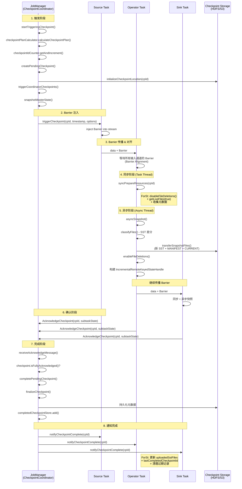
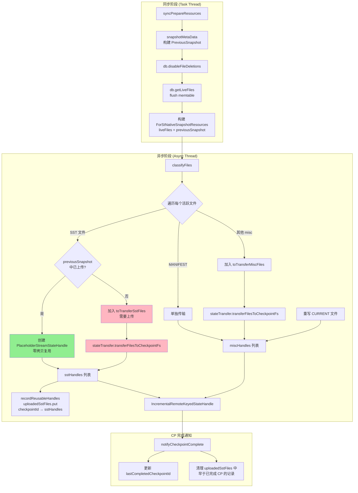
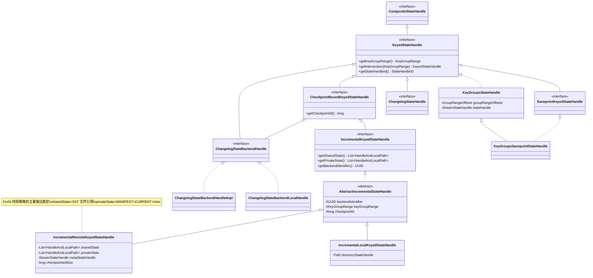
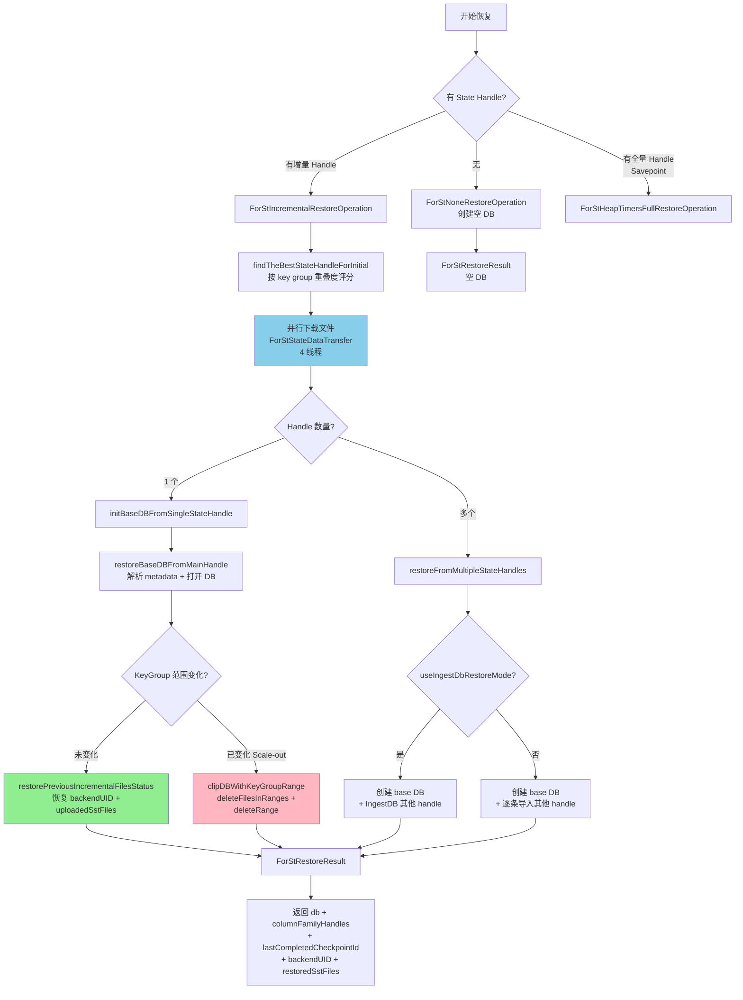

# Flink 2.2 Checkpoint 机制与 ForSt Checkpoint 集成深度分析

## 0. 文档元数据
- **文档 ID**: 1.5
- **状态**: completed
- **依赖**: 无
- **最后更新**: 2026-04-19
- **源码分支**: bmr-2.1.0 (基于 Flink 2.x 代码线)

---

## 1. Context

本文档深度分析 Flink 2.x（bmr-2.1.0 分支）的 Checkpoint 机制，重点关注 ForSt（Flink 的 RocksDB Fork）State Backend 的 Checkpoint 集成实现。ForSt 是 Flink 2.x 对原 RocksDB State Backend 的重构，引入了远程文件系统支持、文件复用策略（ReusableDataTransferStrategy）以及文件级 LRU 缓存机制。

**分析范围**：
1. Checkpoint 完整生命周期（Barrier 注入 → 同步阶段 → 异步阶段 → 上传 → 确认）
2. ForSt 增量快照策略（SST 差分追踪）
3. ForSt 全量快照策略
4. 恢复操作（从 checkpoint 下载 SST → 加载到 ForSt DB）
5. 数据传输策略（Copy vs Reusable）
6. 文件缓存机制（FileBasedCache + DoubleListLru）
7. KeyedStateHandle 类层次

---

## 2. 源码证据

### 核心文件索引

| 模块 | 文件 | 职责 |
|------|------|------|
| flink-runtime | `CheckpointCoordinator.java` | JM 端 Checkpoint 协调器，控制全生命周期 |
| flink-runtime | `SnapshotStrategy.java` | 快照策略接口（syncPrepareResources + asyncSnapshot） |
| flink-runtime | `SnapshotStrategyRunner.java` | 策略执行器，编排同步/异步两阶段 |
| flink-runtime | `KeyedStateHandle.java` | Keyed State 句柄基础接口 |
| flink-runtime | `IncrementalKeyedStateHandle.java` | 增量 Keyed State 句柄接口 |
| flink-runtime | `IncrementalRemoteKeyedStateHandle.java` | 远程增量句柄实现（ForSt 主要使用） |
| forst | `ForStSnapshotStrategyBase.java` | ForSt 快照策略基类 |
| forst | `ForStNativeFullSnapshotStrategy.java` | 全量快照策略 |
| forst | `ForStIncrementalSnapshotStrategy.java` | 增量快照策略（继承全量） |
| forst | `ForStStateDataTransfer.java` | 数据传输调度器（多线程） |
| forst | `DataTransferStrategy.java` | 传输策略抽象基类 |
| forst | `CopyDataTransferStrategy.java` | 字节复制策略 |
| forst | `ReusableDataTransferStrategy.java` | 文件复用策略 |
| forst | `DataTransferStrategyBuilder.java` | 策略构建器 |
| forst | `ForStRestoreOperation.java` | 恢复操作接口 |
| forst | `ForStIncrementalRestoreOperation.java` | 增量恢复操作 |
| forst | `ForStNoneRestoreOperation.java` | 无状态恢复（新建 DB） |
| forst | `ForStHeapTimersFullRestoreOperation.java` | 全量恢复（Heap Timer） |
| forst | `ForStHandle.java` | ForSt DB 实例管理器 |
| forst | `FileBasedCache.java` | 文件级 LRU 缓存 |
| forst | `DoubleListLru.java` | 双链表 LRU 数据结构 |
| forst | `CacheLimitPolicy.java` | 缓存容量策略接口 |

---

## 3. 发现

### 3.1 Checkpoint 完整生命周期

Flink 的 Checkpoint 由 `CheckpointCoordinator`（运行在 JobManager）全权协调，采用**分布式快照**（Chandy-Lamport 变体）算法。完整生命周期分为以下阶段：

#### 阶段 1：触发（Trigger）

**入口方法**：`CheckpointCoordinator.startTriggeringCheckpoint()`

1. **前置检查**：`preCheckGlobalState()` 检查 Job 状态、是否已关闭、并发上限等。
2. **计算 Checkpoint 计划**：`checkpointPlanCalculator.calculateCheckpointPlan()` 确定哪些 Task 需要触发、哪些需要确认。
3. **分配 Checkpoint ID**：通过 `checkpointIdCounter.getAndIncrement()` 获取全局唯一递增 ID。
4. **初始化存储位置**：`initializeCheckpointLocation()` 在 Checkpoint 存储（如 HDFS）上创建目录。
5. **创建 PendingCheckpoint**：记录到 `pendingCheckpoints` Map，设置超时定时器。
6. **Operator Coordinator Checkpoint**：先完成 OperatorCoordinator 的 checkpoint。
7. **Master Hook Snapshot**：执行 MasterTriggerRestoreHook 的快照。
8. **发送 Barrier**：`triggerTasks()` 方法遍历所有需要触发的 Task，调用 `execution.triggerCheckpoint(checkpointId, timestamp, checkpointOptions)` 向 Source 注入 Checkpoint Barrier。

**关键源码证据**（`CheckpointCoordinator.java:836-868`）：
```java
// send messages to the tasks to trigger their checkpoints
List<CompletableFuture<Acknowledge>> acks = new ArrayList<>();
for (Execution execution : checkpoint.getCheckpointPlan().getTasksToTrigger()) {
    acks.add(execution.triggerCheckpoint(checkpointId, timestamp, checkpointOptions));
}
return FutureUtils.waitForAll(acks);
```

#### 阶段 2：Barrier 对齐与本地快照

Barrier 沿着数据流向下游传播。当 Operator 收到所有输入通道的 Barrier 后：

1. **同步阶段**（Sync Phase）：在 Task 线程中调用 `SnapshotStrategy.syncPrepareResources(checkpointId)`
   - ForSt 中：调用 `db.disableFileDeletions()` + `db.getLiveFiles(true)` 获取活跃文件列表
   - 同时 flush memtable（`getLiveFiles(true)` 参数为 `true` 表示 flush）
   - 构建 `ForStNativeSnapshotResources`，包含：stateMetaInfoSnapshots、manifestFileSize、liveFiles 列表、previousSnapshot
   - 最后封装 releaser 回调，用于异步阶段结束后 `db.enableFileDeletions(false)`

2. **异步阶段**（Async Phase）：由 `SnapshotStrategyRunner` 包装为 `FutureTask`，在异步线程池中执行 `SnapshotStrategy.asyncSnapshot()`
   - 具体执行 ForSt 的 snapshot operation（增量或全量）
   - 上传文件到 Checkpoint 存储

**关键源码证据**（`SnapshotStrategyRunner.java:70-113`）：
```java
SR snapshotResources = snapshotStrategy.syncPrepareResources(checkpointId);
// ... 同步阶段完成 ...
SnapshotStrategy.SnapshotResultSupplier<T> asyncSnapshot =
    snapshotStrategy.asyncSnapshot(snapshotResources, checkpointId, timestamp, ...);
// 包装为 FutureTask，异步执行
FutureTask<SnapshotResult<T>> asyncSnapshotTask = new AsyncSnapshotCallable<>() {
    protected SnapshotResult<T> callInternal() throws Exception {
        return asyncSnapshot.get(snapshotCloseableRegistry);
    }
}.toAsyncSnapshotFutureTask(cancelStreamRegistry);
```

#### 阶段 3：确认（Acknowledge）

**入口方法**：`CheckpointCoordinator.receiveAcknowledgeMessage()`

1. Task 完成异步快照后，向 JobManager 发送 `AcknowledgeCheckpoint` 消息。
2. 消息包含 `SubtaskState`（各 Operator 的 state handle 引用）。
3. JM 先将 Shared State 注册到 `SharedStateRegistry`。
4. 调用 `checkpoint.acknowledgeTask()` 记录确认。
5. 当所有 Task 都确认后（`isFullyAcknowledged()`），进入完成流程。

#### 阶段 4：完成（Complete）

**入口方法**：`CheckpointCoordinator.completePendingCheckpoint()`

1. 调用 `finalizeCheckpoint()` 将 `PendingCheckpoint` 转换为 `CompletedCheckpoint`。
2. 持久化到 `CompletedCheckpointStore`（如 ZooKeeper）。
3. 通过 `notifyCheckpointComplete()` 通知所有 Task checkpoint 已完成。
4. ForSt 端收到通知后，更新 `uploadedSstFiles` 和 `lastCompletedCheckpointId`，清理过期记录。

**关键源码证据**（`ForStIncrementalSnapshotStrategy.java:164-179`）：
```java
public void notifyCheckpointComplete(long completedCheckpointId) {
    synchronized (uploadedSstFiles) {
        if (completedCheckpointId > lastCompletedCheckpointId
                && uploadedSstFiles.containsKey(completedCheckpointId)) {
            uploadedSstFiles.keySet()
                .removeIf(checkpointId -> checkpointId < completedCheckpointId);
            lastCompletedCheckpointId = completedCheckpointId;
        }
    }
}
```

---

### 3.2 增量快照策略（SST 差分追踪）

`ForStIncrementalSnapshotStrategy` 继承自 `ForStNativeFullSnapshotStrategy`，是 ForSt 的**默认快照策略**。其核心思想是：只上传自上一次 checkpoint 以来新增或修改的 SST 文件，已上传的 SST 文件通过 `PlaceholderStreamStateHandle` 引用。

#### 同步阶段（syncPrepareResources）

继承自全量策略，主要工作：

1. **收集元数据**：遍历 `kvStateInformation`，对每个 state 取 snapshot。
2. **构建 PreviousSnapshot**：从 `uploadedSstFiles` 中获取上一个已完成 checkpoint 之后的所有已上传文件映射。
3. **禁用文件删除**：`db.disableFileDeletions()` 防止 compaction 删除文件。
4. **获取活跃文件列表**：`db.getLiveFiles(true)` 强制 flush memtable 并返回所有活跃文件。
5. **过滤 CURRENT 文件**：CURRENT 文件在异步阶段重写（避免内容变化）。

**关键源码证据**（`ForStNativeFullSnapshotStrategy.java:149-211`）：
```java
db.disableFileDeletions();
RocksDB.LiveFiles liveFiles = db.getLiveFiles(true); // true = flush memtable
```

#### 异步阶段（asyncSnapshot）

1. **文件分类**（`classifyFiles()`）：
   - 对每个活跃文件，检查是否已在 `previousSnapshot` 中上传过
   - 已上传的 SST：创建 `PlaceholderStreamStateHandle` 引用（零拷贝）
   - 未上传的 SST：加入 `toTransferSstFiles` 列表
   - MANIFEST 文件：单独传输
   - 其他 misc 文件：单独传输
   - CURRENT 文件：在异步阶段重新写入（内容为 manifest 文件名 + 换行符）

2. **元数据序列化**：通过 `KeyedBackendSerializationProxy` 序列化 state meta info。

3. **文件传输**：调用 `ForStStateDataTransfer` 将新文件上传到 Checkpoint 存储。

4. **记录已上传文件**：将本次所有 SST handle（包括复用的和新上传的）记录到 `uploadedSstFiles[checkpointId]`。

5. **构建结果**：返回 `IncrementalRemoteKeyedStateHandle`，包含：
   - `sstFiles`：所有 SST 文件的 handle（shared scope）
   - `miscFiles`：MANIFEST + CURRENT + 其他文件的 handle
   - `metaStateHandle`：元数据 handle

**SST 差分追踪的关键机制 — PreviousSnapshot**：

`PreviousSnapshot` 维护了一个 `confirmedSstFiles` 映射（文件名 -> StreamStateHandle），代表已经被 JM 确认的 SST 文件。构建时有一个**剪枝**逻辑，用于解决 TM 和 JM 之间的通知延迟问题：

```
场景：
1) CP-1 上传 00001.SST → xxx.sst
2) CP-2 因 CP-1 未确认，重新上传 00001.SST → yyy.sst
3) TM 收到 CP-1 确认通知
4) JM 完成 CP-2，清理 CP-1 → 删除 xxx.sst
5) CP-3 试图复用 CP-1 的 xxx.sst → 但已被删除！
```

剪枝逻辑（`pruneFirstCheckpointSstFiles()`）：从最后完成的 checkpoint 开始，移除在后续 checkpoint 中被重新上传的文件。

**SharingFilesStrategy 处理**：
- `FORWARD_BACKWARD`：增量 checkpoint，使用原始 PreviousSnapshot
- `NO_SHARING`：Savepoint，使用空 PreviousSnapshot（所有文件都上传，scope 为 EXCLUSIVE）
- `FORWARD`：Full checkpoint（对增量策略不完全支持，仅首次 checkpoint 允许）

---

### 3.3 全量快照策略

`ForStNativeFullSnapshotStrategy` 是全量快照的实现，同时也是增量策略的父类。

**核心差异**：
- 不维护 `uploadedSstFiles` 历史
- 不做文件差分，所有活跃文件都上传
- `snapshotMetaData()` 返回 `EMPTY_PREVIOUS_SNAPSHOT`
- 所有文件 scope 为 `EXCLUSIVE`（不共享）
- `notifyCheckpointComplete()`/`notifyCheckpointAborted()` 为空操作

**异步阶段**（`ForStNativeFullSnapshotOperation.get()`）：

1. 序列化元数据
2. 上传所有活跃文件（排除 CURRENT 和 MANIFEST）到 EXCLUSIVE scope
3. 单独传输 MANIFEST 文件
4. 重写 CURRENT 文件
5. 构建 `IncrementalRemoteKeyedStateHandle`，其中 `sstFiles = emptyList()`，所有文件放在 `miscFiles`（privateFiles）

---

### 3.4 恢复操作

#### 恢复操作类型

| 操作类 | 场景 | 描述 |
|--------|------|------|
| `ForStNoneRestoreOperation` | 全新启动 | 直接创建空 ForSt DB |
| `ForStIncrementalRestoreOperation` | 从增量 checkpoint 恢复 | 下载 SST + 打开 DB |
| `ForStHeapTimersFullRestoreOperation` | 从 savepoint 恢复（heap timer） | 全量反序列化 + 写入 DB |

#### ForStIncrementalRestoreOperation 详细流程

**恢复入口**：`restore()` 方法

1. **选择最佳 State Handle**：`findTheBestStateHandleForInitial()` 根据 key group 重叠度评分，选择重叠最大的 handle 作为初始 DB。评分公式：先比较交集 key group 数量，再比较重叠比例。

2. **并行下载文件**：
   ```java
   ForStStateDataTransfer transfer = new ForStStateDataTransfer(DEFAULT_THREAD_NUM, ...);
   transfer.transferAllStateDataToDirectory(pathContainer, specs, cancelStreamRegistry, recoveryClaimMode);
   ```
   使用 4 线程并行下载所有 state handle 的文件到本地目录。

3. **打开 DB**（单 handle）：
   - 解析 MANIFEST 文件获取 ColumnFamily 描述符
   - 调用 `ForStHandle.openDB()` 打开 DB
   - 注册所有 ColumnFamilyHandle
   - 检查 key group 范围是否匹配，不匹配则执行 `clipDBWithKeyGroupRange()`

4. **打开 DB**（多 handle，scale-in/scale-out）：
   - 选择最佳 handle 作为 base DB
   - 其他 handle 下载到临时目录
   - 使用 `IngestDB` 模式（如果启用）或逐条导入
   - 最后清理临时目录

5. **恢复增量历史**：如果 key group 范围未变化（无 rescale），恢复 `backendUID` 和 `uploadedSstFiles`，使后续增量 checkpoint 能复用已上传的 SST 文件。

**clipDBWithKeyGroupRange**（Scale-out 场景）：
- 计算需要删除的 key group 范围
- 使用 `db.deleteFilesInRanges()` 快速删除 SST 文件
- 使用 `db.deleteRange()` 放置范围删除墓碑

**ForStRestoreResult** 返回值包含：
- `db`：打开的 RocksDB 实例
- `defaultColumnFamilyHandle`：默认列族句柄
- `nativeMetricMonitor`：可选的原生指标监控器
- `lastCompletedCheckpointId`：最后完成的 checkpoint ID
- `backendUID`：后端唯一标识
- `restoredSstFiles`：已恢复的 SST 文件映射

---

### 3.5 数据传输与缓存

#### 3.5.1 ForStStateDataTransfer

`ForStStateDataTransfer` 是数据传输的调度层，使用固定大小线程池（默认 4 线程）并行执行文件传输任务。

**Checkpoint 方向**（DB → Checkpoint Storage）：
```java
transferFilesToCheckpointFs(): 批量传输多个文件
transferFileToCheckpointFs(): 传输单个文件
writeFileToCheckpointFs(): 直接写入文件内容（用于 CURRENT 文件）
```

**Restore 方向**（Checkpoint Storage → DB）：
```java
transferAllStateDataToDirectory(): 下载所有 state handle 的文件到本地
```

#### 3.5.2 DataTransferStrategy 策略体系

`DataTransferStrategyBuilder` 根据运行时条件选择合适的传输策略：

**Snapshot 策略选择逻辑**：
```
if (forceCopy || NO_SHARING || 无 ForStFlinkFS || DB 路径不在 CP 路径下) {
    → CopyDataTransferStrategy
} else {
    → ReusableDataTransferStrategy
}
```

**Restore 策略选择逻辑**：
```
if (无 ForStFlinkFS || CP FileSystem 不同 || (不同 Job 路径 && NO_CLAIM 模式)) {
    → CopyDataTransferStrategy
} else {
    → ReusableDataTransferStrategy
}
```

#### 3.5.3 CopyDataTransferStrategy

传统的字节拷贝策略，适用于本地文件系统或不同文件系统之间的传输。

**transferToCheckpoint**：
1. 首先尝试**路径复制**（`tryPathCopyingToCheckpoint`）：调用 `checkpointStreamFactory.duplicate()` 进行高效的文件级复制（如 S3 的 CopyObject）
2. 若不支持路径复制，回退到**字节拷贝**（`bytesCopyingToCheckpoint`）：64KB buffer 逐块读写

**transferFromCheckpoint**：
- 打开源 handle 的 InputStream，逐块写入目标 FileSystem

#### 3.5.4 ReusableDataTransferStrategy

**零拷贝策略**，ForSt 2.x 的核心优化之一。仅在 DB 使用远程文件系统（ForStFlinkFileSystem）且 DB 路径在 Checkpoint 路径下时启用。

**transferToCheckpoint**（snapshot 方向）：
- 如果文件是 `PRIVATE_OWNED_BY_DB`：回退到 CopyDataTransferStrategy
- 否则：通过 `reuseFileToCheckpoint()` 直接复用：
  1. 从 ForStFlinkFileSystem 的 MappingEntry 获取文件真实路径
  2. 创建 StateHandle 指向原始文件
  3. 调用 `forStFs.giveUpOwnership()` 将文件所有权转移给 JM
  4. **零数据拷贝**：只传递句柄，不传输字节

**transferFromCheckpoint**（restore 方向）：
- 如果是 `ByteStreamStateHandle`（内存中的小文件）：回退到拷贝
- 如果是 `PRIVATE_OWNED_BY_DB`（如 MANIFEST）：回退到拷贝
- 否则：通过 `reuseFileFromCheckpoint()` 直接复用：
  1. 在 ForStFlinkFileSystem 中注册源文件
  2. 创建符号链接（link）指向源文件
  3. **零数据拷贝**：DB 直接读取 Checkpoint 存储中的文件

#### 3.5.5 FileBasedCache（文件级 LRU 缓存）

`FileBasedCache` 继承 `DoubleListLru`，实现了一个**文件粒度的 LRU 缓存**，用于加速 ForSt 在远程文件系统上的读取性能。

**核心设计**：
- **双链表 LRU**：`DoubleListLru` 维护 first link（热区）和 second link（冷区）
- **晋升机制**：冷区文件被访问 `accessBeforePromote` 次后晋升到热区
- **反晋升限制**：`promoteLimit` 限制单个文件的晋升次数，防止频繁晋升/驱逐
- **异步加载**：晋升时通过 `executorService`（4 线程）异步加载文件到本地缓存

**写入路径**：
- 新生成的 SST 文件通过 `CachedDataOutputStream` **同时写入**原始文件系统和缓存
- 只有新生成的 SST 会进入缓存，从远程恢复的文件不直接缓存

**读取路径**：
- `CachedDataInputStream` 优先从缓存读取，缓存未命中时回退到原始文件
- 只有 Flink 线程的访问才影响 LRU 顺序和指标（通过 `isFlinkThread` ThreadLocal 标识）

**驱逐策略**：
- 由 `CacheLimitPolicy` 控制容量上限
- 热区溢出时，将热区尾部移到冷区
- 冷区文件被 `invalidate()` 标记为无效

**指标**：
- `forst.fileCache.hit`：缓存命中次数
- `forst.fileCache.miss`：缓存未命中次数
- `forst.fileCache.lru.loadback`：从冷区重新加载到热区次数
- `forst.fileCache.lru.evict`：驱逐次数
- `forst.fileCache.usedBytes`：缓存使用字节数

---

### 3.6 KeyedStateHandle 类层次

通过源码搜索映射出的完整 KeyedStateHandle 类层次：

**接口层**：
- `KeyedStateHandle`（顶层接口，继承 `CompositeStateHandle`）
  - `getKeyGroupRange()`
  - `getIntersection(KeyGroupRange)`
  - `getStateHandleId()`

**直接子接口**：
- `CheckpointBoundKeyedStateHandle`：绑定到特定 checkpoint 的句柄
- `IncrementalKeyedStateHandle`：增量 state handle（继承 KeyedStateHandle + CheckpointBoundKeyedStateHandle）
- `SavepointKeyedStateHandle`：Savepoint 专用标记接口
- `ChangelogStateHandle`：Changelog State Backend 句柄
- `ChangelogStateBackendHandle`：Changelog 后端句柄（继承 KeyedStateHandle + CheckpointBoundKeyedStateHandle）

**实现类**：
- `KeyGroupsStateHandle`：直接实现 KeyedStateHandle + StreamStateHandle，key group 偏移索引
  - `KeyGroupsSavepointStateHandle`：Savepoint 版本（额外实现 SavepointKeyedStateHandle）
- `AbstractIncrementalStateHandle`：增量句柄抽象基类
  - `IncrementalRemoteKeyedStateHandle`：**远程增量句柄**（ForSt 主要使用），包含 sharedState（SST 列表）和 privateState（misc 列表）
  - `IncrementalLocalKeyedStateHandle`：本地增量句柄
- `ChangelogStateBackendHandleImpl`：Changelog 后端句柄实现
- `ChangelogStateBackendLocalHandle`：Changelog 本地句柄

**ForSt 与 KeyedStateHandle 的关系**：

ForSt 的增量快照策略和全量快照策略都最终生产 `IncrementalRemoteKeyedStateHandle`。区别在于：
- **增量快照**：`sstFiles`（shared scope）包含所有 SST 的引用（含 PlaceholderStreamStateHandle），`miscFiles`（shared scope）包含 MANIFEST + CURRENT
- **全量快照**：`sstFiles` 为空列表，所有文件都放在 `miscFiles`（exclusive scope）

---

## 4. 架构图 / 时序图

### 4.1 Checkpoint 全生命周期时序图



### 4.2 增量 Checkpoint SST 差分机制图



### 4.3 KeyedStateHandle 类层次图



### 4.4 恢复操作流程图



---

## 5. 与 ForSt-RS 重构的关系

ForSt 2.x 相较于原 RocksDB State Backend 的关键架构变更：

### 5.1 远程文件系统原生支持

- **ForStFlinkFileSystem**：包装层，使 ForSt DB 可以直接运行在远程文件系统（S3/HDFS/OSS）上
- **MappingEntry / FileOwnership**：文件映射表，追踪每个 DB 文件的真实存储位置和所有权
- **影响**：Checkpoint 不再需要"上传"文件，可通过 `ReusableDataTransferStrategy` 直接复用远程路径

### 5.2 零拷贝 Checkpoint

- **ReusableDataTransferStrategy** 的核心价值：当 DB 文件本身就在 Checkpoint 存储的同一个文件系统上时，snapshot 只需传递句柄，不传输字节
- **FileOwnership 转移**：`giveUpOwnership()` 将文件所有权从 DB 转移到 JM，确保文件生命周期正确管理
- **Restore 方向**：通过 `link()` 机制，DB 可以直接读取 Checkpoint 存储中的 SST 文件，无需下载

### 5.3 文件级缓存

- **FileBasedCache**：解决远程文件系统延迟问题
- **双链表 LRU**：热区（first link）+ 冷区（second link），频繁访问的文件保持在本地缓存
- **写时缓存**：新生成的 SST 同时写入远程和本地，确保热数据始终在缓存中
- **晋升/降级**：基于访问频率的自动管理，避免缓存抖动

### 5.4 对比总结

| 特性 | 旧 RocksDB Backend | ForSt 2.x |
|------|-------------------|-----------|
| 文件系统 | 仅本地 | 本地 + 远程（ForStFlinkFileSystem） |
| Checkpoint 传输 | 必须字节拷贝 | 可零拷贝（ReusableDataTransferStrategy） |
| 文件所有权 | 隐式（全部 DB 拥有） | 显式（FileOwnership + MappingEntry） |
| 缓存 | 无 | FileBasedCache（双链表 LRU） |
| Restore 传输 | 必须下载 | 可通过 link 复用 |
| State Handle | IncrementalRemoteKeyedStateHandle | 同（兼容） |
| Snapshot 策略 | RocksIncrementalSnapshotStrategy | ForStIncrementalSnapshotStrategy（类似，增加文件复用逻辑） |

---

## 6. Open Questions

1. **FileMerging 与 ReusableDataTransferStrategy 的交互**：`DataTransferStrategyBuilder` 中有 TODO 注释 `"Support enabling 'cp file reuse' with FsMergingCheckpointStorageAccess"`。当前 FileMerging Checkpoint 与文件复用策略不兼容。

2. **ForSt 远程文件系统的 Compaction 影响**：当 SST 文件所有权已转移给 JM 后，如果 DB 端发生 compaction 产生新的 SST 引用这些已转移文件的数据，文件生命周期如何管理？

3. **FileBasedCache 的容量调优**：`CacheLimitPolicy` 是接口，具体实现未在本次分析范围内。缓存容量过大浪费磁盘空间，过小则无法有效加速读取。需要基于实际 workload 调优。

4. **增量 Checkpoint 的 PreviousSnapshot 剪枝逻辑的边界情况**：当 checkpoint 频率很高且确认延迟较大时，`uploadedSstFiles` 可能积累大量未确认的 checkpoint 记录。虽然 `notifyCheckpointAborted()` 会清理 aborted 的记录，但中间态可能导致内存占用增长。

5. **Scale-in/Scale-out 场景下的 IngestDB 模式**：`useIngestDbRestoreMode` 标志控制是否使用 RocksDB 的 IngestDB 功能进行快速恢复。该模式要求所有 SST 文件的 key range 不重叠，否则需要回退到逐条导入方式。具体的回退逻辑和性能影响需要进一步分析。

6. **CURRENT 文件的一致性保证**：异步阶段重写 CURRENT 文件（内容为 `manifestFileName + "\n"`）而不是直接传输，是为了防止在异步快照期间 RocksDB 切换 MANIFEST 文件导致的不一致。这个设计假设在 `disableFileDeletions()` 和 `enableFileDeletions()` 之间 MANIFEST 文件不会被切换，但需要确认这个保证。
