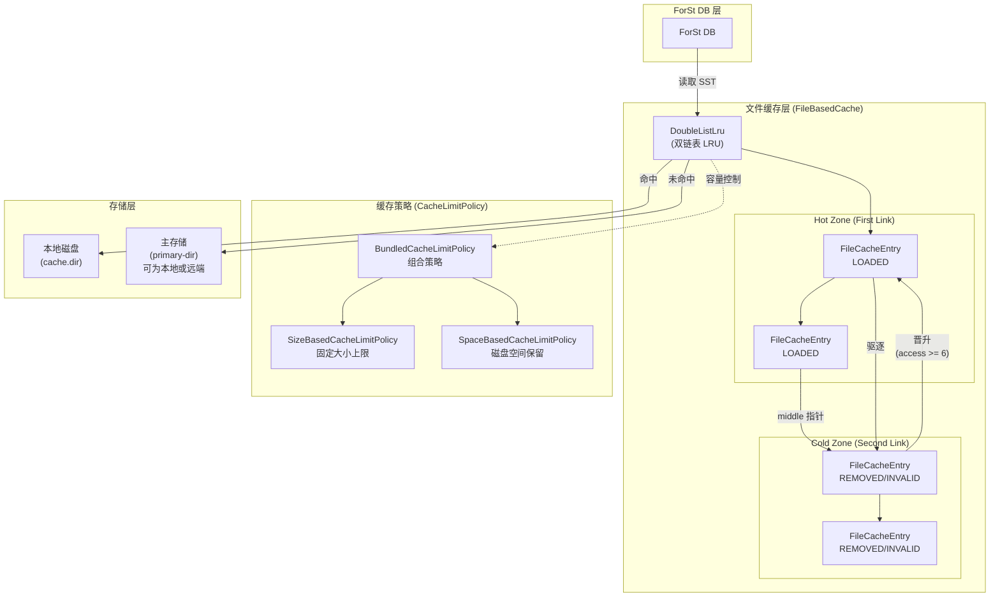
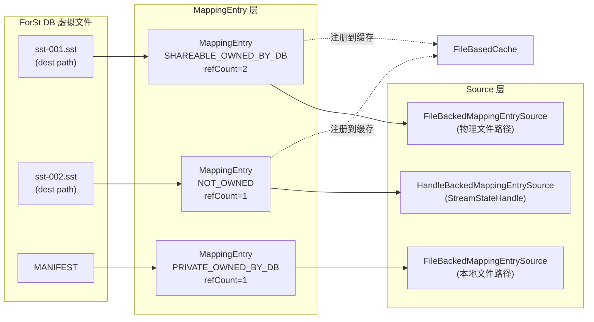
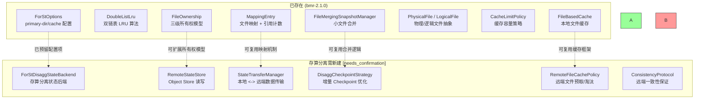

# Flink 2.2 存算分离机制

## 0. 文档元数据
- **文档 ID**: 1.6
- **状态**: completed
- **依赖**: 无
- **最后更新**: 2026-04-19

## 1. Context

本文档分析 Flink `bmr-2.1.0` 分支中存算分离 (Disaggregated State) 的状态。该分支基于 Flink 2.1，**尚未引入完整的存算分离特性**（即不存在 `ForStDisagg*` 系列类）。但已存在若干为存算分离奠定基础的关键基础设施：

- **ForSt 文件缓存层** (`fs/cache/`) -- SST 文件的本地 LRU 缓存
- **文件映射与所有权管理** (`fs/filemapping/`) -- DB 文件到远端的映射、引用计数、生命周期管理
- **File-Merge 基础设施** (`runtime/checkpoint/filemerging/`) -- Checkpoint 小文件合并为物理文件

这些组件的设计理念已体现了"本地缓存 + 远端持久化"的存算分离思路，是 ForSt-RS 重构的重要参考。

## 2. 源码证据

### 2.1 存算分离特性缺失证据

在 `flink-statebackend-forst` 和 `flink-runtime` 模块中搜索关键词：

| 搜索词 | 结果 |
|--------|------|
| `ForStDisagg` | **未找到任何类** |
| `DisaggState` | 未找到 |
| `disagg` | 仅在 `ForStOptions.java:76` 和 `DataTransferStrategyTest.java:569` 中以注释/描述形式出现 |
| `remote.state` | 未找到 |
| `object.store` | 未找到 |
| `bos.endpoint` | 未找到 |

`ForStOptions.SYNC_ENFORCE_LOCAL` 的描述文字中提到 "enabling disaggregated state"，说明配置层面已有预留，但实际的存算分离运行时代码（如远端 Object Store 读写、State 分离管理器等）尚不存在。

### 2.2 已存在的基础设施代码

| 组件 | 路径 |
|------|------|
| 文件缓存 | `flink-statebackend-forst/.../fs/cache/FileBasedCache.java` |
| 双链表 LRU | `flink-statebackend-forst/.../fs/cache/DoubleListLru.java` |
| 缓存条目 | `flink-statebackend-forst/.../fs/cache/FileCacheEntry.java` |
| 缓存限制策略 | `flink-statebackend-forst/.../fs/cache/CacheLimitPolicy.java` |
| 缓存 I/O 流 | `flink-statebackend-forst/.../fs/cache/CachedDataInputStream.java`, `CachedDataOutputStream.java` |
| 文件映射条目 | `flink-statebackend-forst/.../fs/filemapping/MappingEntry.java` |
| 映射源 | `flink-statebackend-forst/.../fs/filemapping/MappingEntrySource.java` |
| 文件所有权 | `flink-statebackend-forst/.../fs/filemapping/FileOwnership.java` |
| 所有权决策 | `flink-statebackend-forst/.../fs/filemapping/FileOwnershipDecider.java` |
| File-Merge 管理器 | `flink-runtime/.../checkpoint/filemerging/FileMergingSnapshotManager.java` |
| 物理文件 | `flink-runtime/.../checkpoint/filemerging/PhysicalFile.java` |
| 逻辑文件 | `flink-runtime/.../checkpoint/filemerging/LogicalFile.java` |

## 3. 发现

### 3.1 存算分离特性状态：不存在

此分支中**没有**存算分离的运行时实现。具体缺失的组件包括：

- 无 `ForStDisaggStateBackend` 或类似的存算分离状态后端
- 无 Object Store (如 S3/BOS) 直接读写集成
- 无远端 State 的分布式锁或一致性协议
- 无 State 数据的远端分片管理器

仅有的"disagg"痕迹是 `ForStOptions.SYNC_ENFORCE_LOCAL` 配置项描述中的文字引用，以及 `DataTransferStrategyTest` 中的一行注释。这表明社区已在规划存算分离，但此分支尚未包含实现。

### 3.2 ForSt 文件缓存层

#### 3.2.1 核心架构

文件缓存层是一个 **文件粒度的 LRU 缓存**，专为 ForSt SST 文件设计。核心类继承关系：

```
DoubleListLru<String, FileCacheEntry>  (抽象双链表 LRU)
  └── FileBasedCache                    (具体缓存实现，线程安全)
```

#### 3.2.2 DoubleListLru -- 双链表 LRU 算法

这是一个自定义的 **两段式 LRU** 数据结构，非标准 LRU。其核心设计：

- **First Link (热区)**：存放最近频繁访问的缓存条目，受 `CacheLimitPolicy` 容量约束
- **Second Link (冷区)**：存放被淘汰的条目元数据（文件可能已被删除），不占用缓存空间
- **Middle 指针**：分割热区和冷区的边界

**晋升机制**：冷区条目被访问达到 `accessBeforePromote` 次（默认 6 次）后，晋升回热区。但如果一个条目被反复驱逐-晋升超过 `promoteLimit` 次（默认 3 次），则不再允许晋升，避免抖动。

**驱逐机制**：当热区空间不足时，`moveMiddleFront()` 将热区尾部条目降级到冷区，触发 `movedToSecond()` -> `tryEvict()` -> `invalidate()` -> 异步删除缓存文件。

#### 3.2.3 FileCacheEntry -- 状态机

每个缓存条目有如下生命周期状态：

```
REMOVED --load()--> LOADING --success--> LOADED --invalidate()--> INVALID --remove()--> REMOVING --> REMOVED
                       |                   |                                                 |
                       +---fail---→ REMOVED |                                                 v
                                           +---close()---→ CLOSED --------→ (删除文件)
```

关键行为：
- **写入时双写**：`CachedDataOutputStream` 同时写入原始路径和缓存路径
- **读取优先缓存**：`CachedDataInputStream` 优先从缓存读取，缓存不可用时回退到原始文件
- **异步加载回**：冷区条目晋升回热区时，通过 `ExecutorService` 异步从原始路径拷贝到缓存路径
- **引用计数**：`FileCacheEntry` 继承 `ReferenceCounted`，引用归零时触发文件清理

#### 3.2.4 CacheLimitPolicy -- 缓存容量策略

接口定义了缓存容量控制的核心方法：

| 方法 | 功能 |
|------|------|
| `directWriteInCache()` | 是否支持写入时直接写缓存 |
| `isSafeToAdd(size)` | 是否有空间添加新条目 |
| `isOverflow(size, hasFile)` | 是否已超出上限 |
| `acquire(size)` / `release(size)` | 申请/释放缓存空间 |

对应的实现类：
- `SizeBasedCacheLimitPolicy`：基于固定大小上限（对应配置 `state.backend.forst.cache.size-based-limit`）
- `SpaceBasedCacheLimitPolicy`：基于磁盘剩余空间（对应配置 `state.backend.forst.cache.reserve-size`，默认 256MB）
- `BundledCacheLimitPolicy`：组合以上两种策略

#### 3.2.5 相关配置

| 配置项 | 默认值 | 说明 |
|--------|--------|------|
| `state.backend.forst.cache.dir` | 无（回退到 local-dir/cache） | 缓存目录 |
| `state.backend.forst.cache.size-based-limit` | 0 (禁用) | 基于大小的缓存上限 |
| `state.backend.forst.cache.reserve-size` | 256MB | 磁盘保留空间 |
| `state.backend.forst.cache.lru.access-before-promote` | 6 | 冷区晋升热区所需访问次数 |
| `state.backend.forst.cache.lru.promote-limit` | 3 | 最大驱逐-晋升循环次数 |

### 3.3 文件映射与所有权

#### 3.3.1 MappingEntry -- 文件映射条目

`MappingEntry` 是 ForSt DB 中文件到外部存储的映射抽象，核心设计：

- **引用计数管理**：继承 `ReferenceCounted`，引用归零时根据 `FileOwnership` 决定是否删除文件
- **Source-Path 多态**：`MappingEntrySource` 有两种实现：
  - `FileBackedMappingEntrySource`：文件路径驱动（普通文件）
  - `HandleBackedMappingEntrySource`：`StreamStateHandle` 驱动（Checkpoint 恢复的文件）
- **缓存集成**：构造时自动将文件注册到 `FileBasedCache`，引用归零时从缓存中删除

#### 3.3.2 FileOwnership -- 三级所有权模型

```
PRIVATE_OWNED_BY_DB    -- DB 私有，生命周期完全由 DB 管理，不可转移给 JM
SHAREABLE_OWNED_BY_DB  -- DB 拥有但可共享，所有权可转移给 JM
NOT_OWNED              -- DB 不拥有，生命周期由 JM 管理（Checkpoint 恢复的文件）
```

#### 3.3.3 FileOwnershipDecider -- 所有权决策逻辑

关键规则：
- **SST 文件** (`.sst` 后缀)：新建时为 `SHAREABLE_OWNED_BY_DB`，恢复时为 `NOT_OWNED`
- **非 SST 文件** (WAL、MANIFEST 等)：始终为 `PRIVATE_OWNED_BY_DB`，因为它们必须保持本地

这一设计直接映射了存算分离的核心思路：**SST 文件可以远端化，而元数据文件必须本地化**。

### 3.4 File-Merge 基础设施

#### 3.4.1 核心概念

File-Merge 机制用于解决 Flink Checkpoint 产生大量小文件的问题：

- **PhysicalFile**：磁盘上的实际文件，可包含多个逻辑文件的数据段
  - 拥有 `FSDataOutputStream`、引用计数 (`logicalFileRefCount`)、大小跟踪 (`size`, `dataSize`)
  - 当逻辑文件引用归零时可被删除

- **LogicalFile**：逻辑文件，代表 PhysicalFile 中的一个数据段
  - 由 `(physicalFile, startOffset, length)` 三元组定义
  - 拥有 `lastUsedCheckpointID` 用于判断是否可以清理
  - `discarded` 标志标记是否被 Checkpoint subsumption/abortion 废弃

#### 3.4.2 FileMergingSnapshotManager 接口

管理单个 Task 的所有 Subtask 的文件合并，一个 Job 在每个 TaskManager 上有一个实例。核心生命周期：

```
initFileSystem() → registerSubtaskForSharedStates() →
  notifyCheckpointStart() → createCheckpointStateOutputStream() →
  notifyCheckpointComplete() / notifyCheckpointAborted() →
  unregisterSubtask() → close()
```

#### 3.4.3 空间统计 (SpaceStat)

跟踪每个目录的空间使用：
- `physicalFileCount` / `physicalFileSize`：物理文件数量和总大小
- `logicalFileCount` / `logicalFileSize`：逻辑文件数量和有效数据大小
- 空间放大率 = `physicalFileSize / logicalFileSize`

#### 3.4.4 Checkpoint 目录布局

```
/user-defined-checkpoint-dir
    /{job-id}
        + --shared/
            + --subtask-1/  (merged shared state files)
            + --subtask-2/
        + --taskowned/      (merged private state files)
        + --chk-1/
        + --chk-2/
```

### 3.5 ForSt 配置中的存储相关选项

| 配置项 | 说明 | 存算分离相关性 |
|--------|------|---------------|
| `state.backend.forst.primary-dir` | SST 文件主目录，默认与 Checkpoint 目录相同 | **高** -- 存算分离时此目录指向远端存储 |
| `state.backend.forst.local-dir` | 本地元数据目录 | **高** -- 存算分离时保持本地 |
| `state.backend.forst.cache.dir` | 缓存目录 | **高** -- 存算分离的本地缓存层 |
| `state.backend.forst.sync.enforce-local` | 同步模式下强制使用本地 State | **直接相关** -- 配置描述明确提到 disaggregated state |

## 4. 架构图

### 4.1 文件缓存架构



### 4.2 文件映射与所有权



### 4.3 已有 vs 需要构建的组件对比



## 5. 与 ForSt-RS 重构的关系

### 5.1 可借鉴的已有基础设施

| 已有组件 | ForSt-RS 可借鉴点 |
|----------|-------------------|
| **DoubleListLru** | 两段式 LRU 算法设计优秀，热/冷分区 + 晋升阈值 + 抖动抑制。Rust 实现可直接移植此算法 |
| **FileOwnership 三级模型** | `PRIVATE_OWNED_BY_DB` / `SHAREABLE_OWNED_BY_DB` / `NOT_OWNED` 的三级模型非常适合存算分离场景，可在 Rust 中用枚举直接表达 |
| **FileOwnershipDecider** | SST 文件可远端化、非 SST 文件必须本地化的决策逻辑是存算分离的基本原则 |
| **MappingEntry 引用计数** | 文件从 DB 拥有到 JM 接管的所有权转移机制，是 Checkpoint 共享文件管理的关键 |
| **CacheLimitPolicy 策略接口** | 基于大小和磁盘空间的双重限制策略，适用于各种部署环境 |
| **FileMerging 物理/逻辑抽象** | PhysicalFile/LogicalFile 的段式存储模型，减少远端存储的小文件数量 |
| **写入时双写** | `CachedDataOutputStream` 同时写原始和缓存路径，存算分离时可改为"写本地 + 异步上传远端" |

### 5.2 ForSt-RS 需从零构建的部分

| 组件 | 说明 | 复杂度 |
|------|------|--------|
| **远端 Object Store 集成** | 对接 S3/BOS/OSS 等对象存储的读写层 | 高 |
| **存算分离状态后端** | 管理本地 DB 实例 + 远端持久化的生命周期 | 高 |
| **State 传输管理器** | Checkpoint/Restore 时的本地-远端数据传输、断点续传 | 高 |
| **远端一致性协议** | 多 TM 访问共享远端 State 的一致性保证 | 高 |
| **增量 Checkpoint 优化** | 基于远端存储的增量 Checkpoint，避免重复上传已存在的 SST | 中 |
| **远端文件预取策略** | 基于访问模式预测，提前将远端 SST 拉取到本地缓存 | 中 |
| **Rust Native LRU 缓存** | 将 Java `DoubleListLru` 移植为 Rust 实现 | 低 |
| **Rust 文件所有权模型** | 用 Rust 枚举 + 智能指针表达 `FileOwnership` 语义 | 低 |

### 5.3 关键设计启示

1. **SST 文件是存算分离的核心对象**：`FileOwnershipDecider.isSstFile()` 明确区分了 SST 与非 SST 文件，只有 SST 文件才有"可共享"属性。这是因为 SST 是不可变的 (immutable)，天然适合远端存储。

2. **所有权转移是 Checkpoint 的关键**：`SHAREABLE_OWNED_BY_DB -> NOT_OWNED` 的转移发生在 Checkpoint 时，代表文件的生命周期管理权从 DB (TaskManager) 转移到 JM (JobManager)。ForSt-RS 需要实现类似的所有权语义。

3. **缓存层是性能的关键**：两段式 LRU 的设计避免了简单 LRU 的缓存抖动问题。ForSt-RS 在远端存储场景下，缓存命中率直接决定读取延迟，需要更精细的缓存策略（如考虑 SST 文件的层级、访问频率、大小权重等）。

4. **File-Merge 减少远端 I/O**：在远端存储场景下，小文件问题更加严重（每个文件一次 HTTP 请求），File-Merge 的物理/逻辑文件抽象可以直接复用来减少远端文件数。

## 6. Open Questions

- [needs_confirmation] Flink 社区的存算分离 FLIP（可能是 FLIP-423 或后续 FLIP）是否已在 main 分支实现？`bmr-2.1.0` 分支何时会合入？
- [needs_confirmation] `ForStOptions.SYNC_ENFORCE_LOCAL` 配置项是否暗示存算分离已在某个未合入的分支中开发？
- [needs_confirmation] `DataTransferStrategyTest` 中关于 "disaggregated setup" 的注释，对应的 `DataTransferStrategy` 类是否已包含远端传输策略？
- [needs_confirmation] ForSt-RS 是否计划直接在 Rust 侧实现文件缓存，还是通过 JNI 复用 Java 侧的 `FileBasedCache`？
- [needs_confirmation] File-Merge 机制在存算分离场景下是否需要调整（例如远端合并 vs 本地合并后上传）？
