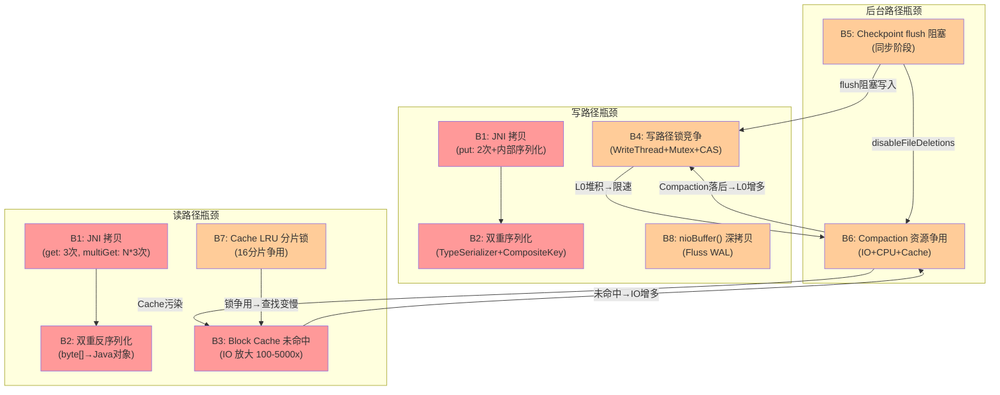

# ForSt + Flink 架构静态瓶颈分析

## 0. 文档元数据
- **文档 ID**: 1.7
- **状态**: completed
- **依赖**: 1.1, 1.2, 1.3, 1.4, 1.5, 1.6, 1.9, 1.10, 1.11
- **最后更新**: 2026-04-19

---

## 1. Context

本文档基于 Wave 1 已完成的 9 份前置文档，对 ForSt（Flink 的 RocksDB Fork）+ Flink 2.2 异步状态后端的当前架构进行系统性的静态瓶颈分析。分析聚焦于五个核心维度：JNI 调用开销、序列化/反序列化双重编码、IO 路径延迟构成、锁竞争热点、Block Cache 命中率影响。每个瓶颈给出完整的原因链、定性影响评估和 ForSt-RS 优化方向。

**分析范围**：
- ForSt C++ 引擎层（文档 1.1、1.2）
- JNI 绑定层（文档 1.3）
- Flink 异步状态后端层（文档 1.4）
- Checkpoint/Restore 路径（文档 1.5、1.6）
- Fluss KV 存储层（文档 1.10）

**不在范围**：运行时动态 profiling 数据（本文为静态代码分析）。

---

## 2. 数据流全景图（标注拷贝/序列化热点）

### 2.1 Flink 异步状态 ValueState.get() 完整数据流

```
  Flink 用户代码
       │
       │ asyncValue()
       ▼
  ┌─────────────────────────────────────────────────────────────────┐
  │  AbstractValueState.handleRequest(VALUE_GET, null)              │
  │  → AEC 收集请求到 batch                                          │
  │  → ForStStateExecutor.executeBatchRequests()                    │
  │       │                                                         │
  │       ▼                                                         │
  │  ForStStateRequestClassifier.convertRequests()                  │
  │       │                                                         │
  │       ▼                                                         │
  │  ForStInnerTable.buildDBGetRequest()                            │
  │       │                                                         │
  │       ▼ ★序列化点 S1                                             │
  │  request.buildSerializedKey()                                   │
  │    → SerializedCompositeKeyBuilder                              │
  │    → Flink TypeSerializer.serialize(key)   [Java 对象 → byte[]] │
  │    → [KeyGroupPrefix][SerializedKey][Namespace]                 │
  │       │                                                         │
  │       ▼ ★JNI 调用点 J1                                          │
  │  db.multiGetAsList(readOptions, cfHandles, keys)                │
  └────────│────────────────────────────────────────────────────────┘
           │
           │  JNI 边界 (Java → C++)
           │  ★拷贝点 C1: 每个 key byte[] → GetByteArrayRegion → native jbyte[]
           ▼
  ┌─────────────────────────────────────────────────────────────────┐
  │  ForSt C++ 引擎: DBImpl::MultiGet()                             │
  │       │                                                         │
  │       ▼                                                         │
  │  GetAndRefSuperVersion()  [原子引用计数, 无锁]                     │
  │       │                                                         │
  │       ▼                                                         │
  │  MemTable 查找 (InlineSkipList)                                  │
  │       │ 未命中                                                   │
  │       ▼                                                         │
  │  Version::Get() → Level 查找                                     │
  │       │                                                         │
  │       ▼                                                         │
  │  ★Bloom Filter 计算 (xxHash / MurmurHash)                       │
  │       │ 可能存在                                                  │
  │       ▼                                                         │
  │  ★Block Cache 查找 (LRUCacheShard::Lookup)                      │
  │       │ ★锁竞争点 L1: 分片级 DMutex                              │
  │       │                                                         │
  │       ├── 命中 → 返回 Data Block                                 │
  │       │                                                         │
  │       └── 未命中 → ★IO 点 I1                                     │
  │           │  FileSystem::Read()                                 │
  │           │  ├── POSIX: pread() 系统调用                          │
  │           │  └── Flink Env: ★JNI 回调 J2 (C++ → Java → 远端 FS)  │
  │           │       └── ★拷贝点 C2: DirectByteBuffer 数据传输       │
  │           ▼                                                     │
  │  Block Cache Insert [★锁竞争点 L2: 插入/淘汰加锁]                  │
  │       │                                                         │
  │       ▼                                                         │
  │  Data Block 内二分搜索 → PinnableSlice (结果)                     │
  └────────│────────────────────────────────────────────────────────┘
           │
           │  JNI 边界 (C++ → Java)
           │  ★拷贝点 C3: PinnableSlice → NewByteArray + SetByteArrayRegion
           ▼
  ┌─────────────────────────────────────────────────────────────────┐
  │  Flink Java 层                                                  │
  │       │                                                         │
  │       ▼ ★反序列化点 S2                                           │
  │  ForStInnerTable.deserializeValue(byte[])                       │
  │    → Flink TypeSerializer.deserialize(byte[])                   │
  │    → [byte[] → Java 对象]                                       │
  │       │                                                         │
  │       ▼                                                         │
  │  future.complete(value)                                         │
  └─────────────────────────────────────────────────────────────────┘
```

### 2.2 Flink 异步状态 ValueState.update() 完整数据流

```
  Flink 用户代码
       │
       │ asyncUpdate(value)
       ▼
  ┌─────────────────────────────────────────────────────────────────┐
  │  AEC 收集 → ForStStateRequestClassifier                         │
  │       │                                                         │
  │       ▼ ★序列化点 S3                                             │
  │  ForStInnerTable.serializeKey(ContextKey)                       │
  │    → TypeSerializer.serialize(key) → byte[]                     │
  │       │                                                         │
  │       ▼ ★序列化点 S4                                             │
  │  ForStInnerTable.serializeValue(value)                          │
  │    → TypeSerializer.serialize(value) → byte[]                   │
  │       │                                                         │
  │       ▼ ★JNI 调用点 J3                                          │
  │  WriteBatch.put(cfHandle, serializedKey, serializedValue)       │
  │    → ★拷贝点 C4: key byte[] → GetByteArrayElements → native     │
  │    → ★拷贝点 C5: value byte[] → GetByteArrayElements → native   │
  │    → ★拷贝点 C6: WriteBatch 内部 rep_ 序列化存储                   │
  │       │                                                         │
  │       ▼ ★JNI 调用点 J4                                          │
  │  db.write(writeOptions, writeBatch)  [纯 handle 传递, 0 拷贝]    │
  └────────│────────────────────────────────────────────────────────┘
           │
           ▼
  ┌─────────────────────────────────────────────────────────────────┐
  │  ForSt C++ 引擎: DBImpl::WriteImpl()                            │
  │       │                                                         │
  │       ▼ ★锁竞争点 L3                                             │
  │  WriteThread::JoinBatchGroup() [全局写入队列竞争]                   │
  │       │                                                         │
  │       ▼ ★锁竞争点 L4                                             │
  │  PreprocessWrite() [DB mutex_ 全局锁]                            │
  │    → 检查是否需要切换 MemTable                                     │
  │    → 检查 L0 文件数是否触发写入限速                                  │
  │       │                                                         │
  │       ▼                                                         │
  │  WriteToWAL() [串行瓶颈: Leader 独占写入]                          │
  │       │  (Flink 场景: ForSt WAL 已禁用, 跳过)                     │
  │       │                                                         │
  │       ▼                                                         │
  │  MemTable InsertConcurrently() [无锁 CAS]                       │
  │    → ★锁竞争点 L5: Arena 分配器的 atomic 争用                      │
  │       │                                                         │
  │       ▼                                                         │
  │  完成通知 → ExitAsBatchGroupLeader()                              │
  └─────────────────────────────────────────────────────────────────┘
```

### 2.3 Fluss KvTablet 写入路径数据流（补充 Fluss 场景）

```
  Fluss 客户端
       │ KvRecordBatch
       ▼
  ┌─────────────────────────────────────────────────────────────────┐
  │  KvTablet.putAsLeader()  [WriteLock]                            │
  │       │                                                         │
  │       ▼ ★序列化点 S5: ArrowWriter                                │
  │  InternalRow → Arrow FieldVector (列式编码)                       │
  │       │                                                         │
  │       ▼ 查旧值 (PreWriteBuffer → RocksDB)                        │
  │    ★JNI J5: db.get() [拷贝 3 次: key拷入 + DB读 + 结果拷出]        │
  │       │                                                         │
  │       ▼ RowMerger.merge()                                       │
  │       │                                                         │
  │       ▼ ★序列化点 S6: Arrow IPC 序列化 + 可选压缩                   │
  │  VectorSchemaRoot → ArrowRecordBatch → MemoryLogRecords          │
  │       │                                                         │
  │       ▼ ★拷贝点 C7: nioBuffer() 深拷贝 (Composite ByteBuf)        │
  │       │                                                         │
  │       ▼ LogTablet.appendAsLeader() [WAL 持久化]                   │
  │       │                                                         │
  │       ▼ KvPreWriteBuffer.put() → flush() → RocksDB               │
  │    ★JNI J6: writeBatch.put() [拷贝 2 次] + db.write() [0 次]     │
  └─────────────────────────────────────────────────────────────────┘
```

---

## 3. 瓶颈清单（按预估影响排序）

### 瓶颈 B1: JNI 跨语言调用的累积开销（影响: 高）

#### 原因链

```
Flink TypeSerializer.serialize()          ForSt C++ DB::Get/Put
        │                                         │
        ▼                                         ▼
   Java byte[]  ──JNI GetByteArrayRegion──→  native jbyte[]
        │              (1次拷贝)                    │
        │                                         │
   native result ──JNI NewByteArray+Set──→    Java byte[]
                       (1次拷贝)
```

1. **每次 get() 操作 3 次拷贝**（文档 1.3 热路径 1）: key 从 Java Heap 拷贝到 Native（GetByteArrayRegion），ForSt 内部读取（可能 pin），结果从 Native 拷贝回 Java Heap（NewByteArray + SetByteArrayRegion）。
2. **每次 put() 操作 2 次拷贝 + 1 次内部序列化**（文档 1.3 热路径 2/4）: key 和 value 分别从 Java Heap 拷贝到 Native，然后 WriteBatch 内部再序列化到 rep_ string。
3. **multiGet 拷贝放大效应**: 批量 N 个 key 的 multiGet 产生 N*3 次拷贝（文档 1.3 热路径 3）。Flink 异步模型（文档 1.4）的批量执行使 multiGet 成为核心读路径，N 通常为数十至数百。
4. **JNI 调用本身的固定开销**: 每次 JNI 调用约 ~57ns（文档 1.9 引用 zakgof 基准测试），虽然单次开销不大，但 Flink 高频状态访问下累积显著。
5. **Flink Env 的二次 JNI**: 当 ForSt 使用 FlinkFileSystem（存算分离场景），C++ 层的每次文件 IO 需要通过 JNI 回调 Java 侧的 Flink FS API（文档 1.2 第 3.7 节），形成 Java→C++→Java 的双重跨语言开销。

#### 定性影响: **高**

- 读路径: multiGet(100 keys) ≈ 300 次内存拷贝 + 100 次 JNI 调用
- 写路径: WriteBatch(100 puts) ≈ 200 次内存拷贝 + 101 次 JNI 调用
- 在 Flink 每秒数百万次状态访问的场景下，JNI 层可能占据 15-30% 的 CPU 时间

#### ForSt-RS 优化方向

| 策略 | 预期收益 | 复杂度 |
|------|---------|--------|
| **Rust 直接实现存储引擎，通过 JNI/FFM 暴露 API** | 消除 C++ 中间层的 JNI 开销；Flink Env 场景从 Java→C++→Java 简化为 Java→Rust→Java | 高 |
| **FFM (Foreign Function & Memory) 替代 JNI** | 单次调用开销从 ~57ns 降至 ~20ns（文档 1.9），约 60% 提升 | 中 |
| **零拷贝指针传递**: ArrowBuf.memoryAddress() 直接传递给 Rust | 消除 key/value 拷贝，从 3 次降至 0-1 次 | 中 |
| **DirectByteBuffer 路径**: 已存在 putDirect/getDirect 变体 | put 从 2 次降至 0 次，get 从 3 次降至 1 次 | 低 |

---

### 瓶颈 B2: Flink TypeSerializer + ForSt Key/Value 编码的双重序列化（影响: 高）

#### 原因链

```
Java 对象 (用户状态)
    │
    ▼ ★Flink 序列化层
TypeSerializer.serialize(key) → byte[]          // 第 1 次: Java 对象 → Flink 二进制格式
TypeSerializer.serialize(namespace) → byte[]     // 第 1.5 次: Namespace 序列化
    │
    ▼ ★ForSt Key 编码层
SerializedCompositeKeyBuilder.build()            // 第 2 次: 组装 [KeyGroup|Key|Namespace|UserKey]
    │                                            //         涉及 byte[] 拼接和拷贝
    ▼ ★JNI 传输层
GetByteArrayRegion → native jbyte[]              // 第 3 次: Java byte[] → Native 内存
    │
    ▼ ★ForSt C++ 内部编码层
WriteBatch::Put() → rep_.append(key+value)       // 第 4 次: Native 内存 → WriteBatch 内部编码
    │
    ▼ ★ForSt MemTable 层
InlineSkipList::Insert() → Arena::Allocate()     // 第 5 次: WriteBatch → MemTable Node 内联存储
```

**详细分析**:

1. **Flink TypeSerializer 开销**: 每个状态访问都需要将 Java 对象序列化为 byte[]（文档 1.4 第 3.4.4 节 ContextKey）。对于复杂的 Key 类型（如 Tuple、POJO），TypeSerializer 涉及反射、字段遍历、类型分派。
2. **复合键编码**: SerializedCompositeKeyBuilder 将 KeyGroupPrefix + SerializedKey + SerializedNamespace 拼接为最终的 byte[]（文档 1.4 第 3.4.5 节），涉及多次 byte[] 分配和拷贝。
3. **MapState 额外开销**: MapState 的 key 编码为 `[KeyGroup][Key][Namespace][UserKey]`（文档 1.4 第 3.2.4 节），UserKey 的序列化是额外的一层开销。每个 MapState.get(userKey) 都需要完整的复合键序列化。
4. **反序列化对称开销**: 读取路径上，从 byte[] → Java 对象的反序列化同样消耗 CPU。
5. **Fluss 场景的叠加**: Fluss KvTablet 在 ForSt 序列化之上，还有 Arrow 列式编码（InternalRow → FieldVector）和 Arrow IPC 序列化（VectorSchemaRoot → ArrowRecordBatch，文档 1.10 第 3.2.2 节），总共经历三层编码。

#### 定性影响: **高**

- 序列化/反序列化可占 Flink 状态后端 CPU 消耗的 20-40%
- 对于大 Value 状态（如 ListState、MapState），序列化开销随数据量线性增长
- ContextKey 的序列化缓存（文档 1.4 第 3.4.5 节 `getOrCreateSerializedKey`）仅在同一 key 多次访问时有效

#### ForSt-RS 优化方向

| 策略 | 预期收益 | 复杂度 |
|------|---------|--------|
| **列式状态存储 (Arrow-native)**: 直接以 Arrow 格式存储状态，消除 TypeSerializer 层 | 消除 Flink 序列化层，从 5 次编码降至 2-3 次 | 高 |
| **FFM MemorySegment 直接传递**: 用 MemorySegment 替代 byte[]，避免中间拷贝 | 消除 byte[] 分配和 GC 压力 | 中 |
| **前缀压缩**: 对排序的 Key 使用 Delta Byte Array 编码（文档 1.11 第 3.5 节） | 减少 Key 编码后的字节数，降低 IO 和内存开销 | 中 |
| **序列化器代码生成**: 为常见 Key 类型生成特化序列化代码 | 消除反射和类型分派开销 | 中 |

---

### 瓶颈 B3: Block Cache 未命中导致的 IO 放大（影响: 高）

#### 原因链

```
状态点查请求 (ValueState.get)
    │
    ▼
MemTable 查找 (InlineSkipList)
    │ 未命中 (常态: 大部分数据在 SST 中)
    ▼
Level 0 遍历所有 SST 文件 (可能重叠)
    │
    ▼ 对每个候选 SST:
    │
    ├── Bloom Filter 查询 → 需要 Filter Block
    │   └── ★Block Cache 查找 Filter Block
    │       ├── 命中 → 直接判断
    │       └── 未命中 → ★IO 读取 Filter Block
    │
    ├── Index Block 查询 → 定位 Data Block
    │   └── ★Block Cache 查找 Index Block
    │       ├── 命中 → 直接定位
    │       └── 未命中 → ★IO 读取 Index Block
    │
    └── Data Block 读取
        └── ★Block Cache 查找 Data Block
            ├── 命中 → 直接返回
            └── 未命中 → ★IO 读取 Data Block
                └── 本地: pread() ~10μs (SSD)
                └── Flink Env 远端: JNI→Java→远端FS ~1-50ms
```

**IO 放大分析**:

| 场景 | Block Cache 命中 | IO 次数 | 延迟估算 |
|------|-----------------|---------|---------|
| 热数据全部命中 | Filter+Index+Data 命中 | 0 | <1μs |
| 仅 Data Block 未命中 | Filter+Index 命中 | 1 | ~10μs (SSD) |
| Index+Data 未命中 | 仅 Filter 命中 | 2 | ~20μs (SSD) |
| 全部未命中 | 无 | 3 | ~30μs (SSD) |
| 远端 FS 全部未命中 | 无 | 3 | ~3-150ms |

**关键因素**:

1. **Flink 状态访问模式**: Flink 流处理中，key 的访问分布通常符合 Zipf 分布（少量热 key 高频访问，大量冷 key 偶尔访问）。冷 key 查询几乎必然触发 Block Cache 未命中。
2. **L0 文件数量影响**: Compaction 不及时导致 L0 文件堆积时，每次点查需要遍历所有 L0 文件（文档 1.2 第 3.3 节），成倍放大 Block Cache 查找次数。
3. **存算分离场景**: 当 ForSt 使用 FlinkFileSystem 运行在远端存储上（文档 1.6），Block Cache 未命中的代价从 ~10μs (本地 SSD) 飙升至 ~1-50ms (网络 IO)，放大 100-5000 倍。
4. **FileBasedCache 的局限**: Flink 的 FileBasedCache（文档 1.6 第 3.2 节）是文件粒度的 LRU 缓存，但 Block Cache 是 Block 粒度。文件级缓存命中并不代表 Block 级缓存命中——大 SST 文件中只有部分 Block 被频繁访问。
5. **缓存容量有限**: 在 Flink 多 Subtask 共享 TaskManager 的部署模式下，每个 Subtask 分到的 Block Cache 容量受限，加剧了缓存争用。

#### 定性影响: **高**

- Block Cache 命中率每下降 10%，读延迟 P99 可能上升 5-10 倍
- 存算分离场景下是性能的**决定性因素**

#### ForSt-RS 优化方向

| 策略 | 预期收益 | 复杂度 |
|------|---------|--------|
| **自适应多级缓存**: 热区 (RAM) + 温区 (本地 SSD) + 冷区 (远端) | 大幅提升有效缓存容量，降低远端 IO 频率 | 高 |
| **Bloom Filter 优化**: 使用 SBBF 算法（文档 1.11）+ per-DataBlock 粒度 | 减少无效 IO，SBBF 比传统 Bloom 更 cache-friendly | 中 |
| **异步预取**: 利用 Rust tokio 异步运行时，在处理当前请求时预取邻近 Block | 减少 IO 等待延迟，隐藏远端 FS 延迟 | 中 |
| **io_uring 异步 IO**: Rust 侧使用 io_uring 替代 pread | 减少系统调用开销，提升 IO 吞吐 | 中 |
| **共享 Block Cache**: 多 Subtask/多 bucket 共享统一的 Block Cache 实例 | 提升缓存利用率，减少内存碎片 | 低 |

---

### 瓶颈 B4: 写路径的锁竞争（DB Mutex + WriteThread + Arena）（影响: 中-高）

#### 原因链

```
多个 Flink IO 线程并发写入
        │
        ▼
WriteThread::JoinBatchGroup()
  ★竞争点 1: 全局写入等待队列 (mutex-based 状态机)
  │  所有写请求必须先进入队列，竞争 Leader 角色
  │  高并发下: spin-wait + mutex 切换开销
  │
  ▼
Leader: PreprocessWrite()
  ★竞争点 2: DB mutex_ 全局锁
  │  检查 MemTable 是否需要切换 (write_buffer_size)
  │  检查 L0 文件数是否触发 WriteController 限速
  │  持有锁期间: 其他读/写操作在此阻塞
  │
  ▼
Leader: WriteToWAL()
  ★竞争点 3: WAL 串行写入
  │  (Flink 场景: WAL 禁用, 此瓶颈不存在)
  │
  ▼
MemTable: InsertConcurrently()
  ★竞争点 4: CAS 重试
  │  InlineSkipList 使用 CAS 原子操作实现无锁插入
  │  高竞争下: CAS 失败→重试循环，CPU 空转
  │
  ▼
Arena::AllocateAligned()
  ★竞争点 5: ConcurrentArena 的 atomic 操作
  │  ThreadLocal shard 分配后，fallback 到全局 arena 时有原子争用
```

**详细分析**:

1. **WriteThread 状态机**: ForSt 的 Write Group 机制（文档 1.2 第 3.2 节）将多个写请求合并为一个批次，由 Leader 统一执行。这在低并发下很高效，但 Flink 异步模型的 WriteThread 池（文档 1.4 第 3.3.1 节）可能产生多线程并发写入，增加 JoinBatchGroup 的竞争。

2. **DB mutex_ 在 PreprocessWrite 中的关键路径**: PreprocessWrite 需要检查是否需要切换 MemTable、是否需要限速写入、是否需要调度 Compaction（文档 1.2 第 3.2 节阶段 4）。虽然持有时间短，但在高吞吐下频繁获取 mutex 会产生可测量的开销。

3. **MemTable 切换的阻塞**: 当 active MemTable 达到 write_buffer_size 需要切换时，可能触发 flush 调度。如果 immutable MemTable 数量达到上限，写入会被完全阻塞直到 flush 完成。

4. **L0 写入限速/停写**: 当 L0 文件数超过 `level0_slowdown_writes_trigger`，WriteController 开始限速；超过 `level0_stop_writes_trigger` 时完全停写（文档 1.2 第 3.6.3 节）。这在 Compaction 落后时成为写入的硬性瓶颈。

5. **Fluss KvTablet 的 WriteLock**: Fluss 在 KvTablet 层面使用 WriteLock（文档 1.10 第 3.1.1 节），所有对同一 bucket 的写入串行化，进一步加剧了写入瓶颈。

#### 定性影响: **中-高**

- Flink 异步模型的写线程并行度（writeIoParallelism）直接受限于这些锁竞争点
- L0 触发的限速/停写可能导致整个 Flink 算子的背压传播
- Fluss 的 WriteLock 使 KvTablet 写入吞吐上限受限于单线程处理能力

#### ForSt-RS 优化方向

| 策略 | 预期收益 | 复杂度 |
|------|---------|--------|
| **无锁写入队列**: 使用 Rust crossbeam 无锁队列替代 mutex-based WriteThread | 消除 JoinBatchGroup 的 mutex 争用 | 中 |
| **Thread-local MemTable 分区**: 每个写线程维护独立的 MemTable 分区，合并时再汇总 | 消除 CAS 重试和 Arena 原子争用 | 高 |
| **WAL-less 写入优化**: 针对 Flink 场景（WAL 已禁用），简化写路径去除 WAL 相关逻辑 | 减少 Leader 串行路径上的分支判断 | 低 |
| **Compaction 感知写入调度**: 根据 L0 文件数动态调节写入批次大小 | 避免触发 hard stop，平滑写入延迟 | 中 |

---

### 瓶颈 B5: Checkpoint 同步阶段的 Flush 阻塞（影响: 中）

#### 原因链

```
Flink Checkpoint Barrier 到达
        │
        ▼
SnapshotStrategy.syncPrepareResources()  [在 Task 主线程中执行]
        │
        ▼
db.disableFileDeletions()
        │
        ▼
★阻塞点: db.getLiveFiles(true)
        │  参数 true = 强制 flush memtable
        │  → 写入必须等待当前 active MemTable flush 到 L0 SST
        │  → flush 需要: 排序 + 写 SST + 更新 Version
        │  → 大 MemTable (如 256MB) 的 flush 可能需要数百毫秒
        │
        ▼
收集文件列表 + 构建 ForStNativeSnapshotResources
        │
        ▼
db.enableFileDeletions()  [在异步阶段结束后调用]
```

**详细分析**:

1. **同步阶段占用 Task 主线程**: `syncPrepareResources` 在 Task 主线程中执行（文档 1.5 第 3.1 节），期间该线程无法处理任何数据记录，直接影响 Flink 的端到端延迟。

2. **getLiveFiles(true) 的 flush 开销**: 该调用强制将当前 active MemTable 刷写为 L0 SST 文件。如果 `write_buffer_size` 设置较大（如 256MB），flush 需要排序所有 key-value 对、构建 Block-Based Table、写入磁盘，可能需要 100ms-1s。

3. **disableFileDeletions 阻止 Compaction**: 在 checkpoint 期间禁止文件删除，阻止了 Compaction 清理旧 SST 文件。如果 checkpoint 间隔频繁且异步阶段耗时较长，可能导致 SST 文件堆积，进而触发 L0 写入限速（与瓶颈 B4 形成恶性循环）。

4. **存算分离场景的放大**: 当 SST 文件存储在远端 FS 上时，flush 写入 SST 的 IO 延迟从本地 SSD 的 ~10ms 飙升至远端存储的 ~100ms-1s。

5. **Fluss KvTablet 的 Checkpoint 互锁**: Fluss 的 RocksIncrementalSnapshot（文档 1.10 第 3.6.1 节）在 RocksDB Checkpoint.create() 期间使用 ResourceGuard 防止并发关闭，但写入路径也需要获取 ResourceGuard，形成读写互斥。

#### 定性影响: **中**

- Checkpoint 同步阶段每增加 100ms，端到端延迟同步增加 100ms
- 大 MemTable 场景下，flush 可能导致 Checkpoint 超时
- 频繁 Checkpoint 与大 write_buffer_size 之间需要权衡

#### ForSt-RS 优化方向

| 策略 | 预期收益 | 复杂度 |
|------|---------|--------|
| **轻量级一致性快照**: 使用 Rust 实现类似 RocksDB Checkpoint 但更轻量的机制（如 hard-link + metadata copy） | 减少同步阶段时间 | 高 |
| **后台 Flush 与 Checkpoint 解耦**: 维护 immutable MemTable 列表的引用，Checkpoint 不强制 flush | 消除同步阶段的 flush 阻塞 | 中 |
| **增量 Checkpoint 优化**: 利用 SST 文件不可变性，仅传输新增 SST 的 metadata | 减少异步阶段时间 | 中 |
| **ReusableDataTransferStrategy 扩展**: 在远端 FS 场景利用零拷贝传输（文档 1.5 第 3.5.4 节） | 消除 SST 文件的网络传输开销 | 低 |

---

### 瓶颈 B6: Compaction 与前台读写的资源争用（影响: 中）

#### 原因链

```
前台读写路径                             后台 Compaction 路径
     │                                       │
     │ 读取 SST Block                         │ 读取多个 SST 文件
     │ → FileSystem::Read()                   │ → 大量顺序 IO
     ▼                                       ▼
★争用点 1: 磁盘 IO 带宽                  ★争用点: 共享 IO 带宽
  │  Compaction 的大块顺序读写              │  可达数百 MB/s
  │  与前台的小块随机读竞争                  │
  │                                       │
  ▼                                       ▼
★争用点 2: Block Cache 污染             写入新 SST 文件
  │  Compaction 读入的 Block              │ → 触发 Block Cache 淘汰
  │  占用 Cache 空间                       │
  │  导致前台热数据被淘汰                   ▼
  │                                  更新 VersionSet (DB mutex_)
  ▼                                  ★争用点 3: 与前台写入竞争 mutex
CPU 争用: Compaction 的合并排序
  │  + CRC32 校验 + 压缩
  │  消耗大量 CPU 时间
```

**详细分析**:

1. **IO 带宽争用**: Compaction 需要读取输入 SST 文件并写入输出 SST 文件，产生大量连续 IO。在 SSD 上，Compaction 的顺序 IO 可以轻松达到数百 MB/s，与前台的随机 IO 争夺带宽（文档 1.2 第 3.6.4 节）。

2. **Block Cache 污染**: RocksDB 默认会将 Compaction 读取的 Block 放入 Block Cache。这可能淘汰前台热数据的 Cache 条目，导致前台读取的 Cache 命中率下降（与瓶颈 B3 叠加）。虽然可以通过 `fill_cache=false` 配置避免，但 Index/Filter Block 仍会进入 Cache。

3. **CPU 争用**: Compaction 的合并排序、CRC32 校验和数据压缩/解压是 CPU 密集型操作，与前台的 Bloom Filter 计算、Block 解压争用 CPU 资源。

4. **Checkpoint 与 Compaction 交互**: Checkpoint 期间 `disableFileDeletions()` 会阻止 Compaction 清理旧 SST 文件（文档 1.5 第 3.2 节），导致 SST 文件数量膨胀，Compaction 落后，形成恶性循环。

5. **远端 FS 场景的放大**: Compaction 的 SST 读写在远端 FS 上产生大量网络 IO，与 Checkpoint 的文件上传和前台读取同时竞争网络带宽。

#### 定性影响: **中**

- Compaction 期间读延迟 P99 可能上升 2-5 倍
- 存算分离场景下，网络带宽争用更为严重
- 写密集型 workload 下，Compaction 落后可能触发写入停止

#### ForSt-RS 优化方向

| 策略 | 预期收益 | 复杂度 |
|------|---------|--------|
| **Compaction 速率限制 + IO 优先级**: 区分前台/后台 IO 优先级，使用 cgroup/ionice | 保护前台读写延迟 | 低 |
| **异步 Compaction IO**: Rust 使用 tokio + io_uring 实现异步 Compaction | 减少 IO 线程阻塞，提升吞吐 | 中 |
| **Cache-friendly Compaction**: Compaction 不污染 Block Cache（类似 RocksDB 的 fill_cache=false + 专用 Compaction Cache） | 保护前台 Cache 命中率 | 低 |
| **SIMD 加速合并/校验**: 利用 Rust 的 SIMD 加速 key 比较、CRC32 校验 | 减少 Compaction 的 CPU 占用 | 中 |
| **Compaction 感知 Checkpoint**: Checkpoint 期间暂停 Compaction 或降低优先级 | 避免 Checkpoint 与 Compaction 的互锁 | 低 |

---

### 瓶颈 B7: Block Cache LRU 分片锁争用（影响: 中）

#### 原因链

```
多个 Flink IO 线程并发读取状态
        │
        ▼
Block Cache 查找: LRUCacheShard::Lookup()
        │
        ▼ ★锁争用
DMutex lock (每个分片独立)
        │  命中: 需要将条目移动到 LRU 链表头部 (加锁操作)
        │  未命中: 需要读取 Block 后 Insert (加锁操作)
        │  淘汰: 当容量满时触发 Evict (加锁操作)
        │
        ▼
默认 16 个分片 (num_shard_bits=4)
  │  hash >> (32 - 4) 选择分片
  │  若热点 key 映射到同一分片 → 锁争用加剧
```

**详细分析**:

1. **LRU 的固有锁需求**: LRU Cache 的每次 Lookup 都需要将访问的条目移动到链表头部，这是一个写操作，必须加锁（文档 1.2 第 3.5.1 节）。高并发下，频繁的链表操作成为瓶颈。

2. **分片数量有限**: 默认 16 个分片，当 Flink 的 readIoParallelism 超过 16 时，多个线程可能映射到同一分片。热点 key 如果哈希分布不均，会加剧特定分片的锁争用。

3. **HyperClockCache 的替代**: ForSt 继承了 RocksDB 的 HyperClockCache（文档 1.2 第 3.5.2 节），使用无锁 CLOCK 算法替代 LRU。但 HyperClockCache 的 CAS 循环在高竞争下仍有开销（countdown 递减 + 状态机转换）。

4. **Cache Insert 的淘汰开销**: 当 Block Cache 满时，Insert 操作需要淘汰旧条目。淘汰涉及链表遍历和条目释放，持有锁的时间较长。

#### 定性影响: **中**

- 在 16+ 并发读线程下可能成为可测量的瓶颈
- 影响读延迟的 P99/P999
- HyperClockCache 可以缓解但不能完全消除

#### ForSt-RS 优化方向

| 策略 | 预期收益 | 复杂度 |
|------|---------|--------|
| **Rust 并发 HashMap**: 使用 dashmap 或 flurry 实现无锁 Cache 查找 | 消除分片级锁争用 | 中 |
| **Clock-Pro 或 W-TinyLFU 算法**: 比 LRU 更高效的淘汰策略，且更适合并发 | 提升命中率的同时减少锁操作 | 中 |
| **增加分片数量 + 自适应分片**: 根据并发度动态调整 Cache 分片数 | 简单有效地减少单分片争用 | 低 |

---

### 瓶颈 B8: Fluss ArrowWalBuilder 的 nioBuffer() 深拷贝（影响: 中）

#### 原因链

```
ArrowWriter.serializeToOutputView()
        │ 写入 ManagedPagedOutputView (分页内存)
        ▼
MultiBytesView (可能包含多个 MemorySegment)
        │
        ▼ ★拷贝点
bytesView.getByteBuf().nioBuffer()
        │  当底层 ByteBuf 是 CompositeByteBuf 时
        │  nioBuffer() 触发完整的字节拷贝
        │  → 分配新的连续 ByteBuffer
        │  → memcpy 所有分页数据到连续缓冲区
        │
        ▼
MemoryLogRecords (连续内存)
```

**详细分析**:

1. **源码确认**: 文档 1.10 第 3.7.2 节明确记录了这个已知问题，源码中有 TODO 标注。

2. **触发条件**: 当 Arrow 序列化后的数据跨越多个 MemorySegment 页面时（大批次写入），`getByteBuf()` 返回 CompositeByteBuf，此时 `nioBuffer()` 必须分配连续内存并拷贝所有页面数据。

3. **数据量**: Fluss 的单批次最大可达 4MB（ChunkedAllocationManager.DEFAULT_CHUNK_SIZE，文档 1.9 第 2.1.1 节），每次深拷贝 4MB 数据的开销不可忽略。

4. **频率**: 这是写入路径上的每批次操作，高吞吐下每秒可能触发数千次。

#### 定性影响: **中**

- 每批次额外 1 次 4MB 级数据拷贝
- 在写入密集的 Fluss 场景下可能占 5-10% 的写入延迟

#### ForSt-RS 优化方向

| 策略 | 预期收益 | 复杂度 |
|------|---------|--------|
| **scatter-gather IO (writev)**: 直接将分页内存写入文件/网络，无需合并 | 完全消除深拷贝 | 中 |
| **预分配连续缓冲区**: 根据历史批次大小预分配足够的连续内存 | 消除动态分配开销（但仍有拷贝） | 低 |
| **Rust 侧零拷贝 WAL 写入**: Arrow 数据直接通过指针传递给 Rust 进行持久化 | 消除 Java 侧的所有中间转换 | 高 |

---

## 4. 瓶颈交互关系图



**图例**: 红色 = 高影响瓶颈; 橙色 = 中等影响瓶颈; 箭头 = 瓶颈间的因果/叠加关系。

---

## 5. 瓶颈汇总对比表

| # | 瓶颈 | 影响维度 | 定性影响 | 主要来源文档 | 受影响路径 | ForSt-RS 优化潜力 |
|---|------|---------|---------|-------------|-----------|-----------------|
| **B1** | JNI 跨语言调用累积开销 | 延迟 + CPU | **高** | 1.3, 1.9 | 读+写 | 极高（消除 C++ 层） |
| **B2** | 双重序列化/反序列化 | CPU + GC | **高** | 1.3, 1.4 | 读+写 | 高（Arrow-native 存储） |
| **B3** | Block Cache 未命中 IO 放大 | 延迟 (长尾) | **高** | 1.2, 1.6 | 读 | 高（多级缓存+异步IO） |
| **B4** | 写路径锁竞争 | 吞吐 | **中-高** | 1.2, 1.10 | 写 | 高（无锁数据结构） |
| **B5** | Checkpoint flush 阻塞 | 延迟 (周期) | **中** | 1.5 | Checkpoint | 中（轻量快照） |
| **B6** | Compaction 资源争用 | 延迟 + 吞吐 | **中** | 1.2, 1.5 | 读+写+后台 | 中（IO 优先级+SIMD） |
| **B7** | Block Cache 分片锁争用 | 延迟 (P99) | **中** | 1.2 | 读 | 中（无锁 Cache） |
| **B8** | nioBuffer() 深拷贝 | 吞吐 | **中** | 1.10 | 写 (Fluss) | 高（scatter-gather IO） |

---

## 6. ForSt-RS 综合优化路线图

基于以上瓶颈分析，ForSt-RS 重构的优化应分三个阶段推进：

### Phase 1: 消除 JNI 层（解决 B1、B2 的核心部分）

**目标**: 用 Rust 实现等价的 KV 存储引擎接口，通过 JNI（近期）或 FFM（中期）直接暴露给 Flink Java 层。

- 消除 Java→C++→Java 的双重 JNI 调用链
- 支持 DirectByteBuffer / MemorySegment 的零拷贝数据传递
- 保持 Flink `ForStKeyedStateBackend` 等 Java 层不变（文档 1.4 第 5.1 节的替换边界建议）

**预期收益**: 读路径拷贝从 3 次降至 0-1 次，写路径拷贝从 2+ 次降至 0 次。

### Phase 2: 重构存储引擎核心（解决 B3、B4、B6、B7）

**目标**: 重新设计 Block Cache、写入路径和 Compaction 机制。

- 实现无锁并发 Cache（解决 B7），支持多级缓存（解决 B3）
- 使用 Rust crossbeam 无锁队列替代 WriteThread 状态机（解决 B4）
- 利用 io_uring 实现异步 Compaction IO，SIMD 加速合并操作（解决 B6）
- 自定义 Arrow-native SST 格式，使用 SBBF Bloom Filter（文档 1.11）

**预期收益**: 读延迟 P99 降低 2-5 倍，写入吞吐提升 2-3 倍。

### Phase 3: 优化 Checkpoint 和 Fluss 集成（解决 B5、B8）

**目标**: 轻量级 Checkpoint 机制和零拷贝 WAL 写入。

- 实现不依赖 `getLiveFiles(flush=true)` 的轻量级一致性快照（解决 B5）
- 利用 Rust scatter-gather IO 消除 nioBuffer() 深拷贝（解决 B8）
- 与 Flink ReusableDataTransferStrategy 集成，实现远端 FS 的零拷贝 Checkpoint

**预期收益**: Checkpoint 同步阶段时间降低 50-80%，写入路径减少一次 4MB 级拷贝。

---

## 7. Open Questions

1. **JNI vs FFM 过渡策略**: Fluss 当前要求 Java 8 源码兼容（文档 1.9 限制 1），FFM 需要 JDK 22+。近期 ForSt-RS 是否应先通过 JNI + DirectByteBuffer 实现零拷贝，再逐步迁移到 FFM？

2. **Block Cache 统一 vs 分离**: 在 Flink 多 Subtask 共享 TaskManager 的部署模式下，ForSt-RS 是否应设计全局共享的 Block Cache？这会改变内存管理和隔离模型。

3. **Compaction 与 Checkpoint 的协调策略**: 是否需要实现 Checkpoint-aware Compaction，在 Checkpoint 窗口内暂停或降低 Compaction 优先级？

4. **双重序列化的根本解法**: 长期来看，是否应推动 Flink 社区采用 Arrow-native State API，从根本上消除 TypeSerializer 层？这涉及 Flink 上游的 API 变更。

5. **Fluss 单实例 vs 共享实例**: Fluss 当前每个 bucket 一个 RocksDB 实例（文档 1.10 第 3.8.2 节不可借鉴设计 1），ForSt-RS 是否应改为多 bucket 共享单个存储引擎实例，以解决资源碎片化问题？

6. **存算分离场景的 Block Cache 策略**: 在远端 FS 场景下（文档 1.6），Block Cache 命中率是性能的决定性因素。ForSt-RS 是否需要实现基于 SST 文件层级和访问频率的加权缓存策略？
