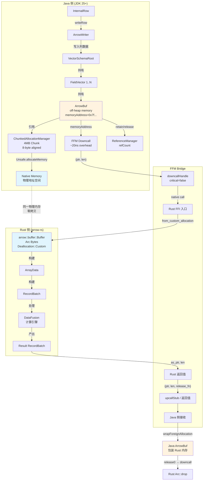
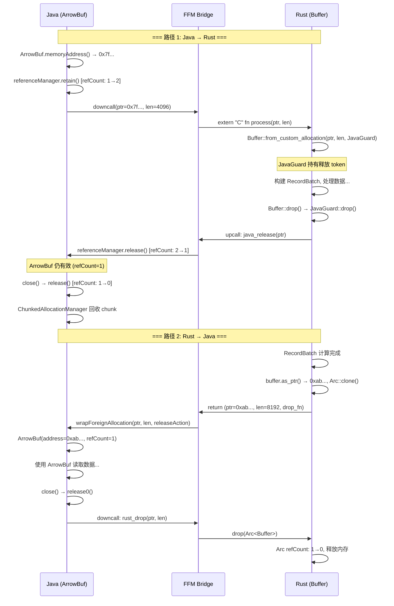

# Arrow Java/Rust 生态 + FFM 零拷贝可行性

## 0. 文档元数据
- **文档 ID**: 1.9
- **状态**: completed
- **依赖**: 无
- **最后更新**: 2026-04-19

---

## 1. Context

### 为什么零拷贝对 ForSt-RS 至关重要

Apache Fluss 的存储层正在考虑引入 Rust 组件 (ForSt-RS) 以获得更好的性能和内存效率。当前 Fluss 大量使用 Arrow 列式格式进行数据的序列化、压缩和传输。如果 Java 侧与 Rust 侧之间的数据交换需要进行内存拷贝，将产生以下问题：

1. **内存开销加倍**: 同一份 Arrow RecordBatch 同时在 Java 堆外内存和 Rust 堆上各存一份
2. **延迟增加**: 对于大批量数据（Fluss 中单批次可达 4MB），拷贝开销不可忽略
3. **GC 压力**: 额外的临时缓冲区分配/释放可能触发 Full GC
4. **违背 Arrow 设计初衷**: Arrow 格式的核心优势就是零拷贝跨语言数据共享

零拷贝路径将使得：
- Java 侧写入的 Arrow 数据可以直接被 Rust 侧的 DataFusion/arrow-rs 计算引擎读取
- Rust 侧计算的结果可以直接被 Java 侧的 Fluss 网络栈发送
- 总体吞吐量提升，延迟降低

---

## 2. 源码证据

### 2.1 Fluss Arrow 使用模式总览

通过分析 Fluss 代码库中的 Arrow 相关文件，提炼出以下关键模式：

#### 2.1.1 内存分配 — ChunkedAllocationManager

**文件**: `fluss-common/src/main/java/org/apache/fluss/shaded/arrow/org/apache/arrow/memory/ChunkedAllocationManager.java`

Fluss 实现了自定义的 Arrow 内存分配器，替换了 Netty 的 `PooledByteBufAllocator`。核心特征：

- **Bump-pointer 策略**: 在预分配的 4MB chunk 中顺序分配，避免碎片
- **8 字节对齐**: 所有子分配均保持 `ALIGNMENT = 8` 对齐
- **引用计数回收**: chunk 中所有子分配释放后，chunk 整体回收到 free-list
- **直接内存地址**: 通过 `MemoryUtil.UNSAFE.allocateMemory()` 获取原生内存地址

关键代码：
```java
// ChunkedAllocationManager.memoryAddress() — 返回稳定的原生指针
@Override
protected long memoryAddress() {
    if (chunk != null) {
        return chunk.address + offsetInChunk;  // chunk 内偏移
    }
    return directAddress;  // 大分配的直接地址
}
```

**零拷贝意义**: 这个 `memoryAddress()` 返回的值是一个真实的、稳定的原生内存指针（通过 `sun.misc.Unsafe.allocateMemory` 分配），只要 ArrowBuf 的引用计数 > 0，该地址就是有效的。这是 Java -> Rust 零拷贝的基础。

#### 2.1.2 写入路径 — ArrowWriter + ArrowWriterPool

**文件**: `fluss-common/src/main/java/org/apache/fluss/row/arrow/ArrowWriter.java`

- ArrowWriter 持有 `VectorSchemaRoot`，是所有列向量的容器
- 通过 `ArrowFieldWriter` 将 Fluss 的 `InternalRow` 写入各 Arrow 列向量
- 初始容量 `INITIAL_CAPACITY = 1024` 行，自动扩展
- 序列化时通过 `VectorUnloader` 将列向量转为 `ArrowRecordBatch`
- 支持压缩（LZ4、Zstd）

**文件**: `fluss-common/src/main/java/org/apache/fluss/row/arrow/ArrowWriterPool.java`

- 线程安全的对象池，按 `tableId-schemaId-compression` 键缓存 ArrowWriter
- 使用 `ReentrantLock` + `@GuardedBy` 保护

#### 2.1.3 序列化路径 — MemoryLogRecordsArrowBuilder

**文件**: `fluss-common/src/main/java/org/apache/fluss/record/MemoryLogRecordsArrowBuilder.java`

- 构建完整的 LogRecordBatch: `[header] [statistics?] [changeTypes] [arrow data]`
- 使用 `AbstractPagedOutputView` 进行分页内存管理
- Arrow 数据通过 `ArrowWriter.serializeToOutputView()` 写入
- CRC32 校验覆盖从 schemaId 到批次末尾的所有数据

#### 2.1.4 反序列化路径 — ArrowUtils.createArrowReader + FlussVectorLoader

**文件**: `fluss-common/src/main/java/org/apache/fluss/utils/ArrowUtils.java`

```java
public static ArrowReader createArrowReader(
        MemorySegment segment, int arrowOffset, int arrowLength,
        VectorSchemaRoot schemaRoot, BufferAllocator allocator, RowType rowType) {
    ByteBuffer arrowBatchBuffer = segment.wrap(arrowOffset, arrowLength);
    try (ReadChannel channel = new ReadChannel(new ByteBufferReadableChannel(arrowBatchBuffer));
         ArrowRecordBatch batch = deserializeRecordBatch(channel, allocator)) {
        FlussVectorLoader vectorLoader =
                new FlussVectorLoader(schemaRoot, ArrowCompressionFactory.INSTANCE);
        vectorLoader.load(batch);
        // ... 创建列向量 ...
    }
}
```

**文件**: `fluss-common/src/main/java/org/apache/fluss/record/FlussVectorLoader.java`

- 修补了 Arrow 原生 VectorLoader 的内存泄漏问题
- 解压缩后的 buffer 在 try-finally 中正确关闭
- 使用 `codec.decompress(allocator, nextBuf)` 解压各列缓冲区

#### 2.1.5 压缩路径 — Lz4/Zstd ArrowCompressionCodec

**文件**: `fluss-common/src/main/java/org/apache/fluss/compression/Lz4ArrowCompressionCodec.java`

当前压缩/解压需要拷贝数据到 `byte[]` 再回写到 `ArrowBuf`，是潜在的优化点。

### 2.2 关键观察

| 观察项 | 详情 | 零拷贝影响 |
|--------|------|-----------|
| 内存分配方式 | `Unsafe.allocateMemory()` 返回原生指针 | 可直接传递给 Rust |
| 对齐保证 | 8 字节对齐（ChunkedAllocationManager） | 满足 Arrow 规范要求 |
| 引用计数 | ArrowBuf 通过 ReferenceManager 管理 | 需要跨语言协调生命周期 |
| 序列化格式 | Arrow IPC RecordBatch（可选压缩） | Rust 侧可直接解析 |
| 内存生命周期 | Writer 池化 + epoch 回收机制 | 需要保证 Rust 访问期间不被回收 |

---

## 3. 发现

### 3.1 三方栈对应关系表

| 概念 | Java (Arrow Java) | FFM (JDK 25) | Rust (arrow-rs) |
|------|-------------------|--------------|-----------------|
| **缓冲区** | `ArrowBuf` (off-heap, 引用计数) | `MemorySegment` (spatial/temporal bounds) | `Buffer` (Arc\<Bytes\>, 不可变) |
| **可变缓冲区** | `ArrowBuf` (同一类型, 可读写) | `MemorySegment` (confined arena 内可写) | `MutableBuffer` (Vec\<u8\> 语义) |
| **内存分配器** | `BufferAllocator` (树形层级, 限额) | `Arena` (confined/shared/global) | `std::alloc::Global` 或自定义 |
| **引用计数** | `ReferenceManager` / `BufferLedger` | N/A (arena 作用域管理) | `Arc<Bytes>` (Rust 引用计数) |
| **物理内存管理** | `AllocationManager` (`memoryAddress()`) | N/A (底层是 `malloc`/`mmap`) | `Deallocation::Standard` / `Custom` |
| **原生指针** | `ArrowBuf.memoryAddress()` -> `long` | `MemorySegment.address()` -> `long` | `Buffer.as_ptr()` -> `*const u8` |
| **外部内存导入** | `BufferAllocator.wrapForeignAllocation()` | `MemorySegment.ofAddress(long)` | `Buffer::from_custom_allocation()` |
| **跨语言接口** | Arrow C Data Interface (`org.apache.arrow.c.Data`) | `Linker.downcallHandle()` / `upcallStub()` | `arrow::ffi` (FFI_ArrowArray, FFI_ArrowSchema) |
| **批次** | `ArrowRecordBatch` / `VectorSchemaRoot` | N/A | `RecordBatch` |
| **序列化** | Arrow IPC (FlatBuffer metadata + body) | N/A | Arrow IPC (`arrow-ipc` crate) |

### 3.2 ArrowBuf 内存模型分析

#### 3.2.1 核心架构

```
ArrowBuf
├── memoryAddress: long          ← 起始虚拟地址 (off-heap)
├── capacity: long               ← 可访问的内存长度
├── ReferenceManager             ← 引用计数管理
│   └── BufferLedger
│       ├── refCount: AtomicInt  ← 引用计数
│       └── AllocationManager    ← 物理内存管理
│           └── memoryAddress()  ← 底层内存地址
└── writerIndex: long            ← 写入位置
```

#### 3.2.2 memoryAddress() 可靠性分析

**结论: 可靠，但有条件**

1. **地址稳定性**: `ArrowBuf.memoryAddress()` 返回的地址在 ArrowBuf 存活期间是**稳定的**。Arrow Java 使用直接内存（off-heap），不受 GC 移动影响。

2. **地址有效性条件**:
   - `ReferenceManager.refCnt() > 0` — 引用计数为正
   - 所属 `BufferAllocator` 未被关闭
   - 对于 Fluss 的 `ChunkedAllocationManager`: chunk 的 `subAllocCount > 0`

3. **对齐保证**:
   - Fluss 的 `ChunkedAllocationManager` 强制 8 字节对齐
   - Arrow 标准要求 buffer 起始地址 8 字节对齐
   - 满足绝大多数 SIMD 操作的对齐需求

4. **Fluss 中的验证证据** (来自 `ChunkedAllocationManagerTest.java`):
   ```java
   // 测试验证连续分配地址的连续性
   assertThat(buf2.memoryAddress() - buf1.memoryAddress()).isEqualTo(64);
   assertThat(buf3.memoryAddress() - buf2.memoryAddress()).isEqualTo(128);
   ```

#### 3.2.3 生命周期管理

```
分配: BufferAllocator.buffer(size)
    → AllocationManager.create(allocator, size)
    → ChunkedAllocationManager (bump-pointer from chunk)
    → ArrowBuf(address, capacity, referenceManager)

使用: ArrowBuf.getInt(index) / setInt(index, value) / memoryAddress()
    → 直接通过 Unsafe 读写 memoryAddress + index

释放: ArrowBuf.close() / ReferenceManager.release()
    → refCount-- → if 0: AllocationManager.release0()
    → ChunkedAllocationManager.Chunk.releaseSubAllocation()
    → if chunk empty: 回收到 free-list 或释放
```

### 3.3 arrow-rs Buffer 所有权模型

#### 3.3.1 Buffer 内部结构

```rust
pub struct Buffer {
    data: Arc<Bytes>,      // 引用计数的内部字节缓冲区
    ptr: *const u8,        // 指向 data 内部的指针（避免指针算术）
    length: usize,         // 字节长度
}

// Bytes 内部
struct Bytes {
    ptr: NonNull<u8>,
    len: usize,
    deallocation: Deallocation,
}

enum Deallocation {
    Standard(Layout),              // Rust std::alloc 分配
    Custom(Arc<dyn Allocation>, usize),  // 自定义释放
}
```

#### 3.3.2 Buffer::from_custom_allocation 详解

```rust
pub unsafe fn from_custom_allocation(
    ptr: NonNull<u8>,    // 外部内存的非空指针
    len: usize,          // 字节长度
    owner: Arc<dyn Allocation>,  // 所有权持有者（释放时调用 drop）
) -> Self
```

**关键语义**:
- `ptr` 必须指向有效的、已分配的内存区域
- `len` 字节范围内的内存必须可读
- `owner` 通过 `Arc` 引用计数管理，当 Buffer 的所有克隆都被 drop 后，`owner` 被释放
- `Allocation` trait 仅要求实现 `Send + Sync`（无额外方法，依赖 `Drop`）
- `capacity()` 对外部分配返回 0（表示不可扩展）
- `shrink_to_fit()` 对外部分配是 no-op

**零拷贝使用示例**（来自 arrow-rs 测试和 mmap 场景）:
```rust
// 从 mmap 创建零拷贝 Buffer
let mmap = unsafe { Mmap::map(&file).unwrap() };
let buffer = unsafe {
    Buffer::from_custom_allocation(
        NonNull::new_unchecked(mmap.as_ptr() as *mut u8),
        mmap.len(),
        Arc::new(mmap),  // mmap 作为 owner，drop 时 munmap
    )
};
```

#### 3.3.3 arrow::ffi — C Data Interface

arrow-rs 的 `arrow::ffi` 模块实现了 Arrow C Data Interface：

```rust
// 导出
let (ffi_array, ffi_schema) = to_ffi(&array_data)?;

// 导入（零拷贝）
let array_data = unsafe { from_ffi(ffi_array, &ffi_schema) }?;
```

内部使用 `Buffer::from_custom_allocation` 来包装外部内存：
```rust
// arrow_array/ffi.rs 第 261 行
.map(|ptr| unsafe { Buffer::from_custom_allocation(ptr, len, owner) })
```

### 3.4 FFM API 关键签名汇总

FFM API (Foreign Function & Memory API) 在 JDK 22 中最终确定（JEP 454），JDK 25 中完全可用。

#### 3.4.1 MemorySegment

```java
// 从原生地址创建段（零拷贝）
MemorySegment segment = MemorySegment.ofAddress(long address);

// 重新解释为指定大小的段（需要在 Arena 内）
MemorySegment segment = MemorySegment.ofAddress(address)
    .reinterpret(byteSize, arena, cleanupAction);

// 地址访问
long address = segment.address();

// 数据访问
int value = segment.get(ValueLayout.JAVA_INT, offset);
segment.set(ValueLayout.JAVA_INT, offset, value);

// 从 Java 数组创建（on-heap, 可通过 critical 选项传递给 native）
MemorySegment heapSegment = MemorySegment.ofArray(new int[]{1, 2, 3});
```

#### 3.4.2 Arena

```java
// 受限 arena — 单线程，try-with-resources 自动清理
try (Arena arena = Arena.ofConfined()) {
    MemorySegment seg = arena.allocate(1024);
    // seg 在此块内有效
}

// 共享 arena — 多线程访问
try (Arena arena = Arena.ofShared()) {
    MemorySegment seg = arena.allocate(1024);
    // seg 可跨线程使用
}

// 全局 arena — 永不释放
MemorySegment seg = Arena.global().allocate(1024);

// 自动 arena — GC 回收
MemorySegment seg = Arena.ofAuto().allocate(1024);
```

#### 3.4.3 Linker

```java
Linker linker = Linker.nativeLinker();

// Downcall — Java 调用 native 函数
MethodHandle nativeFunc = linker.downcallHandle(
    symbolLookup.find("rust_process_arrow_batch").orElseThrow(),
    FunctionDescriptor.of(
        ValueLayout.JAVA_INT,      // 返回值: int (状态码)
        ValueLayout.ADDRESS,       // 参数1: 指向 Arrow 数据的指针
        ValueLayout.JAVA_LONG,     // 参数2: 数据长度
        ValueLayout.ADDRESS        // 参数3: 输出指针
    ),
    Linker.Option.critical(false)  // 标记为 critical 函数（可选）
);

// Upcall — native 函数回调 Java
MethodHandle javaCallback = /* ... */;
MemorySegment upcallStub = linker.upcallStub(
    javaCallback,
    FunctionDescriptor.of(ValueLayout.JAVA_INT, ValueLayout.ADDRESS),
    arena
);
```

#### 3.4.4 Linker.Option.critical(boolean allowHeapAccess)

```java
// critical(false) — 仅允许 off-heap 段，跳过线程状态转换优化
Linker.Option.critical(false)

// critical(true) — 允许 heap 段，通过临时原生地址暴露 Java 堆内存
// 仅在函数调用期间有效，函数必须极其短暂
Linker.Option.critical(true)
```

**约束**:
- Critical 函数**不能回调 Java**（不能使用 upcall stub）
- 函数执行时间必须极短（类似空函数）
- 违反约束会导致 JVM 崩溃或性能退化

### 3.5 零拷贝路径 1: Java -> Rust

#### 判定: **CONDITIONALLY FEASIBLE**

#### 3.5.1 数据流

```
Java 侧:
  ArrowWriter.writeRow() → VectorSchemaRoot 中的列向量
  → 每个 FieldVector 持有若干 ArrowBuf
  → ArrowBuf.memoryAddress() 返回 off-heap 原生地址

传输层 (FFM):
  long ptr = arrowBuf.memoryAddress();
  long len = arrowBuf.readableBytes();
  MemorySegment segment = MemorySegment.ofAddress(ptr).reinterpret(len);
  // 通过 downcallHandle 传递 (ptr, len) 给 Rust

Rust 侧:
  extern "C" fn process_batch(ptr: *const u8, len: usize) -> i32 {
      let buffer = unsafe {
          Buffer::from_custom_allocation(
              NonNull::new_unchecked(ptr as *mut u8),
              len,
              Arc::new(JavaOwned { /* prevent Java-side free */ }),
          )
      };
      // 使用 buffer 构建 arrow-rs 的 ArrayData / RecordBatch
  }
```

#### 3.5.2 方案 A: 直接指针传递（推荐用于只读场景）

**步骤**:
1. Java 侧获取 `ArrowBuf.memoryAddress()` 和 `readableBytes()`
2. 增加 ArrowBuf 引用计数: `arrowBuf.getReferenceManager().retain()`
3. 通过 FFM downcall 传递 `(address, length)` 给 Rust
4. Rust 侧通过 `Buffer::from_custom_allocation` 包装指针
5. Rust 完成处理后，通过 FFM upcall 或返回值通知 Java 释放引用

**优点**: 真正零拷贝，最低开销
**限制**:
- Rust 侧必须只读（或 Java 侧保证不并发修改）
- 需要协调释放时机

#### 3.5.3 方案 B: Arrow C Data Interface（推荐用于完整 RecordBatch 交换）

**步骤**:
1. Java 侧使用 `org.apache.arrow.c.Data.exportVectorSchemaRoot()` 导出
2. 导出产生 FFI_ArrowArray + FFI_ArrowSchema 的内存地址
3. 通过 FFM downcall 传递两个地址给 Rust
4. Rust 侧使用 `arrow::ffi::from_ffi()` 导入（零拷贝）

**优点**:
- 标准化的跨语言接口
- 自动处理 schema、嵌套类型、dictionary
- 内置所有权转移语义（release callback）

**限制**:
- 导出/导入有固定开销（FlatBuffer metadata 解析）
- Fluss 使用 shaded Arrow，需确保 C Data Interface 结构体二进制兼容
- 需要处理 Fluss 的自定义压缩（Arrow C Data Interface 不直接支持压缩后的数据）

#### 3.5.4 可行性条件

| 条件 | 状态 | 说明 |
|------|------|------|
| ArrowBuf 地址稳定 | OK | Unsafe.allocateMemory 返回的地址在 GC 中不移动 |
| 8 字节对齐 | OK | ChunkedAllocationManager 保证 |
| 引用计数协调 | **需要实现** | 需要机制确保 Rust 使用期间 Java 不释放 |
| 压缩数据处理 | **需要解压后传递** | Arrow C Data Interface 不支持压缩 body |
| Shaded Arrow 兼容性 | **需要验证** | C Data Interface 结构体布局必须与标准一致 |
| JDK 版本要求 | **需要 JDK 22+** | FFM API 在 JDK 22 中最终确定；Fluss 当前 Java 8 源码级别 |

### 3.6 零拷贝路径 2: Rust -> Java

#### 判定: **CONDITIONALLY FEASIBLE**

#### 3.6.1 数据流

```
Rust 侧:
  // 计算产生 RecordBatch
  let batch: RecordBatch = /* DataFusion 计算结果 */;
  // 获取各 buffer 的原始指针
  let buffer = batch.column(0).to_data().buffers()[0];
  let ptr = buffer.as_ptr();
  let len = buffer.len();
  // 通过 FFI 返回 (ptr, len) 给 Java

传输层 (FFM):
  // 方式1: MemorySegment.ofAddress
  MemorySegment segment = MemorySegment.ofAddress(rustPtr)
      .reinterpret(len, arena, cleanupAction);

  // 方式2: 通过 wrapForeignAllocation 创建 ArrowBuf
  ArrowBuf buf = allocator.wrapForeignAllocation(
      new ForeignAllocation(len, rustPtr) {
          @Override protected void release0() {
              // 通过 FFM downcall 调用 Rust 释放函数
              rustFreeHandle.invokeExact(rustPtr, len);
          }
      });

Java 侧:
  // 使用 ArrowBuf 构建 VectorSchemaRoot
  // 或直接使用 MemorySegment 进行数据访问
```

#### 3.6.2 方案 A: wrapForeignAllocation（推荐）

**步骤**:
1. Rust 侧分配 Arrow Buffer 并返回 `(ptr, len, release_fn_ptr)`
2. Java 侧通过 FFM 接收指针
3. 使用 `BufferAllocator.wrapForeignAllocation()` 将 Rust 内存包装为 `ArrowBuf`
4. ArrowBuf 释放时（引用计数归零），通过 FFM downcall 调用 Rust 释放函数

**注意**: `wrapForeignAllocation` 在 Arrow Java 中标记为 **EXPERIMENTAL**，但 Apache DataFusion Comet 等项目已在生产中使用。

#### 3.6.3 方案 B: Arrow C Data Interface（反向）

**步骤**:
1. Rust 侧使用 `arrow::ffi::to_ffi()` 导出 RecordBatch
2. 产生 `FFI_ArrowArray` 和 `FFI_ArrowSchema` 的内存指针
3. 通过 FFM 传递给 Java
4. Java 侧使用 `org.apache.arrow.c.Data.importVectorSchemaRoot()` 导入

#### 3.6.4 可行性条件

| 条件 | 状态 | 说明 |
|------|------|------|
| Rust 指针有效期 | **需要协调** | Rust Buffer 使用 Arc 引用计数，需保证 Java 使用期间不 drop |
| 对齐保证 | OK | arrow-rs 标准分配器保证 64 字节对齐 |
| 释放回调 | **需要实现** | Java 侧释放时需通过 FFM downcall 通知 Rust |
| wrapForeignAllocation 稳定性 | EXPERIMENTAL | 已被多个项目使用，实际可靠 |
| C Data Interface 兼容 | OK | arrow-rs 与 Arrow Java 共享同一规范 |

### 3.7 FFM 性能模型

#### 3.7.1 Downcall 开销

根据多个独立基准测试的综合数据：

| 场景 | 延迟 | 来源 |
|------|------|------|
| FFM downcall (普通) | ~22.7 ns | Daniel Lemire 基准测试 (M4, 2026) |
| FFM downcall (critical) | ~19.5 ns | Daniel Lemire 基准测试 (M4, 2026) |
| JNI 调用 | ~56.6 ns | zakgof/java-native-benchmark |
| FFM vs JNI | **~12% 更快** | zakgof JMH 基准测试 |
| FFM downcall (critical, trivial) | **~160% JNI 性能** | Glavo/java-ffi-benchmark (JDK 21) |

#### 3.7.2 Upcall 开销

- FFM upcall (Rust 调用 Java): 约 **3.5-4x JNI 性能** (QSort 基准测试)
- upcall 比 downcall 更重（需要维护 Java 栈帧）

#### 3.7.3 与 Fluss 场景的关系

```
Fluss 场景:
- 单批次大小: 最大 4MB (ChunkedAllocationManager.DEFAULT_CHUNK_SIZE)
- 列数: 通常 10-1000+
- 操作模式: 批量处理，非逐行

分析:
- 零拷贝传递一个 4MB 批次: 1 次 downcall = ~20ns
- 拷贝 4MB 数据: ~1000ns (memcpy, L3 cache)
- 收益比: 50x

即使是 critical downcall 的 20ns 开销，相对于避免的 MB 级数据拷贝，
开销可忽略不计。关键是每批次只需 1-2 次 FFI 调用（传递指针），
而非每行每列都调用。
```

#### 3.7.4 性能优化建议

1. **缓存 MethodHandle**: `Linker.downcallHandle()` 应在静态初始化时创建，不要每次调用
2. **批量传递**: 每批次 1 次 FFI 调用传递整个 RecordBatch 指针，而非逐列传递
3. **使用 critical(false)**: 对于只传递 off-heap 指针的短函数，使用 critical 选项
4. **避免 upcall**: 尽量通过返回值或共享内存通知，减少 upcall 使用

### 3.8 JDK Vector API 评估

#### 3.8.1 当前状态

| 版本 | JEP | 状态 |
|------|-----|------|
| JDK 16 | JEP 338 | 第一次 Incubator |
| JDK 25 | JEP 508 | **第十次 Incubator** |
| JDK 26 | JEP 529 | 第十一次 Incubator |

**结论: 仍处于 Incubator 阶段，不适合生产使用。**

#### 3.8.2 无法升级到 Preview 的原因

Vector API 明确声明等待 **Project Valhalla** 的 value types 功能作为 preview feature。原因：
- 向量类型（如 `IntVector`）在语义上是值类型，不应有对象标识
- 当前通过 HotSpot intrinsic 模拟值语义，但无法保证标量化
- Valhalla 的 value objects 将使向量可以真正映射到硬件寄存器

#### 3.8.3 JDK 25 中的改进

- `VectorShuffle` 支持从 `MemorySegment` 读写（与 FFM API 集成）
- 数学函数库改为通过 FFM API 链接（而非 JNI）
- Float16 (binary16) 自动向量化支持（x64）

#### 3.8.4 对 ForSt-RS 的意义

- **短期 (1-2 年)**: 不推荐依赖 Vector API，因为 Incubator API 随时可能变更
- **中期 (2-3 年)**: 如果 Valhalla value types 在 JDK 27/28 中 preview，Vector API 可能在 JDK 28/29 进入 preview
- **替代方案**: SIMD 加速的计算应放在 Rust 侧（arrow-rs compute kernels 已经利用了 Rust 的 auto-vectorization 和手动 SIMD），通过零拷贝从 Java 传递数据

### 3.9 已知限制与 Workaround

#### 限制 1: Fluss 源码级别 Java 8

**问题**: Fluss 当前要求 Java 8 源码兼容，FFM API 需要 JDK 22+。

**Workaround**:
- 创建独立的 bridge 模块 (`fluss-bridge-ffm`)，仅此模块使用 JDK 22+ 编译
- 通过反射或 ServiceLoader 在运行时动态加载
- 当 JDK < 22 时降级为 JNI 或数据拷贝方案
- 参考: Fluss 已有 multi-version connector 模式 (`fluss-flink-1.18`, `fluss-flink-1.20` 等)

#### 限制 2: Shaded Arrow 的 C Data Interface 兼容性

**问题**: Fluss 使用 `org.apache.fluss.shaded.arrow.*`，需确认 C Data Interface 结构体布局未被 shading 影响。

**Workaround**:
- C Data Interface 使用的 `ArrowArray` / `ArrowSchema` 是 C 结构体，通过 `memoryAddress()` 操作原始内存，不涉及 Java 类名
- 但 `org.apache.arrow.c.Data` 等辅助类需要包含在 shaded jar 中
- 替代方案: 直接通过 FFM 操作 C 结构体内存布局，绕过 Java 辅助类

#### 限制 3: 压缩数据的零拷贝

**问题**: Fluss 使用 LZ4/Zstd 压缩 Arrow 数据。压缩后的数据不是有效的 Arrow 格式。

**Workaround**:
- 方案 A: 在 Java 侧解压后再传递给 Rust（当前已有路径）
- 方案 B: 传递压缩数据的指针，在 Rust 侧解压（利用 Rust 更高效的 LZ4/Zstd 实现）
- 方案 C: 如果数据已经在 Java 侧解压并加载到 VectorSchemaRoot，直接传递列向量指针

#### 限制 4: 跨语言引用计数协调

**问题**: Java ArrowBuf 和 Rust Buffer 各自有引用计数，需要协调。

**Workaround**:
```
Java -> Rust:
  1. Java retain() → refCount+1
  2. 传递指针给 Rust
  3. Rust 创建 Buffer::from_custom_allocation，owner 持有一个 release token
  4. Rust Buffer drop 时 → owner drop → 通过 FFM upcall 调用 Java release()

Rust -> Java:
  1. Rust Arc::clone() 增加引用计数
  2. 传递指针给 Java
  3. Java wrapForeignAllocation，release0() 中通过 FFM downcall 调用 Rust drop
  4. Java ArrowBuf close 时 → release0() → Rust Arc drop
```

#### 限制 5: MemorySegment 与 ArrowBuf 的生命周期对齐

**问题**: `MemorySegment.ofAddress()` 创建的段默认是 zero-length，需要 `reinterpret` 指定大小和 arena。

**Workaround**:
```java
// 使用 Arena.ofShared() 管理跨 FFI 的 MemorySegment 生命周期
try (Arena arena = Arena.ofShared()) {
    // 从 ArrowBuf 地址创建 MemorySegment
    MemorySegment segment = MemorySegment.ofAddress(arrowBuf.memoryAddress())
        .reinterpret(arrowBuf.readableBytes(), arena, ms -> {
            // 清理回调：当 arena 关闭时释放 ArrowBuf 引用
            arrowBuf.getReferenceManager().release();
        });
    // 将 segment.address() 和 segment.byteSize() 传递给 Rust
}
```

---

## 4. 架构图

### 4.1 零拷贝数据流图



### 4.2 内存所有权生命周期图



---

## 5. 与 ForSt-RS 重构的关系

### 5.1 近期可行路径（不依赖 JDK 版本升级）

由于 Fluss 当前要求 Java 8 源码兼容，完整的 FFM 路径需要渐进式采用：

1. **Phase 0 — JNI + 指针传递**:
   - 使用传统 JNI 传递 `ArrowBuf.memoryAddress()` 给 Rust
   - Rust 侧通过 `Buffer::from_custom_allocation` 零拷贝包装
   - 这是当前最实际的方案，Apache DataFusion Comet 已在生产中验证

2. **Phase 1 — 可选 FFM Bridge**:
   - 创建 `fluss-bridge-ffm` 模块，JDK 22+ 编译
   - 运行时检测 JDK 版本，可用时自动使用 FFM 替换 JNI
   - 减少 ~30% 的 FFI 开销

### 5.2 中期架构目标

```
Fluss Server (Java)
    ↕ Arrow 零拷贝 (JNI/FFM)
ForSt-RS (Rust)
    ├── KV 存储引擎 (RocksDB-compatible)
    ├── Arrow 列式扫描 (arrow-rs)
    └── 计算下推 (DataFusion)
```

### 5.3 Apache DataFusion Comet 的参考价值

Comet 项目是 Java-Rust Arrow 零拷贝的最成熟参考实现：

- **JVM → Native**: 通过 `CometBatchIterator` 使用 Arrow C Data Interface 传递数据
- **Native → JVM**: 通过 `CometExecIterator` 返回计算结果
- **内存管理**: 明确的所有权转移语义 (`arrow_ffi_safe` 标志)
- **验证**: 生产级别的内存安全和性能

---

## 6. Open Questions

1. **Fluss 的 JDK 版本路线图**: 何时计划升级到 JDK 22+ 作为运行时要求？这直接影响 FFM 的可用时间线。

2. **Shaded Arrow 的 C Data Interface 测试**: 需要编写集成测试验证 `org.apache.fluss.shaded.arrow` 包中的 C Data Interface 实现与标准 Arrow 二进制兼容。

3. **压缩策略**: 在 Java-Rust 边界，是传递压缩数据让 Rust 解压更好，还是在 Java 侧解压后传递原始 Arrow 数据更好？需要基准测试对比。

4. **ChunkedAllocationManager 与 Rust 分配器统一**: 是否可以让 Java 和 Rust 共享同一个内存池（例如通过 mmap 共享内存区域），进一步减少分配开销？

5. **Arrow C Data Interface vs 直接指针传递**: 对于 Fluss 的场景（schema 已知、不频繁变更），直接传递 buffer 指针可能比完整的 C Data Interface 更高效。需要评估两种方案的 trade-off。

6. **多线程安全**: Fluss 的 `ArrowWriterPool` 是线程安全的，但零拷贝路径需要确保 Rust 侧的访问与 Java 侧的回收不会产生竞态条件。需要设计清晰的所有权转移协议。

7. **JNI 降级方案**: 对于无法使用 FFM 的环境（JDK < 22），JNI + ArrowBuf.memoryAddress() 的零拷贝路径是否同样可行？需要与 Comet 方案对比。
